# Low-Level Design (LLD) Specification
## CredVault — Credit Card Management Platform

---

| Field | Value |
|---|---|
| **Document Title** | Low-Level Design Specification |
| **System** | CredVault Credit Card Management Platform |
| **Document Version** | 1.0 |
| **Status** | Draft for Review |
| **Prepared By** | Engineering Team |
| **Prepared For** | Engineering Sprint Review |
| **Date** | 2026-04-13 |
| **Audience** | Software Engineers, Architects, QA, Integration Teams |

---

## Revision History

| Version | Date | Author | Changes |
|---|---|---|---|
| 0.1 | 2026-04-10 | Engineering | Initial draft — service boundaries & DB schema |
| 0.2 | 2026-04-12 | Engineering | Added saga sequence diagrams & event catalog |
| 0.3 | 2026-04-12 | Engineering | DB migration: `AddMissingForeignKeys` applied to billing |
| 1.0 | 2026-04-13 | Engineering | Full LLD baseline — all sections complete |

---

## Table of Contents

1. [Executive Summary & Design Principles](#1-executive-summary--design-principles)
2. [Glossary of Terms](#2-glossary-of-terms)
3. [System Architecture Overview](#3-system-architecture-overview)
4. [Bounded Contexts & Service Map](#4-bounded-contexts--service-map)
5. [Actor & Use Case Model](#5-actor--use-case-model)
6. [Class & Component Diagrams](#6-class--component-diagrams)
7. [Database Architecture & ER Diagrams](#7-database-architecture--er-diagrams)
8. [Event-Driven Architecture (RabbitMQ)](#8-event-driven-architecture-rabbitmq)
9. [Complete Event Catalog](#9-complete-event-catalog)
10. [Saga State Machine — Payment Orchestration](#10-saga-state-machine--payment-orchestration)
11. [Sequence Diagrams — Core User Flows](#11-sequence-diagrams--core-user-flows)
12. [API Specification](#12-api-specification)
13. [Request & Response Contracts](#13-request--response-contracts)
14. [Security Architecture](#14-security-architecture)
15. [Error Handling & Exception Strategy](#15-error-handling--exception-strategy)
16. [Infrastructure & Deployment](#16-infrastructure--deployment)
17. [Known Issues & Technical Debt](#17-known-issues--technical-debt)

---

## 1. Executive Summary & Design Principles

CredVault is a microservices-based credit card management platform built with ASP.NET Core 10, Angular 19, SQL Server, RabbitMQ, and Docker. The system allows users to register credit cards, track transactions, receive monthly bills, and pay them through a distributed, 2FA-secured payment flow.

### 1.1 Core Design Principles

| Principle | Decision | Rationale |
|---|---|---|
| **Database per Service** | Each microservice owns an isolated SQL Server database | Enforces true service independence; prevents shared schema coupling |
| **No Synchronous HTTP Between Services** | All cross-service communication is event-driven via RabbitMQ | Eliminates temporal coupling and single points of failure |
| **Clean Architecture** | `Domain → Application → Infrastructure → API` layer separation per service | Business logic is framework-agnostic and fully testable |
| **CQRS via MediatR** | All writes use `IRequest<T>` Commands; all reads use Queries | Clear separation of read/write paths; independent scaling |
| **Saga Orchestration** | Payment flow uses MassTransit StateMachine saga | Resolves dual-write problem across 3 independent databases atomically |
| **Eventual Consistency** | Domain events trigger downstream reactions asynchronously | Accepts a short inconsistency window in exchange for high availability |
| **Soft Deletes** | Card service marks records `IsDeleted = true` instead of physical deletion | Maintains data history; prevents orphan foreign key issues |
| **GUID Primary Keys** | All entities use `uniqueidentifier` PKs | Enables ID generation at the application layer without DB round-trips |

### 1.2 Technology Stack

| Layer | Technology |
|---|---|
| Backend Framework | ASP.NET Core 10 (.NET 10) |
| Frontend | Angular 19 |
| ORM | Entity Framework Core 10 |
| Database | Microsoft SQL Server (port 1434) |
| Message Broker | RabbitMQ with MassTransit |
| API Gateway | Ocelot |
| CQRS/Mediator | MediatR |
| Validation | FluentValidation |
| Email | SMTP / SendGrid |
| Containerization | Docker / Docker Compose |
| Auth | JWT Bearer tokens + OTP (6-digit, crypto-RNG) |

---

## 2. Glossary of Terms

| Term | Definition |
|---|---|
| **Bounded Context** | A service and its exclusively owned database/domain model |
| **CQRS** | Command Query Responsibility Segregation — writes (commands) and reads (queries) are separate pipelines |
| **Saga** | A long-lived transaction coordinator that manages a multi-step distributed workflow via events |
| **MassTransit** | .NET library abstracting RabbitMQ with built-in saga, retry, and consumer support |
| **Domain Event** | A fire-and-forget notification broadcast when something meaningful happens in a service |
| **Saga Event** | A request/response event within the payment orchestration; always consumed by the saga |
| **DLQ** | Dead Letter Queue — a RabbitMQ queue where failed/unprocessable messages land after retries are exhausted |
| **OTP** | One-Time Password — 6-digit code used for email verification and payment authorization |
| **Compensation** | Rolling back previous saga steps when a later step fails |
| **Cross-service Reference** | A GUID stored in Service B that logically refers to an entity owned by Service A, but with no SQL FK |
| **Idempotent Consumer** | A message consumer safe to call multiple times without side effects |
| **Soft Delete** | Marking `IsDeleted = true` rather than physically removing a row |

---

## 3. System Architecture Overview

This diagram shows the full system from the client through to databases and the message broker.

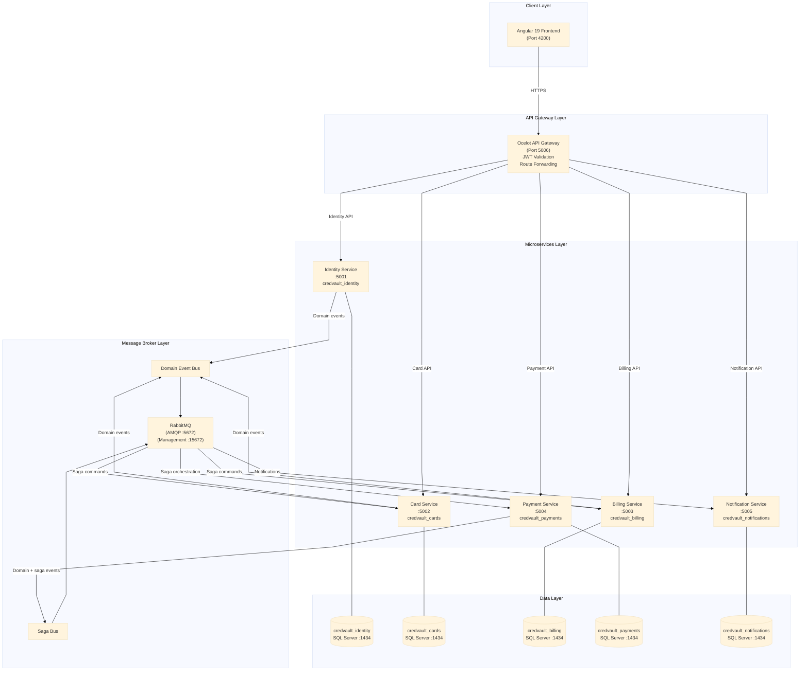
```mermaid
%%{init: {"theme":"base","themeVariables":{"fontSize":"15px","edgeLabelBackground":"#ffffff"},"flowchart":{"curve":"linear","nodeSpacing":95,"rankSpacing":130},"sequence":{"actorMargin":95,"messageMargin":60,"diagramMarginX":90,"diagramMarginY":55}}}%%
flowchart TB
    subgraph CLIENT["Client Layer"]
        ANG["Angular 19 Frontend\n(Port 4200)"]
    end

    subgraph GATEWAY["API Gateway Layer"]
        GW["Ocelot API Gateway\n(Port 5006)\nJWT Validation\nRoute Forwarding"]
    end

    subgraph SERVICES["Microservices Layer"]
        IS["Identity Service\n:5001\ncredvault_identity"]
        CS["Card Service\n:5002\ncredvault_cards"]
        BS["Billing Service\n:5003\ncredvault_billing"]
        PS["Payment Service\n:5004\ncredvault_payments"]
        NS["Notification Service\n:5005\ncredvault_notifications"]
    end

    subgraph BROKER["Message Broker Layer"]
        RMQ["RabbitMQ\n(AMQP :5672)\n(Management :15672)"]
        DE["Domain Event Bus"]
        SB["Saga Bus"]
    end

    subgraph DATA["Data Layer"]
        DB1[("credvault_identity\nSQL Server :1434")]
        DB2[("credvault_cards\nSQL Server :1434")]
        DB3[("credvault_billing\nSQL Server :1434")]
        DB4[("credvault_payments\nSQL Server :1434")]
        DB5[("credvault_notifications\nSQL Server :1434")]
    end

    ANG -->|"HTTPS"| GW

    GW -->|"Identity API"| IS
    GW -->|"Card API"| CS
    GW -->|"Billing API"| BS
    GW -->|"Payment API"| PS
    GW -->|"Notification API"| NS

    IS --- DB1
    CS --- DB2
    BS --- DB3
    PS --- DB4
    NS --- DB5

    IS -->|"Domain events"| DE
    CS -->|"Domain events"| DE
    BS -->|"Domain events"| DE
    PS -->|"Domain + saga events"| SB

    DE --> RMQ
    SB --> RMQ

    RMQ -->|"Notifications"| NS
    RMQ -->|"Saga commands"| CS
    RMQ -->|"Saga commands"| BS
    RMQ -->|"Saga orchestration"| PS
```

**Gateway Route Groups (for readability):** `/api/v1/identity/**`, `/api/v1/cards/**`, `/api/v1/billing/**`, `/api/v1/payments/**`, `/api/v1/notifications/**`

---

## 4. Bounded Contexts & Service Map

Each service is a fully independent deployable unit. The table below summarises ownership.

| Service | Port | Database | Owns | Publishes | Consumes |
|---|---|---|---|---|---|
| **Identity** | 5001 | `credvault_identity` | Users, Auth | `IUserRegistered`, `IUserOtpGenerated` | *(none)* |
| **Card** | 5002 | `credvault_cards` | Cards, Issuers, Transactions | `ICardAdded`, `ICardDeductionSucceeded/Failed` | `IUserDeleted`, `IPaymentReversed`, `ICardDeductionRequested` |
| **Billing** | 5003 | `credvault_billing` | Bills, Statements, Rewards | `IBillGenerated`, `IBillOverdueDetected`, `IBillUpdateSucceeded/Failed` | `IUserDeleted`, `IBillUpdateRequested`, `IRevertBillUpdateRequested`, `IRewardRedemptionRequested` |
| **Payment** | 5004 | `credvault_payments` | Payments, Ledger, Sagas | `IPaymentCompleted`, `IPaymentFailed`, `IPaymentOtpGenerated`, `IPaymentReversed` + all saga events | Saga orchestrates everything |
| **Notification** | 5005 | `credvault_notifications` | AuditLogs, NotificationLogs | *(none)* | All domain events — sends emails via SMTP |
| **Gateway** | 5006 | *(none)* | Routing, JWT enforcement | *(none)* | *(none)* |

### Service Dependency Graph

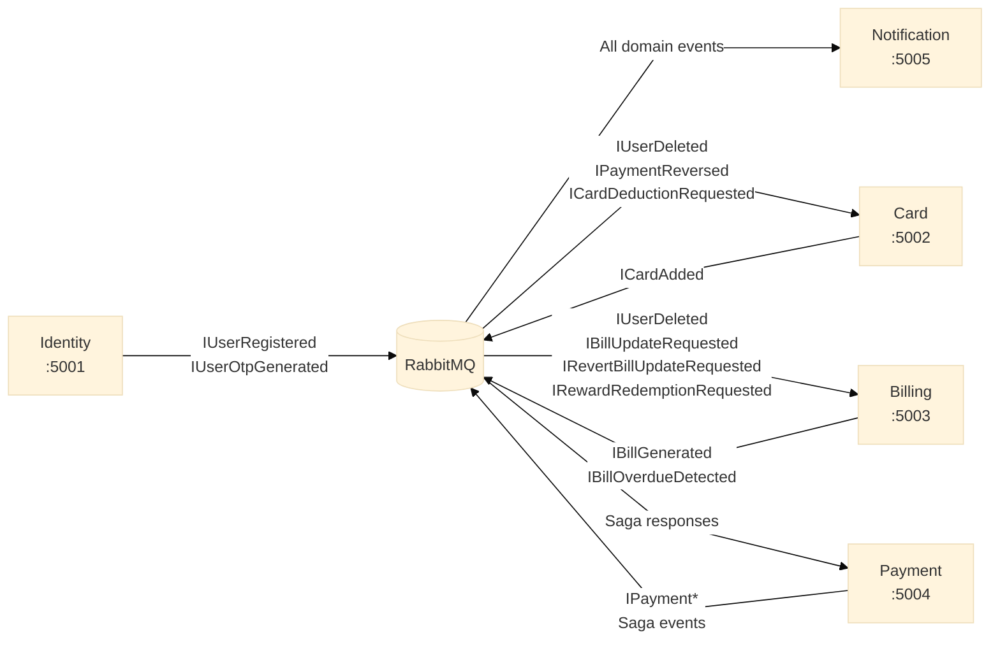
```mermaid
%%{init: {"theme":"base","themeVariables":{"fontSize":"15px","edgeLabelBackground":"#ffffff"},"flowchart":{"curve":"linear","nodeSpacing":95,"rankSpacing":130},"sequence":{"actorMargin":95,"messageMargin":60,"diagramMarginX":90,"diagramMarginY":55}}}%%
flowchart LR
    IS["Identity\n:5001"]
    CS["Card\n:5002"]
    BS["Billing\n:5003"]
    PS["Payment\n:5004"]
    NS["Notification\n:5005"]
    RMQ[("RabbitMQ")]

    IS -->|"IUserRegistered\nIUserOtpGenerated"| RMQ
    CS -->|"ICardAdded"| RMQ
    BS -->|"IBillGenerated\nIBillOverdueDetected"| RMQ
    PS -->|"IPayment*\nSaga events"| RMQ

    RMQ -->|"All domain events"| NS
    RMQ -->|"IUserDeleted\nIPaymentReversed\nICardDeductionRequested"| CS
    RMQ -->|"IUserDeleted\nIBillUpdateRequested\nIRevertBillUpdateRequested\nIRewardRedemptionRequested"| BS
    RMQ -->|"Saga responses"| PS
```

---

## 5. Actor & Use Case Model

### 5.1 System Actors

| Actor | Description |
|---|---|
| **End User** | Registered customer who manages their own credit cards and payments |
| **System Admin** | Privileged operator with elevated access to manage users, cards, tiers, and billing |
| **Scheduler** | An internal background CRON timer that triggers overdue bill detection |
| **Notification Worker** | Internal async consumer that fires emails on domain events |

### 5.2 Use Case Diagram

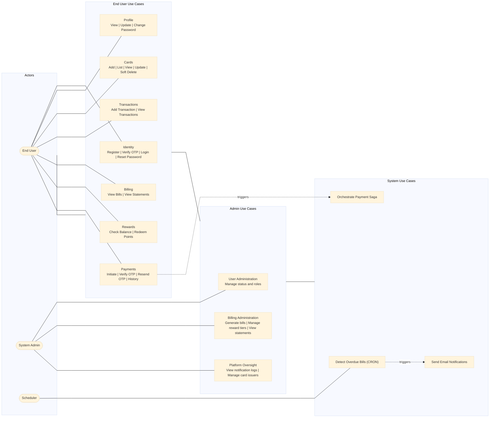
```mermaid
%%{init: {"theme":"base","themeVariables":{"fontSize":"15px","edgeLabelBackground":"#ffffff"},"flowchart":{"curve":"linear","nodeSpacing":95,"rankSpacing":130},"sequence":{"actorMargin":95,"messageMargin":60,"diagramMarginX":90,"diagramMarginY":55}}}%%
flowchart LR
    subgraph COL1["Actors"]
        direction TB
        USER(["End User"])
        ADMIN(["System Admin"])
        SCHED(["Scheduler"])
    end

    subgraph COL2["End User Use Cases"]
        direction TB
        U1["Identity\nRegister | Verify OTP | Login | Reset Password"]
        U2["Profile\nView | Update | Change Password"]
        U3["Cards\nAdd | List | View | Update | Soft Delete"]
        U4["Transactions\nAdd Transaction | View Transactions"]
        U5["Billing\nView Bills | View Statements"]
        U6["Rewards\nCheck Balance | Redeem Points"]
        U7["Payments\nInitiate | Verify OTP | Resend OTP | History"]
    end

    subgraph COL3["Admin Use Cases"]
        direction TB
        A1["User Administration\nManage status and roles"]
        A2["Billing Administration\nGenerate bills | Manage reward tiers | View statements"]
        A3["Platform Oversight\nView notification logs | Manage card issuers"]
    end

    subgraph COL4["System Use Cases"]
        direction TB
        S1["Detect Overdue Bills (CRON)"]
        S2["Send Email Notifications"]
        S3["Orchestrate Payment Saga"]
    end

    COL1 --- COL2
    COL2 --- COL3
    COL3 --- COL4

    USER --- U1
    USER --- U2
    USER --- U3
    USER --- U4
    USER --- U5
    USER --- U6
    USER --- U7

    ADMIN --- A1
    ADMIN --- A2
    ADMIN --- A3

    SCHED --- S1
    S1 -.->|"triggers"| S2
    U7 -.->|"triggers"| S3
```

---

## 6. Class & Component Diagrams

### 6.1 Clean Architecture Layers (Per Service)

Every service follows an identical 4-layer structure enforced at the project level.

```
<ServiceName>/
├── <ServiceName>.Domain/
│   ├── Entities/         ← Core domain objects (no framework dependency)
│   └── Enums/            ← Status codes, types
│
├── <ServiceName>.Application/
│   ├── Commands/         ← Write-side: IRequest<T> + Handler
│   ├── Queries/          ← Read-side: IRequest<T> + Handler
│   ├── Interfaces/       ← Repository contracts (ICardRepository, etc.)
│   ├── DTOs/             ← Data Transfer Objects for API surface
│   └── Helpers/          ← Domain-specific utilities
│
├── <ServiceName>.Infrastructure/
│   ├── Persistence/Sql/  ← EF Core DbContext, Migrations, SqlRepositories
│   ├── Consumers/        ← MassTransit IConsumer<T> implementations
│   └── Services/         ← Email, external integrations
│
└── <ServiceName>.API/
    └── Controllers/      ← ASP.NET Controllers (thin; delegate to MediatR)
```

### 6.2 Payment Service — Full Class Diagram

The Payment Service contains the highest complexity due to saga orchestration.


```mermaid
%%{init: {"theme":"base","themeVariables":{"fontSize":"15px","edgeLabelBackground":"#ffffff"},"flowchart":{"curve":"linear","nodeSpacing":95,"rankSpacing":130},"sequence":{"actorMargin":95,"messageMargin":60,"diagramMarginX":90,"diagramMarginY":55}}}%%
classDiagram
    direction LR
    class PaymentsController {
        -IMediator _mediator
        +InitiatePayment(InitiatePaymentRequest) Task~ApiResponse~
        +VerifyOtp(Guid paymentId, VerifyOtpRequest) Task~ApiResponse~
        +ResendOtp(Guid paymentId) Task~ApiResponse~
        +GetMyPayments() Task~ApiResponse~
        +GetPaymentById(Guid id) Task~ApiResponse~
    }

    class InitiatePaymentCommand {
        +Guid UserId
        +string Email
        +string FullName
        +Guid CardId
        +Guid BillId
        +decimal Amount
        +PaymentType PaymentType
        +decimal RewardsPoints
    }

    class InitiatePaymentCommandHandler {
        -IPaymentRepository _repo
        -IPublishEndpoint _publisher
        +Handle(command, ct) Task~ApiResponse~
        -MarkExpiredStuckPaymentsAsync()
        -ValidateBillOwnership()
        -ValidateAmount()
        -GenerateOtp() string
    }

    class PaymentOrchestrationSaga {
        +CorrelationId Guid
        +CurrentState string
        +Event~IStartPaymentOrchestration~ OnStart
        +Event~IOtpVerified~ OnOtpVerified
        +Event~IPaymentProcessSucceeded~ OnPaymentProcessed
        +Event~IBillUpdateSucceeded~ OnBillUpdated
        +Event~IRewardRedemptionSucceeded~ OnRewardRedeemed
        +Event~ICardDeductionSucceeded~ OnCardDeducted
        +Event~ICardDeductionFailed~ OnCardFailed
        +TransitionTo(state) void
    }

    class PaymentProcessConsumer {
        -IPaymentRepository _repo
        -IPublishEndpoint _publisher
        +Consume(ConsumeContext~IPaymentProcessRequested~) Task
    }

    class RevertPaymentConsumer {
        -IPaymentRepository _repo
        -IPublishEndpoint _publisher
        +Consume(ConsumeContext~IRevertPaymentRequested~) Task
    }

    class RewardRedemptionConsumer {
        -IBillingApiClient _billing
        -IPublishEndpoint _publisher
        +Consume(ConsumeContext~IRewardRedemptionRequested~) Task
    }

    class IPaymentRepository {
        <<interface>>
        +AddAsync(Payment) Task~Payment~
        +GetByIdAsync(Guid) Task~Payment~
        +UpdateAsync(Payment) Task
        +GetByUserIdAsync(Guid) Task~List~Payment~~
        +MarkStuckPaymentsFailedAsync(Guid userId, Guid billId) Task
    }

    class Payment {
        +Guid Id
        +Guid UserId
        +Guid CardId
        +Guid BillId
        +decimal Amount
        +PaymentType PaymentType
        +PaymentStatus Status
        +string OtpCode
        +DateTime OtpExpiresAtUtc
    }

    PaymentsController --> InitiatePaymentCommand : creates
    InitiatePaymentCommand --> InitiatePaymentCommandHandler : handled by
    InitiatePaymentCommandHandler --> IPaymentRepository : uses
    InitiatePaymentCommandHandler --> PaymentOrchestrationSaga : publishes IStartPaymentOrchestration
    PaymentOrchestrationSaga --> PaymentProcessConsumer : routes IPaymentProcessRequested
    PaymentOrchestrationSaga --> RewardRedemptionConsumer : routes IRewardRedemptionRequested
    PaymentOrchestrationSaga --> RevertPaymentConsumer : routes IRevertPaymentRequested
    IPaymentRepository <|.. SqlPaymentRepository
    Payment <-- IPaymentRepository : manages
```

### 6.3 Card Service — Class Diagram

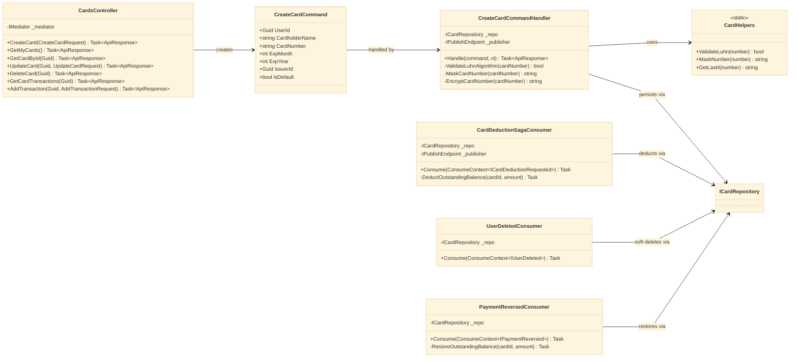
```mermaid
%%{init: {"theme":"base","themeVariables":{"fontSize":"15px","edgeLabelBackground":"#ffffff"},"flowchart":{"curve":"linear","nodeSpacing":95,"rankSpacing":130},"sequence":{"actorMargin":95,"messageMargin":60,"diagramMarginX":90,"diagramMarginY":55}}}%%
classDiagram
    direction LR
    class CardsController {
        -IMediator _mediator
        +CreateCard(CreateCardRequest) Task~ApiResponse~
        +GetMyCards() Task~ApiResponse~
        +GetCardById(Guid) Task~ApiResponse~
        +UpdateCard(Guid, UpdateCardRequest) Task~ApiResponse~
        +DeleteCard(Guid) Task~ApiResponse~
        +GetCardTransactions(Guid) Task~ApiResponse~
        +AddTransaction(Guid, AddTransactionRequest) Task~ApiResponse~
    }

    class CreateCardCommand {
        +Guid UserId
        +string CardholderName
        +string CardNumber
        +int ExpMonth
        +int ExpYear
        +Guid IssuerId
        +bool IsDefault
    }

    class CreateCardCommandHandler {
        -ICardRepository _repo
        -IPublishEndpoint _publisher
        +Handle(command, ct) Task~ApiResponse~
        -ValidateLuhnAlgorithm(cardNumber) bool
        -MaskCardNumber(cardNumber) string
        -EncryptCardNumber(cardNumber) string
    }

    class CardHelpers {
        <<static>>
        +ValidateLuhn(number) bool
        +MaskNumber(number) string
        +GetLast4(number) string
    }

    class UserDeletedConsumer {
        -ICardRepository _repo
        +Consume(ConsumeContext~IUserDeleted~) Task
    }

    class CardDeductionSagaConsumer {
        -ICardRepository _repo
        -IPublishEndpoint _publisher
        +Consume(ConsumeContext~ICardDeductionRequested~) Task
        -DeductOutstandingBalance(cardId, amount) Task
    }

    class PaymentReversedConsumer {
        -ICardRepository _repo
        +Consume(ConsumeContext~IPaymentReversed~) Task
        -RestoreOutstandingBalance(cardId, amount) Task
    }

    CardsController --> CreateCardCommand : creates
    CreateCardCommand --> CreateCardCommandHandler : handled by
    CreateCardCommandHandler --> CardHelpers : uses
    CreateCardCommandHandler --> ICardRepository : persists via
    CardDeductionSagaConsumer --> ICardRepository : deducts via
    UserDeletedConsumer --> ICardRepository : soft-deletes via
    PaymentReversedConsumer --> ICardRepository : restores via
```

### 6.4 Billing Service — Class Diagram

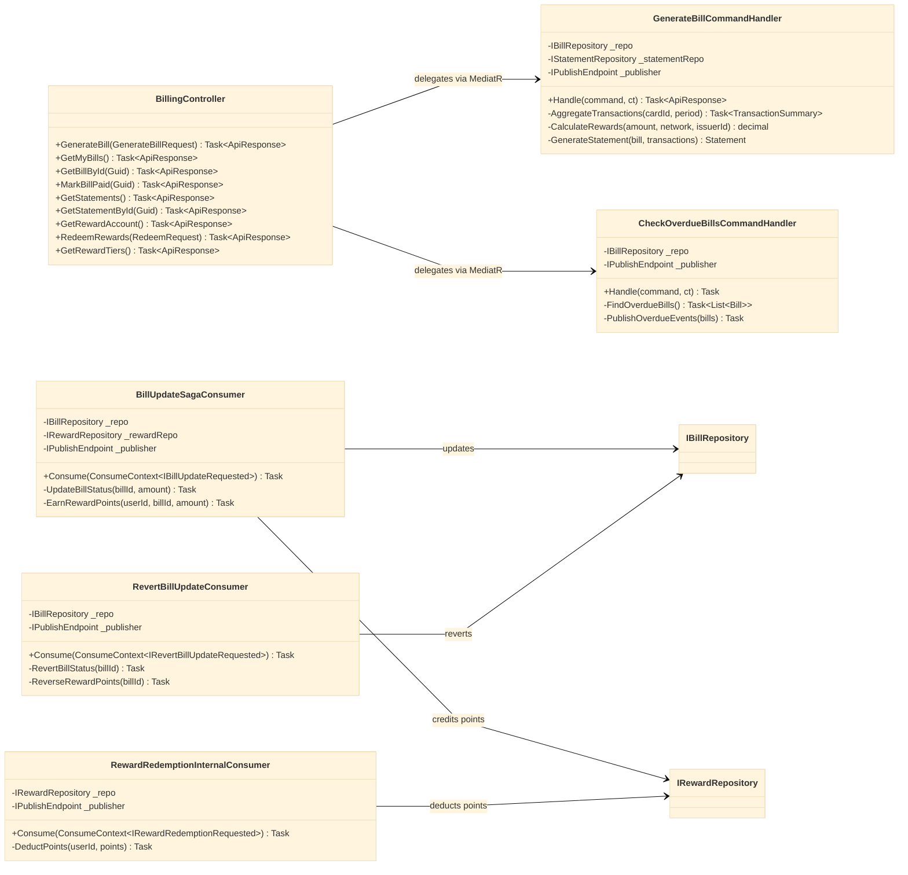
```mermaid
%%{init: {"theme":"base","themeVariables":{"fontSize":"15px","edgeLabelBackground":"#ffffff"},"flowchart":{"curve":"linear","nodeSpacing":95,"rankSpacing":130},"sequence":{"actorMargin":95,"messageMargin":60,"diagramMarginX":90,"diagramMarginY":55}}}%%
classDiagram
    direction LR
    class BillingController {
        +GenerateBill(GenerateBillRequest) Task~ApiResponse~
        +GetMyBills() Task~ApiResponse~
        +GetBillById(Guid) Task~ApiResponse~
        +MarkBillPaid(Guid) Task~ApiResponse~
        +GetStatements() Task~ApiResponse~
        +GetStatementById(Guid) Task~ApiResponse~
        +GetRewardAccount() Task~ApiResponse~
        +RedeemRewards(RedeemRequest) Task~ApiResponse~
        +GetRewardTiers() Task~ApiResponse~
    }

    class GenerateBillCommandHandler {
        -IBillRepository _repo
        -IStatementRepository _statementRepo
        -IPublishEndpoint _publisher
        +Handle(command, ct) Task~ApiResponse~
        -AggregateTransactions(cardId, period) Task~TransactionSummary~
        -CalculateRewards(amount, network, issuerId) decimal
        -GenerateStatement(bill, transactions) Statement
    }

    class CheckOverdueBillsCommandHandler {
        -IBillRepository _repo
        -IPublishEndpoint _publisher
        +Handle(command, ct) Task
        -FindOverdueBills() Task~List~Bill~~
        -PublishOverdueEvents(bills) Task
    }

    class BillUpdateSagaConsumer {
        -IBillRepository _repo
        -IRewardRepository _rewardRepo
        -IPublishEndpoint _publisher
        +Consume(ConsumeContext~IBillUpdateRequested~) Task
        -UpdateBillStatus(billId, amount) Task
        -EarnRewardPoints(userId, billId, amount) Task
    }

    class RewardRedemptionInternalConsumer {
        -IRewardRepository _repo
        -IPublishEndpoint _publisher
        +Consume(ConsumeContext~IRewardRedemptionRequested~) Task
        -DeductPoints(userId, points) Task
    }

    class RevertBillUpdateConsumer {
        -IBillRepository _repo
        -IPublishEndpoint _publisher
        +Consume(ConsumeContext~IRevertBillUpdateRequested~) Task
        -RevertBillStatus(billId) Task
        -ReverseRewardPoints(billId) Task
    }

    BillingController --> GenerateBillCommandHandler : delegates via MediatR
    BillingController --> CheckOverdueBillsCommandHandler : delegates via MediatR
    BillUpdateSagaConsumer --> IBillRepository : updates
    BillUpdateSagaConsumer --> IRewardRepository : credits points
    RevertBillUpdateConsumer --> IBillRepository : reverts
    RewardRedemptionInternalConsumer --> IRewardRepository : deducts points
```

### 6.5 Identity Service — Class Diagram

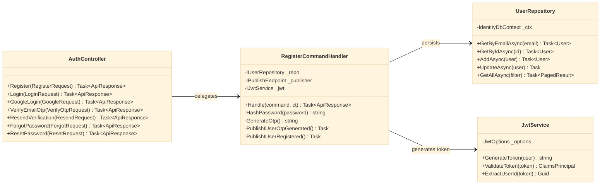
```mermaid
%%{init: {"theme":"base","themeVariables":{"fontSize":"15px","edgeLabelBackground":"#ffffff"},"flowchart":{"curve":"linear","nodeSpacing":95,"rankSpacing":130},"sequence":{"actorMargin":95,"messageMargin":60,"diagramMarginX":90,"diagramMarginY":55}}}%%
classDiagram
    direction LR
    class AuthController {
        +Register(RegisterRequest) Task~ApiResponse~
        +Login(LoginRequest) Task~ApiResponse~
        +GoogleLogin(GoogleRequest) Task~ApiResponse~
        +VerifyEmailOtp(VerifyOtpRequest) Task~ApiResponse~
        +ResendVerification(ResendRequest) Task~ApiResponse~
        +ForgotPassword(ForgotRequest) Task~ApiResponse~
        +ResetPassword(ResetRequest) Task~ApiResponse~
    }

    class RegisterCommandHandler {
        -IUserRepository _repo
        -IPublishEndpoint _publisher
        -IJwtService _jwt
        +Handle(command, ct) Task~ApiResponse~
        -HashPassword(password) string
        -GenerateOtp() string
        -PublishIUserOtpGenerated() Task
        -PublishIUserRegistered() Task
    }

    class JwtService {
        -JwtOptions _options
        +GenerateToken(user) string
        +ValidateToken(token) ClaimsPrincipal
        +ExtractUserId(token) Guid
    }

    class UserRepository {
        -IdentityDbContext _ctx
        +GetByEmailAsync(email) Task~User~
        +GetByIdAsync(id) Task~User~
        +AddAsync(user) Task~User~
        +UpdateAsync(user) Task
        +GetAllAsync(filter) Task~PagedResult~
    }

    AuthController --> RegisterCommandHandler : delegates
    RegisterCommandHandler --> UserRepository : persists
    RegisterCommandHandler --> JwtService : generates token
```

---

## 7. Database Architecture & ER Diagrams

All services follow the **Database-per-Service** pattern. SQL foreign keys only exist **within** the same database. Cross-service references are plain GUID columns with application-layer validation only.

### 7.1 Database Inventory

| Service | Database | Tables | SQL FK Count | Last Migration |
|---|---|---|---|---|
| Identity | `credvault_identity` | 1 | 0 | Initial |
| Card | `credvault_cards` | 3 | 2 | Initial |
| Billing | `credvault_billing` | 6 | 5 | `AddMissingForeignKeys` (2026-04-12) |
| Payment | `credvault_payments` | 3 | 1 | Initial |
| Notification | `credvault_notifications` | 2 | 0 | Initial |

### 7.2 Identity Database (`credvault_identity`)

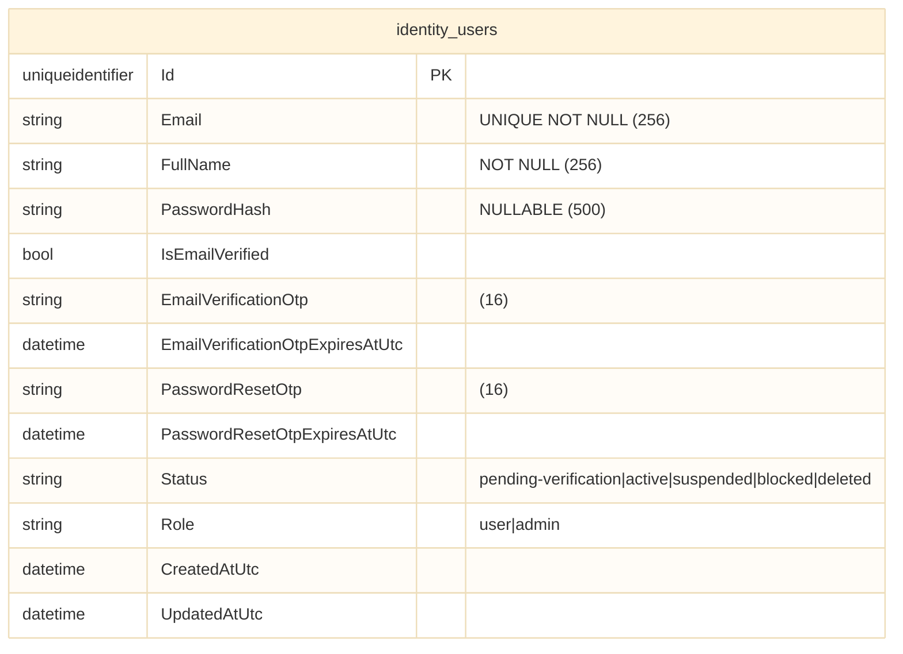
```mermaid
%%{init: {"theme":"base","themeVariables":{"fontSize":"15px","edgeLabelBackground":"#ffffff"},"flowchart":{"curve":"linear","nodeSpacing":95,"rankSpacing":130},"sequence":{"actorMargin":95,"messageMargin":60,"diagramMarginX":90,"diagramMarginY":55}}}%%
erDiagram
    identity_users {
        uniqueidentifier Id PK
        string Email "UNIQUE NOT NULL (256)"
        string FullName "NOT NULL (256)"
        string PasswordHash "NULLABLE (500)"
        bool IsEmailVerified
        string EmailVerificationOtp "(16)"
        datetime EmailVerificationOtpExpiresAtUtc
        string PasswordResetOtp "(16)"
        datetime PasswordResetOtpExpiresAtUtc
        string Status "pending-verification|active|suspended|blocked|deleted"
        string Role "user|admin"
        datetime CreatedAtUtc
        datetime UpdatedAtUtc
    }
```

**Indexes:** `Email (UNIQUE)`

**Enums:**

| Enum | Values |
|---|---|
| `UserStatus` | PendingVerification(1), Active(2), Suspended(3), Blocked(4), Deleted(5) |
| `UserRole` | User(1), Admin(2) |

---

### 7.3 Card Database (`credvault_cards`)

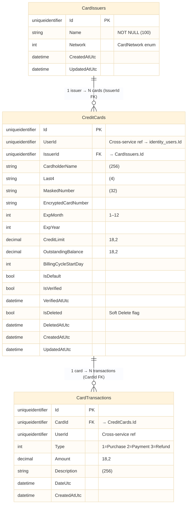
```mermaid
%%{init: {"theme":"base","themeVariables":{"fontSize":"15px","edgeLabelBackground":"#ffffff"},"flowchart":{"curve":"linear","nodeSpacing":95,"rankSpacing":130},"sequence":{"actorMargin":95,"messageMargin":60,"diagramMarginX":90,"diagramMarginY":55}}}%%
erDiagram
    CardIssuers {
        uniqueidentifier Id PK
        string Name "NOT NULL (100)"
        int Network "CardNetwork enum"
        datetime CreatedAtUtc
        datetime UpdatedAtUtc
    }

    CreditCards {
        uniqueidentifier Id PK
        uniqueidentifier UserId "Cross-service ref → identity_users.Id"
        uniqueidentifier IssuerId FK "→ CardIssuers.Id"
        string CardholderName "(256)"
        string Last4 "(4)"
        string MaskedNumber "(32)"
        string EncryptedCardNumber
        int ExpMonth "1–12"
        int ExpYear
        decimal CreditLimit "18,2"
        decimal OutstandingBalance "18,2"
        int BillingCycleStartDay
        bool IsDefault
        bool IsVerified
        datetime VerifiedAtUtc
        bool IsDeleted "Soft Delete flag"
        datetime DeletedAtUtc
        datetime CreatedAtUtc
        datetime UpdatedAtUtc
    }

    CardTransactions {
        uniqueidentifier Id PK
        uniqueidentifier CardId FK "→ CreditCards.Id"
        uniqueidentifier UserId "Cross-service ref"
        int Type "1=Purchase 2=Payment 3=Refund"
        decimal Amount "18,2"
        string Description "(256)"
        datetime DateUtc
        datetime CreatedAtUtc
    }

    CardIssuers ||--o{ CreditCards : "1 issuer → N cards (IssuerId FK)"
    CreditCards ||--o{ CardTransactions : "1 card → N transactions (CardId FK)"
```

**Indexes:** `CreditCards(UserId)`, `CreditCards(UserId, IsDefault)`, `CardTransactions(CardId)`, `CardTransactions(UserId)`, `CardTransactions(DateUtc)`

**On Delete:** CardIssuers → CreditCards: `RESTRICT` | CreditCards → CardTransactions: `RESTRICT`

---

### 7.4 Billing Database (`credvault_billing`)

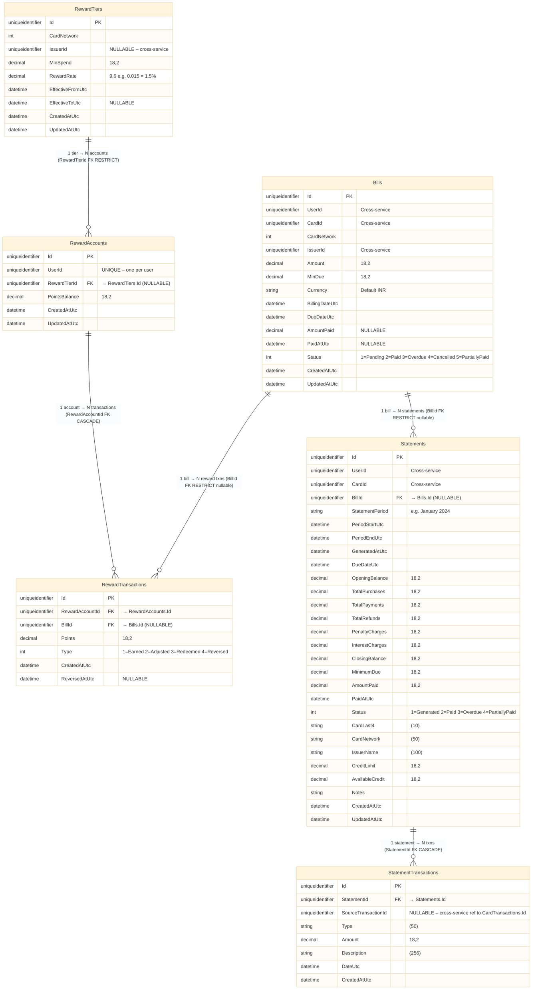
```mermaid
%%{init: {"theme":"base","themeVariables":{"fontSize":"15px","edgeLabelBackground":"#ffffff"},"flowchart":{"curve":"linear","nodeSpacing":95,"rankSpacing":130},"sequence":{"actorMargin":95,"messageMargin":60,"diagramMarginX":90,"diagramMarginY":55}}}%%
erDiagram
    Bills {
        uniqueidentifier Id PK
        uniqueidentifier UserId "Cross-service"
        uniqueidentifier CardId "Cross-service"
        int CardNetwork
        uniqueidentifier IssuerId "Cross-service"
        decimal Amount "18,2"
        decimal MinDue "18,2"
        string Currency "Default INR"
        datetime BillingDateUtc
        datetime DueDateUtc
        decimal AmountPaid "NULLABLE"
        datetime PaidAtUtc "NULLABLE"
        int Status "1=Pending 2=Paid 3=Overdue 4=Cancelled 5=PartiallyPaid"
        datetime CreatedAtUtc
        datetime UpdatedAtUtc
    }

    RewardTiers {
        uniqueidentifier Id PK
        int CardNetwork
        uniqueidentifier IssuerId "NULLABLE – cross-service"
        decimal MinSpend "18,2"
        decimal RewardRate "9,6 e.g. 0.015 = 1.5%"
        datetime EffectiveFromUtc
        datetime EffectiveToUtc "NULLABLE"
        datetime CreatedAtUtc
        datetime UpdatedAtUtc
    }

    RewardAccounts {
        uniqueidentifier Id PK
        uniqueidentifier UserId "UNIQUE – one per user"
        uniqueidentifier RewardTierId FK "→ RewardTiers.Id (NULLABLE)"
        decimal PointsBalance "18,2"
        datetime CreatedAtUtc
        datetime UpdatedAtUtc
    }

    RewardTransactions {
        uniqueidentifier Id PK
        uniqueidentifier RewardAccountId FK "→ RewardAccounts.Id"
        uniqueidentifier BillId FK "→ Bills.Id (NULLABLE)"
        decimal Points "18,2"
        int Type "1=Earned 2=Adjusted 3=Redeemed 4=Reversed"
        datetime CreatedAtUtc
        datetime ReversedAtUtc "NULLABLE"
    }

    Statements {
        uniqueidentifier Id PK
        uniqueidentifier UserId "Cross-service"
        uniqueidentifier CardId "Cross-service"
        uniqueidentifier BillId FK "→ Bills.Id (NULLABLE)"
        string StatementPeriod "e.g. January 2024"
        datetime PeriodStartUtc
        datetime PeriodEndUtc
        datetime GeneratedAtUtc
        datetime DueDateUtc
        decimal OpeningBalance "18,2"
        decimal TotalPurchases "18,2"
        decimal TotalPayments "18,2"
        decimal TotalRefunds "18,2"
        decimal PenaltyCharges "18,2"
        decimal InterestCharges "18,2"
        decimal ClosingBalance "18,2"
        decimal MinimumDue "18,2"
        decimal AmountPaid "18,2"
        datetime PaidAtUtc
        int Status "1=Generated 2=Paid 3=Overdue 4=PartiallyPaid"
        string CardLast4 "(10)"
        string CardNetwork "(50)"
        string IssuerName "(100)"
        decimal CreditLimit "18,2"
        decimal AvailableCredit "18,2"
        string Notes
        datetime CreatedAtUtc
        datetime UpdatedAtUtc
    }

    StatementTransactions {
        uniqueidentifier Id PK
        uniqueidentifier StatementId FK "→ Statements.Id"
        uniqueidentifier SourceTransactionId "NULLABLE – cross-service ref to CardTransactions.Id"
        string Type "(50)"
        decimal Amount "18,2"
        string Description "(256)"
        datetime DateUtc
        datetime CreatedAtUtc
    }

    RewardTiers ||--o{ RewardAccounts : "1 tier → N accounts (RewardTierId FK RESTRICT)"
    RewardAccounts ||--o{ RewardTransactions : "1 account → N transactions (RewardAccountId FK CASCADE)"
    Bills ||--o{ RewardTransactions : "1 bill → N reward txns (BillId FK RESTRICT nullable)"
    Bills ||--o{ Statements : "1 bill → N statements (BillId FK RESTRICT nullable)"
    Statements ||--o{ StatementTransactions : "1 statement → N txns (StatementId FK CASCADE)"
```

**Note on `AddMissingForeignKeys` migration (2026-04-12):** Two FKs were missing from the original schema and were added:
- `RewardAccounts.RewardTierId → RewardTiers.Id`
- `Statements.BillId → Bills.Id`

---

### 7.5 Payment Database (`credvault_payments`)

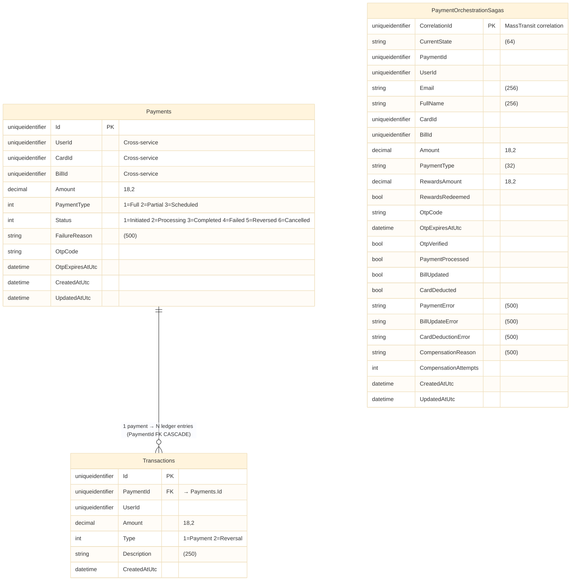
```mermaid
%%{init: {"theme":"base","themeVariables":{"fontSize":"15px","edgeLabelBackground":"#ffffff"},"flowchart":{"curve":"linear","nodeSpacing":95,"rankSpacing":130},"sequence":{"actorMargin":95,"messageMargin":60,"diagramMarginX":90,"diagramMarginY":55}}}%%
erDiagram
    Payments {
        uniqueidentifier Id PK
        uniqueidentifier UserId "Cross-service"
        uniqueidentifier CardId "Cross-service"
        uniqueidentifier BillId "Cross-service"
        decimal Amount "18,2"
        int PaymentType "1=Full 2=Partial 3=Scheduled"
        int Status "1=Initiated 2=Processing 3=Completed 4=Failed 5=Reversed 6=Cancelled"
        string FailureReason "(500)"
        string OtpCode
        datetime OtpExpiresAtUtc
        datetime CreatedAtUtc
        datetime UpdatedAtUtc
    }

    Transactions {
        uniqueidentifier Id PK
        uniqueidentifier PaymentId FK "→ Payments.Id"
        uniqueidentifier UserId
        decimal Amount "18,2"
        int Type "1=Payment 2=Reversal"
        string Description "(250)"
        datetime CreatedAtUtc
    }

    PaymentOrchestrationSagas {
        uniqueidentifier CorrelationId PK "MassTransit correlation"
        string CurrentState "(64)"
        uniqueidentifier PaymentId
        uniqueidentifier UserId
        string Email "(256)"
        string FullName "(256)"
        uniqueidentifier CardId
        uniqueidentifier BillId
        decimal Amount "18,2"
        string PaymentType "(32)"
        decimal RewardsAmount "18,2"
        bool RewardsRedeemed
        string OtpCode
        datetime OtpExpiresAtUtc
        bool OtpVerified
        bool PaymentProcessed
        bool BillUpdated
        bool CardDeducted
        string PaymentError "(500)"
        string BillUpdateError "(500)"
        string CardDeductionError "(500)"
        string CompensationReason "(500)"
        int CompensationAttempts
        datetime CreatedAtUtc
        datetime UpdatedAtUtc
    }

    Payments ||--o{ Transactions : "1 payment → N ledger entries (PaymentId FK CASCADE)"
```

**Indexes:** `Payments(UserId)`, `Payments(BillId)`, `Transactions(UserId)`

---

### 7.6 Notification Database (`credvault_notifications`)

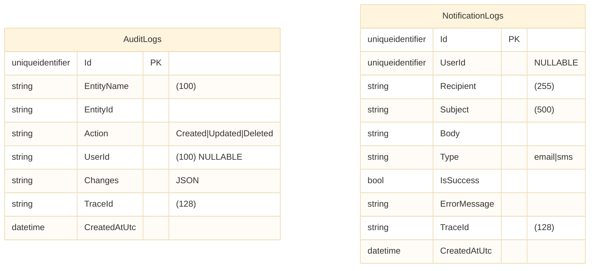
```mermaid
%%{init: {"theme":"base","themeVariables":{"fontSize":"15px","edgeLabelBackground":"#ffffff"},"flowchart":{"curve":"linear","nodeSpacing":95,"rankSpacing":130},"sequence":{"actorMargin":95,"messageMargin":60,"diagramMarginX":90,"diagramMarginY":55}}}%%
erDiagram
    AuditLogs {
        uniqueidentifier Id PK
        string EntityName "(100)"
        string EntityId
        string Action "Created|Updated|Deleted"
        string UserId "(100) NULLABLE"
        string Changes "JSON"
        string TraceId "(128)"
        datetime CreatedAtUtc
    }

    NotificationLogs {
        uniqueidentifier Id PK
        uniqueidentifier UserId "NULLABLE"
        string Recipient "(255)"
        string Subject "(500)"
        string Body
        string Type "email|sms"
        bool IsSuccess
        string ErrorMessage
        string TraceId "(128)"
        datetime CreatedAtUtc
    }
```

---

### 7.7 Cross-Service Reference Map

SQL foreign key constraints **cannot** cross databases. The table below documents all logical cross-service references and how they are validated at the application layer.

| Column | Host Table | Host DB | Logically References | Owner DB | Validation Method |
|---|---|---|---|---|---|
| `UserId` | `CreditCards` | cards | `identity_users.Id` | identity | JWT claim check |
| `UserId` | `Bills` | billing | `identity_users.Id` | identity | JWT claim + event payload |
| `CardId` | `Bills` | billing | `CreditCards.Id` | cards | Event payload from card service |
| `IssuerId` | `Bills` | billing | `CardIssuers.Id` | cards | Stored at bill generation time |
| `CardId` | `Statements` | billing | `CreditCards.Id` | cards | Bill generation context |
| `UserId` | `Statements` | billing | `identity_users.Id` | identity | JWT claim |
| `IssuerId` | `RewardTiers` | billing | `CardIssuers.Id` | cards | Admin-managed data entry |
| `SourceTransactionId` | `StatementTransactions` | billing | `CardTransactions.Id` | cards | Best-effort denormalization |
| `CardId` | `Payments` | payments | `CreditCards.Id` | cards | API call at payment initiation |
| `BillId` | `Payments` | payments | `Bills.Id` | billing | API call at payment initiation |
| `UserId` | `Payments` | payments | `identity_users.Id` | identity | JWT claim |
| `UserId` | `NotificationLogs` | notifications | `identity_users.Id` | identity | Event payload |

---

## 8. Event-Driven Architecture (RabbitMQ)

### 8.1 Two Event Patterns in CredVault

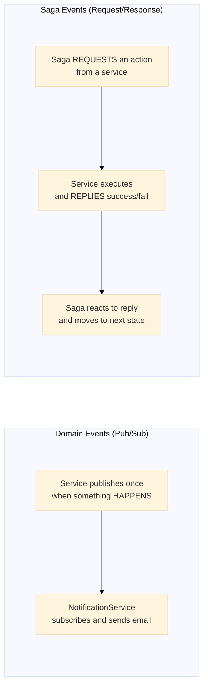
```mermaid
%%{init: {"theme":"base","themeVariables":{"fontSize":"15px","edgeLabelBackground":"#ffffff"},"flowchart":{"curve":"linear","nodeSpacing":95,"rankSpacing":130},"sequence":{"actorMargin":95,"messageMargin":60,"diagramMarginX":90,"diagramMarginY":55}}}%%
flowchart LR
    subgraph DOMAIN["Domain Events (Pub/Sub)"]
        direction TB
        D1["Service publishes once\nwhen something HAPPENS"]
        D2["NotificationService\nsubscribes and sends email"]
        D1 --> D2
    end

    subgraph SAGA["Saga Events (Request/Response)"]
        direction TB
        S1["Saga REQUESTS an action\nfrom a service"]
        S2["Service executes\nand REPLIES success/fail"]
        S3["Saga reacts to reply\nand moves to next state"]
        S1 --> S2 --> S3
    end
```

| Attribute | Domain Events | Saga Events |
|---|---|---|
| **Pattern** | Fire and forget (Pub/Sub) | Request → Response |
| **Consumer** | Notification Service (emails) | Always the Saga |
| **Routing** | Fanout via exchange | Direct point-to-point queue |
| **Failure Handling** | DLQ after retries | Saga compensation logic |
| **Count** | 10 events | 22 events |

### 8.2 Queue Architecture

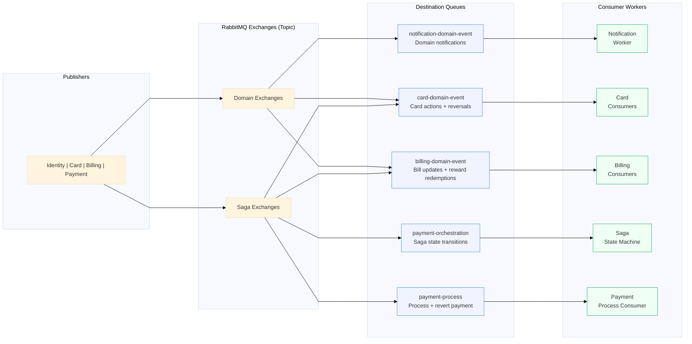
```mermaid
%%{init: {"theme":"base","themeVariables":{"fontSize":"15px","edgeLabelBackground":"#ffffff"},"flowchart":{"curve":"linear","nodeSpacing":95,"rankSpacing":130},"sequence":{"actorMargin":95,"messageMargin":60,"diagramMarginX":90,"diagramMarginY":55}}}%%
flowchart LR
    subgraph PUB["Publishers"]
        P["Identity | Card | Billing | Payment"]
    end

    subgraph EXCHANGES["RabbitMQ Exchanges (Topic)"]
        E1["Domain Exchanges"]
        E2["Saga Exchanges"]
    end

    subgraph QUEUES["Destination Queues"]
        QN["notification-domain-event\nDomain notifications"]
        QC["card-domain-event\nCard actions + reversals"]
        QB["billing-domain-event\nBill updates + reward redemptions"]
        QS["payment-orchestration\nSaga state transitions"]
        QP["payment-process\nProcess + revert payment"]
    end

    subgraph CONSUMERS["Consumer Workers"]
        NS["Notification\nWorker"]
        CW["Card\nConsumers"]
        BW["Billing\nConsumers"]
        SW["Saga\nState Machine"]
        PW["Payment\nProcess Consumer"]
    end

    P --> E1
    P --> E2

    E1 --> QN
    E1 --> QC
    E1 --> QB
    E2 --> QS
    E2 --> QP
    E2 --> QC
    E2 --> QB

    QN --> NS
    QC --> CW
    QB --> BW
    QS --> SW
    QP --> PW

    classDef queueStyle fill:#f0f4ff,stroke:#4a90d9
    classDef workerStyle fill:#f0fff4,stroke:#27ae60
    class QN,QC,QB,QS,QP queueStyle
    class NS,CW,BW,SW,PW workerStyle
```

### 8.3 Retry & Dead Letter Policy

| Stage | Behavior |
|---|---|
| **Attempt 1** | Message processed immediately |
| **Attempt 2** | Retry after 5 seconds (fast retry) |
| **Attempt 3** | Retry after 30 seconds (slow retry) |
| **Exhausted** | Message moved to `<queue-name>.error` DLQ |
| **Saga Fault** | Max 3 internal attempts → transitions to `Compensating` state |

---

## 9. Complete Event Catalog

### 9.1 Summary

| Category | Count | Working |
|---|---|---|
| Identity Events | 3 | 2 active, 1 scheduled for activation |
| Card Events | 1 | ✅ |
| Billing Events | 2 | 1 active, 1 pending downstream adoption |
| Payment Domain Events | 4 | ✅ |
| Saga Orchestration Events | 22 | ✅ |
| **Total** | **32** | **28 active in current release** |

### 9.2 Identity Events

**File:** `shared.contracts/Shared.Contracts/Events/Identity/IdentityEvents.cs`

| Event | Publisher | Consumer(s) | Properties |
|---|---|---|---|
| `IUserRegistered` | RegisterCommandHandler | NotificationService | UserId, Email, FullName, CreatedAtUtc |
| `IUserOtpGenerated` | RegisterHandler, ResendVerificationHandler, ForgotPasswordHandler | NotificationService | UserId, Email, FullName, OtpCode, Purpose, ExpiresAtUtc |
| `IUserDeleted` | Identity user lifecycle workflow (activation pending) | Card, Billing, Payment | UserId, DeletedAtUtc |

### 9.3 Card Events

**File:** `shared.contracts/Shared.Contracts/Events/Card/CardEvents.cs`

| Event | Publisher | Consumer(s) | Properties |
|---|---|---|---|
| `ICardAdded` | CreateCardCommandHandler | NotificationService | CardId, UserId, Email, FullName, CardNumberLast4, CardHolderName, AddedAt |

### 9.4 Billing Events

**File:** `shared.contracts/Shared.Contracts/Events/Billing/BillingEvents.cs`

| Event | Publisher | Consumer(s) | Properties |
|---|---|---|---|
| `IBillGenerated` | GenerateBillCommandHandler | NotificationService | BillId, UserId, Email, FullName, CardId, Amount, DueDate, GeneratedAt |
| `IBillOverdueDetected` | CheckOverdueBillsCommandHandler | Planned: Notification reminders, Billing penalty processor | BillId, CardId, UserId, OverdueAmount, DueDate, DaysOverdue, DetectedAt |

### 9.5 Payment Domain Events

**File:** `shared.contracts/Shared.Contracts/Events/Payment/PaymentEvents.cs`

| Event | Publisher | Consumer(s) | Properties |
|---|---|---|---|
| `IPaymentCompleted` | PaymentOrchestrationSaga (on completion) | NotificationService, Saga | PaymentId, UserId, Email, FullName, CardId, BillId, Amount, AmountPaid, RewardsRedeemed, CompletedAt |
| `IPaymentFailed` | PaymentOrchestrationSaga (on compensation) | NotificationService, Saga | PaymentId, UserId, Email, FullName, Amount, Reason, FailedAt |
| `IPaymentReversed` | PaymentOrchestrationSaga (reversal) | Card Service (restores balance) | PaymentId, UserId, BillId, CardId, Amount, PointsDeducted, ReversedAt |
| `IPaymentOtpGenerated` | InitiatePaymentCommandHandler | NotificationService | PaymentId, UserId, Email, FullName, Amount, OtpCode, ExpiresAtUtc |

### 9.6 Saga Orchestration Events

**File:** `shared.contracts/Shared.Contracts/Events/Saga/SagaOrchestrationEvents.cs`

**Saga → Services (Commands):**

| Event | Trigger | Target |
|---|---|---|
| `IStartPaymentOrchestration` | Payment initiated | Saga starts |
| `IOtpVerified` | User submits correct OTP | Saga transitions |
| `IOtpFailed` | User submits wrong OTP | Saga marks failure |
| `IPaymentProcessRequested` | OTP verified | PaymentProcessConsumer |
| `IBillUpdateRequested` | Payment processed | Billing SagaConsumer |
| `ICardDeductionRequested` | Bill updated | Card SagaConsumer |
| `IRewardRedemptionRequested` | Bill updated (if rewards) | RewardRedemptionConsumer |
| `IRevertBillUpdateRequested` | Card deduction failed | Billing SagaConsumer (compensate) |
| `IRevertPaymentRequested` | Bill revert succeeded | RevertPaymentConsumer |

**Services → Saga (Responses):**

| Event | Sender | Meaning |
|---|---|---|
| `IPaymentProcessSucceeded` | PaymentProcessConsumer | Payment ledger created |
| `IPaymentProcessFailed` | PaymentProcessConsumer | Ledger failed |
| `IBillUpdateSucceeded` | BillUpdateSagaConsumer | Bill marked processing |
| `IBillUpdateFailed` | BillUpdateSagaConsumer | Bill update error |
| `ICardDeductionSucceeded` | CardDeductionSagaConsumer | Balance deducted |
| `ICardDeductionFailed` | CardDeductionSagaConsumer | Insufficient balance / error |
| `IRevertBillUpdateSucceeded` | RevertBillUpdateConsumer | Bill reverted to Pending |
| `IRevertBillUpdateFailed` | RevertBillUpdateConsumer | Revert failed |
| `IRevertPaymentSucceeded` | RevertPaymentConsumer | Payment voided |
| `IRevertPaymentFailed` | RevertPaymentConsumer | Void failed |
| `IRewardRedemptionSucceeded` | RewardRedemptionConsumer | Points deducted |
| `IRewardRedemptionFailed` | RewardRedemptionConsumer | Points deduction error |

---

## 10. Saga State Machine — Payment Orchestration

The Payment Orchestration Saga coordinates a distributed, multi-service atomic operation. It is implemented as a MassTransit `MassTransitStateMachine<PaymentOrchestrationSagaState>`.

### 10.1 State Transition Diagram

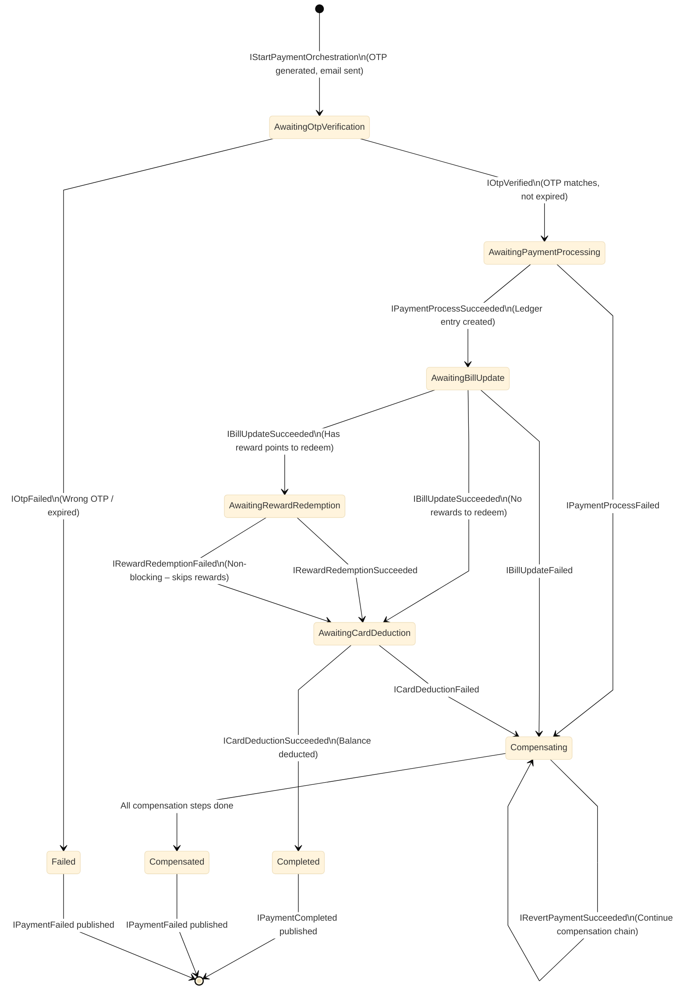
```mermaid
%%{init: {"theme":"base","themeVariables":{"fontSize":"15px","edgeLabelBackground":"#ffffff"},"flowchart":{"curve":"linear","nodeSpacing":95,"rankSpacing":130},"sequence":{"actorMargin":95,"messageMargin":60,"diagramMarginX":90,"diagramMarginY":55}}}%%
stateDiagram-v2
    [*] --> AwaitingOtpVerification : IStartPaymentOrchestration\n(OTP generated, email sent)

    AwaitingOtpVerification --> AwaitingPaymentProcessing : IOtpVerified\n(OTP matches, not expired)
    AwaitingOtpVerification --> Failed : IOtpFailed\n(Wrong OTP / expired)

    AwaitingPaymentProcessing --> AwaitingBillUpdate : IPaymentProcessSucceeded\n(Ledger entry created)
    AwaitingPaymentProcessing --> Compensating : IPaymentProcessFailed

    AwaitingBillUpdate --> AwaitingRewardRedemption : IBillUpdateSucceeded\n(Has reward points to redeem)
    AwaitingBillUpdate --> AwaitingCardDeduction : IBillUpdateSucceeded\n(No rewards to redeem)
    AwaitingBillUpdate --> Compensating : IBillUpdateFailed

    AwaitingRewardRedemption --> AwaitingCardDeduction : IRewardRedemptionSucceeded
    AwaitingRewardRedemption --> AwaitingCardDeduction : IRewardRedemptionFailed\n(Non-blocking – skips rewards)

    AwaitingCardDeduction --> Completed : ICardDeductionSucceeded\n(Balance deducted)
    AwaitingCardDeduction --> Compensating : ICardDeductionFailed

    Compensating --> Compensating : IRevertBillUpdateSucceeded\n(Continue compensation chain)
    Compensating --> Compensating : IRevertPaymentSucceeded\n(Continue compensation chain)
    Compensating --> Compensated : All compensation steps done

    Completed --> [*] : IPaymentCompleted published
    Compensated --> [*] : IPaymentFailed published
    Failed --> [*] : IPaymentFailed published
```

### 10.2 State Descriptions

| State | Description | Next Trigger |
|---|---|---|
| `AwaitingOtpVerification` | Saga created. OTP emailed to user. Waiting for `/verify-otp` call. | `IOtpVerified` or `IOtpFailed` |
| `AwaitingPaymentProcessing` | OTP validated. Payment process consumer asked to create ledger entry. | `IPaymentProcessSucceeded` or `IPaymentProcessFailed` |
| `AwaitingBillUpdate` | Ledger entry created. Billing asked to mark bill as paying. | `IBillUpdateSucceeded` or `IBillUpdateFailed` |
| `AwaitingRewardRedemption` | Bill updated. If user has reward points selected, redemption is requested. | `IRewardRedemptionSucceeded` or `IRewardRedemptionFailed` |
| `AwaitingCardDeduction` | Rewards handled. Card service asked to deduct outstanding balance. | `ICardDeductionSucceeded` or `ICardDeductionFailed` |
| `Completed` | All steps succeeded. `IPaymentCompleted` published. | Terminal |
| `Compensating` | A step failed. Rolling back completed steps in reverse order. | Compensation responses |
| `Compensated` | All rollback steps done. `IPaymentFailed` published. | Terminal |
| `Failed` | OTP failure path. No compensation needed. | Terminal |

### 10.3 Compensation Chain

Compensation executes in reverse order of execution:

```
Step that failed: ICardDeductionFailed
    ↓
Compensate Step 3: Publish IRevertBillUpdateRequested → Billing reverts bill to Pending
    ↓
Compensate Step 2: Publish IRevertPaymentRequested → Payment voids ledger entry
    ↓
State → Compensated
    ↓
Publish IPaymentFailed
```

---

## 11. Sequence Diagrams — Core User Flows

### 11.1 User Registration & Email Verification

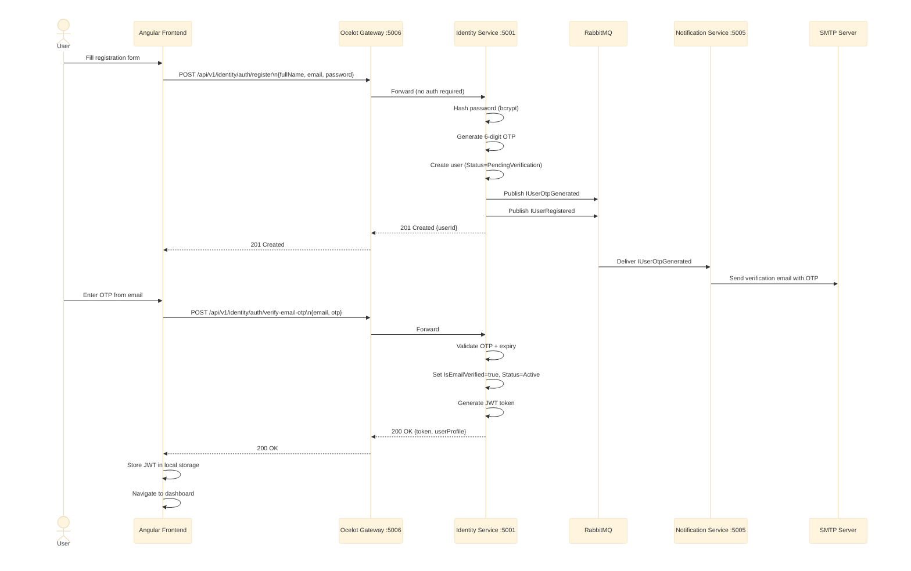
```mermaid
%%{init: {"theme":"base","themeVariables":{"fontSize":"15px","edgeLabelBackground":"#ffffff"},"flowchart":{"curve":"linear","nodeSpacing":95,"rankSpacing":130},"sequence":{"actorMargin":95,"messageMargin":60,"diagramMarginX":90,"diagramMarginY":55}}}%%
sequenceDiagram
    actor U as User
    participant F as Angular Frontend
    participant G as Ocelot Gateway :5006
    participant I as Identity Service :5001
    participant RMQ as RabbitMQ
    participant N as Notification Service :5005
    participant EMAIL as SMTP Server

    U->>F: Fill registration form
    F->>G: POST /api/v1/identity/auth/register\n{fullName, email, password}
    G->>I: Forward (no auth required)
    I->>I: Hash password (bcrypt)
    I->>I: Generate 6-digit OTP
    I->>I: Create user (Status=PendingVerification)
    I->>RMQ: Publish IUserOtpGenerated
    I->>RMQ: Publish IUserRegistered
    I-->>G: 201 Created {userId}
    G-->>F: 201 Created
    RMQ->>N: Deliver IUserOtpGenerated
    N->>EMAIL: Send verification email with OTP

    U->>F: Enter OTP from email
    F->>G: POST /api/v1/identity/auth/verify-email-otp\n{email, otp}
    G->>I: Forward
    I->>I: Validate OTP + expiry
    I->>I: Set IsEmailVerified=true, Status=Active
    I->>I: Generate JWT token
    I-->>G: 200 OK {token, userProfile}
    G-->>F: 200 OK
    F->>F: Store JWT in local storage
    F->>F: Navigate to dashboard
```

### 11.2 Add Credit Card

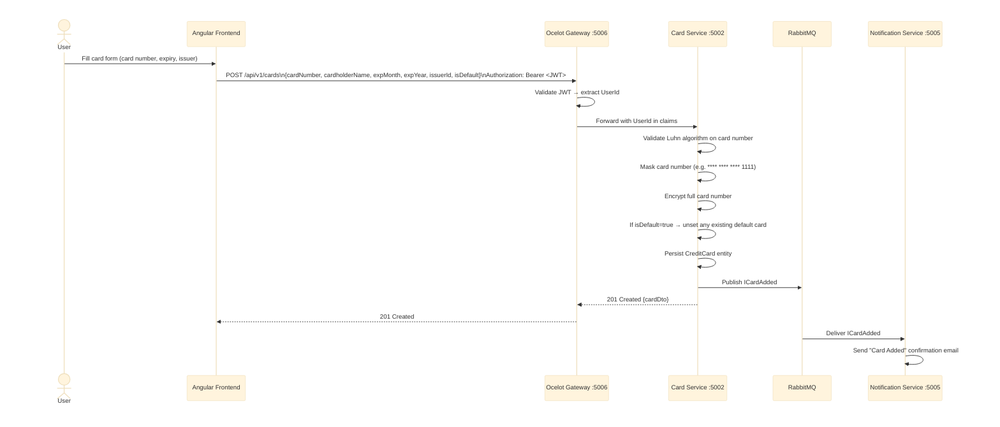
```mermaid
%%{init: {"theme":"base","themeVariables":{"fontSize":"15px","edgeLabelBackground":"#ffffff"},"flowchart":{"curve":"linear","nodeSpacing":95,"rankSpacing":130},"sequence":{"actorMargin":95,"messageMargin":60,"diagramMarginX":90,"diagramMarginY":55}}}%%
sequenceDiagram
    actor U as User
    participant F as Angular Frontend
    participant G as Ocelot Gateway :5006
    participant C as Card Service :5002
    participant RMQ as RabbitMQ
    participant N as Notification Service :5005

    U->>F: Fill card form (card number, expiry, issuer)
    F->>G: POST /api/v1/cards\n{cardNumber, cardholderName, expMonth, expYear, issuerId, isDefault}\nAuthorization: Bearer <JWT>
    G->>G: Validate JWT → extract UserId
    G->>C: Forward with UserId in claims
    C->>C: Validate Luhn algorithm on card number
    C->>C: Mask card number (e.g. **** **** **** 1111)
    C->>C: Encrypt full card number
    C->>C: If isDefault=true → unset any existing default card
    C->>C: Persist CreditCard entity
    C->>RMQ: Publish ICardAdded
    C-->>G: 201 Created {cardDto}
    G-->>F: 201 Created
    RMQ->>N: Deliver ICardAdded
    N->>N: Send "Card Added" confirmation email
```

### 11.3 Bill Generation (Admin)

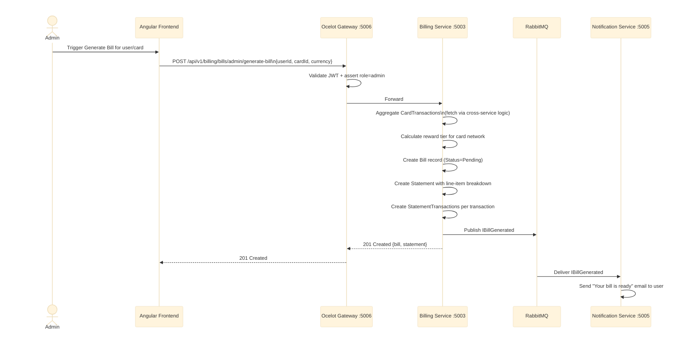
```mermaid
%%{init: {"theme":"base","themeVariables":{"fontSize":"15px","edgeLabelBackground":"#ffffff"},"flowchart":{"curve":"linear","nodeSpacing":95,"rankSpacing":130},"sequence":{"actorMargin":95,"messageMargin":60,"diagramMarginX":90,"diagramMarginY":55}}}%%
sequenceDiagram
    actor A as Admin
    participant F as Angular Frontend
    participant G as Ocelot Gateway :5006
    participant B as Billing Service :5003
    participant RMQ as RabbitMQ
    participant N as Notification Service :5005

    A->>F: Trigger Generate Bill for user/card
    F->>G: POST /api/v1/billing/bills/admin/generate-bill\n{userId, cardId, currency}
    G->>G: Validate JWT + assert role=admin
    G->>B: Forward
    B->>B: Aggregate CardTransactions\n(fetch via cross-service logic)
    B->>B: Calculate reward tier for card network
    B->>B: Create Bill record (Status=Pending)
    B->>B: Create Statement with line-item breakdown
    B->>B: Create StatementTransactions per transaction
    B->>RMQ: Publish IBillGenerated
    B-->>G: 201 Created {bill, statement}
    G-->>F: 201 Created
    RMQ->>N: Deliver IBillGenerated
    N->>N: Send "Your bill is ready" email to user
```

### 11.4 Payment Flow — Happy Path (Full Saga)

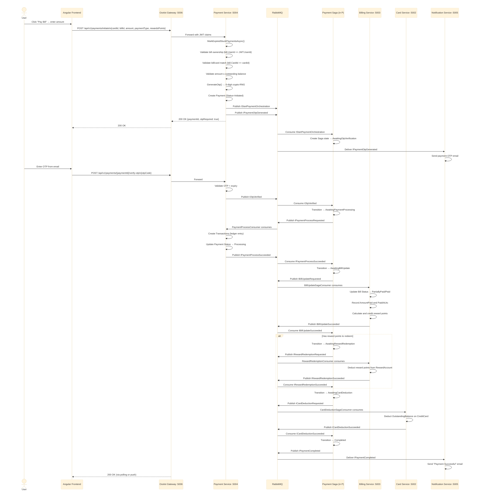
```mermaid
%%{init: {"theme":"base","themeVariables":{"fontSize":"15px","edgeLabelBackground":"#ffffff"},"flowchart":{"curve":"linear","nodeSpacing":95,"rankSpacing":130},"sequence":{"actorMargin":95,"messageMargin":60,"diagramMarginX":90,"diagramMarginY":55}}}%%
sequenceDiagram
    actor U as User
    participant F as Angular Frontend
    participant G as Ocelot Gateway :5006
    participant P as Payment Service :5004
    participant RMQ as RabbitMQ
    participant SAGA as Payment Saga (in P)
    participant B as Billing Service :5003
    participant C as Card Service :5002
    participant N as Notification Service :5005

    U->>F: Click "Pay Bill" → enter amount
    F->>G: POST /api/v1/payments/initiate\n{cardId, billId, amount, paymentType, rewardsPoints}
    G->>P: Forward with JWT claims
    P->>P: MarkExpiredStuckPaymentsAsync()
    P->>P: Validate bill ownership (bill.UserId == JWT.UserId)
    P->>P: Validate bill/card match (bill.CardId == cardId)
    P->>P: Validate amount ≤ outstanding balance
    P->>P: GenerateOtp() → 6-digit crypto-RNG
    P->>P: Create Payment (Status=Initiated)
    P->>RMQ: Publish IStartPaymentOrchestration
    P->>RMQ: Publish IPaymentOtpGenerated
    P-->>G: 200 OK {paymentId, otpRequired: true}
    G-->>F: 200 OK

    RMQ->>SAGA: Consume IStartPaymentOrchestration
    SAGA->>SAGA: Create Saga state → AwaitingOtpVerification
    RMQ->>N: Deliver IPaymentOtpGenerated
    N->>N: Send payment OTP email

    U->>F: Enter OTP from email
    F->>G: POST /api/v1/payments/{paymentId}/verify-otp\n{otpCode}
    G->>P: Forward
    P->>P: Validate OTP + expiry
    P->>RMQ: Publish IOtpVerified

    RMQ->>SAGA: Consume IOtpVerified
    SAGA->>SAGA: Transition → AwaitingPaymentProcessing
    SAGA->>RMQ: Publish IPaymentProcessRequested

    RMQ->>P: PaymentProcessConsumer consumes
    P->>P: Create Transactions (ledger entry)
    P->>P: Update Payment Status → Processing
    P->>RMQ: Publish IPaymentProcessSucceeded

    RMQ->>SAGA: Consume IPaymentProcessSucceeded
    SAGA->>SAGA: Transition → AwaitingBillUpdate
    SAGA->>RMQ: Publish IBillUpdateRequested

    RMQ->>B: BillUpdateSagaConsumer consumes
    B->>B: Update Bill Status → PartiallyPaid/Paid
    B->>B: Record AmountPaid and PaidAtUtc
    B->>B: Calculate and credit reward points
    B->>RMQ: Publish IBillUpdateSucceeded

    RMQ->>SAGA: Consume IBillUpdateSucceeded
    alt Has reward points to redeem
        SAGA->>SAGA: Transition → AwaitingRewardRedemption
        SAGA->>RMQ: Publish IRewardRedemptionRequested
        RMQ->>B: RewardRedemptionConsumer consumes
        B->>B: Deduct reward points from RewardAccount
        B->>RMQ: Publish IRewardRedemptionSucceeded
        RMQ->>SAGA: Consume IRewardRedemptionSucceeded
    end

    SAGA->>SAGA: Transition → AwaitingCardDeduction
    SAGA->>RMQ: Publish ICardDeductionRequested

    RMQ->>C: CardDeductionSagaConsumer consumes
    C->>C: Deduct OutstandingBalance on CreditCard
    C->>RMQ: Publish ICardDeductionSucceeded

    RMQ->>SAGA: Consume ICardDeductionSucceeded
    SAGA->>SAGA: Transition → Completed
    SAGA->>RMQ: Publish IPaymentCompleted

    RMQ->>N: Deliver IPaymentCompleted
    N->>N: Send "Payment Successful" email
    G-->>F: 200 OK (via polling or push)
```

### 11.5 Payment Flow — Failure & Compensation

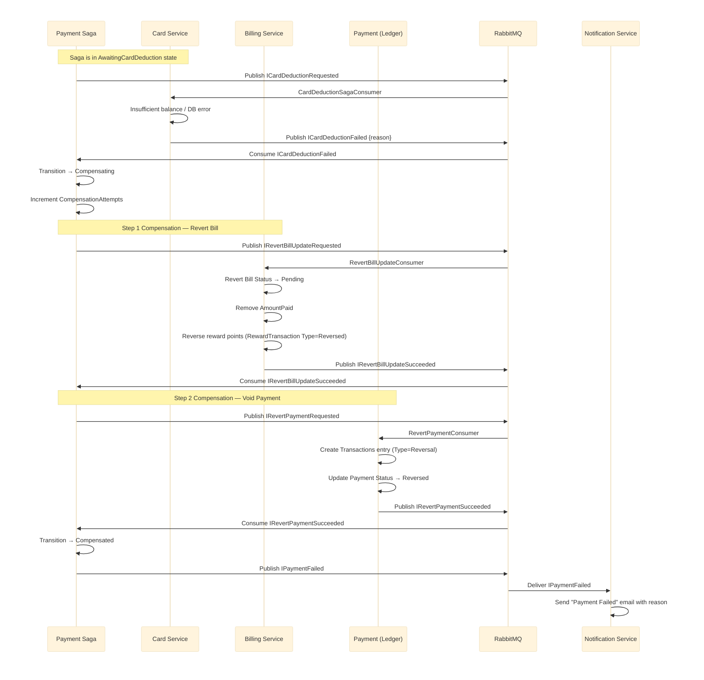
```mermaid
%%{init: {"theme":"base","themeVariables":{"fontSize":"15px","edgeLabelBackground":"#ffffff"},"flowchart":{"curve":"linear","nodeSpacing":95,"rankSpacing":130},"sequence":{"actorMargin":95,"messageMargin":60,"diagramMarginX":90,"diagramMarginY":55}}}%%
sequenceDiagram
    participant SAGA as Payment Saga
    participant C as Card Service
    participant B as Billing Service
    participant P as Payment (Ledger)
    participant RMQ as RabbitMQ
    participant N as Notification Service

    Note over SAGA,C: Saga is in AwaitingCardDeduction state
    SAGA->>RMQ: Publish ICardDeductionRequested
    RMQ->>C: CardDeductionSagaConsumer
    C->>C: Insufficient balance / DB error
    C->>RMQ: Publish ICardDeductionFailed {reason}

    RMQ->>SAGA: Consume ICardDeductionFailed
    SAGA->>SAGA: Transition → Compensating
    SAGA->>SAGA: Increment CompensationAttempts

    Note over SAGA,B: Step 1 Compensation — Revert Bill
    SAGA->>RMQ: Publish IRevertBillUpdateRequested
    RMQ->>B: RevertBillUpdateConsumer
    B->>B: Revert Bill Status → Pending
    B->>B: Remove AmountPaid
    B->>B: Reverse reward points (RewardTransaction Type=Reversed)
    B->>RMQ: Publish IRevertBillUpdateSucceeded

    RMQ->>SAGA: Consume IRevertBillUpdateSucceeded

    Note over SAGA,P: Step 2 Compensation — Void Payment
    SAGA->>RMQ: Publish IRevertPaymentRequested
    RMQ->>P: RevertPaymentConsumer
    P->>P: Create Transactions entry (Type=Reversal)
    P->>P: Update Payment Status → Reversed
    P->>RMQ: Publish IRevertPaymentSucceeded

    RMQ->>SAGA: Consume IRevertPaymentSucceeded
    SAGA->>SAGA: Transition → Compensated
    SAGA->>RMQ: Publish IPaymentFailed

    RMQ->>N: Deliver IPaymentFailed
    N->>N: Send "Payment Failed" email with reason
```

### 11.6 Password Reset Flow

```mermaid
%%{init: {"theme":"base","themeVariables":{"fontSize":"15px","edgeLabelBackground":"#ffffff"},"flowchart":{"curve":"linear","nodeSpacing":95,"rankSpacing":130},"sequence":{"actorMargin":95,"messageMargin":60,"diagramMarginX":90,"diagramMarginY":55}}}%%
sequenceDiagram
    actor U as User
    participant F as Frontend
    participant G as Gateway
    participant I as Identity Service
    participant RMQ as RabbitMQ
    participant N as Notification Service

    U->>F: Click "Forgot Password"
    F->>G: POST /api/v1/identity/auth/forgot-password {email}
    G->>I: Forward
    I->>I: Find user by email
    I->>I: Generate 6-digit reset OTP
    I->>I: Store OTP + expiry on user record
    I->>RMQ: Publish IUserOtpGenerated (Purpose=PasswordReset)
    I-->>G: 200 OK
    RMQ->>N: Deliver IUserOtpGenerated
    N->>N: Send password reset OTP email

    U->>F: Enter OTP + new password
    F->>G: POST /api/v1/identity/auth/reset-password\n{email, otp, newPassword}
    G->>I: Forward
    I->>I: Validate OTP + expiry
    I->>I: Hash new password
    I->>I: Clear OTP fields
    I-->>G: 200 OK
    G-->>F: 200 OK
    F->>F: Navigate to login
```

---

## 12. API Specification

All external traffic routes through the Ocelot API Gateway at `:5006`. The gateway enforces JWT Bearer validation and forwards requests to the appropriate upstream service.

### 12.1 Authentication Matrix

| Access Level | Token Required | Role Claim |
|---|---|---|
| **Public** | No | — |
| **Authenticated** | Yes (`Bearer <JWT>`) | Any valid role |
| **Admin** | Yes (`Bearer <JWT>`) | `role: admin` |

### 12.2 Identity Service — `/api/v1/identity`

#### Auth Endpoints

| Method | Path | Auth | Description |
|---|---|---|---|
| POST | `/auth/register` | Public | Register new user |
| POST | `/auth/login` | Public | Login with email/password |
| POST | `/auth/google` | Public | Google OAuth login |
| POST | `/auth/resend-verification` | Public | Resend email OTP |
| POST | `/auth/verify-email-otp` | Public | Verify email with OTP |
| POST | `/auth/forgot-password` | Public | Trigger password reset OTP |
| POST | `/auth/reset-password` | Public | Reset password with OTP |

#### User Endpoints

| Method | Path | Auth | Description |
|---|---|---|---|
| GET | `/users/me` | Authenticated | Get own profile |
| PUT | `/users/me` | Authenticated | Update own profile |
| PUT | `/users/me/password` | Authenticated | Change own password |
| GET | `/users` | Admin | Paginated user list |
| GET | `/users/stats` | Admin | Aggregate user stats |
| GET | `/users/{userId}` | Admin | Get user by ID |
| PUT | `/users/{userId}/status` | Admin | Update user status |
| PUT | `/users/{userId}/role` | Admin | Update user role |

### 12.3 Card Service — `/api/v1/cards`

| Method | Path | Auth | Description |
|---|---|---|---|
| POST | `/cards` | Authenticated | Add a new credit card |
| GET | `/cards` | Authenticated | List my cards |
| GET | `/cards/transactions` | Authenticated | All my transactions (all cards) |
| GET | `/cards/{cardId}` | Authenticated | Card details |
| PUT | `/cards/{cardId}` | Authenticated | Update card details |
| DELETE | `/cards/{cardId}` | Authenticated | Soft-delete card |
| GET | `/cards/{cardId}/transactions` | Authenticated | Transactions for a card |
| POST | `/cards/{cardId}/transactions` | Authenticated | Add a transaction |
| GET | `/cards/admin/{cardId}` | Admin | Admin: card details |
| GET | `/cards/admin/{cardId}/transactions` | Admin | Admin: card transactions |
| PUT | `/cards/{cardId}/admin` | Admin | Admin: update card (limits, balance) |
| GET | `/cards/user/{userId}` | Admin | Admin: get cards by user |
| GET | `/issuers` | Authenticated | List card issuers |
| POST | `/issuers` | Admin | Create card issuer |
| PUT | `/issuers/{id}` | Admin | Update card issuer |
| DELETE | `/issuers/{id}` | Admin | Delete card issuer |

### 12.4 Billing Service — `/api/v1/billing`

| Method | Path | Auth | Description |
|---|---|---|---|
| GET | `/bills` | Authenticated | List my bills |
| GET | `/bills/{id}` | Authenticated | Bill details |
| POST | `/bills/admin/generate-bill` | Admin | Generate a bill for user/card |
| POST | `/bills/admin/check-overdue` | Admin | Trigger overdue detection |
| GET | `/bills?userId=` | Admin | Get all bills for a user |
| GET | `/bills/has-pending/{cardId}` | Public | Check pending bill exists |
| GET | `/statements` | Authenticated | List my statements |
| GET | `/statements/{id}` | Authenticated | Statement details |
| GET | `/statements?userId=&cardId=` | Admin | Admin: statements filter |
| GET | `/statements/admin/all` | Admin | All statements |
| GET | `/statements/admin/{statementId}/full` | Admin | Full statement detail |
| GET | `/rewards/tiers` | Authenticated | List reward tiers |
| POST | `/rewards/tiers` | Admin | Create reward tier |
| PUT | `/rewards/tiers/{id}` | Admin | Update reward tier |
| DELETE | `/rewards/tiers/{id}` | Admin | Delete reward tier |
| GET | `/rewards/account` | Authenticated | My reward account & balance |
| POST | `/rewards/redeem` | Authenticated | Redeem reward points |
| GET | `/rewards/transactions?userId=` | Admin | Reward transaction history |
| POST | `/rewards/internal/redeem` | Public (internal) | Internal reward deduction endpoint |

### 12.5 Payment Service — `/api/v1/payments`

| Method | Path | Auth | Description |
|---|---|---|---|
| POST | `/payments/initiate` | Authenticated | Initiate payment (spawns saga) |
| POST | `/payments/{paymentId}/verify-otp` | Authenticated | Submit OTP to trigger saga |
| POST | `/payments/{paymentId}/resend-otp` | Authenticated | Resend payment OTP |
| GET | `/payments` | Authenticated | My payment history |
| GET | `/payments/{id}` | Authenticated | Payment details |

### 12.6 Notification Service — `/api/v1/notifications`

| Method | Path | Auth | Description |
|---|---|---|---|
| GET | `/notifications/logs` | Admin | View notification send logs |
| GET | `/notifications/audit` | Admin | View audit log entries |

---

## 13. Request & Response Contracts

### 13.1 Standard Response Envelope

Every API response is wrapped in `ApiResponse<T>`:

```json
{
  "success": true,
  "message": "Card added successfully",
  "errorCode": null,
  "data": {
    "id": "3fa85f64-5717-4562-b3fc-2c963f66afa6"
  },
  "traceId": "0HN5PBZXK3AGT:00000001"
}
```

**Error Response:**
```json
{
  "success": false,
  "message": "Bill amount has already been fully paid",
  "errorCode": "BILL_ALREADY_PAID",
  "data": null,
  "traceId": "0HN5PBZXK3AGT:00000002"
}
```

### 13.2 Key Request Contracts

**Register User:**
```json
{
  "fullName": "Aarav Sharma",
  "email": "aarav@example.com",
  "password": "StrongPassword@123"
}
```

**Login:**
```json
{
  "email": "aarav@example.com",
  "password": "StrongPassword@123"
}
```

**Add Card:**
```json
{
  "cardholderName": "AARAV SHARMA",
  "cardNumber": "4111111111111111",
  "expMonth": 12,
  "expYear": 2028,
  "issuerId": "3fa85f64-5717-4562-b3fc-2c963f66afa6",
  "isDefault": true
}
```

**Add Transaction:**
```json
{
  "type": 1,
  "amount": 1250.00,
  "description": "Restaurant - Zomato",
  "dateUtc": "2026-04-10T18:30:00Z"
}
```

**Initiate Payment:**
```json
{
  "cardId": "3fa85f64-5717-4562-b3fc-2c963f66afa6",
  "billId": "7cb85f64-5717-4562-b3fc-2c963f66afb7",
  "amount": 2500.00,
  "paymentType": "Full",
  "rewardsPoints": 50
}
```

**Verify Payment OTP:**
```json
{
  "otpCode": "483920"
}
```

**Redeem Rewards:**
```json
{
  "points": 100,
  "target": "Bill",
  "billId": "7cb85f64-5717-4562-b3fc-2c963f66afb7"
}
```

### 13.3 Key Response Contracts

**Login Response:**
```json
{
  "success": true,
  "message": "Login successful",
  "data": {
    "token": "eyJhbGciOiJIUzI1NiIs...",
    "userId": "3fa85f64-5717-4562-b3fc-2c963f66afa6",
    "email": "aarav@example.com",
    "fullName": "Aarav Sharma",
    "role": "user"
  }
}
```

**Card Response:**
```json
{
  "success": true,
  "data": {
    "id": "...",
    "cardholderName": "AARAV SHARMA",
    "maskedNumber": "**** **** **** 1111",
    "last4": "1111",
    "network": "Visa",
    "issuerName": "HDFC Bank",
    "creditLimit": 100000.00,
    "outstandingBalance": 5000.00,
    "isDefault": true,
    "isVerified": false
  }
}
```

**Bill Response:**
```json
{
  "success": true,
  "data": {
    "id": "...",
    "amount": 5000.00,
    "minDue": 500.00,
    "currency": "INR",
    "billingDate": "2026-04-01",
    "dueDate": "2026-04-20",
    "status": "Pending",
    "amountPaid": null
  }
}
```

---

## 14. Security Architecture

### 14.1 JWT Token Structure

```mermaid
%%{init: {"theme":"base","themeVariables":{"fontSize":"15px","edgeLabelBackground":"#ffffff"},"flowchart":{"curve":"linear","nodeSpacing":95,"rankSpacing":130},"sequence":{"actorMargin":95,"messageMargin":60,"diagramMarginX":90,"diagramMarginY":55}}}%%
flowchart LR
    I["Identity Service\nIssues Token"]
    T["JWT Payload\n---\nsub: userId\nrole: user|admin\nemail: user@x.com\nexp: +1 hour\niss: CredVault\naud: CredVault"]
    G["Ocelot Gateway\nValidates every request\nExtracts claims"]
    S["Downstream Services\nTrust gateway-forwarded claims\nNo re-validation needed"]

    I -->|"Signs with SecretKey"| T
    T --> G
    G -->|"Injects userId, role into headers"| S
```

### 14.2 Security Controls per Endpoint Type

| Concern | Implementation |
|---|---|
| **Authentication** | JWT Bearer token validated at Ocelot gateway |
| **Authorization** | `[Authorize(Roles = "admin")]` on admin controllers |
| **Password Storage** | BCrypt hashed, never stored in plaintext |
| **Payment Authorization** | 6-digit OTP (crypto-RNG), 5-minute TTL, single-use |
| **Card Data** | Full card number AES-encrypted at rest; only `Last4` + `MaskedNumber` stored in plaintext |
| **OTP Expiry** | `OtpExpiresAtUtc` checked server-side; expired OTPs rejected |
| **Stack Trace Leaking** | `ExceptionHandlingMiddleware` catches all unhandled exceptions, logs internally, returns generic `500` to client |
| **Input Validation** | FluentValidation pipeline validates all command inputs before handlers execute |
| **Stuck Payment Cleanup** | `MarkExpiredStuckPaymentsAsync()` runs on every new payment initiation to clear zombie saga states |

### 14.3 OTP Flow Detail

```
1. Crypto-RNG generates 6-digit code
2. Code stored on entity (User or Payment record) with 5-minute expiry
3. Code published in event → Notification Service → Email
4. On verification:
   a. Code retrieved from DB
   b. Current UTC compared against expiry
   c. Code compared (constant-time string comparison)
   d. On success: code cleared from DB (single-use enforcement)
```

---

## 15. Error Handling & Exception Strategy

### 15.1 Exception Middleware Pipeline

```mermaid
%%{init: {"theme":"base","themeVariables":{"fontSize":"15px","edgeLabelBackground":"#ffffff"},"flowchart":{"curve":"linear","nodeSpacing":95,"rankSpacing":130},"sequence":{"actorMargin":95,"messageMargin":60,"diagramMarginX":90,"diagramMarginY":55}}}%%
flowchart TB
    REQ["Incoming HTTP Request"]
    MW["ExceptionHandlingMiddleware\n(first in pipeline)"]
    FV["FluentValidation Pipeline\n(validates commands before handlers)"]
    H["Command/Query Handler"]
    DB["Database / Message Broker"]

    REQ --> MW
    MW --> FV
    FV --> H
    H --> DB
    DB -->|"EF Core Exception"| H
    H -->|"Domain Exception"| MW
    FV -->|"ValidationException"| MW
    MW -->|"Structured Error Response"| REQ
```

### 15.2 HTTP Status Code Map

| HTTP Status | Scenario | Example |
|---|---|---|
| `200 OK` | Successful read or action | Login, get cards |
| `201 Created` | New resource created | Register, add card |
| `400 Bad Request` | Validation failure, business rule violation | Amount > outstanding balance |
| `401 Unauthorized` | No token / invalid / expired JWT | Missing `Authorization` header |
| `403 Forbidden` | Valid token but insufficient role | User accessing admin endpoint |
| `404 Not Found` | Entity not found in DB | `GET /cards/{id}` for unknown ID |
| `409 Conflict` | Duplicate resource | Registering with existing email |
| `503 Service Unavailable` | Downstream dependency unavailable | RabbitMQ down |
| `500 Internal Server Error` | Unhandled exception (middleware catches) | DB connection failure |

### 15.3 Domain Error Codes

| Error Code | Meaning |
|---|---|
| `INVALID_OTP` | OTP does not match |
| `EXPIRED_OTP` | OTP TTL exceeded |
| `BILL_NOT_FOUND` | Bill ID not found |
| `BILL_ALREADY_PAID` | Bill status is Paid |
| `BILL_CARD_MISMATCH` | Bill.CardId ≠ requested CardId |
| `OVERPAYMENT` | Amount > outstanding balance |
| `CARD_NOT_FOUND` | Card ID not found |
| `INVALID_LUHN` | Card number fails Luhn check |
| `USER_SUSPENDED` | Login blocked due to status |
| `EMAIL_NOT_VERIFIED` | Login blocked until email verified |

---

## 16. Infrastructure & Deployment

### 16.1 Service Port Map

| Service | Internal Port | External (Docker) |
|---|---|---|
| Identity Service | 5001 | 5001 |
| Card Service | 5002 | 5002 |
| Billing Service | 5003 | 5003 |
| Payment Service | 5004 | 5004 |
| Notification Service | 5005 | 5005 |
| API Gateway (Ocelot) | 5006 | 5006 |
| SQL Server | 1433 | 1434 |
| RabbitMQ AMQP | 5672 | 5672 |
| RabbitMQ Management UI | 15672 | 15672 |
| Angular Frontend | 4200 | 4200 |

### 16.2 Environment Variables

```bash
# Database Connections
IDENTITY_DB_CONNECTION=Server=localhost,1434;Database=credvault_identity;User Id=sa;Password=...
CARD_DB_CONNECTION=Server=localhost,1434;Database=credvault_cards;User Id=sa;Password=...
BILLING_DB_CONNECTION=Server=localhost,1434;Database=credvault_billing;User Id=sa;Password=...
PAYMENT_DB_CONNECTION=Server=localhost,1434;Database=credvault_payments;User Id=sa;Password=...

# JWT
JwtOptions__SecretKey=<min-32-char-secret>
JwtOptions__Issuer=CredVault
JwtOptions__Audience=CredVault
JwtOptions__ExpiryMinutes=60

# RabbitMQ
RabbitMqSettings__Host=localhost
RabbitMqSettings__Port=5672
RabbitMqSettings__Username=guest
RabbitMqSettings__Password=guest

# SMTP
SmtpSettings__Host=smtp.gmail.com
SmtpSettings__Port=587
SmtpSettings__Username=credvault@gmail.com
SmtpSettings__Password=<app-password>
SmtpSettings__FromName=CredVault
```

### 16.3 Migration Locations

```
server/services/
├── identity-service/IdentityService.Infrastructure/Persistence/Sql/Migrations/
├── card-service/CardService.Infrastructure/Persistence/Sql/Migrations/
├── billing-service/BillingService.Infrastructure/Persistence/Sql/Migrations/
│   └── 20260412100953_AddMissingForeignKeys.cs  ← Latest
├── payment-service/PaymentService.Infrastructure/Persistence/Sql/Migrations/
└── notification-service/NotificationService.Infrastructure/Migrations/
```

### 16.4 Health Check Endpoints

```bash
curl http://localhost:5006/health                        # Gateway
curl http://localhost:5006/api/v1/identity/health       # Identity
curl http://localhost:5006/api/v1/cards/health          # Card
curl http://localhost:5006/api/v1/billing/health        # Billing
curl http://localhost:5006/api/v1/payments/health       # Payment
```

### 16.5 Diagnostic SQL Queries

```sql
-- Find stuck/zombie payments (initiated > 1 hour ago with no saga completion)
SELECT * FROM payments
WHERE Status = 1
AND CreatedAtUtc < DATEADD(hour, -1, GETUTCDATE());

-- Find saga states that never completed
SELECT CorrelationId, CurrentState, CreatedAtUtc, Amount
FROM payment_orchestration_saga_state
WHERE CurrentState NOT IN ('Completed', 'Compensated', 'Failed')
ORDER BY CreatedAtUtc DESC;

-- Check overdue bills
SELECT Id, UserId, Amount, DueDateUtc, Status
FROM bills
WHERE Status = 1  -- Pending
AND DueDateUtc < GETUTCDATE();

-- Reward points summary per user
SELECT UserId, PointsBalance, UpdatedAtUtc
FROM reward_accounts
ORDER BY PointsBalance DESC;
```

---

## 17. Known Issues & Technical Debt

### 17.1 High Priority: Activate `IUserDeleted` Lifecycle Event

**Priority:** High

**Description:** Admin status updates can mark a user as `Deleted`, but the Identity Service does not yet emit `IUserDeleted` in the current release path. Card, Billing, and Payment consumers are already subscribed and ready to process the event.

**Impact:**

| Service | Consumer | Orphaned Data |
|---|---|---|
| Card Service | `UserDeletedConsumer` | CreditCards, CardTransactions remain |
| Billing Service | `UserDeletedConsumer` | Bills, Statements, RewardAccounts remain |
| Payment Service | *(implied)* | Payments, Sagas remain |

**Current Gap:** A dedicated deletion command flow, delete endpoint, and event emission path are not yet part of the Identity Service API surface.

**Implementation Plan:**
1. Add `DeleteUserCommandHandler` in Identity → Application → Commands
2. Add `DELETE /api/v1/identity/users/{id}` (Admin only)
3. Handler sets `Status = Deleted` then publishes `IUserDeleted`

---

### 17.2 Medium Priority: Connect `IBillOverdueDetected` Consumers

**Priority:** Medium

**Description:** `CheckOverdueBillsCommandHandler` in Billing Service detects overdue bills and publishes `IBillOverdueDetected`. Downstream consumer subscriptions are pending integration.

**Impact:** Users with overdue bills do not receive reminder emails. No late fee application is triggered.

**Potential Consumers to Add:**

| Consumer | Action |
|---|---|
| Notification Service | Send "Your bill is overdue" email |
| Billing Service (self) | Auto-apply penalty charges |

---

### 17.3 Low Priority: Notification Controller — Role Enforcement

**Severity:** 🟡 Low

**Description:** The Notification controller is behind JWT authentication, but `[Authorize(Roles = "admin")]` attribute is not applied to action methods. Any authenticated user who discovers the endpoint URL can query notification and audit logs.

**Fix:** Add `[Authorize(Roles = "admin")]` to `NotificationLogsController` and `AuditLogsController`.

---

## Appendix A — Shared Enum Reference

| Enum | Values |
|---|---|
| `CardNetwork` | Unknown(0), Visa(1), Mastercard(2) |
| `UserStatus` | PendingVerification(1), Active(2), Suspended(3), Blocked(4), Deleted(5) |
| `UserRole` | User(1), Admin(2) |
| `TransactionType` | Purchase(1), Payment(2), Refund(3) |
| `BillStatus` | Pending(1), Paid(2), Overdue(3), Cancelled(4), PartiallyPaid(5) |
| `PaymentStatus` | Initiated(1), Processing(2), Completed(3), Failed(4), Reversed(5), Cancelled(6) |
| `PaymentType` | Full(1), Partial(2), Scheduled(3) |
| `RewardTransactionType` | Earned(1), Adjusted(2), Redeemed(3), Reversed(4) |
| `StatementStatus` | Generated(1), Paid(2), Overdue(3), PartiallyPaid(4) |

---

## Appendix B — File Naming Convention

| Artifact | Pattern | Example |
|---|---|---|
| Commands | `[Action][Entity]Command.cs` + `Handler.cs` | `CreateCardCommand.cs` |
| Queries | `[Action][Entity]Query.cs` + `Handler.cs` | `ListCardsQuery.cs` |
| Controllers | `[Entity]Controller.cs` | `CardsController.cs` |
| Repositories (Interface) | `I[Entity]Repository.cs` | `ICardRepository.cs` |
| Repositories (SQL impl) | `Sql[Entity]Repository.cs` | `SqlCardRepository.cs` |
| Consumers | `[EventName]Consumer.cs` | `UserDeletedConsumer.cs` |
| Entities | `[EntityName].cs` | `CreditCard.cs` |
| DTOs | `[EntityName]Dto.cs` | `CreditCardDto.cs` |

---

## Appendix C — Shared Contracts Project Structure

```
shared.contracts/Shared.Contracts/
├── Events/
│   ├── Identity/IdentityEvents.cs        (IUserRegistered, IUserOtpGenerated, IUserDeleted)
│   ├── Card/CardEvents.cs                (ICardAdded)
│   ├── Billing/BillingEvents.cs          (IBillGenerated, IBillOverdueDetected)
│   ├── Payment/PaymentEvents.cs          (IPaymentCompleted, IPaymentFailed, IPaymentReversed, IPaymentOtpGenerated)
│   └── Saga/SagaOrchestrationEvents.cs   (22 saga events)
└── Models/
    └── ApiResponse.cs                    (Shared response wrapper)
```

---

*Document prepared for CredVault Technical Review — CredVault Engineering Team*
*All diagrams use Mermaid syntax and are renderable in GitHub, GitLab, Notion, and VS Code.*
