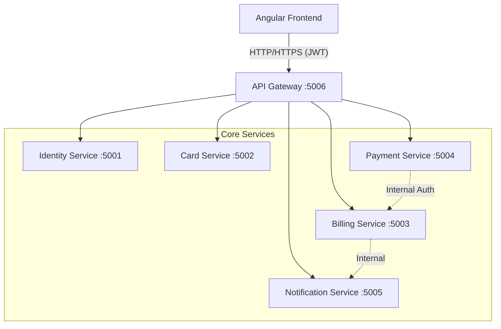
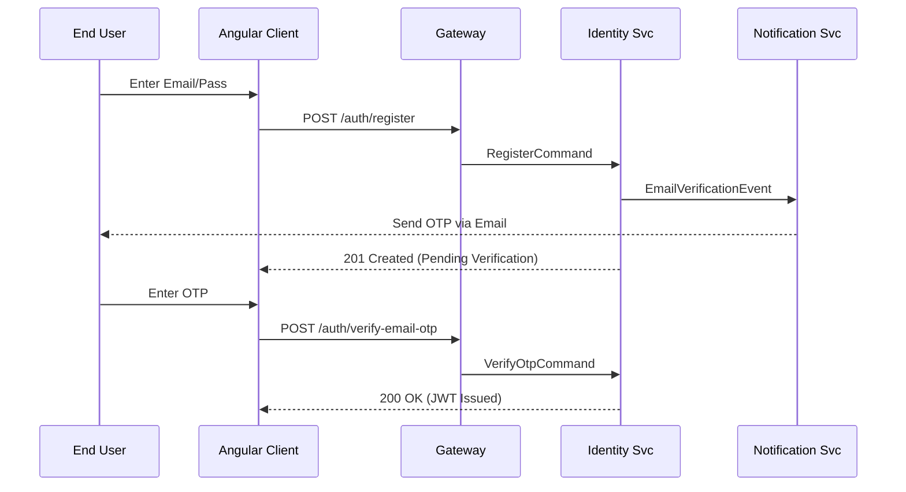
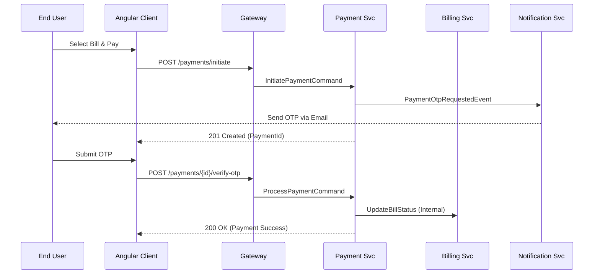

# Technical API Reference Guide

## 1. Executive Summary & Architecture Overview

### 1.1 Overview
The Credit Card Platform is an enterprise-grade microservices architecture designed to handle secure credit card management, automated billing, rewards redemption, and two-factor authenticated payments. This document serves as the primary technical reference for frontend and backend engineers, QA, and integration partners.

### 1.2 Architecture Overview
The platform utilizes a **Gateway-Aggregator pattern** where all external traffic is routed through a central API Gateway (Ocelot), which handles cross-cutting concerns like routing and protocol translation.



### 1.3 Service Inventory
| Service | Port | Primary Responsibility |
| :--- | :--- | :--- |
| **API Gateway** | 5006 | Central entry point, request routing, and rate limiting. |
| **Identity** | 5001 | User authentication, RBAC, profile management, and OTP generation. |
| **Card** | 5002 | Card lifecycle, transaction recording, and issuer management. |
| **Billing** | 5003 | Statement generation, bill cycles, and rewards point accounting. |
| **Payment** | 5004 | Payment initiation, 2FA (OTP) processing, and wallet management. |
| **Notification** | 5005 | Email/SMS delivery, delivery logs, and system audit trails. |

---

## 2. API Standards & Conventions

### 2.1 Base URLs
- **Internal Cluster:** `http://localhost:<service-port>`
- **External/Client:** `http://localhost:5006` (All clients MUST use the Gateway)

### 2.2 Headers
| Header | Value | Description |
| :--- | :--- | :--- |
| `Authorization` | `Bearer <JWT_TOKEN>` | Required for all protected endpoints. |
| `Content-Type` | `application/json` | Required for all `POST`, `PUT`, and `PATCH` requests. |
| `X-Trace-Id` | `<GUID>` | (Optional) Client-provided trace ID for distributed logging. |

### 2.3 Standard Response Envelope
All API responses follow a consistent wrapper to ensure predictable client-side parsing.

```json
{
  "success": true,
  "message": "Operation description",
  "errorCode": null,
  "data": { ... },
  "traceId": "0HN12345678"
}
```

### 2.4 Common Status Codes
| Code | Category | Meaning |
| :--- | :--- | :--- |
| **200** | Success | Standard success response. |
| **201** | Success | Resource successfully created. |
| **400** | Client Error | Validation failed or business rule violation. |
| **401** | Security | Token missing or invalid. |
| **403** | Security | Authenticated but insufficient permissions (Role required). |
| **404** | Client Error | Resource not found. |
| **503** | Server Error | Downstream service or database unavailable. |

---

## 3. Service Catalog

### 3.1 Identity Service
*Handles authentication and user profiles.*

| Method | Endpoint | Auth | Description |
| :--- | :--- | :--- | :--- |
| `POST` | `/api/v1/identity/auth/register` | Public | Register a new user account. |
| `POST` | `/api/v1/identity/auth/login` | Public | Authenticate and receive a JWT. |
| `POST` | `/api/v1/identity/auth/verify-email-otp` | Public | Verify email address with 6-digit OTP. |
| `GET` | `/api/v1/identity/users/me` | User | Get current user's profile. |
| `GET` | `/api/v1/identity/users` | Admin | (Paginated) List all users. |

**Example: User Registration**
```json
{
  "fullName": "John Doe",
  "email": "john@example.com",
  "password": "SecurePassword123!"
}
```

### 3.2 Card Service
*Manages credit card instruments and basic transactions.*

| Method | Endpoint | Auth | Description |
| :--- | :--- | :--- | :--- |
| `GET` | `/api/v1/cards` | User | List all cards for the user. |
| `POST` | `/api/v1/cards` | User | Add a new credit card. |
| `GET` | `/api/v1/cards/{id}` | User | Get specific card details. |
| `POST` | `/api/v1/cards/{id}/transactions` | User | Manually record a transaction. |
| `GET` | `/api/v1/issuers` | User | List supported card issuers. |

**Example: Add Card**
```json
{
  "cardholderName": "JOHN DOE",
  "cardNumber": "4111222233334444",
  "expMonth": 12,
  "expYear": 2028,
  "issuerId": "3fa85f64-5717-4562-b3fc-2c963f66afa6",
  "isDefault": true
}
```

### 3.3 Billing & Rewards Service
*Handles billing cycles and reward logic.*

| Method | Endpoint | Auth | Description |
| :--- | :--- | :--- | :--- |
| `GET` | `/api/v1/billing/bills` | User | List all bills. |
| `GET` | `/api/v1/billing/statements` | User | List generated PDF/Data statements. |
| `GET` | `/api/v1/billing/rewards/account` | User | Get current reward points balance. |
| `POST` | `/api/v1/billing/rewards/redeem` | User | Redeem points for bill credit. |
| `POST` | `/api/v1/billing/bills/admin/generate-bill` | Admin | Manually trigger a bill cycle for a user. |

### 3.4 Payment Service
*Orchestrates money movement and 2FA.*

| Method | Endpoint | Auth | Description |
| :--- | :--- | :--- | :--- |
| `POST` | `/api/v1/payments/initiate` | User | Start payment flow (triggers OTP). |
| `POST` | `/api/v1/payments/{id}/verify-otp` | User | Finalize payment with OTP. |
| `GET` | `/api/v1/payments` | User | Payment history. |
| `GET` | `/api/v1/wallets/balance` | User | Get wallet balance (if applicable). |

**Example: Initiate Payment**
```json
{
  "cardId": "GUID",
  "billId": "GUID",
  "amount": 500.00,
  "paymentType": "Full",
  "rewardsPoints": 100
}
```

### 3.5 Notification Service
*Audit trail and log visibility.*

| Method | Endpoint | Auth | Description |
| :--- | :--- | :--- | :--- |
| `GET` | `/api/v1/notifications/logs` | Admin | View sent notification history. |
| `GET` | `/api/v1/notifications/audit` | Admin | System-wide notification audit trail. |

---

## 4. Angular Integration Mapping

The frontend consumes backend services via dedicated Angular services.

| Angular Service | Method | Backend Endpoint |
| :--- | :--- | :--- |
| `AuthService` | `login()` | `POST /api/v1/identity/auth/login` |
| `AuthService` | `getProfile()` | `GET /api/v1/identity/users/me` |
| `DashboardService` | `getCards()` | `GET /api/v1/cards` |
| `BillingService` | `getMyBills()` | `GET /api/v1/billing/bills` |
| `RewardsService` | `getRewardAccount()` | `GET /api/v1/billing/rewards/account` |
| `PaymentService` | `initiatePayment()` | `POST /api/v1/payments/initiate` |
| `AdminService` | `getAllUsers()` | `GET /api/v1/identity/users` |

---

## 5. Core Business Flows

### 5.1 User Registration & Verification


### 5.2 Bill Payment with OTP


---

## 6. Operational Readiness & Health Checks

### 6.1 Health Check Matrix
Health checks are available at the following endpoints for monitoring systems (e.g., Kubernetes Liveness/Readiness probes).

| Service | Health Check URL |
| :--- | :--- |
| **API Gateway** | `http://localhost:5006/health` |
| **Identity** | `http://localhost:5001/api/v1/identity/health` |
| **Card** | `http://localhost:5002/api/v1/cards/health` |
| **Billing** | `http://localhost:5003/api/v1/billing/health` |
| **Payment** | `http://localhost:5004/api/v1/payments/health` |

### 6.2 Smoke Test Command
```bash
# Verify Gateway and Identity Connectivity
curl -X GET http://localhost:5006/api/v1/identity/health \
     -H "Accept: application/json"
```

---

## 7. Versioning & Deprecation
- Current Version: `v1`
- All breaking changes will be introduced via `v2` pathing.
- Deprecated endpoints will include a `Warning: 299 - "Deprecated"` header.
