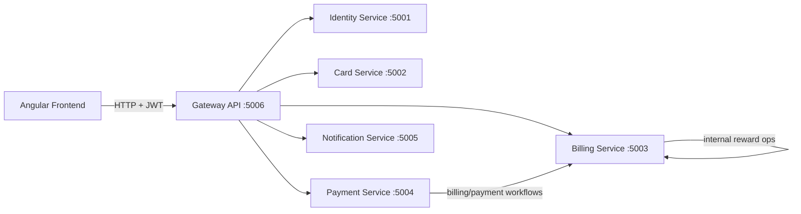
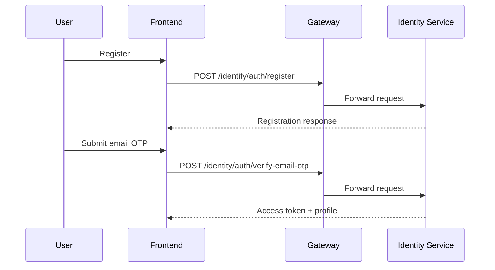
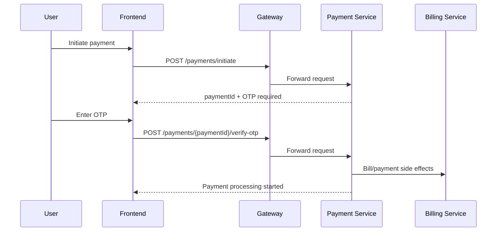

# Unified API Reference

## Document Control

| Field          | Value                                                         |
|----------------|---------------------------------------------------------------|
| Project        | Credit Card Platform (Gateway + Microservices + Angular Client) |
| Document Type  | Technical API Reference                                       |
| Version        | 1.0                                                           |
| Prepared On    | 2026-04-10                                                    |
| Audience       | Engineering, QA, Support, Integration Teams                   |
| Scope          | Frontend API usage + Backend service contracts                |

---

## 1. Executive Summary

This document provides a complete API reference for the platform, including:

- Gateway-exposed backend APIs across Identity, Card, Billing, Payment, and Notification services
- Angular frontend service-to-endpoint integration map
- Request and response contracts
- Authentication, authorization, and error-handling conventions
- Operational health and smoke-test references

The backend is accessed primarily through the API Gateway running on port `5006`.

---

## 2. Architecture Overview



### Runtime Endpoints

| Component              | URL                   |
|------------------------|-----------------------|
| API Gateway (primary)  | http://localhost:5006 |
| Identity Service       | http://localhost:5001 |
| Card Service           | http://localhost:5002 |
| Billing Service        | http://localhost:5003 |
| Payment Service        | http://localhost:5004 |
| Notification Service   | http://localhost:5005 |

---

## 3. API Standards

### 3.1 Base URL

All frontend and external client traffic should use:

`http://localhost:5006`

### 3.2 Headers

| Header                         | Required                     | Notes                                      |
|--------------------------------|------------------------------|--------------------------------------------|
| Authorization: Bearer <token>  | Yes (protected endpoints)    | JWT added by Angular auth interceptor      |
| Content-Type: application/json | Yes (request bodies)         | JSON request/response                      |

### 3.3 Standard Response Envelope

```json
{
  "success": true,
  "message": "Operation completed",
  "errorCode": null,
  "data": {},
  "traceId": "0HN...."
}
```

### 3.4 Common Status Codes

| Code | Meaning                                   |
|------|-------------------------------------------|
| 200  | Success                                   |
| 201  | Created                                   |
| 400  | Validation or business rule failure       |
| 401  | Unauthorized / missing or invalid token   |
| 403  | Forbidden (role mismatch)                |
| 404  | Not found                                 |
| 503  | Downstream dependency unavailable         |

---

## 4. Authentication and Authorization Matrix

| Access Type   | Description                          |
|---------------|--------------------------------------|
| Public        | No token required                    |
| Authenticated | JWT required                         |
| Admin         | JWT required with role `admin`       |

### Public Endpoints

- `GET /health`
- `GET /api/v1/billing/bills/has-pending/{cardId}`
- `POST /api/v1/billing/rewards/internal/redeem` (internal service call)
- Identity auth lifecycle endpoints (`/api/v1/identity/auth/*`)

---

## 5. Backend API Catalog

## 5.1 Identity Service

### 5.1.1 Auth APIs

| Method | Endpoint                                      | Auth   | Request Body                     | Description                     |
|--------|-----------------------------------------------|--------|----------------------------------|---------------------------------|
| POST   | /api/v1/identity/auth/register                | Public | fullName, email, password        | Register new user               |
| POST   | /api/v1/identity/auth/login                   | Public | email, password                  | Login with email/password       |
| POST   | /api/v1/identity/auth/google                  | Public | idToken                          | Google login                    |
| POST   | /api/v1/identity/auth/resend-verification     | Public | email                            | Resend verification OTP         |
| POST   | /api/v1/identity/auth/verify-email-otp        | Public | email, otp                       | Verify email with OTP           |
| POST   | /api/v1/identity/auth/forgot-password         | Public | email                            | Trigger password reset OTP      |
| POST   | /api/v1/identity/auth/reset-password          | Public | email, otp, newPassword          | Reset password                  |

#### Sample Request: Register

```json
{
  "fullName": "Aarav Sharma",
  "email": "aarav@example.com",
  "password": "StrongPassword@123"
}
```

### 5.1.2 User APIs

| Method | Endpoint                                   | Auth          | Query                                   | Request Body                     | Description               |
|--------|--------------------------------------------|---------------|------------------------------------------|----------------------------------|--------------------------|
| GET    | /api/v1/identity/users/me                  | Authenticated | -                                        | -                                | Get own profile          |
| PUT    | /api/v1/identity/users/me                  | Authenticated | -                                        | fullName                         | Update own profile       |
| PUT    | /api/v1/identity/users/me/password         | Authenticated | -                                        | currentPassword, newPassword     | Change own password      |
| GET    | /api/v1/identity/users/{userId}            | Admin         | -                                        | -                                | Get user by ID           |
| PUT    | /api/v1/identity/users/{userId}/status     | Admin         | -                                        | status                           | Update user status       |
| PUT    | /api/v1/identity/users/{userId}/role       | Admin         | -                                        | role                             | Update user role         |
| GET    | /api/v1/identity/users                     | Admin         | page, pageSize, search, status           | -                                | Paginated user list      |
| GET    | /api/v1/identity/users/stats               | Admin         | -                                        | -                                | Aggregate user stats     |

---

## 5.2 Card Service

### 5.2.1 Cards APIs

| Method | Endpoint                                   | Auth          | Query | Request Body                                                     | Description              |
|--------|--------------------------------------------|---------------|-------|------------------------------------------------------------------|--------------------------|
| POST   | /api/v1/cards                              | Authenticated | -     | cardholderName, expMonth, expYear, cardNumber, issuerId, isDefault | Add card                 |
| GET    | /api/v1/cards                              | Authenticated | -     | -                                                                | List my cards            |
| GET    | /api/v1/cards/transactions                 | Authenticated | -     | -                                                                | List all my transactions |
| GET    | /api/v1/cards/{cardId}                     | Authenticated | -     | -                                                                | Card details             |
| PUT    | /api/v1/cards/{cardId}                     | Authenticated | -     | cardholderName, expMonth, expYear, isDefault                     | Update card              |
| DELETE | /api/v1/cards/{cardId}                     | Authenticated | -     | -                                                                | Delete card              |
| GET    | /api/v1/cards/{cardId}/transactions        | Authenticated | -     | -                                                                | Card transactions        |
| POST   | /api/v1/cards/{cardId}/transactions        | Authenticated | -     | type, amount, description, dateUtc                               | Add transaction          |
| GET    | /api/v1/cards/admin/{cardId}               | Admin         | -     | -                                                                | Admin card view          |
| GET    | /api/v1/cards/admin/{cardId}/transactions  | Admin         | -     | -                                                                | Admin card transactions  |
| PUT    | /api/v1/cards/{cardId}/admin               | Admin         | -     | cardholderName, creditLimit, outstandingBalance, billingCycleStartDay | Admin card update   |
| GET    | /api/v1/cards/user/{userId}                | Admin         | -     | -                                                                | Cards by user            |

### 5.2.2 Issuer APIs

| Method | Endpoint                      | Auth          | Request Body   | Description     |
|--------|-------------------------------|---------------|----------------|-----------------|
| GET    | /api/v1/issuers               | Authenticated | -              | List issuers    |
| GET    | /api/v1/issuers/{id}          | Authenticated | -              | Get issuer      |
| POST   | /api/v1/issuers               | Admin         | name, network  | Create issuer   |
| PUT    | /api/v1/issuers/{id}          | Admin         | name, network  | Update issuer   |
| DELETE | /api/v1/issuers/{id}          | Admin         | -              | Delete issuer   |

---

## 5.3 Billing Service

### 5.3.1 Bills APIs

| Method | Endpoint                                           | Auth             | Query                          | Request Body                     | Description               |
|--------|----------------------------------------------------|------------------|--------------------------------|----------------------------------|---------------------------|
| GET    | /api/v1/billing/bills                              | Authenticated    | userId (admin optional)        | -                                | List bills                |
| GET    | /api/v1/billing/bills/{billId}                     | Authenticated    | -                              | -                                | Bill detail               |
| POST   | /api/v1/billing/bills/admin/generate-bill          | Admin            | -                              | userId, cardId, currency         | Generate bill             |
| POST   | /api/v1/billing/bills/admin/check-overdue          | Admin            | -                              | -                                | Mark overdue bills        |
| GET    | /api/v1/billing/bills/has-pending/{cardId}         | Public/Internal  | -                              | -                                | Pending/overdue check     |

### 5.3.2 Statements APIs

| Method | Endpoint                                              | Auth          | Query                          | Request Body   | Description                     |
|--------|-------------------------------------------------------|---------------|--------------------------------|----------------|---------------------------------|
| GET    | /api/v1/billing/statements                            | Authenticated | userId (admin optional)        | -              | List statements                 |
| GET    | /api/v1/billing/statements/{statementId}              | Authenticated | -                              | -              | Statement detail                |
| POST   | /api/v1/billing/statements/generate                   | Authenticated | -                              | cardId         | Generate statement              |
| POST   | /api/v1/billing/statements/admin/generate             | Admin         | -                              | cardId, userId | Generate statement as admin     |
| GET    | /api/v1/billing/statements/admin/all                  | Admin         | -                              | -              | All statements                  |
| GET    | /api/v1/billing/statements/bill/{billId}              | Authenticated | -                              | -              | Statements by bill              |
| GET    | /api/v1/billing/statements/{statementId}/transactions | Authenticated | -                              | -              | Statement transactions          |
| GET    | /api/v1/billing/statements/admin/{statementId}/full   | Admin         | -                              | -              | Full statement bundle           |

### 5.3.3 Rewards APIs

| Method | Endpoint                                          | Auth             | Query                          | Request Body                                                                 | Description                  |
|--------|---------------------------------------------------|------------------|--------------------------------|------------------------------------------------------------------------------|------------------------------|
| GET    | /api/v1/billing/rewards/tiers                     | Authenticated    | -                              | -                                                                            | List reward tiers            |
| POST   | /api/v1/billing/rewards/tiers                     | Admin            | -                              | cardNetwork, issuerId, minimumSpend, pointsPerDollar, effectiveFromUtc, effectiveToUtc | Create tier         |
| PUT    | /api/v1/billing/rewards/tiers/{id}                | Admin            | -                              | cardNetwork, issuerId, minimumSpend, pointsPerDollar, effectiveFromUtc, effectiveToUtc | Update tier         |
| DELETE | /api/v1/billing/rewards/tiers/{id}                | Admin            | -                              | -                                                                            | Delete tier                 |
| GET    | /api/v1/billing/rewards/account                   | Authenticated    | -                              | -                                                                            | My reward account            |
| GET    | /api/v1/billing/rewards/transactions              | Authenticated    | userId (admin optional)        | -                                                                            | Reward transaction history   |
| POST   | /api/v1/billing/rewards/redeem                    | Authenticated    | -                              | points, target, billId                                                       | Redeem points                |
| POST   | /api/v1/billing/rewards/internal/redeem           | Public/Internal  | -                              | userId, points, target, billId                                               | Internal redeem call         |

---

## 5.4 Payment Service

| Method | Endpoint                                      | Auth          | Request Body                                       | Description                   |
|--------|-----------------------------------------------|---------------|----------------------------------------------------|-------------------------------|
| POST   | /api/v1/payments/initiate                     | Authenticated | cardId, billId, amount, paymentType, rewardsPoints | Initiate payment + OTP        |
| POST   | /api/v1/payments/{paymentId}/verify-otp       | Authenticated | otpCode                                            | Verify OTP                    |
| POST   | /api/v1/payments/{paymentId}/resend-otp       | Authenticated | -                                                  | Resend OTP                    |
| GET    | /api/v1/payments                              | Authenticated | -                                                  | List my payments              |
| GET    | /api/v1/payments/{paymentId}                  | Authenticated | -                                                  | Payment detail                |
| GET    | /api/v1/payments/{paymentId}/transactions     | Authenticated | -                                                  | Payment transactions          |

#### Sample Request: Initiate Payment

```json
{
  "cardId": "1e83d51b-4f43-4be9-8af7-4f77d244846a",
  "billId": "325ad403-07ca-4a47-a2cf-8bc9fb861c0e",
  "amount": 4200,
  "paymentType": "Full",
  "rewardsPoints": 100
}
```

---

## 5.5 Notification Service

| Method | Endpoint                          | Auth          | Query                                   | Description               |
|--------|-----------------------------------|---------------|------------------------------------------|---------------------------|
| GET    | /api/v1/notifications/logs        | Authenticated | email, page, pageSize                    | Notification delivery logs |
| GET    | /api/v1/notifications/audit       | Authenticated | userId, traceId, page, pageSize          | Audit trail logs          |

Note: controller comments indicate admin intent, but role-level restriction is not enforced at action level currently.

---

## 5.6 Health Endpoints

| Method | Endpoint                           | Auth   | Description        |
|--------|------------------------------------|--------|--------------------|
| GET    | /health                            | Public | Gateway health     |
| GET    | /api/v1/identity/health            | Public | Identity health    |
| GET    | /api/v1/cards/health               | Public | Card health        |
| GET    | /api/v1/billing/health             | Public | Billing health     |
| GET    | /api/v1/payments/health            | Public | Payment health     |

---

## 6. Frontend API Reference (Angular)

## 6.1 Runtime Configuration

Frontend reads the API base URL from runtime-generated environment values and defaults to:

`http://localhost:5006`

## 6.2 HTTP Interceptor Behavior

- Attaches JWT bearer token to outbound requests when token exists.
- On `401 Unauthorized`, auto-logs out user and redirects to login.

---

## 6.3 Service-to-Endpoint Matrix

### AuthService

| Method              | HTTP | Endpoint                                   |
|---------------------|------|--------------------------------------------|
| register            | POST | /api/v1/identity/auth/register             |
| verifyEmailOtp      | POST | /api/v1/identity/auth/verify-email-otp     |
| resendVerification  | POST | /api/v1/identity/auth/resend-verification  |
| forgotPassword      | POST | /api/v1/identity/auth/forgot-password      |
| resetPassword       | POST | /api/v1/identity/auth/reset-password       |
| login               | POST | /api/v1/identity/auth/login                |
| loginWithGoogle     | POST | /api/v1/identity/auth/google               |
| getProfile          | GET  | /api/v1/identity/users/me                  |
| updateProfile       | PUT  | /api/v1/identity/users/me                  |
| changePassword      | PUT  | /api/v1/identity/users/me/password         |

### DashboardService (Cards)

| Method                   | HTTP   | Endpoint                                      |
|--------------------------|--------|-----------------------------------------------|
| getCards                 | GET    | /api/v1/cards                                 |
| getAllTransactions       | GET    | /api/v1/cards/transactions                    |
| getCardById              | GET    | /api/v1/cards/{cardId}                        |
| getTransactionsByCardId  | GET    | /api/v1/cards/{cardId}/transactions           |
| addCard                  | POST   | /api/v1/cards                                 |
| deleteCard               | DELETE | /api/v1/cards/{cardId}                        |
| addTransaction           | POST   | /api/v1/cards/{cardId}/transactions           |

### BillingService

| Method      | HTTP | Endpoint                     |
|-------------|------|------------------------------|
| getMyBills  | GET  | /api/v1/billing/bills        |

### RewardsService + StatementService

| Method                | HTTP | Endpoint                                      |
|-----------------------|------|-----------------------------------------------|
| getRewardAccount      | GET  | /api/v1/billing/rewards/account               |
| getRewardHistory      | GET  | /api/v1/billing/rewards/transactions          |
| getRewardTiers        | GET  | /api/v1/billing/rewards/tiers                 |
| getMyStatements       | GET  | /api/v1/billing/statements                    |
| getStatementById      | GET  | /api/v1/billing/statements/{statementId}      |
| getStatementByBillId  | GET  | /api/v1/billing/statements/bill/{billId}      |
| generateStatement     | POST | /api/v1/billing/statements/generate           |

### PaymentService

| Method             | HTTP | Endpoint                                      |
|--------------------|------|-----------------------------------------------|
| initiatePayment    | POST | /api/v1/payments/initiate                     |
| verifyOtp          | POST | /api/v1/payments/{paymentId}/verify-otp       |
| resendOtp          | POST | /api/v1/payments/{paymentId}/resend-otp       |
| getPaymentById     | GET  | /api/v1/payments/{paymentId}                  |
| getMyPayments      | GET  | /api/v1/payments                              |

### AdminService

| Domain       | Method                        | HTTP   | Endpoint                                              |
|--------------|-------------------------------|--------|-------------------------------------------------------|
| Identity     | getAllUsers                   | GET    | /api/v1/identity/users                                |
| Identity     | getUserDetails                | GET    | /api/v1/identity/users/{userId}                       |
| Identity     | updateUserStatus              | PUT    | /api/v1/identity/users/{userId}/status                |
| Identity     | updateUserRole                | PUT    | /api/v1/identity/users/{userId}/role                  |
| Identity     | getUserStats                  | GET    | /api/v1/identity/users/stats                          |
| Card         | getIssuers                    | GET    | /api/v1/issuers                                       |
| Card         | createIssuer                  | POST   | /api/v1/issuers                                       |
| Card         | updateIssuer                  | PUT    | /api/v1/issuers/{id}                                  |
| Card         | deleteIssuer                  | DELETE | /api/v1/issuers/{id}                                  |
| Card         | getCardsByUser                | GET    | /api/v1/cards/user/{userId}                           |
| Card         | updateCardByAdmin             | PUT    | /api/v1/cards/{cardId}/admin                          |
| Card         | getAdminCardTransactions      | GET    | /api/v1/cards/admin/{cardId}/transactions             |
| Billing      | generateBill                  | POST   | /api/v1/billing/bills/admin/generate-bill             |
| Billing      | checkOverdue                  | POST   | /api/v1/billing/bills/admin/check-overdue             |
| Billing      | getUserBills                  | GET    | /api/v1/billing/bills?userId=...                      |
| Billing      | getUserStatements             | GET    | /api/v1/billing/statements?userId=...                 |
| Billing      | getCardStatements             | GET    | /api/v1/billing/statements?cardId=...                 |
| Billing      | getAllStatementsForAdmin      | GET    | /api/v1/billing/statements/admin/all                  |
| Billing      | getAdminStatementFull         | GET    | /api/v1/billing/statements/admin/{statementId}/full   |
| Rewards      | getRewardTiers                | GET    | /api/v1/billing/rewards/tiers                         |
| Rewards      | createRewardTier              | POST   | /api/v1/billing/rewards/tiers                         |
| Rewards      | updateRewardTier              | PUT    | /api/v1/billing/rewards/tiers/{id}                    |
| Rewards      | deleteRewardTier              | DELETE | /api/v1/billing/rewards/tiers/{id}                    |
| Rewards      | getUserRewardTransactions     | GET    | /api/v1/billing/rewards/transactions?userId=...       |
| Notification | getNotificationLogs           | GET    | /api/v1/notifications/logs                            |
| Notification | getAuditLogs                  | GET    | /api/v1/notifications/audit                           |

---

## 7. Key Request Contracts

## 7.1 Identity Requests

```json
{
  "register": { "fullName": "string", "email": "string", "password": "string" },
  "login": { "email": "string", "password": "string" },
  "verifyEmailOtp": { "email": "string", "otp": "string" },
  "resetPassword": { "email": "string", "otp": "string", "newPassword": "string" },
  "changePassword": { "currentPassword": "string", "newPassword": "string" }
}
```

## 7.2 Card Requests

```json
{
  "createCard": {
    "cardholderName": "string",
    "expMonth": 1,
    "expYear": 2030,
    "cardNumber": "string",
    "issuerId": "guid",
    "isDefault": true
  },
  "updateCard": {
    "cardholderName": "string",
    "expMonth": 1,
    "expYear": 2030,
    "isDefault": false
  },
  "addTransaction": {
    "type": 1,
    "amount": 1200,
    "description": "Restaurant",
    "dateUtc": "2026-04-10T10:30:00Z"
  }
}
```

## 7.3 Billing and Payment Requests

```json
{
  "generateBill": {
    "userId": "guid",
    "cardId": "guid",
    "currency": "INR"
  },
  "generateStatement": { "cardId": "guid" },
  "initiatePayment": {
    "cardId": "guid",
    "billId": "guid",
    "amount": 2500,
    "paymentType": "Full",
    "rewardsPoints": 50
  },
  "verifyOtp": { "otpCode": "123456" },
  "redeemRewards": { "points": 100, "target": "Bill", "billId": "guid" }
}
```

---

## 8. Core Business Flow References

## 8.1 User Onboarding and Verification



## 8.2 Bill Payment with OTP and Rewards



---

## 9. Operational Readiness Checks

### 9.1 Basic Health Smoke Test

```bash
curl -s http://localhost:5006/health
curl -s http://localhost:5006/api/v1/identity/health
curl -s http://localhost:5006/api/v1/cards/health
curl -s http://localhost:5006/api/v1/billing/health
curl -s http://localhost:5006/api/v1/payments/health
```

### 9.2 Auth Validation Smoke Test

- Protected endpoints should return `401` without token, not `500`.

---

## 10. Notes and Constraints

- Gateway route strategy uses broad service-level templates to avoid route fragility when APIs evolve.
- Frontend API base URL is runtime-injected and falls back to gateway localhost URL.
- Notification controller is authenticated, but explicit admin-role checks are currently not enforced in action attributes.

---

## 11. Source Index (Code Locations)

- Gateway routes: `server/services/gateway/Gateway.API/ocelot.json`
- Gateway setup: `server/services/gateway/Gateway.API/Program.cs`
- Identity APIs: `server/services/identity-service/IdentityService.API/Controllers/`
- Card APIs: `server/services/card-service/CardService.API/Controllers/`
- Billing APIs: `server/services/billing-service/BillingService.API/Controllers/`
- Payment APIs: `server/services/payment-service/PaymentService.API/Controllers/`
- Notification APIs: `server/services/notification-service/NotificationService.API/Controllers/`
- Shared response model: `server/shared.contracts/Shared.Contracts/Models/ApiResponse.cs`
- Frontend service consumers: `client/src/app/core/services/`
- Frontend auth interceptor: `client/src/app/core/interceptors/auth.interceptor.ts`
- Frontend environment: `client/src/environments/environment.ts`
