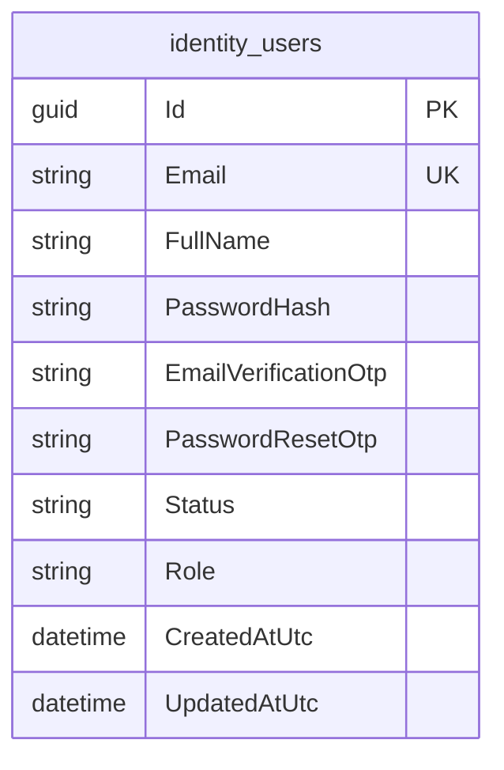
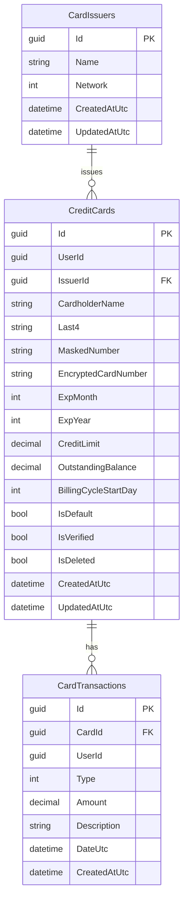
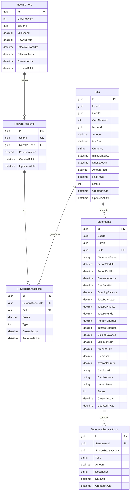
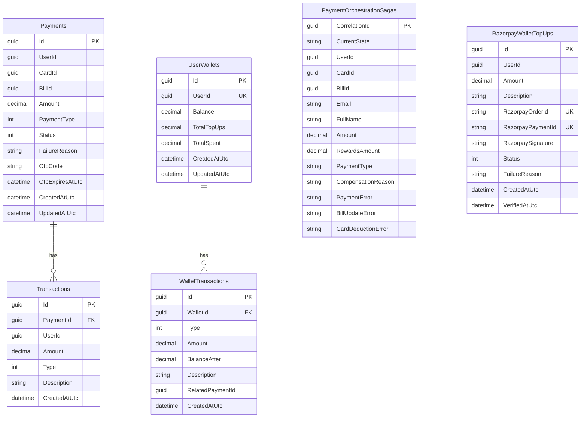
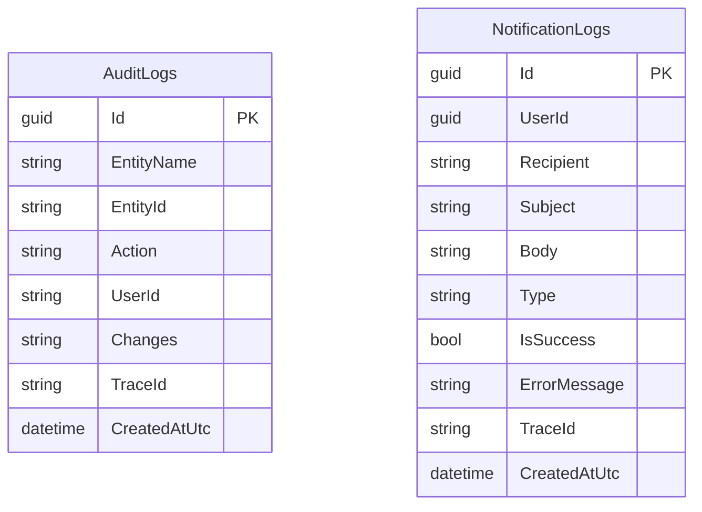
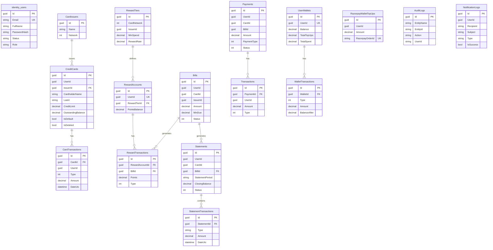

# Database Foreign Key Architecture Documentation

## Overview

This document provides a comprehensive overview of the database architecture across all microservices in the Credit Card Payment System. Each service maintains its own database with clearly defined foreign key relationships.

**Technology Stack:** .NET 10 with Entity Framework Core (Code-First Approach)
**Database:** SQL Server (per service)

---

## Table of Contents

1. [Identity Service Database](#1-identity-service-database)
2. [Card Service Database](#2-card-service-database)
3. [Billing Service Database](#3-billing-service-database)
4. [Payment Service Database](#4-payment-service-database)
5. [Notification Service Database](#5-notification-service-database)
6. [Cross-Service Relationships](#6-cross-service-relationships)
7. [Complete ER Diagram](#7-complete-er-diagram)
8. [Foreign Key Summary](#8-foreign-key-summary)

---

## 1. Identity Service Database

### Entities and Tables

#### IdentityUser
**Table:** `identity_users`

| Column | Type | Constraints | Description |
|--------|------|-------------|-------------|
| Id | Guid | PK | Unique identifier |
| Email | string(256) | Unique, Required | User's email address |
| FullName | string(256) | Required | User's full name |
| PasswordHash | string(500) | Nullable | BCrypt hashed password |
| EmailVerificationOtp | string(16) | Nullable | OTP for email verification |
| PasswordResetOtp | string(16) | Nullable | OTP for password reset |
| Status | string(64) | Required | Account status (active/suspended/blocked/pending-verification) |
| Role | string(64) | Required | User role (admin/user) |
| CreatedAtUtc | DateTime | Required | Creation timestamp |
| UpdatedAtUtc | DateTime | Required | Last update timestamp |

### ER Diagram - Identity Service

**Notes:**
- PasswordHash is nullable for Google SSO users
- Email field has unique constraint
- Status and Role are stored as strings ("active", "suspended", "blocked", "pending-verification", "admin", "user")

---

## 2. Card Service Database

### Entities and Tables

#### CardIssuer
**Table:** `CardIssuers`

| Column | Type | Constraints | Description |
|--------|------|-------------|-------------|
| Id | Guid | PK | Unique identifier |
| Name | string(100) | Required | Issuer name (e.g., HDFC, ICICI) |
| Network | int | Required | Card network (Visa/MasterCard/Rupay) |
| CreatedAtUtc | DateTime | Required | Creation timestamp |
| UpdatedAtUtc | DateTime | Required | Last update timestamp |

#### CreditCard
**Table:** `CreditCards`

| Column | Type | Constraints | Description |
|--------|------|-------------|-------------|
| Id | Guid | PK | Unique identifier |
| UserId | Guid | Required, Indexed | Reference to IdentityUser |
| IssuerId | Guid | Required, FK, Indexed | Reference to CardIssuer |
| CardholderName | string(256) | Required | Name on card |
| Last4 | string(4) | Required | Last 4 digits |
| MaskedNumber | string(32) | Required | Masked card number |
| EncryptedCardNumber | string(512) | Nullable | Encrypted full number |
| ExpMonth | int | Required | Expiry month |
| ExpYear | int | Required | Expiry year |
| CreditLimit | decimal(18,2) | Required | Credit limit amount |
| OutstandingBalance | decimal(18,2) | Required | Current balance |
| BillingCycleStartDay | int | Required | Day of month for billing |
| IsDefault | bool | Required | Is default card |
| IsVerified | bool | Required | Verification status |
| VerifiedAtUtc | DateTime | Nullable | Verification timestamp |
| IsDeleted | bool | Required | Soft delete flag |
| DeletedAtUtc | DateTime | Nullable | Deletion timestamp |
| CreatedAtUtc | DateTime | Required | Creation timestamp |
| UpdatedAtUtc | DateTime | Required | Last update timestamp |

**Foreign Keys:**
- `IssuerId` → `CardIssuers.Id` (DeleteBehavior.Restrict)

**Indexes:**
- UserId
- (UserId, IsDefault)
- IssuerId

**Query Filter:** `!IsDeleted` (soft delete)

#### CardTransaction
**Table:** `CardTransactions`

| Column | Type | Constraints | Description |
|--------|------|-------------|-------------|
| Id | Guid | PK | Unique identifier |
| CardId | Guid | Required, FK, Indexed | Reference to CreditCard |
| UserId | Guid | Required, Indexed | Reference to IdentityUser |
| Type | int | Required | Transaction type (Purchase/Payment/Refund) |
| Amount | decimal(18,2) | Required | Transaction amount |
| Description | string(256) | Required | Transaction description |
| DateUtc | DateTime | Required, Indexed | Transaction date |
| CreatedAtUtc | DateTime | Required | Creation timestamp |

**Foreign Keys:**
- `CardId` → `CreditCards.Id` (DeleteBehavior.Restrict)

**Query Filter:** `!Card.IsDeleted` (only returns transactions for non-deleted cards)

### ER Diagram - Card Service

**Relationships:**
- One CardIssuer can issue many CreditCards (1:N)
- One CreditCard can have many CardTransactions (1:N)
- CreditCards reference UserId (cross-service reference, no FK constraint)
- CardTransactions reference UserId (cross-service reference, no FK constraint)

---

## 3. Billing Service Database

### Entities and Tables

#### Bill
**Table:** `Bills`

| Column | Type | Constraints | Description |
|--------|------|-------------|-------------|
| Id | Guid | PK | Unique identifier |
| UserId | Guid | Required, Indexed | Reference to IdentityUser |
| CardId | Guid | Required | Reference to CreditCard |
| CardNetwork | int | Required | Card network enum |
| IssuerId | Guid | Required | Reference to CardIssuer |
| Amount | decimal(18,2) | Required | Bill amount |
| MinDue | decimal(18,2) | Required | Minimum due amount |
| Currency | string(8) | Required | Currency code (default: INR) |
| BillingDateUtc | DateTime | Required | Billing date |
| DueDateUtc | DateTime | Required, Indexed | Payment due date |
| AmountPaid | decimal(18,2) | Nullable | Amount paid |
| PaidAtUtc | DateTime | Nullable | Payment timestamp |
| Status | int | Required | Bill status (Pending/Paid/Overdue/PartiallyPaid) |
| CreatedAtUtc | DateTime | Required | Creation timestamp |
| UpdatedAtUtc | DateTime | Required | Last update timestamp |

**Indexes:**
- UserId
- (UserId, Status)
- DueDateUtc

#### RewardTier
**Table:** `RewardTiers`

| Column | Type | Constraints | Description |
|--------|------|-------------|-------------|
| Id | Guid | PK | Unique identifier |
| CardNetwork | int | Required | Card network |
| IssuerId | Guid | Nullable | Specific issuer (null = all issuers) |
| MinSpend | decimal(18,2) | Required | Minimum spend for tier |
| RewardRate | decimal(9,6) | Required | Reward rate (e.g., 0.015 = 1.5%) |
| EffectiveFromUtc | DateTime | Required | Tier effective from |
| EffectiveToUtc | DateTime | Nullable | Tier effective to |
| CreatedAtUtc | DateTime | Required | Creation timestamp |
| UpdatedAtUtc | DateTime | Required | Last update timestamp |

**Indexes:**
- (CardNetwork, EffectiveFromUtc)

#### RewardAccount
**Table:** `RewardAccounts`

| Column | Type | Constraints | Description |
|--------|------|-------------|-------------|
| Id | Guid | PK | Unique identifier |
| UserId | Guid | Required, Unique | Reference to IdentityUser |
| RewardTierId | Guid | Nullable, FK | Current reward tier |
| PointsBalance | decimal(18,2) | Required | Current points balance |
| CreatedAtUtc | DateTime | Required | Creation timestamp |
| UpdatedAtUtc | DateTime | Required | Last update timestamp |

**Foreign Keys:**
- `RewardTierId` → `RewardTiers.Id` (DeleteBehavior.Restrict)

**Indexes:**
- UserId (Unique)

#### RewardTransaction
**Table:** `RewardTransactions`

| Column | Type | Constraints | Description |
|--------|------|-------------|-------------|
| Id | Guid | PK | Unique identifier |
| RewardAccountId | Guid | Required, FK, Indexed | Reference to RewardAccount |
| BillId | Guid | Nullable, FK, Indexed | Reference to Bill |
| Points | decimal(18,2) | Required | Points earned/redeemed |
| Type | int | Required | Transaction type (Earned/Redeemed/Reversed) |
| CreatedAtUtc | DateTime | Required, Indexed | Transaction date |
| ReversedAtUtc | DateTime | Nullable | Reversal timestamp |

**Foreign Keys:**
- `RewardAccountId` → `RewardAccounts.Id` (DeleteBehavior.Cascade)
- `BillId` → `Bills.Id` (DeleteBehavior.Restrict)

#### Statement
**Table:** `Statements`

| Column | Type | Constraints | Description |
|--------|------|-------------|-------------|
| Id | Guid | PK | Unique identifier |
| UserId | Guid | Required, Indexed | Reference to IdentityUser |
| CardId | Guid | Required, Indexed | Reference to CreditCard |
| BillId | Guid | Nullable, FK | Reference to Bill |
| StatementPeriod | string(100) | Required | Period description |
| PeriodStartUtc | DateTime | Required | Period start |
| PeriodEndUtc | DateTime | Required, Indexed | Period end |
| GeneratedAtUtc | DateTime | Required | Generation timestamp |
| DueDateUtc | DateTime | Nullable | Due date |
| OpeningBalance | decimal(18,2) | Required | Opening balance |
| TotalPurchases | decimal(18,2) | Required | Total purchases |
| TotalPayments | decimal(18,2) | Required | Total payments |
| TotalRefunds | decimal(18,2) | Required | Total refunds |
| PenaltyCharges | decimal(18,2) | Required | Penalty charges |
| InterestCharges | decimal(18,2) | Required | Interest charges |
| ClosingBalance | decimal(18,2) | Required | Closing balance |
| MinimumDue | decimal(18,2) | Required | Minimum due |
| AmountPaid | decimal(18,2) | Nullable | Amount paid |
| CreditLimit | decimal(18,2) | Required | Credit limit |
| AvailableCredit | decimal(18,2) | Required | Available credit |
| CardLast4 | string(10) | Required | Last 4 digits |
| CardNetwork | string(50) | Required | Card network |
| IssuerName | string(100) | Required | Issuer name |
| Status | int | Required | Statement status |
| PaidAtUtc | DateTime | Nullable | Payment timestamp |
| Notes | string | Nullable | Additional notes |
| CreatedAtUtc | DateTime | Required | Creation timestamp |
| UpdatedAtUtc | DateTime | Required | Last update timestamp |

**Foreign Keys:**
- `BillId` → `Bills.Id` (DeleteBehavior.Restrict)

**Indexes:**
- UserId
- CardId
- (UserId, Status)
- PeriodEndUtc

#### StatementTransaction
**Table:** `StatementTransactions`

| Column | Type | Constraints | Description |
|--------|------|-------------|-------------|
| Id | Guid | PK | Unique identifier |
| StatementId | Guid | Required, FK, Indexed | Reference to Statement |
| SourceTransactionId | Guid | Nullable | Original transaction ID |
| Type | string(50) | Required | Transaction type |
| Amount | decimal(18,2) | Required | Transaction amount |
| Description | string(256) | Required | Transaction description |
| DateUtc | DateTime | Required, Indexed | Transaction date |
| CreatedAtUtc | DateTime | Required | Creation timestamp |

**Foreign Keys:**
- `StatementId` → `Statements.Id` (DeleteBehavior.Cascade)

### ER Diagram - Billing Service

**Relationships:**
- One RewardTier can be assigned to many RewardAccounts (1:N)
- One RewardAccount can have many RewardTransactions (1:N)
- One Bill can have many RewardTransactions (1:N)
- One Bill can have many Statements (1:N)
- One Statement can have many StatementTransactions (1:N)
- Bills, Statements reference UserId and CardId (cross-service references, no FK constraints)

---

## 4. Payment Service Database

### Entities and Tables

#### Payment
**Table:** `Payments`

| Column | Type | Constraints | Description |
|--------|------|-------------|-------------|
| Id | Guid | PK | Unique identifier |
| UserId | Guid | Required, Indexed | Reference to IdentityUser |
| CardId | Guid | Required | Reference to CreditCard |
| BillId | Guid | Required, Indexed | Reference to Bill |
| Amount | decimal(18,2) | Required | Payment amount |
| PaymentType | int | Required | Payment type (Wallet/Card) |
| Status | int | Required | Payment status |
| FailureReason | string(500) | Nullable | Failure description |
| OtpCode | string | Nullable | OTP for verification |
| OtpExpiresAtUtc | DateTime | Nullable | OTP expiry |
| CreatedAtUtc | DateTime | Required | Creation timestamp |
| UpdatedAtUtc | DateTime | Required | Last update timestamp |

**Indexes:**
- UserId
- BillId

#### Transaction
**Table:** `Transactions`

| Column | Type | Constraints | Description |
|--------|------|-------------|-------------|
| Id | Guid | PK | Unique identifier |
| PaymentId | Guid | Required, FK, Indexed | Reference to Payment |
| UserId | Guid | Required, Indexed | Reference to IdentityUser |
| Amount | decimal(18,2) | Required | Transaction amount |
| Type | int | Required | Transaction type |
| Description | string(250) | Nullable | Description |
| CreatedAtUtc | DateTime | Required | Creation timestamp |

**Foreign Keys:**
- `PaymentId` → `Payments.Id` (DeleteBehavior.Cascade)

#### PaymentOrchestrationSagaState
**Table:** `PaymentOrchestrationSagas`

| Column | Type | Constraints | Description |
|--------|------|-------------|-------------|
| CorrelationId | Guid | PK | Saga correlation ID |
| CurrentState | string(64) | Nullable | Current saga state |
| UserId | Guid | Required | User reference |
| CardId | Guid | Required | Card reference |
| BillId | Guid | Required | Bill reference |
| Email | string(256) | Nullable | User email |
| FullName | string(256) | Nullable | User full name |
| Amount | decimal(18,2) | Nullable | Payment amount |
| RewardsAmount | decimal(18,2) | Nullable | Rewards amount |
| PaymentType | string(32) | Nullable | Payment type |
| CompensationReason | string(500) | Nullable | Compensation reason |
| PaymentError | string(500) | Nullable | Payment error |
| BillUpdateError | string(500) | Nullable | Bill update error |
| CardDeductionError | string(500) | Nullable | Card deduction error |

**Note:** This is a MassTransit Saga state table for orchestrating payment flows.

#### UserWallet
**Table:** `UserWallets`

| Column | Type | Constraints | Description |
|--------|------|-------------|-------------|
| Id | Guid | PK | Unique identifier |
| UserId | Guid | Required, Unique | Reference to IdentityUser |
| Balance | decimal(18,2) | Required | Current wallet balance |
| TotalTopUps | decimal(18,2) | Required | Total amount topped up |
| TotalSpent | decimal(18,2) | Required | Total amount spent |
| CreatedAtUtc | DateTime | Required | Creation timestamp |
| UpdatedAtUtc | DateTime | Required | Last update timestamp |

**Indexes:**
- UserId (Unique)

#### WalletTransaction
**Table:** `WalletTransactions`

| Column | Type | Constraints | Description |
|--------|------|-------------|-------------|
| Id | Guid | PK | Unique identifier |
| WalletId | Guid | Required, FK, Indexed | Reference to UserWallet |
| Type | int | Required | Transaction type (TopUp/Debit/Refund) |
| Amount | decimal(18,2) | Required | Transaction amount |
| BalanceAfter | decimal(18,2) | Required | Balance after transaction |
| Description | string(500) | Nullable | Description |
| RelatedPaymentId | Guid | Nullable | Related payment ID |
| CreatedAtUtc | DateTime | Required, Indexed | Transaction date |

**Foreign Keys:**
- `WalletId` → `UserWallets.Id` (DeleteBehavior.Cascade)

#### RazorpayWalletTopUp
**Table:** `RazorpayWalletTopUps`

| Column | Type | Constraints | Description |
|--------|------|-------------|-------------|
| Id | Guid | PK | Unique identifier |
| UserId | Guid | Required, Indexed | Reference to IdentityUser |
| Amount | decimal(18,2) | Required | Top-up amount |
| Description | string(250) | Nullable | Description |
| RazorpayOrderId | string(100) | Required, Unique | Razorpay order ID |
| RazorpayPaymentId | string(100) | Nullable, Unique | Razorpay payment ID |
| RazorpaySignature | string(512) | Nullable | Razorpay signature |
| Status | int | Required | Top-up status |
| FailureReason | string(500) | Nullable | Failure reason |
| CreatedAtUtc | DateTime | Required | Creation timestamp |
| VerifiedAtUtc | DateTime | Nullable | Verification timestamp |

**Indexes:**
- UserId
- RazorpayOrderId (Unique)
- RazorpayPaymentId (Unique, with filter)

### ER Diagram - Payment Service

**Relationships:**
- One Payment can have many Transactions (1:N)
- One UserWallet can have many WalletTransactions (1:N)
- Payments reference UserId, CardId, BillId (cross-service references, no FK constraints)
- UserWallets reference UserId (cross-service reference, no FK constraint)
- WalletTransactions may reference RelatedPaymentId (cross-service reference)

---

## 5. Notification Service Database

### Entities and Tables

#### AuditLog
**Table:** `AuditLogs`

| Column | Type | Constraints | Description |
|--------|------|-------------|-------------|
| Id | Guid | PK | Unique identifier |
| EntityName | string(100) | Required | Entity name (e.g., "User", "Card") |
| EntityId | string | Required | Entity ID |
| Action | string(100) | Required | Action performed (e.g., "Create", "Update") |
| UserId | string(100) | Nullable | User who performed action |
| Changes | string | Nullable | JSON of changes |
| TraceId | string(128) | Nullable | Correlation ID for tracing |
| CreatedAtUtc | DateTime | Required | Creation timestamp |

#### NotificationLog
**Table:** `NotificationLogs`

| Column | Type | Constraints | Description |
|--------|------|-------------|-------------|
| Id | Guid | PK | Unique identifier |
| UserId | Guid | Nullable | Target user |
| Recipient | string(255) | Required | Email/phone number |
| Subject | string(500) | Required | Notification subject |
| Body | string | Required | Notification body |
| Type | string(50) | Required | Notification type (Email/SMS) |
| IsSuccess | bool | Required | Success status |
| ErrorMessage | string | Nullable | Error message if failed |
| TraceId | string(128) | Nullable | Correlation ID for tracing |
| CreatedAtUtc | DateTime | Required | Creation timestamp |

### ER Diagram - Notification Service

**Notes:**
- AuditLog and NotificationLog are independent logging tables
- UserId references are cross-service references (no FK constraints)
- TraceId is used for distributed tracing across microservices

---

## 6. Cross-Service Relationships

### Logical Foreign Key Relationships (No Physical FK Constraints)

In a microservices architecture, physical foreign key constraints are not enforced across service boundaries. Instead, logical relationships are maintained through GUID references:

| Source Service | Source Table | Column | Target Service | Target Table | Description |
|--------------|--------------|--------|---------------|--------------|-------------|
| Card Service | CreditCards | UserId | Identity Service | identity_users | Card belongs to user |
| Card Service | CardTransactions | UserId | Identity Service | identity_users | Transaction by user |
| Card Service | CardTransactions | CardId | Card Service | CreditCards | Transaction on card |
| Billing Service | Bills | UserId | Identity Service | identity_users | Bill for user |
| Billing Service | Bills | CardId | Card Service | CreditCards | Bill for card |
| Billing Service | Bills | IssuerId | Card Service | CardIssuers | Bill from issuer |
| Billing Service | Statements | UserId | Identity Service | identity_users | Statement for user |
| Billing Service | Statements | CardId | Card Service | CreditCards | Statement for card |
| Billing Service | Statements | BillId | Billing Service | Bills | Statement for bill |
| Billing Service | RewardAccounts | UserId | Identity Service | identity_users | Reward account for user |
| Payment Service | Payments | UserId | Identity Service | identity_users | Payment by user |
| Payment Service | Payments | CardId | Card Service | CreditCards | Payment for card |
| Payment Service | Payments | BillId | Billing Service | Bills | Payment for bill |
| Payment Service | UserWallets | UserId | Identity Service | identity_users | Wallet for user |
| Payment Service | WalletTransactions | RelatedPaymentId | Payment Service | Payments | Wallet transaction from payment |
| Notification Service | AuditLogs | UserId | Identity Service | identity_users | Audit by user |
| Notification Service | NotificationLogs | UserId | Identity Service | identity_users | Notification to user |

### Data Consistency Approach

Since physical foreign keys are not used across services, data consistency is maintained through:

1. **Saga Pattern**: PaymentOrchestrationSaga handles distributed transactions
2. **Event-Driven Architecture**: Services publish events on successful operations
3. **Compensating Actions**: Failed operations trigger rollback events
4. **Idempotency**: Operations can be safely retried
5. **Soft Deletes**: Cards use `IsDeleted` flag to maintain referential integrity

---

## 7. Complete ER Diagram

---

## 8. Foreign Key Summary

### Physical Foreign Keys (Within Service)

| Service | Table | Column | References | Delete Behavior |
|---------|-------|--------|------------|-----------------|
| Card Service | CreditCards | IssuerId | CardIssuers.Id | Restrict |
| Card Service | CardTransactions | CardId | CreditCards.Id | Restrict |
| Billing Service | RewardAccounts | RewardTierId | RewardTiers.Id | Restrict |
| Billing Service | RewardTransactions | RewardAccountId | RewardAccounts.Id | Cascade |
| Billing Service | RewardTransactions | BillId | Bills.Id | Restrict |
| Billing Service | Statements | BillId | Bills.Id | Restrict |
| Billing Service | StatementTransactions | StatementId | Statements.Id | Cascade |
| Payment Service | Transactions | PaymentId | Payments.Id | Cascade |
| Payment Service | WalletTransactions | WalletId | UserWallets.Id | Cascade |

### Logical Foreign Keys (Cross-Service)

| Source Service | Source Table | Column | Target Service | Target Table | Consistency Mechanism |
|---------------|--------------|--------|---------------|--------------|----------------------|
| Card Service | CreditCards | UserId | Identity | identity_users | Event-driven, Saga |
| Card Service | CardTransactions | UserId | Identity | identity_users | Event-driven |
| Billing Service | Bills | UserId | Identity | identity_users | Event-driven |
| Billing Service | Bills | CardId | Card | CreditCards | Event-driven |
| Billing Service | Bills | IssuerId | Card | CardIssuers | Event-driven |
| Billing Service | Statements | UserId | Identity | identity_users | Event-driven |
| Billing Service | Statements | CardId | Card | CreditCards | Event-driven |
| Billing Service | RewardAccounts | UserId | Identity | identity_users | Event-driven |
| Payment Service | Payments | UserId | Identity | identity_users | Event-driven, Saga |
| Payment Service | Payments | CardId | Card | CreditCards | Event-driven, Saga |
| Payment Service | Payments | BillId | Billing | Bills | Event-driven, Saga |
| Payment Service | UserWallets | UserId | Identity | identity_users | Event-driven |
| Notification | AuditLogs | UserId | Identity | identity_users | Logging only |
| Notification | NotificationLogs | UserId | Identity | identity_users | Logging only |

---

## Appendix: Enum Types

### CardNetwork (Shared)
- 0 = Visa
- 1 = MasterCard
- 2 = Rupay
- 3 = Amex

### UserStatus (Identity)
- PendingVerification = 0
- Active = 1
- Suspended = 2
- Blocked = 3

### UserRole (Identity)
- User = 0
- Admin = 1

### CardTransactionType (Card)
- Purchase = 0
- Payment = 1
- Refund = 2

### BillStatus (Billing)
- Pending = 0
- Paid = 1
- Overdue = 2
- PartiallyPaid = 3

### RewardTransactionType (Billing)
- Earned = 0
- Redeemed = 1
- Reversed = 2

### StatementStatus (Billing)
- Generated = 0
- Paid = 1
- Overdue = 2
- PartiallyPaid = 3

### PaymentType (Payment)
- Wallet = 0
- Card = 1

### PaymentStatus (Payment)
- Pending = 0
- Completed = 1
- Failed = 2
- Reversed = 3
- Expired = 4

### PaymentTransactionType (Payment)
- Debit = 0
- Credit = 1

### WalletTransactionType (Payment)
- TopUp = 0
- Debit = 1
- Refund = 2

### RazorpayWalletTopUpStatus (Payment)
- Pending = 0
- Completed = 1
- Failed = 2

---

## References

- **Solution File**: `/Users/tirtharaj/Desktop/Desktop/self-learning/project/src/server/CreditCardPaymentSystem.sln`
- **DbContext Files**:
  - Identity: `/server/services/identity-service/IdentityService.Infrastructure/Persistence/Sql/IdentityDbContext.cs`
  - Card: `/server/services/card-service/CardService.Infrastructure/Persistence/Sql/CardDbContext.cs`
  - Billing: `/server/services/billing-service/BillingService.Infrastructure/Persistence/Sql/BillingDbContext.cs`
  - Payment: `/server/services/payment-service/PaymentService.Infrastructure/Persistence/Sql/PaymentDbContext.cs`
  - Notification: `/server/services/notification-service/NotificationService.Infrastructure/Persistence/NotificationDbContext.cs`

---

**Generated on**: April 29, 2026
**Database Architecture**: Microservices with per-service databases
**ORM**: Entity Framework Core (Code-First)
**Documentation Version**: 1.0
