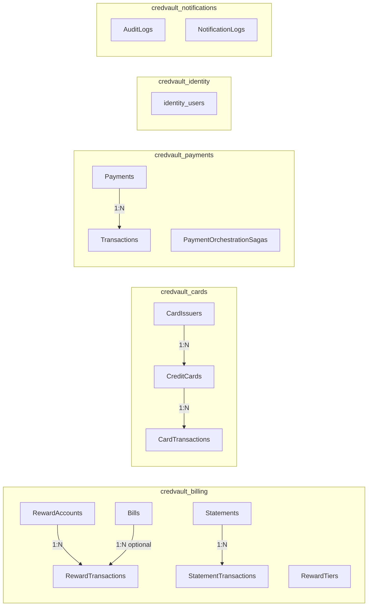
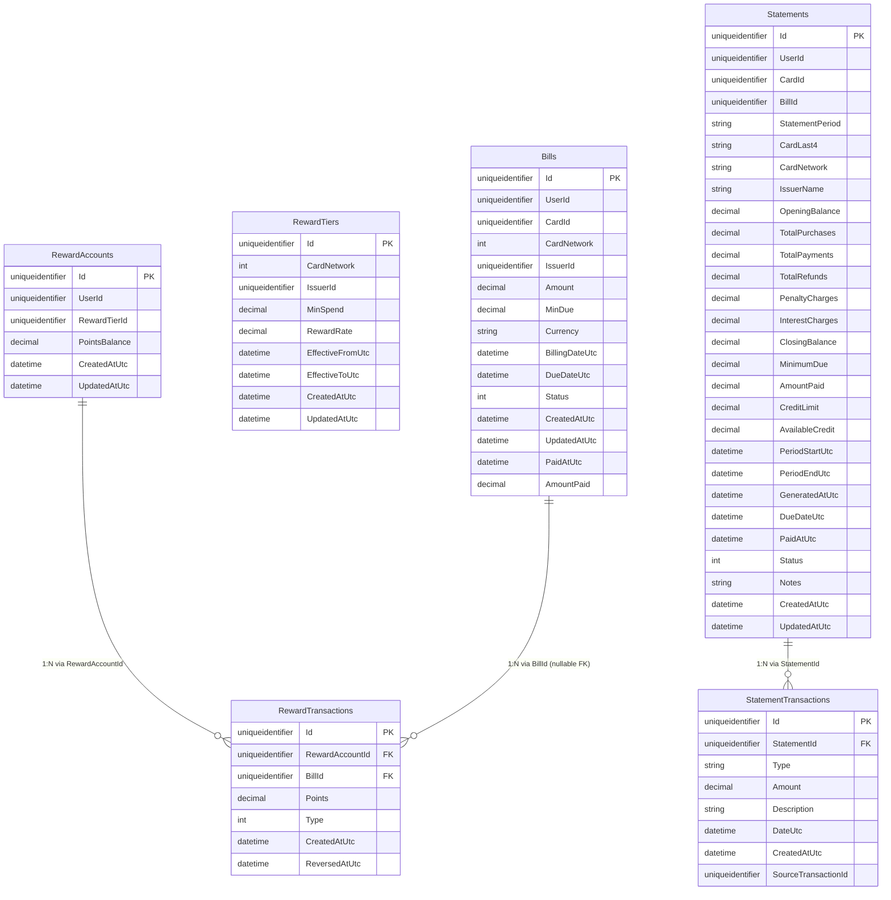
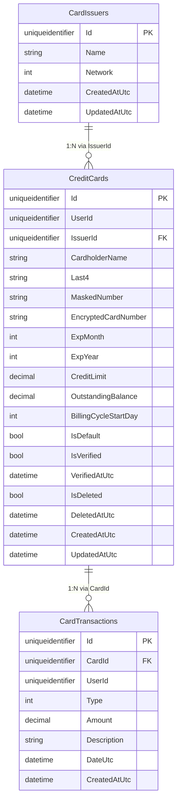
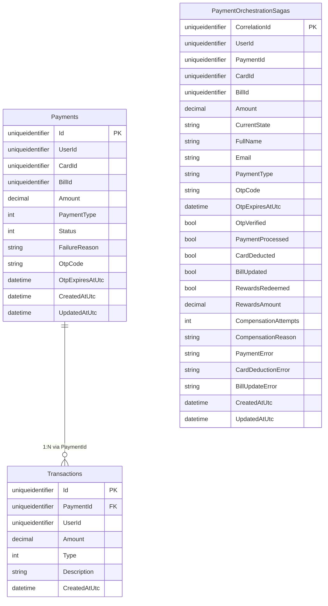
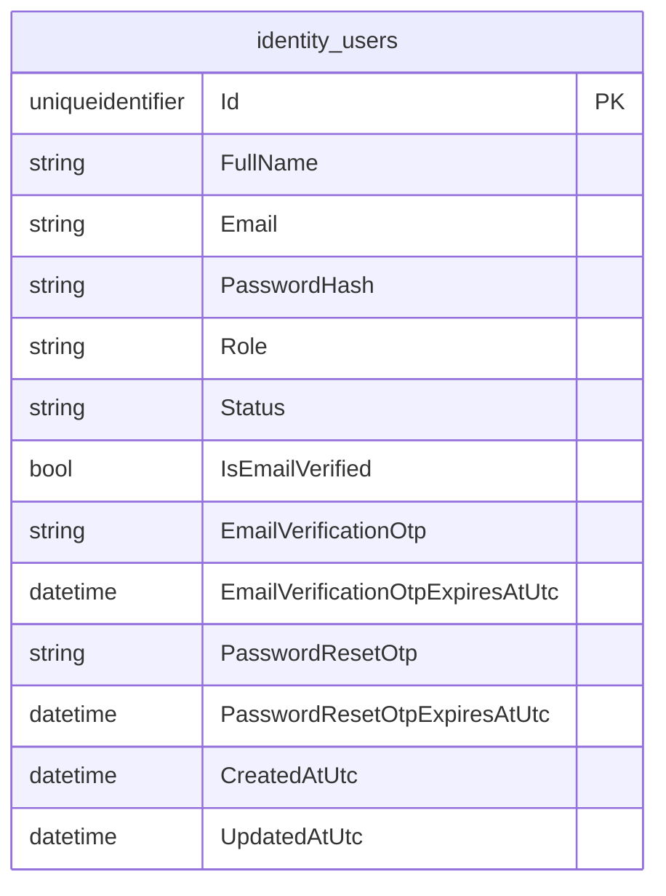
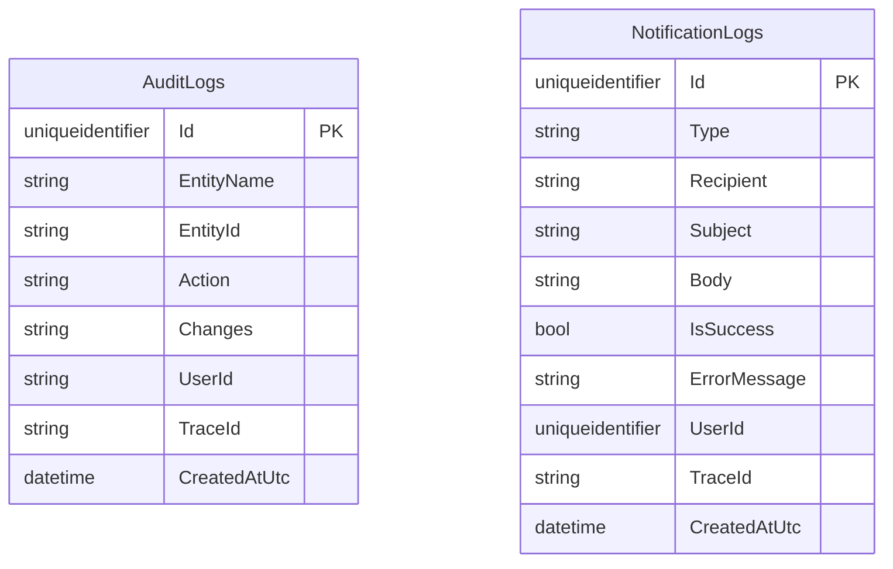

# Database Architecture (Tables, Columns, and Relationships)

This document shows the current SQL database architecture from EF Core `DbContext` + model snapshots:

1. Every database
2. Every table in each database
3. Key columns in each table
4. Relationship type and cardinality (`1:N`, `N:1`, `1:1`)

## Database Overview

| Service | Database | Tables | SQL FK Count |
|---|---|---:|---:|
| Billing | `credvault_billing` | 6 | 3 |
| Card | `credvault_cards` | 3 | 2 |
| Payment | `credvault_payments` | 3 | 1 |
| Identity | `credvault_identity` | 1 | 0 |
| Notification | `credvault_notifications` | 2 | 0 |

## Global Architecture Diagram

## Detailed ER Diagrams By Database

### Billing Database (`credvault_billing`)

### Card Database (`credvault_cards`)

### Payment Database (`credvault_payments`)

### Identity Database (`credvault_identity`)

### Notification Database (`credvault_notifications`)

## Relationship Cardinality Matrix

| Database | Parent Table | Child Table | FK Column | Parent to Child | Child to Parent | On Delete |
|---|---|---|---|---|---|---|
| `credvault_billing` | `RewardAccounts` | `RewardTransactions` | `RewardAccountId` | `1:N` | `N:1` | `CASCADE` |
| `credvault_billing` | `Bills` | `RewardTransactions` | `BillId` (nullable) | `1:N` (optional link) | `N:1` (optional) | `RESTRICT` |
| `credvault_billing` | `Statements` | `StatementTransactions` | `StatementId` | `1:N` | `N:1` | `CASCADE` |
| `credvault_cards` | `CardIssuers` | `CreditCards` | `IssuerId` | `1:N` | `N:1` | `RESTRICT` |
| `credvault_cards` | `CreditCards` | `CardTransactions` | `CardId` | `1:N` | `N:1` | `RESTRICT` |
| `credvault_payments` | `Payments` | `Transactions` | `PaymentId` | `1:N` | `N:1` | `CASCADE` |

Current schema has no `1:1` SQL foreign key relationship.

## Important Architecture Note

You will see many cross-service ID columns like `UserId`, `BillId`, and `CardId` in multiple databases. These are application-level references for microservice boundaries, not SQL-enforced foreign keys across databases.

## Logical Links Without SQL FK Constraint

These columns look relational but are not enforced as SQL foreign keys in the current model:

| Database | Table.Column | Logical Target | Notes |
|---|---|---|---|
| `credvault_billing` | `RewardAccounts.RewardTierId` | `RewardTiers.Id` | Same DB reference pattern, no FK configured |
| `credvault_billing` | `Statements.BillId` | `Bills.Id` | Same DB reference pattern, no FK configured |
| `credvault_payments` | `PaymentOrchestrationSagas.PaymentId` | `Payments.Id` | Workflow/saga linkage, no FK configured |
| `credvault_payments` | `Payments.BillId` | Billing `Bills.Id` | Cross-service ID reference |
| `credvault_payments` | `Payments.CardId` | Card `CreditCards.Id` | Cross-service ID reference |
| `credvault_cards` | `CreditCards.UserId` | Identity `identity_users.Id` | Cross-service ID reference |
| `credvault_billing` | `Bills.UserId` / `Statements.UserId` | Identity `identity_users.Id` | Cross-service ID references |
| `credvault_notifications` | `NotificationLogs.UserId` | Identity `identity_users.Id` | Cross-service ID reference |

## Source of Truth Used

- `server/services/billing-service/BillingService.Infrastructure/Persistence/Sql/BillingDbContext.cs`
- `server/services/billing-service/BillingService.Infrastructure/Persistence/Sql/Migrations/BillingDbContextModelSnapshot.cs`
- `server/services/card-service/CardService.Infrastructure/Persistence/Sql/CardDbContext.cs`
- `server/services/card-service/CardService.Infrastructure/Persistence/Sql/Migrations/CardDbContextModelSnapshot.cs`
- `server/services/payment-service/PaymentService.Infrastructure/Persistence/Sql/PaymentDbContext.cs`
- `server/services/payment-service/PaymentService.Infrastructure/Migrations/PaymentDbContextModelSnapshot.cs`
- `server/services/identity-service/IdentityService.Infrastructure/Persistence/Sql/Migrations/IdentityDbContextModelSnapshot.cs`
- `server/services/notification-service/NotificationService.Infrastructure/Migrations/NotificationDbContextModelSnapshot.cs`
