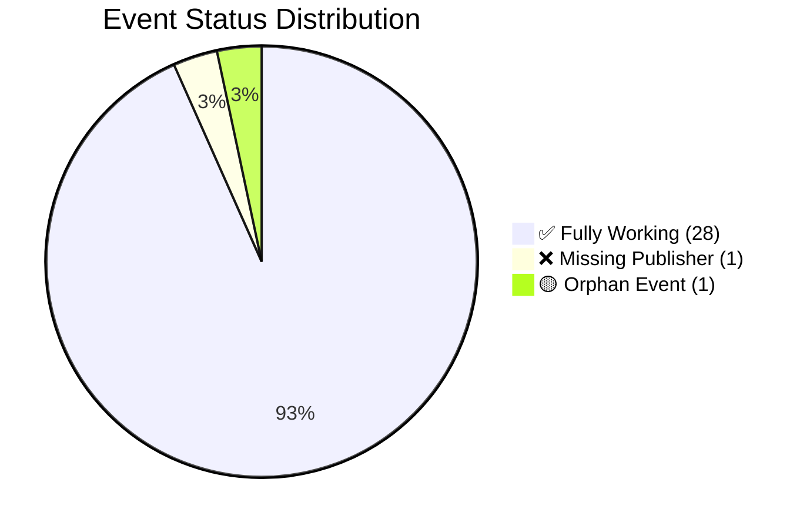
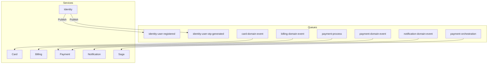
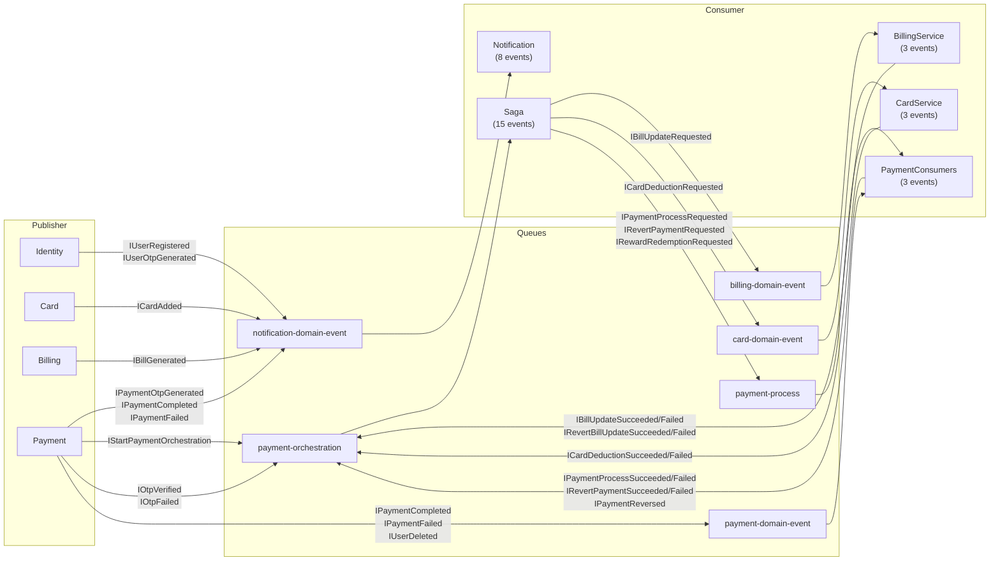
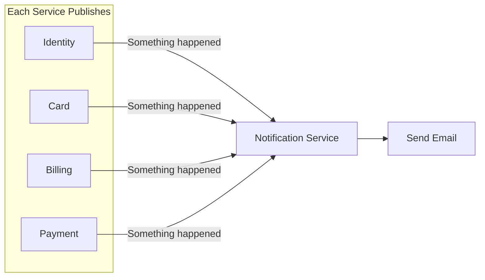
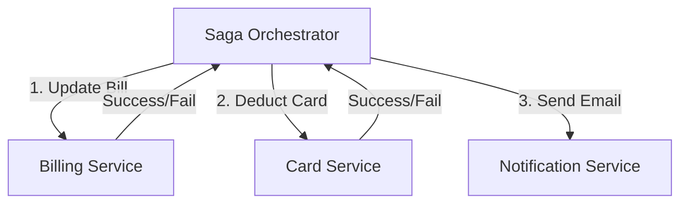
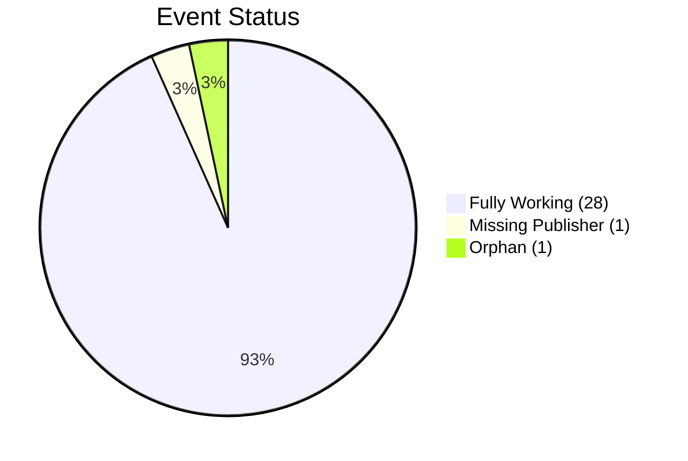

# Events Audit Report

## CredVault Microservices Event Architecture

**Document Version:** 1.1
**Date:** 2026-04-12

---

# Table of Contents

1. [Executive Summary](#1-executive-summary)
2. [Event Definitions](#2-event-definitions)
3. [Service-by-Service Analysis](#3-service-by-service-analysis)
4. [Queue Architecture](#4-queue-architecture)
5. [Event Flow Matrix](#5-event-flow-matrix)
6. [Known Issues](#6-known-issues)
7. [Why So Many Events?](#7-why-so-many-events)

---

# 1. Executive Summary

## Total Event Count

| Category | Count |
|----------|-------|
| **Identity Events** | 3 |
| **Card Events** | 1 |
| **Billing Events** | 2 |
| **Payment Events** | 4 |
| **Saga Orchestration Events** | 22 |
| **TOTAL EVENTS** | **31** |

## Event Flow Status



| Status | Count | Events |
|--------|-------|--------|
| **Fully Working** | 28 | All events except below |
| **Missing Publisher** ❌ | 1 | `IUserDeleted` |
| **Orphan Event** 🟡 | 1 | `IBillOverdueDetected` |

---

# 2. Event Definitions

## 2.1 Identity Events
**File:** `shared.contracts/Shared.Contracts/Events/Identity/IdentityEvents.cs`

```csharp
public interface IUserRegistered
{
    Guid UserId { get; }
    string Email { get; }
    string FullName { get; }
    DateTime CreatedAtUtc { get; }
}

public interface IUserOtpGenerated
{
    Guid UserId { get; }
    string Email { get; }
    string FullName { get; }
    string OtpCode { get; }
    string Purpose { get; } // "EmailVerification", "PasswordReset", etc.
    DateTime ExpiresAtUtc { get; }
}

public interface IUserDeleted
{
    Guid UserId { get; }
    DateTime DeletedAtUtc { get; }
}
```

---

## 2.2 Card Events
**File:** `shared.contracts/Shared.Contracts/Events/Card/CardEvents.cs`

```csharp
public interface ICardAdded
{
    Guid CardId { get; }
    Guid UserId { get; }
    string Email { get; }
    string FullName { get; }
    string CardNumberLast4 { get; }
    string CardHolderName { get; }
    DateTime AddedAt { get; }
}
```

---

## 2.3 Billing Events
**File:** `shared.contracts/Shared.Contracts/Events/Billing/BillingEvents.cs`

```csharp
public interface IBillGenerated
{
    Guid BillId { get; }
    Guid UserId { get; }
    string Email { get; }
    string FullName { get; }
    Guid CardId { get; }
    decimal Amount { get; }
    DateTime DueDate { get; }
    DateTime GeneratedAt { get; }
}

public interface IBillOverdueDetected
{
    Guid BillId { get; }
    Guid CardId { get; }
    Guid UserId { get; }
    decimal OverdueAmount { get; }
    DateTime DueDate { get; }
    int DaysOverdue { get; }
    DateTime DetectedAt { get; }
}
```

---

## 2.4 Payment Events
**File:** `shared.contracts/Shared.Contracts/Events/Payment/PaymentEvents.cs`

```csharp
public interface IPaymentCompleted
{
    Guid PaymentId { get; }
    Guid UserId { get; }
    string Email { get; }
    string FullName { get; }
    Guid CardId { get; }
    Guid BillId { get; }
    decimal Amount { get; }
    decimal AmountPaid { get; }
    decimal RewardsRedeemed { get; }
    DateTime CompletedAt { get; }
}

public interface IPaymentFailed
{
    Guid PaymentId { get; }
    Guid UserId { get; }
    string Email { get; }
    string FullName { get; }
    decimal Amount { get; }
    string Reason { get; }
    DateTime FailedAt { get; }
}

public interface IPaymentReversed
{
    Guid PaymentId { get; }
    Guid UserId { get; }
    Guid BillId { get; }
    Guid CardId { get; }
    decimal Amount { get; }
    decimal PointsDeducted { get; }
    DateTime ReversedAt { get; }
}

public interface IPaymentOtpGenerated
{
    Guid PaymentId { get; }
    Guid UserId { get; }
    string Email { get; }
    string FullName { get; }
    decimal Amount { get; }
    string OtpCode { get; }
    DateTime ExpiresAtUtc { get; }
}
```

---

## 2.5 Saga Orchestration Events
**File:** `shared.contracts/Shared.Contracts/Events/Saga/SagaOrchestrationEvents.cs`

### Request Events (Saga → Services)

```csharp
// Start saga
public interface IStartPaymentOrchestration
{
    Guid CorrelationId { get; }
    Guid PaymentId { get; }
    Guid UserId { get; }
    string Email { get; }
    string FullName { get; }
    Guid CardId { get; }
    Guid BillId { get; }
    decimal Amount { get; }
    string PaymentType { get; }
    string OtpCode { get; }
    decimal RewardsAmount { get; }
    DateTime StartedAt { get; }
}

// OTP events
public interface IOtpVerified { Guid CorrelationId; Guid PaymentId; string OtpCode; DateTime VerifiedAt; }
public interface IOtpFailed { Guid CorrelationId; Guid PaymentId; string Reason; DateTime FailedAt; }

// Payment processing
public interface IPaymentProcessRequested { Guid CorrelationId; Guid PaymentId; Guid UserId; decimal Amount; DateTime RequestedAt; }

// Bill update (Saga → Billing)
public interface IBillUpdateRequested { Guid CorrelationId; Guid PaymentId; Guid UserId; Guid BillId; Guid CardId; decimal Amount; DateTime RequestedAt; }

// Card deduction (Saga → Card)
public interface ICardDeductionRequested { Guid CorrelationId; Guid PaymentId; Guid UserId; Guid CardId; decimal Amount; DateTime RequestedAt; }

// Revert operations
public interface IRevertBillUpdateRequested { Guid CorrelationId; Guid PaymentId; Guid UserId; Guid BillId; decimal Amount; DateTime RequestedAt; }
public interface IRevertPaymentRequested { Guid CorrelationId; Guid PaymentId; Guid UserId; Guid BillId; Guid CardId; decimal Amount; DateTime RequestedAt; }

// Reward redemption
public interface IRewardRedemptionRequested { Guid CorrelationId; Guid PaymentId; Guid UserId; Guid BillId; decimal Amount; DateTime RequestedAt; }
```

### Response Events (Services → Saga)

```csharp
// Payment processing results
public interface IPaymentProcessSucceeded { Guid CorrelationId; Guid PaymentId; DateTime SucceededAt; }
public interface IPaymentProcessFailed { Guid CorrelationId; Guid PaymentId; string Reason; DateTime FailedAt; }

// Bill update results
public interface IBillUpdateSucceeded { Guid CorrelationId; Guid BillId; Guid CardId; DateTime SucceededAt; }
public interface IBillUpdateFailed { Guid CorrelationId; Guid BillId; string Reason; DateTime FailedAt; }

// Card deduction results
public interface ICardDeductionSucceeded { Guid CorrelationId; Guid CardId; decimal NewBalance; DateTime SucceededAt; }
public interface ICardDeductionFailed { Guid CorrelationId; Guid CardId; string Reason; DateTime FailedAt; }

// Revert results
public interface IRevertBillUpdateSucceeded { Guid CorrelationId; Guid BillId; DateTime SucceededAt; }
public interface IRevertBillUpdateFailed { Guid CorrelationId; Guid BillId; string Reason; DateTime FailedAt; }
public interface IRevertPaymentSucceeded { Guid CorrelationId; Guid PaymentId; DateTime SucceededAt; }
public interface IRevertPaymentFailed { Guid CorrelationId; Guid PaymentId; string Reason; DateTime FailedAt; }

// Reward redemption results
public interface IRewardRedemptionSucceeded { Guid CorrelationId; Guid BillId; decimal AmountRedeemed; DateTime SucceededAt; }
public interface IRewardRedemptionFailed { Guid CorrelationId; Guid BillId; string Reason; DateTime FailedAt; }
```

---

# 3. Service-by-Service Analysis

## 3.1 Identity Service

| Property | Value |
|----------|-------|
| **Queue** | `identity-user-registered`, `identity-user-otp-generated` |
| **Database** | `credvault_identity` |
| **Publishes** | 4 events |
| **Consumes** | 0 (pure publisher) |

### Publishers

| Event | File | Line | Trigger |
|-------|------|------|---------|
| `IUserOtpGenerated` | RegisterCommand.cs | 71 | User registration |
| `IUserRegistered` | RegisterCommand.cs | 74 | User registration |
| `IUserOtpGenerated` | ResendVerificationCommand.cs | 59 | Resend verification |
| `IUserOtpGenerated` | ForgotPasswordCommand.cs | 53 | Password reset |

---

## 3.2 Card Service

| Property | Value |
|----------|-------|
| **Queue** | `card-domain-event` |
| **Database** | `credvault_cards` |
| **Publishes** | 3 events |
| **Consumes** | 3 events |

### Consumers

| Event | Consumer | Line | Action |
|-------|----------|------|--------|
| `IUserDeleted` | UserDeletedConsumer | 11 | Delete user cards |
| `IPaymentReversed` | PaymentReversedConsumer | 14 | Increase card balance |
| `ICardDeductionRequested` | CardDeductionSagaConsumer | 18 | Deduct card balance |

### Publishers

| Event | File | Line | Trigger |
|-------|------|------|---------|
| `ICardAdded` | CreateCardCommand.cs | 100 | New card created |
| `ICardDeductionSucceeded` | SagaConsumers.cs | 31, 82 | Card deduction success |
| `ICardDeductionFailed` | SagaConsumers.cs | 45, 95 | Card deduction failure |

---

## 3.3 Billing Service

| Property | Value |
|----------|-------|
| **Queue** | `billing-domain-event` |
| **Database** | `credvault_billing` |
| **Publishes** | 6 events |
| **Consumes** | 3 events |

### Consumers

| Event | Consumer | Line | Action |
|-------|----------|------|--------|
| `IUserDeleted` | UserDeletedConsumer | 9 | Delete user bills |
| `IBillUpdateRequested` | BillUpdateSagaConsumer | 14 | Mark bill as paid |
| `IRevertBillUpdateRequested` | RevertBillSagaConsumer | 77 | Revert bill payment |

### Publishers

| Event | File | Line | Trigger |
|-------|------|------|---------|
| `IBillGenerated` | GenerateAdminBillCommand.cs | 102 | Bill generation |
| `IBillOverdueDetected` | CheckOverdueBillsCommand.cs | 79 | Overdue check (ORPHAN) |
| `IBillUpdateSucceeded` | SagaConsumers.cs | 34 | Bill paid |
| `IBillUpdateFailed` | SagaConsumers.cs | 47, 61 | Bill payment failed |
| `IRevertBillUpdateSucceeded` | SagaConsumers.cs | 97 | Bill revert |
| `IRevertBillUpdateFailed` | SagaConsumers.cs | 109, 123 | Bill revert failed |

---

## 3.4 Payment Service

| Property | Value |
|----------|-------|
| **Queues** | `payment-orchestration`, `payment-process`, `payment-domain-event` |
| **Database** | `credvault_payments` |
| **Publishes** | 20+ events |
| **Consumes** | 6 events (external) |

### Consumers (External Events)

| Event | Consumer | Line | Action |
|-------|----------|------|--------|
| `IPaymentProcessRequested` | PaymentProcessConsumer | 14 | Process payment |
| `IRevertPaymentRequested` | RevertPaymentConsumer | 15 | Process compensation |
| `IRewardRedemptionRequested` | RewardRedemptionConsumer | 12 | Redeem rewards |
| `IPaymentCompleted` | PaymentCompletedConsumer | 11 | Log completion |
| `IPaymentFailed` | PaymentFailedConsumer | 55 | Log failure |
| `IUserDeleted` | UserDeletedConsumer | 9 | Delete user payments |

### Saga Publishers

| Event | Line | Purpose |
|-------|------|---------|
| `IStartPaymentOrchestration` | 150 | Start saga |
| `IPaymentProcessRequested` | 90 | Request payment processing |
| `IBillUpdateRequested` | 125 | Update bill |
| `IRewardRedemptionRequested` | 163 | Redeem rewards |
| `ICardDeductionRequested` | 175, 216 | Deduct card |
| `IRevertPaymentRequested` | 193, 233, 292, 376 | Compensation |
| `IRevertBillUpdateRequested` | 274, 324 | Revert bill |
| `IPaymentCompleted` | 253 | Payment success |
| `IPaymentFailed` | 105, 142, 311, 344, 363 | Payment failed |

---

## 3.5 Notification Service

| Property | Value |
|----------|-------|
| **Queue** | `notification-domain-event` |
| **Database** | `credvault_notifications` |
| **Publishes** | 0 (pure consumer) |
| **Consumes** | 8 events |

### Consumers

| Event | Line | Email Template |
|-------|------|---------------|
| `IUserRegistered` | 18 | UserWelcome |
| `IUserOtpGenerated` | 25 | EmailVerificationOtp / PasswordResetOtp |
| `IBillGenerated` | 32 | BillGenerated |
| `IPaymentOtpGenerated` | 39 | PaymentOtp |
| `IPaymentCompleted` | 46 | PaymentCompleted |
| `IPaymentFailed` | 53 | PaymentFailed |
| `IOtpFailed` | 60 | OtpVerificationFailed |
| `ICardAdded` | 68 | CardAdded |

---

# 4. Queue Architecture

## Queue Assignment



| Queue | Type | Services |
|-------|------|----------|
| `identity-user-registered` | Publisher Only | IdentityService publishes |
| `identity-user-otp-generated` | Publisher Only | IdentityService publishes |
| `card-domain-event` | Consumer | CardService: 3 consumers |
| `billing-domain-event` | Consumer | BillingService: 3 consumers |
| `payment-orchestration` | Consumer | PaymentOrchestrationSaga |
| `payment-process` | Consumer | PaymentService: 3 consumers |
| `payment-domain-event` | Consumer | PaymentService: 3 consumers |
| `notification-domain-event` | Consumer | NotificationService: 1 consumer (8 events) |

---

# 5. Event Flow Matrix

## Complete Matrix



---

# 6. Known Issues

## Issue #1: `IUserDeleted` - Never Published ❌

### Problem

The `IUserDeleted` event is consumed by 3 services but NEVER published by IdentityService.

### Consumers (Waiting Forever)

| Service | Consumer | Action |
|---------|----------|--------|
| Billing | UserDeletedConsumer | Would delete user bills |
| Card | UserDeletedConsumer | Would delete user cards |
| Payment | UserDeletedConsumer | Would delete user payments |

### Missing Implementation

```csharp
// NOT IMPLEMENTED - What should exist:
public class DeleteUserCommandHandler : IRequestHandler<DeleteUserCommand>
{
    public async Task Handle(DeleteUserCommand request, CancellationToken ct)
    {
        var user = await _userRepo.GetByIdAsync(request.UserId);
        
        await _userRepo.DeleteAsync(request.UserId);
        
        // THIS IS MISSING:
        await _publisher.Publish(new IUserDeleted 
        { 
            UserId = request.UserId,
            DeletedAtUtc = DateTime.UtcNow
        });
    }
}
```

### Impact

| Service | Impact |
|---------|--------|
| Billing | Orphaned bills remain |
| Card | Orphaned cards remain |
| Payment | Orphaned payments remain |

---

## Issue #2: `IBillOverdueDetected` - Never Consumed 🟡

### Problem

The `IBillOverdueDetected` event IS published but has NO consumer.

### Publisher

| File | Line | Status |
|------|------|--------|
| `CheckOverdueBillsCommand.cs` | 79 | ✅ Published |

### Consumer

| Status | Notes |
|--------|-------|
| ❌ NONE | No consumer implemented |

### Potential Uses (Not Implemented)

- Send overdue notification email
- Apply late fees
- Alert collections system
- Update credit score

---

# 7. Why So Many Events?

## Two Types of Events

### 1. Domain Events - For Notifications



**Purpose:** Tell other services when something happens in your domain.

### 2. Saga Events - For Distributed Workflows



**Purpose:** Coordinate multi-step workflows across services with compensation on failure.

## Summary

| Event Type | Count | Pattern | Always Consumed? |
|------------|-------|---------|------------------|
| Domain Events | ~10 | Publish → Subscribe | Notification only |
| Saga Events | ~20 | Request → Response | Always by Saga |

**The events ARE being consumed!** The 2 issues are:
1. `IUserDeleted` never published (BUG)
2. `IBillOverdueDetected` never consumed (ORPHAN)

---

# Summary Tables

## Events by Queue

| Queue | Events | Type |
|-------|--------|------|
| `notification-domain-event` | 8 | All notification events |
| `payment-orchestration` | ~15 | Saga communication |
| `payment-process` | 3 | Consumer requests |
| `payment-domain-event` | 3 | Domain events |
| `billing-domain-event` | 3 | Billing requests |
| `card-domain-event` | 3 | Card requests |

## Consumer Count by Event

| Event | Consumers | Status |
|-------|-----------|--------|
| `IUserDeleted` | 3 | ❌ No publisher |
| `IOtpFailed` | 2 | ✅ Working |
| `IPaymentCompleted` | 2 | ✅ Working |
| `IPaymentFailed` | 2 | ✅ Working |
| All others | 1 | ✅ Working |

## Event Status Summary


