# Complete Events Reference Guide

## CredVault Microservices Event Architecture

**Document Version:** 1.0
**Date:** 2026-04-12
**Purpose:** Complete reference for all events, who publishes them, who consumes them, and which queue they use.

---

# Table of Contents

1. [Overview - Total Event Count](#1-overview)
2. [Understanding Event Types](#2-understanding-event-types)
3. [All Event Definitions](#3-all-event-definitions)
4. [Service-by-Service Breakdown](#4-service-by-service-breakdown)
5. [Queue Architecture](#5-queue-architecture)
6. [Complete Event Flow Matrix](#6-complete-event-flow-matrix)
7. [Event Publishing Reference](#7-event-publishing-reference)
8. [Event Consumption Reference](#8-event-consumption-reference)
9. [Saga State Machine](#9-saga-state-machine)
10. [Visual Architecture](#10-visual-architecture)
11. [Known Issues](#11-known-issues)

---

# 1. Overview

## Total Event Count

| Category | Count |
|----------|-------|
| **Identity Events** | 3 |
| **Card Events** | 1 |
| **Billing Events** | 2 |
| **Payment Events** | 4 |
| **Saga Orchestration Events** | 22 |
| **TOTAL EVENTS** | **31** |

## Event Types Summary

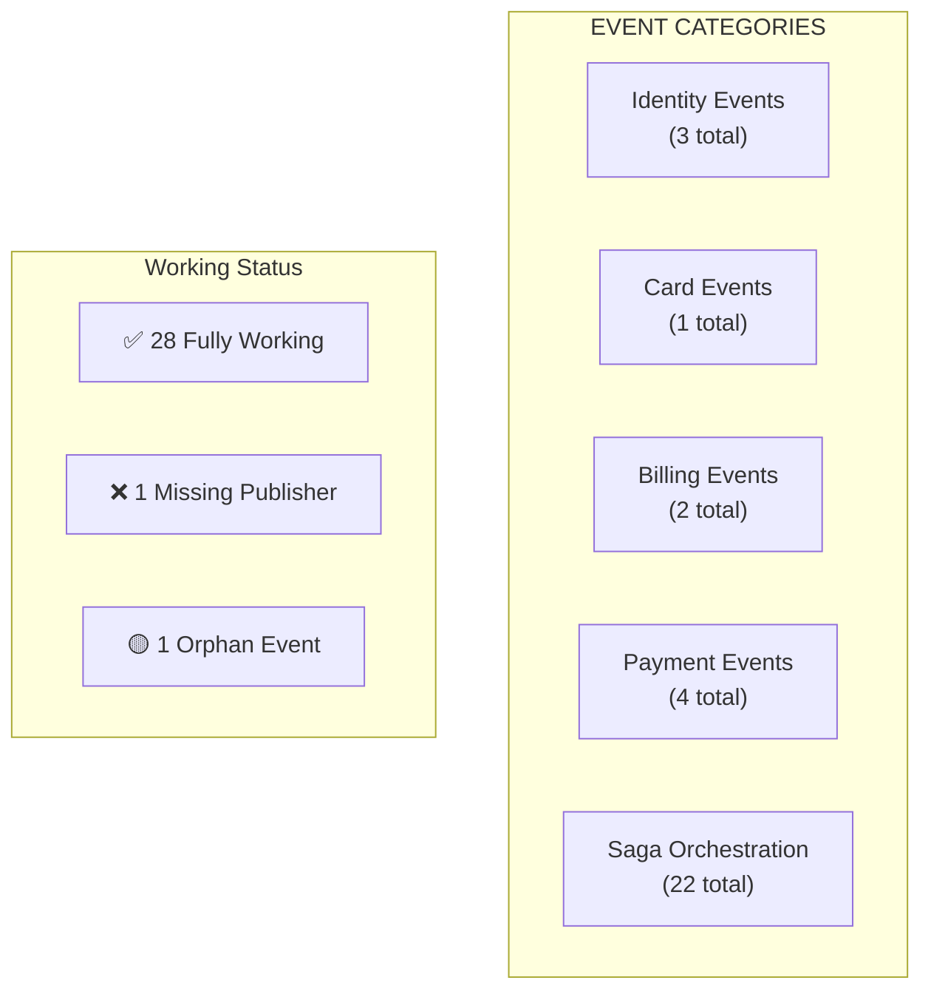
```mermaid
graph TB
    subgraph EVENTS["EVENT CATEGORIES"]
        ID["Identity Events<br/>(3 total)"]
        CA["Card Events<br/>(1 total)"]
        BI["Billing Events<br/>(2 total)"]
        PA["Payment Events<br/>(4 total)"]
        SA["Saga Orchestration<br/>(22 total)"]
    end
    
    subgraph WORKING["Working Status"]
        W1["✅ 28 Fully Working"]
        W2["❌ 1 Missing Publisher"]
        W3["🟡 1 Orphan Event"]
    end
```

---

# 2. Understanding Event Types

## Two Types of Events in Your System

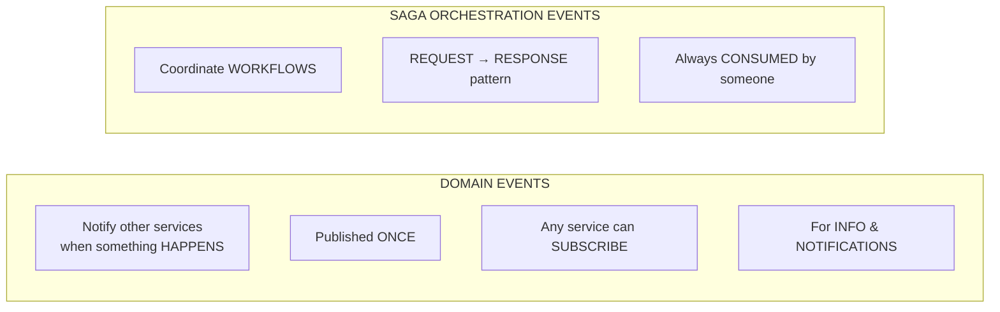
```mermaid
graph LR
    subgraph DOMAIN["DOMAIN EVENTS"]
        D1["Notify other services<br/>when something HAPPENS"]
        D2["Published ONCE"]
        D3["Any service can SUBSCRIBE"]
        D4["For INFO & NOTIFICATIONS"]
    end
    
    subgraph SAGA["SAGA ORCHESTRATION EVENTS"]
        S1["Coordinate WORKFLOWS"]
        S2["REQUEST → RESPONSE pattern"]
        S3["Always CONSUMED by someone"]
    end
```

## Your Events Categorized

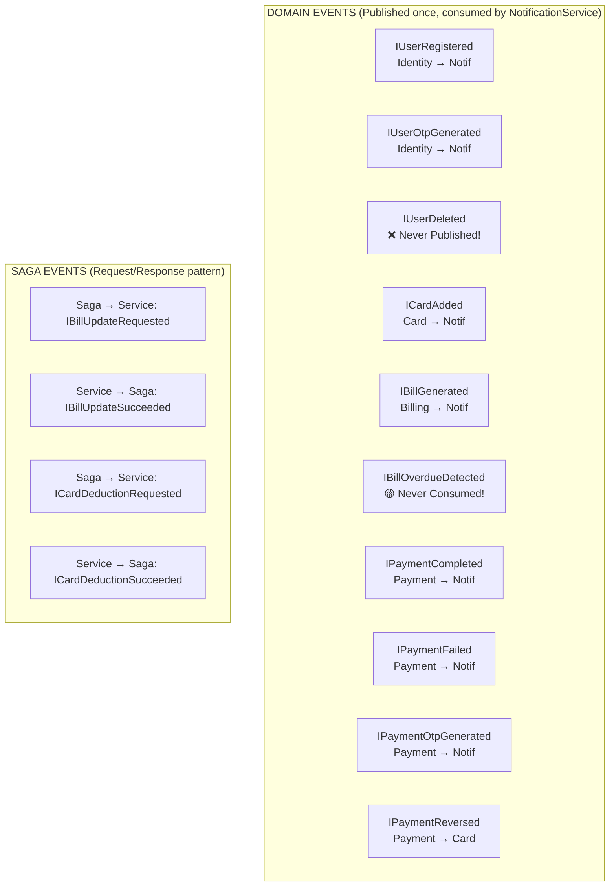
```mermaid
flowchart TB
    subgraph DOMAIN_EVENTS["DOMAIN EVENTS (Published once, consumed by NotificationService)"]
        E1["IUserRegistered<br/>Identity → Notif"]
        E2["IUserOtpGenerated<br/>Identity → Notif"]
        E3["IUserDeleted<br/>❌ Never Published!"]
        E4["ICardAdded<br/>Card → Notif"]
        E5["IBillGenerated<br/>Billing → Notif"]
        E6["IBillOverdueDetected<br/>🟡 Never Consumed!"]
        E7["IPaymentCompleted<br/>Payment → Notif"]
        E8["IPaymentFailed<br/>Payment → Notif"]
        E9["IPaymentOtpGenerated<br/>Payment → Notif"]
        E10["IPaymentReversed<br/>Payment → Card"]
    end
    
    subgraph SAGA_EVENTS["SAGA EVENTS (Request/Response pattern)"]
        S1["Saga → Service: IBillUpdateRequested"]
        S2["Service → Saga: IBillUpdateSucceeded"]
        S3["Saga → Service: ICardDeductionRequested"]
        S4["Service → Saga: ICardDeductionSucceeded"]
    end
```

---

# 3. All Event Definitions

## 3.1 Identity Events
**File:** `shared.contracts/Shared.Contracts/Events/Identity/IdentityEvents.cs`

| Event | Properties | Line |
|-------|------------|------|
| **IUserRegistered** | UserId, Email, FullName, CreatedAtUtc | 3-9 |
| **IUserOtpGenerated** | UserId, Email, FullName, OtpCode, Purpose, ExpiresAtUtc | 11-19 |
| **IUserDeleted** | UserId, DeletedAtUtc | 21-25 |

### Code Example:
```csharp
public interface IUserRegistered
{
    Guid UserId { get; }
    string Email { get; }
    string FullName { get; }
    DateTime CreatedAtUtc { get; }
}
```

---

## 3.2 Card Events
**File:** `shared.contracts/Shared.Contracts/Events/Card/CardEvents.cs`

| Event | Properties | Line |
|-------|------------|------|
| **ICardAdded** | CardId, UserId, Email, FullName, CardNumberLast4, CardHolderName, AddedAt | 3-12 |

---

## 3.3 Billing Events
**File:** `shared.contracts/Shared.Contracts/Events/Billing/BillingEvents.cs`

| Event | Properties | Line |
|-------|------------|------|
| **IBillGenerated** | BillId, UserId, Email, FullName, CardId, Amount, DueDate, GeneratedAt | 3-13 |
| **IBillOverdueDetected** | BillId, CardId, UserId, OverdueAmount, DueDate, DaysOverdue, DetectedAt | (in Saga file) |

---

## 3.4 Payment Events
**File:** `shared.contracts/Shared.Contracts/Events/Payment/PaymentEvents.cs`

| Event | Properties | Line |
|-------|------------|------|
| **IPaymentCompleted** | PaymentId, UserId, Email, FullName, CardId, BillId, Amount, AmountPaid, RewardsRedeemed, CompletedAt | 3-15 |
| **IPaymentFailed** | PaymentId, UserId, Email, FullName, Amount, Reason, FailedAt | 17-26 |
| **IPaymentReversed** | PaymentId, UserId, BillId, CardId, Amount, PointsDeducted, ReversedAt | 28-37 |
| **IPaymentOtpGenerated** | PaymentId, UserId, Email, FullName, Amount, OtpCode, ExpiresAtUtc | 39-48 |

---

## 3.5 Saga Orchestration Events
**File:** `shared.contracts/Shared.Contracts/Events/Saga/SagaOrchestrationEvents.cs`

### Request Events (Saga → Services)
| Event | Line |
|-------|------|
| **IStartPaymentOrchestration** | 3-17 |
| **IOtpVerified** | 30-36 |
| **IOtpFailed** | 38-44 |
| **IPaymentProcessRequested** | 46-53 |
| **IBillUpdateRequested** | 70-79 |
| **ICardDeductionRequested** | 97-105 |
| **IRevertBillUpdateRequested** | 123-131 |
| **IRevertPaymentRequested** | 148-157 |
| **IRewardRedemptionRequested** | 174-182 |

### Response Events (Services → Saga)
| Event | Line |
|-------|------|
| **IPaymentProcessSucceeded** | 55-60 |
| **IPaymentProcessFailed** | 62-68 |
| **IBillUpdateSucceeded** | 81-87 |
| **IBillUpdateFailed** | 89-95 |
| **ICardDeductionSucceeded** | 107-113 |
| **ICardDeductionFailed** | 115-121 |
| **IRevertBillUpdateSucceeded** | 133-138 |
| **IRevertBillUpdateFailed** | 140-146 |
| **IRevertPaymentSucceeded** | 159-164 |
| **IRevertPaymentFailed** | 166-172 |
| **IRewardRedemptionSucceeded** | 184-190 |
| **IRewardRedemptionFailed** | 192-198 |

---

# 4. Service-by-Service Breakdown

---

## 4.1 Identity Service
**Queue:** `identity-user-registered`, `identity-user-otp-generated`
**Database:** `credvault_identity`

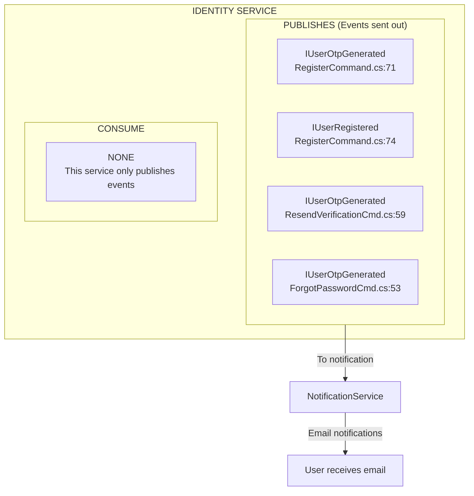
```mermaid
flowchart TB
    subgraph ID["IDENTITY SERVICE"]
        subgraph PUB["PUBLISHES (Events sent out)"]
            P1["IUserOtpGenerated<br/>RegisterCommand.cs:71"]
            P2["IUserRegistered<br/>RegisterCommand.cs:74"]
            P3["IUserOtpGenerated<br/>ResendVerificationCmd.cs:59"]
            P4["IUserOtpGenerated<br/>ForgotPasswordCmd.cs:53"]
        end
        
        subgraph CON["CONSUME"]
            C1["NONE<br/>This service only publishes events"]
        end
    end
    
    PUB -->|"To notification"| NOTIF["NotificationService"]
    NOTIF -->|"Email notifications"| EMAIL["User receives email"]
```

| Event | Published By | Line | When |
|-------|-------------|------|-------|
| `IUserOtpGenerated` | `RegisterCommandHandler` | 71 | User registers |
| `IUserRegistered` | `RegisterCommandHandler` | 74 | User registers |
| `IUserOtpGenerated` | `ResendVerificationCommandHandler` | 59 | Resend verification |
| `IUserOtpGenerated` | `ForgotPasswordCommandHandler` | 53 | Password reset |

---

## 4.2 Card Service
**Queue:** `card-domain-event`
**Database:** `credvault_cards`

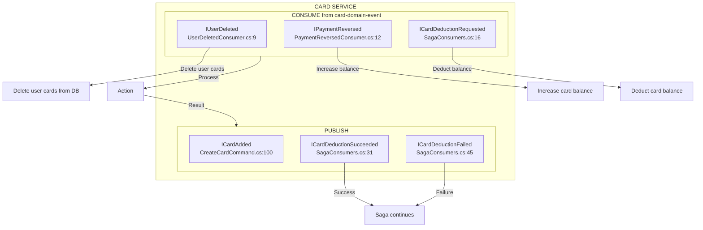
```mermaid
flowchart TB
    subgraph CARD["CARD SERVICE"]
        subgraph CON["CONSUME from card-domain-event"]
            C1["IUserDeleted<br/>UserDeletedConsumer.cs:9"]
            C2["IPaymentReversed<br/>PaymentReversedConsumer.cs:12"]
            C3["ICardDeductionRequested<br/>SagaConsumers.cs:16"]
        end
        
        subgraph PUB["PUBLISH"]
            P1["ICardAdded<br/>CreateCardCommand.cs:100"]
            P2["ICardDeductionSucceeded<br/>SagaConsumers.cs:31"]
            P3["ICardDeductionFailed<br/>SagaConsumers.cs:45"]
        end
    end
    
    CON -->|"Process"| ACTION["Action"]
    ACTION -->|"Result"| PUB
    
    C1 -->|"Delete user cards"| DEL["Delete user cards from DB"]
    C2 -->|"Increase balance"| INC["Increase card balance"]
    C3 -->|"Deduct balance"| DED["Deduct card balance"]
    
    P2 -->|"Success"| SAGA["Saga continues"]
    P3 -->|"Failure"| SAGA
```

### Event Flow Diagram:
```
card-domain-event queue
        │
        ├──► UserDeletedConsumer ──► Delete user cards
        │
        ├──► PaymentReversedConsumer ──► Increase card balance
        │
        └──► CardDeductionSagaConsumer ──► Deduct card balance
                                                    │
                                                    ▼
                                          ICardDeductionSucceeded
                                          ICardDeductionFailed
```

---

## 4.3 Billing Service
**Queue:** `billing-domain-event`
**Database:** `credvault_billing`

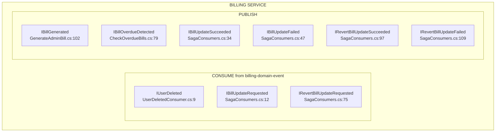
```mermaid
flowchart TB
    subgraph BILL["BILLING SERVICE"]
        subgraph CON["CONSUME from billing-domain-event"]
            C1["IUserDeleted<br/>UserDeletedConsumer.cs:9"]
            C2["IBillUpdateRequested<br/>SagaConsumers.cs:12"]
            C3["IRevertBillUpdateRequested<br/>SagaConsumers.cs:75"]
        end
        
        subgraph PUB["PUBLISH"]
            P1["IBillGenerated<br/>GenerateAdminBill.cs:102"]
            P2["IBillOverdueDetected<br/>CheckOverdueBills.cs:79"]
            P3["IBillUpdateSucceeded<br/>SagaConsumers.cs:34"]
            P4["IBillUpdateFailed<br/>SagaConsumers.cs:47"]
            P5["IRevertBillUpdateSucceeded<br/>SagaConsumers.cs:97"]
            P6["IRevertBillUpdateFailed<br/>SagaConsumers.cs:109"]
        end
    end
```

### Saga Consumer Logic:

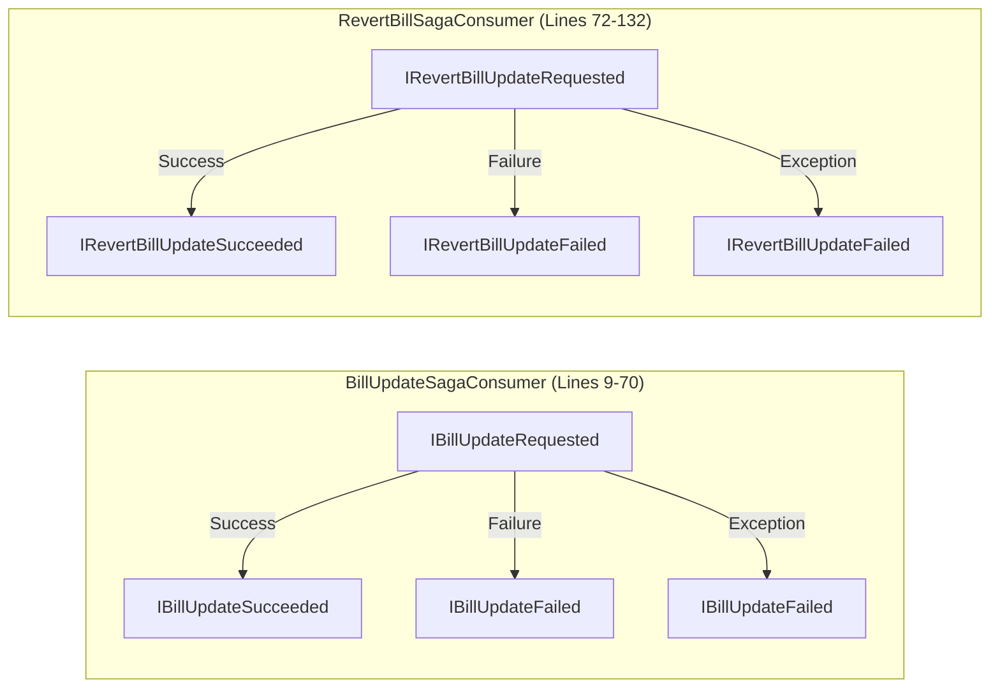
```mermaid
flowchart LR
    subgraph CONSUMER1["BillUpdateSagaConsumer (Lines 9-70)"]
        A["IBillUpdateRequested"] -->|Success| B["IBillUpdateSucceeded"]
        A -->|Failure| C["IBillUpdateFailed"]
        A -->|Exception| D["IBillUpdateFailed"]
    end
    
    subgraph CONSUMER2["RevertBillSagaConsumer (Lines 72-132)"]
        E["IRevertBillUpdateRequested"] -->|Success| F["IRevertBillUpdateSucceeded"]
        E -->|Failure| G["IRevertBillUpdateFailed"]
        E -->|Exception| H["IRevertBillUpdateFailed"]
    end
```

---

## 4.4 Payment Service
**Queues:** `payment-orchestration`, `payment-process`, `payment-domain-event`
**Database:** `credvault_payments`

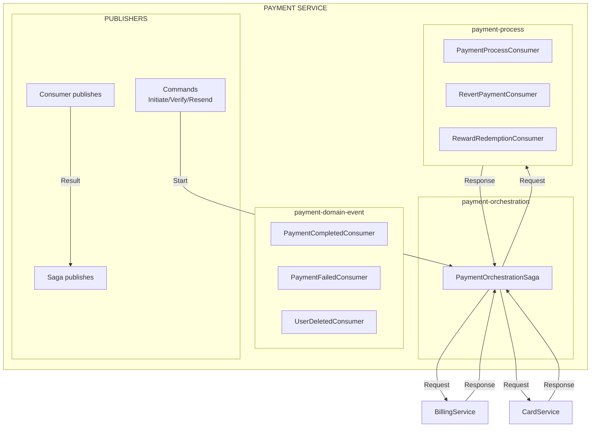
```mermaid
flowchart TB
    subgraph PAY["PAYMENT SERVICE"]
        subgraph Q1["payment-orchestration"]
            SAGA["PaymentOrchestrationSaga"]
        end
        
        subgraph Q2["payment-process"]
            PPC["PaymentProcessConsumer"]
            RPC["RevertPaymentConsumer"]
            RRC["RewardRedemptionConsumer"]
        end
        
        subgraph Q3["payment-domain-event"]
            PCC["PaymentCompletedConsumer"]
            PFC["PaymentFailedConsumer"]
            UDC["UserDeletedConsumer"]
        end
        
        subgraph PUB["PUBLISHERS"]
            CMD["Commands<br/>Initiate/Verify/Resend"]
            SAGAPUB["Saga publishes"]
            CONPUB["Consumer publishes"]
        end
    end
    
    CMD -->|"Start"| SAGA
    SAGA -->|"Request"| Q2
    SAGA -->|"Request"| BILL["BillingService"]
    SAGA -->|"Request"| CARD["CardService"]
    Q2 -->|"Response"| SAGA
    BILL -->|"Response"| SAGA
    CARD -->|"Response"| SAGA
    CONPUB -->|"Result"| SAGAPUB
```

### Key Publishers:

| Event | Source | Line |
|-------|--------|------|
| `IStartPaymentOrchestration` | InitiatePaymentCommand | 150 |
| `IPaymentOtpGenerated` | InitiatePaymentCommand | 166 |
| `IOtpVerified` | VerifyOtpCommand | 89 |
| `IOtpFailed` | VerifyOtpCommand | 56, 70 |
| `IPaymentCompleted` | Saga | 253 |
| `IPaymentFailed` | Saga | 105, 142, 311, 344, 363 |
| `IPaymentProcessRequested` | Saga | 90 |
| `IBillUpdateRequested` | Saga | 125 |
| `ICardDeductionRequested` | Saga | 175, 216 |
| `IRewardRedemptionRequested` | Saga | 163 |
| `IRevertPaymentRequested` | Saga | 193, 233, 292, 376 |
| `IRevertBillUpdateRequested` | Saga | 274, 324 |
| `IPaymentReversed` | RevertPaymentConsumer | 71 |

---

## 4.5 Notification Service
**Queue:** `notification-domain-event`
**Database:** `credvault_notifications`

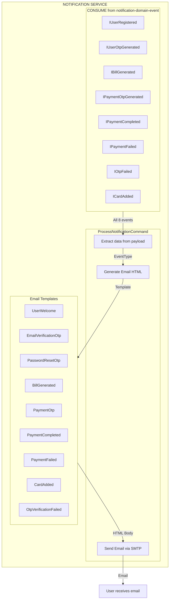
```mermaid
flowchart TB
    subgraph NOTIF["NOTIFICATION SERVICE"]
        subgraph CON["CONSUME from notification-domain-event"]
            C1["IUserRegistered"]
            C2["IUserOtpGenerated"]
            C3["IBillGenerated"]
            C4["IPaymentOtpGenerated"]
            C5["IPaymentCompleted"]
            C6["IPaymentFailed"]
            C7["IOtpFailed"]
            C8["ICardAdded"]
        end
        
        subgraph ACTION["ProcessNotificationCommand"]
            TRIG["Extract data from payload"]
            GEN["Generate Email HTML"]
            SEND["Send Email via SMTP"]
        end
        
        subgraph EMAIL["Email Templates"]
            T1["UserWelcome"]
            T2["EmailVerificationOtp"]
            T3["PasswordResetOtp"]
            T4["BillGenerated"]
            T5["PaymentOtp"]
            T6["PaymentCompleted"]
            T7["PaymentFailed"]
            T8["CardAdded"]
            T9["OtpVerificationFailed"]
        end
    end
    
    CON -->|"All 8 events"| TRIG
    TRIG -->|"EventType"| GEN
    GEN -->|"Template"| EMAIL
    EMAIL -->|"HTML Body"| SEND
    SEND -->|"Email"| USER["User receives email"]
```

### Single Consumer Pattern

The Notification Service uses a **single consumer class** that implements multiple event interfaces:

```csharp
public class DomainEventConsumer : 
    IConsumer<IUserRegistered>,           // Line 14
    IConsumer<IUserOtpGenerated>,        // Line 14
    IConsumer<IBillGenerated>,           // Line 15
    IConsumer<IPaymentOtpGenerated>,     // Line 15
    IConsumer<IPaymentCompleted>,         // Line 15
    IConsumer<IPaymentFailed>,            // Line 16
    IConsumer<IOtpFailed>,               // Line 16
    IConsumer<ICardAdded>                // Line 16
```

| Event | Line | Email Template |
|-------|------|---------------|
| `IUserRegistered` | 18 | UserWelcome |
| `IUserOtpGenerated` | 25 | EmailVerificationOtp / PasswordResetOtp |
| `IBillGenerated` | 32 | BillGenerated |
| `IPaymentOtpGenerated` | 39 | PaymentOtp |
| `IPaymentCompleted` | 46 | PaymentCompleted |
| `IPaymentFailed` | 53 | PaymentFailed |
| `IOtpFailed` | 60 | OtpVerificationFailed |
| `ICardAdded` | 68 | CardAdded |

---

# 5. Queue Architecture

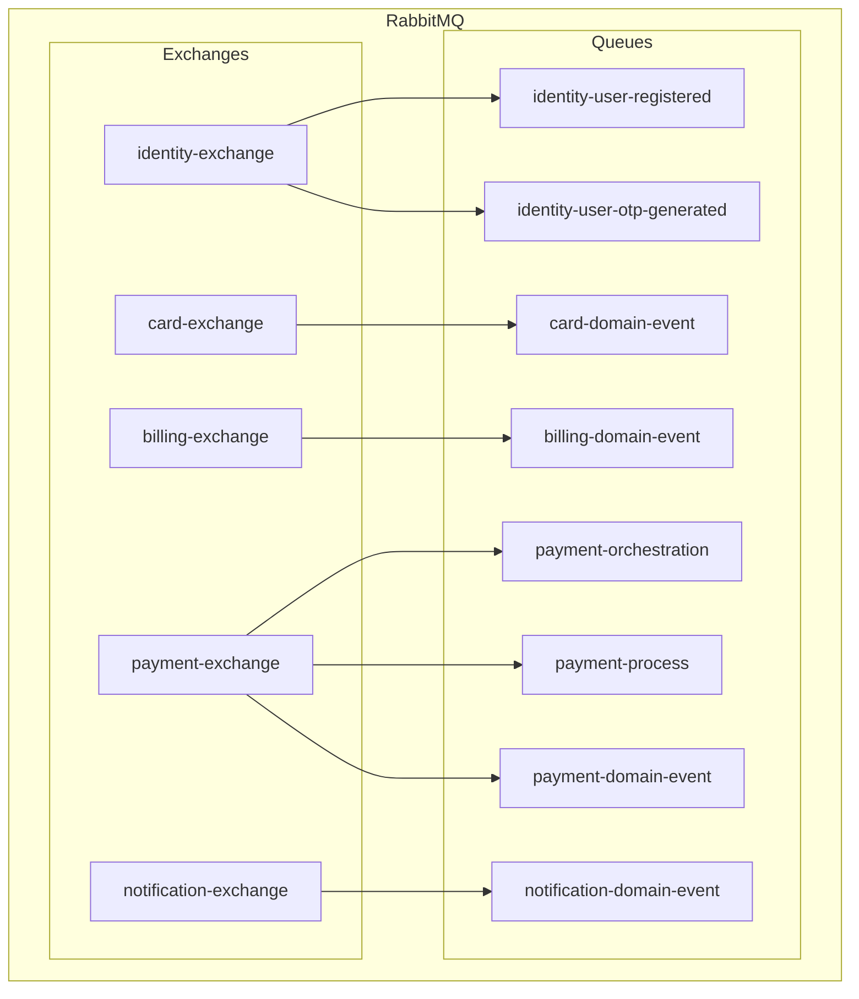
```mermaid
flowchart TB
    subgraph RMQ["RabbitMQ"]
        subgraph EX["Exchanges"]
            E1["identity-exchange"]
            E2["card-exchange"]
            E3["billing-exchange"]
            E4["payment-exchange"]
            E5["notification-exchange"]
        end
        
        subgraph QUEUES["Queues"]
            Q1["identity-user-registered"]
            Q2["identity-user-otp-generated"]
            Q3["card-domain-event"]
            Q4["billing-domain-event"]
            Q5["payment-orchestration"]
            Q6["payment-process"]
            Q7["payment-domain-event"]
            Q8["notification-domain-event"]
        end
    end
    
    E1 --> Q1
    E1 --> Q2
    E2 --> Q3
    E3 --> Q4
    E4 --> Q5
    E4 --> Q6
    E4 --> Q7
    E5 --> Q8
```

## Queue Assignment Table

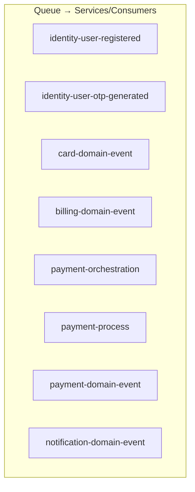
```mermaid
graph TB
    subgraph TABLE["Queue → Services/Consumers"]
        Q1["identity-user-registered"]
        Q2["identity-user-otp-generated"]
        Q3["card-domain-event"]
        Q4["billing-domain-event"]
        Q5["payment-orchestration"]
        Q6["payment-process"]
        Q7["payment-domain-event"]
        Q8["notification-domain-event"]
    end
```

| Queue Name | Type | Services/Consumers |
|------------|------|---------------------|
| `identity-user-registered` | Publisher Only | IdentityService publishes |
| `identity-user-otp-generated` | Publisher Only | IdentityService publishes |
| `card-domain-event` | Consumer | CardService: UserDeletedConsumer, PaymentReversedConsumer, CardDeductionSagaConsumer |
| `billing-domain-event` | Consumer | BillingService: UserDeletedConsumer, BillUpdateSagaConsumer, RevertBillSagaConsumer |
| `payment-orchestration` | Consumer | PaymentOrchestrationSaga |
| `payment-process` | Consumer | PaymentService: PaymentProcessConsumer, RevertPaymentConsumer, RewardRedemptionConsumer |
| `payment-domain-event` | Consumer | PaymentService: PaymentCompletedConsumer, PaymentFailedConsumer, UserDeletedConsumer |
| `notification-domain-event` | Consumer | NotificationService: DomainEventConsumer (all 8 events) |

---

# 6. Complete Event Flow Matrix

## Who Publishes → Who Consumes

| Event | PUBLISHER | Line | CONSUMERS | Queue |
|-------|-----------|------|-----------|-------|
| **Identity** |
| `IUserRegistered` | IdentityService | 74 | NotificationService | notification-domain-event |
| `IUserOtpGenerated` | IdentityService | 71,59,53 | NotificationService | notification-domain-event |
| `IUserDeleted` | **NONE** ❌ | - | Billing/Card/Payment | various |
| **Card** |
| `ICardAdded` | CardService | 100 | NotificationService | notification-domain-event |
| **Billing** |
| `IBillGenerated` | BillingService | 102 | NotificationService | notification-domain-event |
| `IBillOverdueDetected` | BillingService | 79 | **NONE** 🟡 | - |
| **Payment** |
| `IPaymentCompleted` | PaymentService | 253 | NotificationService + PaymentService | both queues |
| `IPaymentFailed` | PaymentService | 105+ | NotificationService + PaymentService | both queues |
| `IPaymentReversed` | PaymentService | 71 | CardService | card-domain-event |
| `IPaymentOtpGenerated` | PaymentService | 166,56 | NotificationService | notification-domain-event |
| **Saga** |
| `IStartPaymentOrchestration` | PaymentService | 150 | Saga | payment-orchestration |
| `IOtpVerified` | PaymentService | 89 | Saga | payment-orchestration |
| `IOtpFailed` | PaymentService | 56,70,337 | Notification + Saga | both queues |
| `IPaymentProcessRequested` | Saga | 90 | PaymentService | payment-process |
| `IPaymentProcessSucceeded` | PaymentService | 43,59 | Saga | payment-orchestration |
| `IPaymentProcessFailed` | PaymentService | 30,70 | Saga | payment-orchestration |
| `IBillUpdateRequested` | Saga | 125 | BillingService | billing-domain-event |
| `IBillUpdateSucceeded` | BillingService | 34 | Saga | payment-orchestration |
| `IBillUpdateFailed` | BillingService | 47,61 | Saga | payment-orchestration |
| `ICardDeductionRequested` | Saga | 175,216 | CardService | card-domain-event |
| `ICardDeductionSucceeded` | CardService | 31 | Saga | payment-orchestration |
| `ICardDeductionFailed` | CardService | 45 | Saga | payment-orchestration |
| `IRevertBillUpdateRequested` | Saga | 274,324 | BillingService | billing-domain-event |
| `IRevertBillUpdateSucceeded` | BillingService | 97 | Saga | payment-orchestration |
| `IRevertBillUpdateFailed` | BillingService | 109,123 | Saga | payment-orchestration |
| `IRevertPaymentRequested` | Saga | 193+ | PaymentService | payment-process |
| `IRevertPaymentSucceeded` | PaymentService | 44,84 | Saga | payment-orchestration |
| `IRevertPaymentFailed` | PaymentService | 31,95 | Saga | payment-orchestration |
| `IRewardRedemptionRequested` | Saga | 163 | PaymentService | payment-process |
| `IRewardRedemptionSucceeded` | PaymentService | 28,85 | Saga | payment-orchestration |
| `IRewardRedemptionFailed` | PaymentService | 61,98 | Saga | payment-orchestration |

---

# 7. Event Publishing Reference

## By Service - Complete List

### Identity Service Publishers

| Event | Handler | Line | Trigger |
|-------|---------|------|---------|
| `IUserOtpGenerated` | RegisterCommandHandler | 71 | User registration |
| `IUserRegistered` | RegisterCommandHandler | 74 | User registration |
| `IUserOtpGenerated` | ResendVerificationCommandHandler | 59 | Resend verification |
| `IUserOtpGenerated` | ForgotPasswordCommandHandler | 53 | Password reset |

### Card Service Publishers

| Event | Handler | Line | Trigger |
|-------|---------|------|---------|
| `ICardAdded` | CreateCardCommandHandler | 100 | New card created |
| `ICardDeductionSucceeded` | CardDeductionSagaConsumer | 31, 82 | Card deduction success |
| `ICardDeductionFailed` | CardDeductionSagaConsumer | 45, 95 | Card deduction failure |

### Billing Service Publishers

| Event | Handler | Line | Trigger |
|-------|---------|------|---------|
| `IBillGenerated` | GenerateAdminBillCommandHandler | 102 | Bill generation |
| `IBillOverdueDetected` | CheckOverdueBillsCommandHandler | 79 | Overdue check |
| `IBillUpdateSucceeded` | BillUpdateSagaConsumer | 34 | Bill paid |
| `IBillUpdateFailed` | BillUpdateSagaConsumer | 47, 61 | Bill payment failed |
| `IRevertBillUpdateSucceeded` | RevertBillSagaConsumer | 97 | Bill revert |
| `IRevertBillUpdateFailed` | RevertBillSagaConsumer | 109, 123 | Bill revert failed |

### Payment Service Publishers

| Event | Handler | Line | Trigger |
|-------|---------|------|---------|
| `IStartPaymentOrchestration` | InitiatePaymentCommandHandler | 150 | Payment initiated |
| `IPaymentOtpGenerated` | InitiatePaymentCommandHandler | 166 | OTP generated |
| `IPaymentOtpGenerated` | ResendOtpCommandHandler | 56 | OTP resent |
| `IOtpVerified` | VerifyOtpCommandHandler | 89 | OTP verified |
| `IOtpFailed` | VerifyOtpCommandHandler | 56, 70 | OTP verification failed |
| `IOtpFailed` | InitiatePaymentCommandHandler | 337 | OTP generation failed |
| `IPaymentCompleted` | PaymentOrchestrationSaga | 253 | Payment complete |
| `IPaymentFailed` | PaymentOrchestrationSaga | 105, 142, 311, 344, 363 | Payment failed |
| `IPaymentProcessRequested` | PaymentOrchestrationSaga | 90 | Request payment processing |
| `IPaymentProcessSucceeded` | PaymentProcessConsumer | 43, 59 | Payment processed |
| `IPaymentProcessFailed` | PaymentProcessConsumer | 30, 70 | Payment processing failed |
| `IBillUpdateRequested` | PaymentOrchestrationSaga | 125 | Request bill update |
| `ICardDeductionRequested` | PaymentOrchestrationSaga | 175, 216 | Request card deduction |
| `IRewardRedemptionRequested` | PaymentOrchestrationSaga | 163 | Request reward redemption |
| `IRewardRedemptionSucceeded` | RewardRedemptionConsumer | 28, 85 | Reward redemption success |
| `IRewardRedemptionFailed` | RewardRedemptionConsumer | 61, 98 | Reward redemption failed |
| `IRevertPaymentRequested` | PaymentOrchestrationSaga | 193, 233, 292, 376 | Compensation triggered |
| `IRevertPaymentSucceeded` | RevertPaymentConsumer | 44, 84 | Compensation success |
| `IRevertPaymentFailed` | RevertPaymentConsumer | 31, 95 | Compensation failed |
| `IRevertBillUpdateRequested` | PaymentOrchestrationSaga | 274, 324 | Request bill revert |
| `IPaymentReversed` | RevertPaymentConsumer | 71 | Payment reversed |

---

# 8. Event Consumption Reference

## By Queue - Complete List

### `card-domain-event`

| Event | Consumer | Line | Action |
|-------|----------|------|--------|
| `IUserDeleted` | UserDeletedConsumer | 11 | Delete user cards |
| `IPaymentReversed` | PaymentReversedConsumer | 14 | Increase card balance |
| `ICardDeductionRequested` | CardDeductionSagaConsumer | 18 | Deduct card balance |

### `billing-domain-event`

| Event | Consumer | Line | Action |
|-------|----------|------|--------|
| `IUserDeleted` | UserDeletedConsumer | 9 | Delete user bills |
| `IBillUpdateRequested` | BillUpdateSagaConsumer | 14 | Mark bill as paid |
| `IRevertBillUpdateRequested` | RevertBillSagaConsumer | 77 | Revert bill payment |

### `payment-process`

| Event | Consumer | Line | Action |
|-------|----------|------|--------|
| `IPaymentProcessRequested` | PaymentProcessConsumer | 14 | Process payment |
| `IRevertPaymentRequested` | RevertPaymentConsumer | 15 | Process compensation |
| `IRewardRedemptionRequested` | RewardRedemptionConsumer | 12 | Redeem rewards |

### `payment-domain-event`

| Event | Consumer | Line | Action |
|-------|----------|------|--------|
| `IPaymentCompleted` | PaymentCompletedConsumer | 11 | Log completion |
| `IPaymentFailed` | PaymentFailedConsumer | 55 | Log failure |
| `IUserDeleted` | UserDeletedConsumer | 9 | Delete user payments |

### `notification-domain-event`

| Event | Consumer | Line | Email Template |
|-------|----------|------|---------------|
| `IUserRegistered` | DomainEventConsumer | 18 | UserWelcome |
| `IUserOtpGenerated` | DomainEventConsumer | 25 | EmailVerificationOtp |
| `IBillGenerated` | DomainEventConsumer | 32 | BillGenerated |
| `IPaymentOtpGenerated` | DomainEventConsumer | 39 | PaymentOtp |
| `IPaymentCompleted` | DomainEventConsumer | 46 | PaymentCompleted |
| `IPaymentFailed` | DomainEventConsumer | 53 | PaymentFailed |
| `IOtpFailed` | DomainEventConsumer | 60 | OtpVerificationFailed |
| `ICardAdded` | DomainEventConsumer | 68 | CardAdded |

---

# 9. Saga State Machine

## States

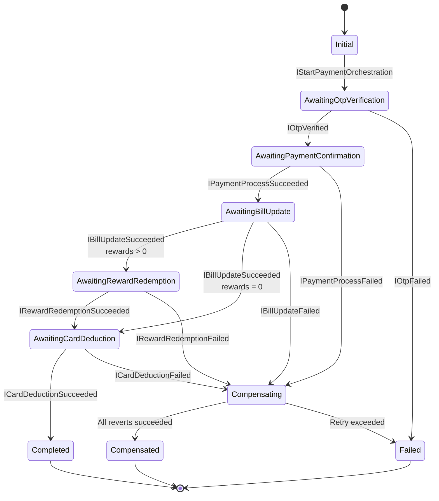
```mermaid
stateDiagram-v2
    [*] --> Initial
    Initial --> AwaitingOtpVerification: IStartPaymentOrchestration
    
    AwaitingOtpVerification --> AwaitingPaymentConfirmation: IOtpVerified
    AwaitingOtpVerification --> Failed: IOtpFailed
    
    AwaitingPaymentConfirmation --> AwaitingBillUpdate: IPaymentProcessSucceeded
    AwaitingPaymentConfirmation --> Compensating: IPaymentProcessFailed
    
    AwaitingBillUpdate --> AwaitingRewardRedemption: IBillUpdateSucceeded<br/>rewards > 0
    AwaitingBillUpdate --> AwaitingCardDeduction: IBillUpdateSucceeded<br/>rewards = 0
    AwaitingBillUpdate --> Compensating: IBillUpdateFailed
    
    AwaitingRewardRedemption --> AwaitingCardDeduction: IRewardRedemptionSucceeded
    AwaitingRewardRedemption --> Compensating: IRewardRedemptionFailed
    
    AwaitingCardDeduction --> Completed: ICardDeductionSucceeded
    AwaitingCardDeduction --> Compensating: ICardDeductionFailed
    
    Compensating --> Compensated: All reverts succeeded
    Compensating --> Failed: Retry exceeded
    
    Completed --> [*]
    Compensated --> [*]
    Failed --> [*]
```

## Happy Path Flow

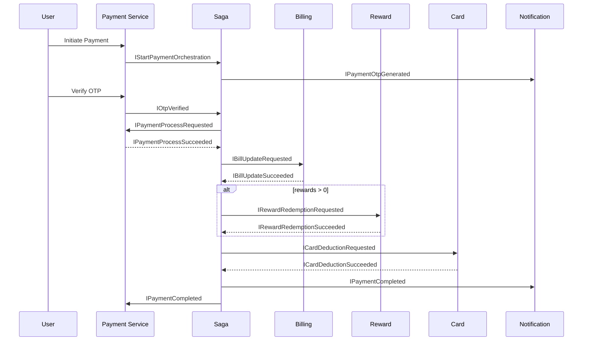
```mermaid
sequenceDiagram
    participant User
    participant Payment as Payment Service
    participant Saga
    participant Billing
    participant Reward
    participant Card
    participant Notif as Notification
    
    User->>Payment: Initiate Payment
    Payment->>Saga: IStartPaymentOrchestration
    Saga->>Notif: IPaymentOtpGenerated
    
    User->>Payment: Verify OTP
    Payment->>Saga: IOtpVerified
    
    Saga->>Payment: IPaymentProcessRequested
    Payment-->>Saga: IPaymentProcessSucceeded
    
    Saga->>Billing: IBillUpdateRequested
    Billing-->>Saga: IBillUpdateSucceeded
    
    alt rewards > 0
        Saga->>Reward: IRewardRedemptionRequested
        Reward-->>Saga: IRewardRedemptionSucceeded
    end
    
    Saga->>Card: ICardDeductionRequested
    Card-->>Saga: ICardDeductionSucceeded
    
    Saga->>Notif: IPaymentCompleted
    Saga->>Payment: IPaymentCompleted
```

---

# 10. Visual Architecture

## Complete Event Flow

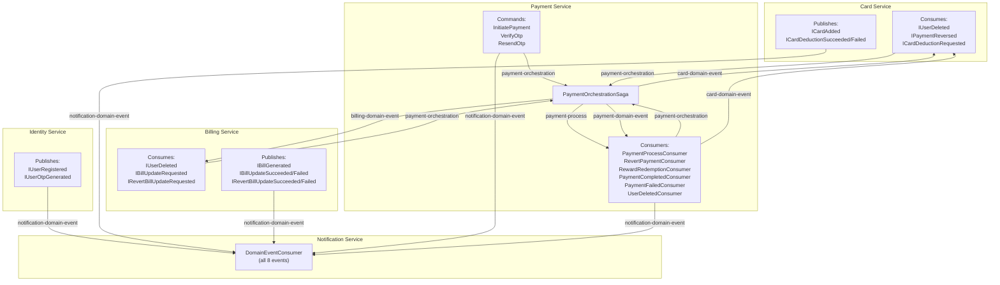
```mermaid
flowchart TB
    subgraph ID["Identity Service"]
        ID_PUB["Publishes:<br/>IUserRegistered<br/>IUserOtpGenerated"]
    end
    
    subgraph CARD["Card Service"]
        CARD_CON["Consumes:<br/>IUserDeleted<br/>IPaymentReversed<br/>ICardDeductionRequested"]
        CARD_PUB["Publishes:<br/>ICardAdded<br/>ICardDeductionSucceeded/Failed"]
    end
    
    subgraph BILL["Billing Service"]
        BILL_CON["Consumes:<br/>IUserDeleted<br/>IBillUpdateRequested<br/>IRevertBillUpdateRequested"]
        BILL_PUB["Publishes:<br/>IBillGenerated<br/>IBillUpdateSucceeded/Failed<br/>IRevertBillUpdateSucceeded/Failed"]
    end
    
    subgraph PAY["Payment Service"]
        PAY_CMD["Commands:<br/>InitiatePayment<br/>VerifyOtp<br/>ResendOtp"]
        PAY_SAGA["PaymentOrchestrationSaga"]
        PAY_CON["Consumers:<br/>PaymentProcessConsumer<br/>RevertPaymentConsumer<br/>RewardRedemptionConsumer<br/>PaymentCompletedConsumer<br/>PaymentFailedConsumer<br/>UserDeletedConsumer"]
    end
    
    subgraph NOTIF["Notification Service"]
        NOTIF_CON["DomainEventConsumer<br/>(all 8 events)"]
    end
    
    %% Publishing flows to Notification
    ID_PUB -->|"notification-domain-event"| NOTIF_CON
    CARD_PUB -->|"notification-domain-event"| NOTIF_CON
    BILL_PUB -->|"notification-domain-event"| NOTIF_CON
    PAY_CMD -->|"notification-domain-event"| NOTIF_CON
    
    %% Saga orchestration
    PAY_CMD -->|"payment-orchestration"| PAY_SAGA
    PAY_SAGA -->|"billing-domain-event"| BILL_CON
    PAY_SAGA -->|"card-domain-event"| CARD_CON
    PAY_SAGA -->|"payment-process"| PAY_CON
    
    %% Response back to Saga
    BILL_CON -->|"payment-orchestration"| PAY_SAGA
    CARD_CON -->|"payment-orchestration"| PAY_SAGA
    PAY_CON -->|"payment-orchestration"| PAY_SAGA
    
    %% PaymentReversed to Card
    PAY_CON -->|"card-domain-event"| CARD_CON
    
    %% Payment completed/failed to Notification
    PAY_SAGA -->|"payment-domain-event"| PAY_CON
    PAY_CON -->|"notification-domain-event"| NOTIF_CON
```

---

# 11. Known Issues

## Issue #1: `IUserDeleted` - NEVER PUBLISHED ❌

### What SHOULD happen:

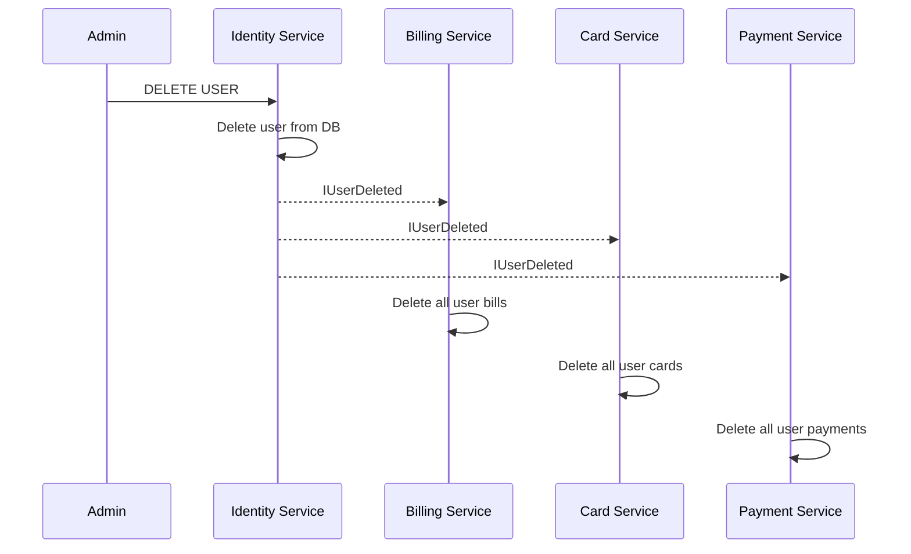
```mermaid
sequenceDiagram
    participant Admin
    participant Identity as Identity Service
    participant Billing as Billing Service
    participant Card as Card Service
    participant Payment as Payment Service
    
    Admin->>Identity: DELETE USER
    Identity->>Identity: Delete user from DB
    Identity-->>Billing: IUserDeleted
    Identity-->>Card: IUserDeleted
    Identity-->>Payment: IUserDeleted
    
    Billing->>Billing: Delete all user bills
    Card->>Card: Delete all user cards
    Payment->>Payment: Delete all user payments
```

### What ACTUALLY happens:

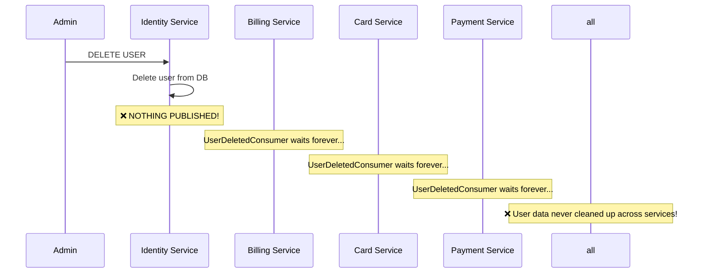
```mermaid
sequenceDiagram
    participant Admin
    participant Identity as Identity Service
    participant Billing as Billing Service
    participant Card as Card Service
    participant Payment as Payment Service
    
    Admin->>Identity: DELETE USER
    Identity->>Identity: Delete user from DB
    Note over Identity: ❌ NOTHING PUBLISHED!
    
    Note over Billing: UserDeletedConsumer waits forever...
    Note over Card: UserDeletedConsumer waits forever...
    Note over Payment: UserDeletedConsumer waits forever...
    
    Note over all: ❌ User data never cleaned up across services!
```

### Why This Happens

**Root Cause:** There's NO DELETE endpoint or command in IdentityService that publishes `IUserDeleted`.

**Missing Implementation:**
- No `DELETE /api/users/{id}` endpoint
- No `DeleteUserCommand` handler
- No `Publish<IUserDeleted>()` call

### Impact

| Service | Consumer | Impact |
|---------|----------|--------|
| Billing | UserDeletedConsumer | Orphaned bills remain in DB |
| Card | UserDeletedConsumer | Orphaned cards remain in DB |
| Payment | UserDeletedConsumer | Orphaned payments remain in DB |

---

## Issue #2: `IBillOverdueDetected` - NEVER CONSUMED 🟡

### What COULD happen (if implemented):

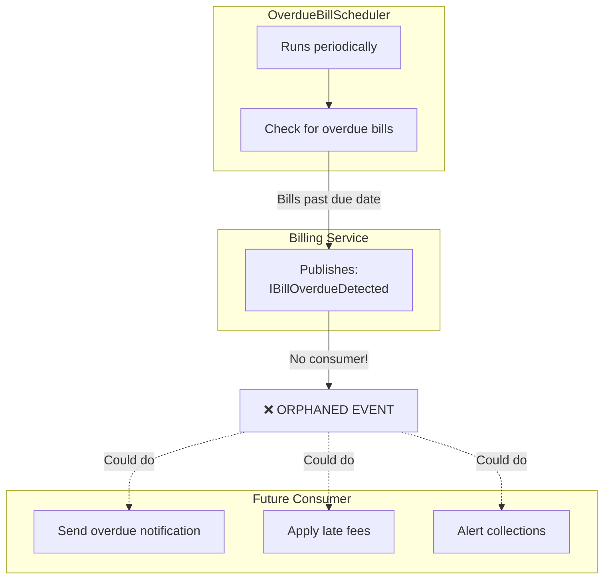
```mermaid
flowchart TB
    subgraph SCHEDULER["OverdueBillScheduler"]
        RUN["Runs periodically"]
        CHECK["Check for overdue bills"]
    end
    
    subgraph BILL["Billing Service"]
        PUB["Publishes:<br/>IBillOverdueDetected"]
    end
    
    subgraph FUTURE["Future Consumer"]
        OPT1["Send overdue notification"]
        OPT2["Apply late fees"]
        OPT3["Alert collections"]
    end
    
    RUN --> CHECK
    CHECK -->|"Bills past due date"| PUB
    PUB -->|"No consumer!"| VOID["❌ ORPHANED EVENT"]
    
    VOID -.->|"Could do"| OPT1
    VOID -.->|"Could do"| OPT2
    VOID -.->|"Could do"| OPT3
```

### Why This Happens

**Root Cause:** The event IS published by `CheckOverdueBillsCommandHandler`, but NO consumer was implemented.

### Potential Uses (Not Implemented)

- Send overdue notification email
- Apply penalty/late fees
- Alert collections system
- Update credit score

---

## Summary - What's Working vs Not

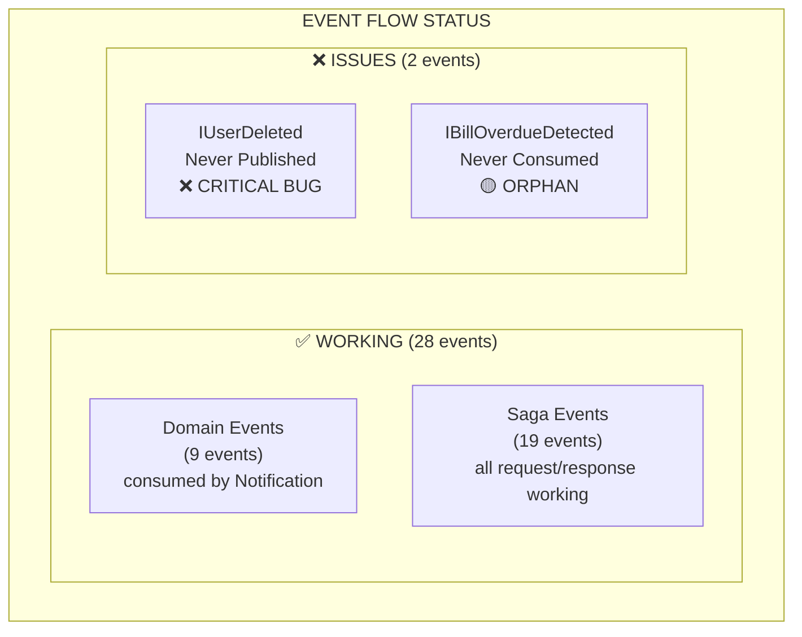
```mermaid
flowchart TB
    subgraph STATUS["EVENT FLOW STATUS"]
        subgraph WORKING["✅ WORKING (28 events)"]
            W1["Domain Events<br/>(9 events)<br/>consumed by Notification"]
            W2["Saga Events<br/>(19 events)<br/>all request/response working"]
        end
        
        subgraph BUGS["❌ ISSUES (2 events)"]
            B1["IUserDeleted<br/>Never Published<br/>❌ CRITICAL BUG"]
            B2["IBillOverdueDetected<br/>Never Consumed<br/>🟡 ORPHAN"]
        end
    end
```

| Status | Count | Events |
|--------|-------|--------|
| **Fully Working** | 28 | All except below |
| **Missing Publisher** ❌ | 1 | `IUserDeleted` |
| **Orphan Event** 🟡 | 1 | `IBillOverdueDetected` |

---

# Quick Reference: File Locations

## Event Definitions
```
shared.contracts/Shared.Contracts/Events/
├── Identity/IdentityEvents.cs          (3 events)
├── Card/CardEvents.cs                 (1 event)
├── Billing/BillingEvents.cs           (2 events)
├── Payment/PaymentEvents.cs          (4 events)
└── Saga/SagaOrchestrationEvents.cs   (22 events)
```

## Consumer Locations

| Service | File | Key Lines |
|---------|------|-----------|
| **Card** | `SagaConsumers.cs` | 16, 18, 31, 45, 82, 95 |
| **Card** | `UserDeletedConsumer.cs` | 9, 11 |
| **Card** | `PaymentReversedConsumer.cs` | 12, 14 |
| **Billing** | `SagaConsumers.cs` | 12, 14, 34, 47, 61, 75, 77, 97, 109, 123 |
| **Billing** | `UserDeletedConsumer.cs` | 9 |
| **Payment** | `PaymentOrchestrationSaga.cs` | All saga events |
| **Payment** | `PaymentProcessConsumer.cs` | 14, 30, 43, 70 |
| **Payment** | `RevertPaymentConsumer.cs` | 15, 31, 44, 71, 84, 95 |
| **Payment** | `RewardRedemptionConsumer.cs` | 12, 28, 61, 85, 98 |
| **Payment** | `PaymentConsumers.cs` | 11, 55 |
| **Notification** | `DomainEventConsumer.cs` | 14-68 (8 events) |

---

# Why So Many Publishing Events?

## Understanding the Architecture

### 1. Domain Events - For Notifications

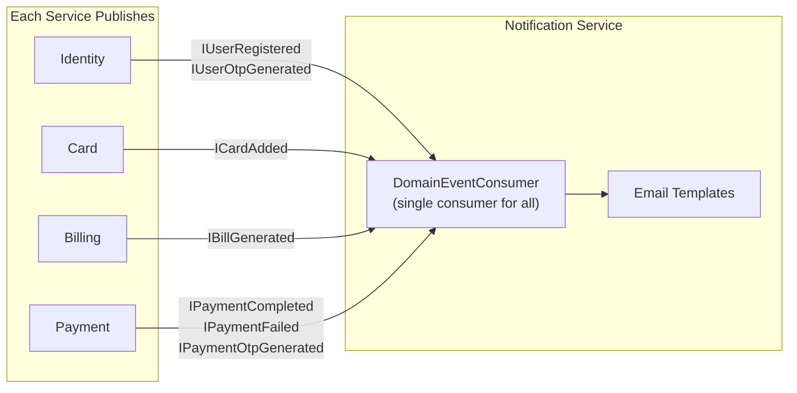
```mermaid
flowchart LR
    subgraph DOMAIN["Each Service Publishes"]
        I["Identity"]
        C["Card"]
        B["Billing"]
        P["Payment"]
    end
    
    subgraph NOTIF["Notification Service"]
        CONS["DomainEventConsumer<br/>(single consumer for all)"]
        EMAIL["Email Templates"]
    end
    
    I -->|"IUserRegistered<br/>IUserOtpGenerated"| CONS
    C -->|"ICardAdded"| CONS
    B -->|"IBillGenerated"| CONS
    P -->|"IPaymentCompleted<br/>IPaymentFailed<br/>IPaymentOtpGenerated"| CONS
    
    CONS --> EMAIL
```

**Purpose:** Each service notifies when something happens → NotificationService sends emails.

### 2. Saga Events - For Distributed Transactions

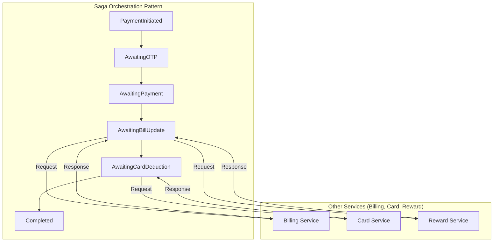
```mermaid
flowchart TB
    subgraph SAGA["Saga Orchestration Pattern"]
        START["PaymentInitiated"]
        S1["AwaitingOTP"]
        S2["AwaitingPayment"]
        S3["AwaitingBillUpdate"]
        S4["AwaitingCardDeduction"]
        END["Completed"]
    end
    
    subgraph SERVICES["Other Services (Billing, Card, Reward)"]
        B["Billing Service"]
        C["Card Service"]
        R["Reward Service"]
    end
    
    START --> S1
    S1 --> S2
    S2 --> S3
    
    S3 -->|"Request"| B
    B -->|"Response"| S3
    
    S3 -->|"Request"| R
    R -->|"Response"| S3
    
    S3 --> S4
    S4 -->|"Request"| C
    C -->|"Response"| S4
    
    S4 --> END
```

**Purpose:** Payment is a multi-step process involving multiple services. Saga coordinates the flow and handles failures.

### Key Difference

| Type | Purpose | Pattern | Consumer |
|------|---------|---------|----------|
| **Domain Events** | Notify when something happens | Publish → Subscribe | NotificationService only |
| **Saga Events** | Coordinate distributed workflows | Request → Response | Always consumed by Saga |

---

# Consumer Count by Event

| Event | Consumers | Notes |
|-------|-----------|-------|
| `IUserDeleted` | 3 | ⚠️ No publisher - BUG |
| `IOtpFailed` | 2 | Notification + Saga |
| `IPaymentCompleted` | 2 | Notification + Saga |
| `IPaymentFailed` | 2 | Notification + Saga |
| All others | 1 | Single consumer |

---

# Queue Event Count

| Queue | Events | Type |
|-------|--------|------|
| payment-orchestration | ~15 | Saga communication |
| payment-process | 3 | Consumer requests |
| payment-domain-event | 3 | Domain events |
| notification-domain-event | 8 | All notification events |
| billing-domain-event | 3 | Billing requests |
| card-domain-event | 3 | Card requests |
