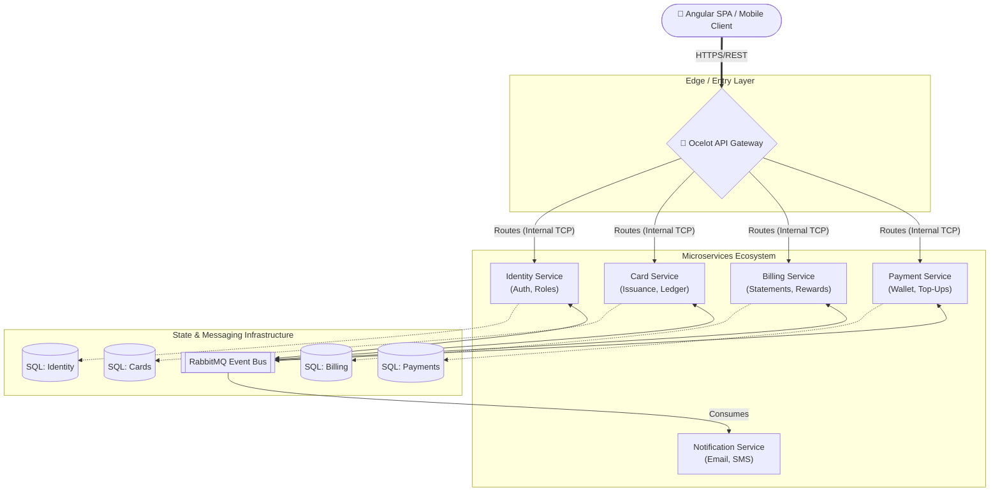
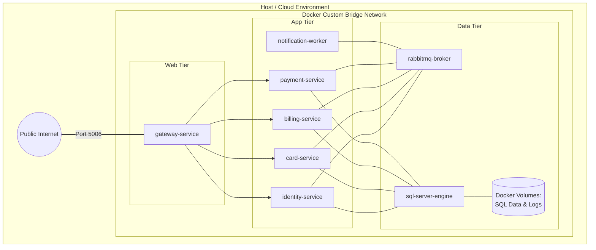

# High-Level Design (HLD) Specification

**System Name:** CredVault Credit Card Management Platform  
**Document Version:** 2.0 (Enterprise Grade)  
**Date:** 2026-04-15  
**Target Audience:** Engineering Leads, System Architects, DevOps, Product Managers  

---

## 1. Introduction

### 1.1 Purpose
The purpose of this High-Level Design (HLD) document is to provide a comprehensive architectural overview of the CredVault platform. It abstracts the underlying technical complexities into a structural blueprint, outlining system components, their interactions, data flows, and the foundational principles guiding the engineering lifecycle.

### 1.2 Scope
This document covers the macro-architecture of CredVault, including component modeling, inter-service communication paradigms, data architecture strategy, and deployment topologies. For precise database schemas, state machines, and class structures, refer to the **Low-Level Design (LLD)**.

---

## 2. Architectural Principles & Constraints

To ensure long-term maintainability and horizontal scalability, the architecture firmly adheres to the following principles:

* **Microservices Architecture:** The system is partitioned into autonomous Bounded Contexts aligned with business sub-domains (Identity, Cards, Billing, Payments).
* **Decentralized Data Management (Database-per-Service):** Each microservice exclusively owns its database. Cross-database queries are strictly prohibited; data aggregation is achieved via API composition or event-carried state transfer.
* **Event-Driven Communication:** Asynchronous communication via a robust message broker (RabbitMQ) to minimize temporal coupling and support high-throughput operations.
* **CQRS (Command Query Responsibility Segregation):** Mutation operations (Commands) are strictly separated from read operations (Queries) within service boundaries to optimize performance scaling.
* **API Gateway Pattern:** A unified entry point abstracts the internal network topology from external clients, handling cross-cutting concerns like routing and SSL termination.

---

## 3. Non-Functional Requirements (NFRs)

* **Availability:** Target 99.9% uptime. The failure of non-critical services (e.g., Notifications) must not hinder core payment processing.
* **Scalability:** Stateless microservices designed to scale horizontally behind a reverse proxy/load balancer.
* **Performance:** API Gateway response latencies should target < 200ms for standard queries (p95).
* **Security:** All endpoints protected via JSON Web Tokens (JWT). Internal traffic operates within a secure, isolated Docker bridge network.
* **Resilience:** Implementation of localized retries, distributed Saga compensations, and eventual consistency models for distributed state mutations.

---

## 4. Logical Architecture & Component Model

The logical architecture defines the core subsystems and their interconnectivity.

### 4.1 Component Descriptions

1.  **Angular SPA Client:** The user-facing application providing dashboards, payment interfaces, and card management via responsive WEB/UI.
2.  **Ocelot API Gateway:** Serves as the single ingress point. It maps public URL schemas (e.g., `/api/cards`) to internal upstream service IPs (e.g., `http://cards-service:80`).
3.  **Identity Service:** The source of truth for user profiles and authentication. Issues JWTs utilizing secure hashing mechanisms.
4.  **Card Service:** Manages credit card entities, masking algorithms, and card-specific transactional ledgers.
5.  **Billing Service:** Aggregates user spends into cyclic bills, generates statements, and calculates reward points.
6.  **Payment Service:** Orchestrates complex digital wallet top-ups and cross-service distributed bill payments (incorporating the Saga orchestrator).
7.  **Notification Service:** A background worker service entirely decoupled from the request-response cycle. It listens for domain events (`UserRegistered`, `PaymentFailed`) and dispatches emails.

---

## 5. Data Architecture Strategy

* **Polyglot & Segregated Persistence:** While currently utilizing SQL Server for relational consistency, the architecture allows swapping data stores (e.g., mapping MongoDB for Notifications) without impacting adjacent services.
* **Foreign Keys Over Microservices:** Physical foreign keys do not exist across domains. Services utilize immutable **Correlation IDs / User IDs (GUIDs)**. Example: The `Billing Service` records a `UserId` but does not JOIN with the `Identity DB`. It queries the Identity API if synchronous profile data is absolutely necessary, preferring replicated data via events.
* **Event Sourcing (Partial):** State transitions for critical financial elements (like Payments) are tracked via Saga State Logs to maintain a history of compensation attempts.

---

## 6. Communication & Integration Strategy

### 6.1 Synchronous Communication (REST/HTTP)
Reserved exclusively for:
1.  Client-to-Gateway interactions.
2.  Gateway-to-Microservice downstream routing.
*Constraint:* Microservice-to-Microservice synchronous HTTP calls are strictly avoided to prevent cascading timeouts (except in rare, non-mutating validation scenarios).

### 6.2 Asynchronous Communication (AMQP / RabbitMQ)
The backbone of the system's eventual consistency, utilized for:
1.  **Publish-Subscribe (Pub/Sub):** Broadcasting state changes. Example: Identity service publishes `UserCreatedIntegrationEvent`; Notification service consumes it to send a welcome email, Billing service consumes it to initialize a blank Reward Account.
2.  **Saga Orchestration:** Directed command-based messaging where the `Payment Orchestrator` sends specific commands to specific queues (e.g., `DeductWalletCommand` to the Payment Queue, `UpdateBillCommand` to the Billing Queue) and awaits structured Acknowledgment events.

---

## 7. Security Architecture

1.  **Edge Termination:** SSL/TLS is terminated at the Gateway/Load Balancer.
2.  **Token-Based Auth:** Stateless JWT authentication. The Gateway optionally parses token validity, but deep Authorization (Claims/Role checking) is executed locally within each microservice's ASP.NET middleware pipeline.
3.  **Network Isolation:** All backend components (APIs, SQL, RabbitMQ) reside in a private Docker virtual network (`credvault-network`). They expose zero public ports.
4.  **Secret Management:** Environment variables dictate runtime configuration (DB strings, JWT symmetric keys). No secrets are hardcoded.

---

## 8. Deployment & Infrastructure View

The target container orchestration utilizes Docker. The topology ensures environment parity across Development, Staging, and Production.

**Key Deployment Tenets:**
* **Immutability:** Docker images are compiled once and promoted across environments.
* **Persistent Storage:** SQL Server data mounts to persistent Docker Volumes mapped to the host filesystem, protecting against container ephemerality.
* **Service Discovery:** Native Docker DNS mapping allows services to resolve internal names (e.g., `rabbitmq://rabbitmq-broker:5672`).
