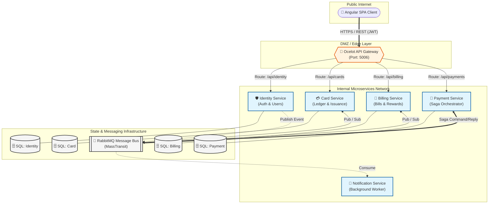

# High-Level Design (HLD) Specification: CredVault

**System Name:** CredVault Credit Card Management Platform  
**Document Version:** 3.0 (Enterprise Standard)  
**Status:** Final / Approved  
**Date:** 2026-05-20  

---

## 1. Introduction & Scope

### 1.1 Purpose
This High-Level Design (HLD) document serves as the authoritative architectural blueprint for the **CredVault** platform. It defines the system's macro-structure, component interactions, and the strategic design patterns employed to achieve enterprise-grade resilience and scalability.

### 1.2 Scope
The scope of this document encompasses:
*   **System Topology**: Edge-to-infrastructure connectivity.
*   **Architectural Paradigms**: Principles guiding service boundaries and state management.
*   **Component Modeling**: Detailed functional definitions of core microservices.
*   **Communication Strategy**: Synchronous vs. Asynchronous paradigms.
*   **Non-Functional Requirements (NFRs)**: Security, Scalability, and Availability targets.
*   **Infrastructure View**: Containerization and network isolation strategies.

---

## 2. Architectural Principles

CredVault is built upon a cloud-native, distributed architecture designed to mitigate single points of failure and allow for independent lifecycle management of business domains.

*   **Microservices Architecture**: The system is decomposed into autonomous, loosely coupled services aligned with business domains (Bounded Contexts).
*   **API Gateway Pattern**: A central ingress point (Ocelot) manages cross-cutting concerns, including request routing, authentication verification, and SSL termination.
*   **Event-Driven Architecture (EDA)**: Primary inter-service communication is asynchronous via a message broker (RabbitMQ), ensuring temporal decoupling and high system throughput.
*   **Database-per-Service**: Each microservice maintains its own private data store. Data consistency across services is achieved via **Eventual Consistency** and distributed Sagas.
*   **CQRS (Command Query Responsibility Segregation)**: Read and write operations are separated at the implementation level using MediatR, allowing for asymmetrical scaling of data paths.

---

## 3. System Components

### 3.1 Edge Layer
*   **Angular Client**: A modern SPA providing the user interface for card management, bill payments, and profile settings.
*   **Ocelot API Gateway**: Acts as the single entry point for all client requests. It provides unified routing to internal microservices and shields the internal network topology.

### 3.2 Core Microservices
*   **Identity Service**: Manages user authentication, authorization (RBAC), and profile management. Issues JWTs and handles multi-factor authentication (OTP).
*   **Card Service**: Responsible for card issuance, cardholder details, and maintaining the card-level transaction ledger.
*   **Billing Service**: Handles cyclic bill generation, statement processing, and maintains the rewards point system.
*   **Payment Service**: Orchestrates the payment lifecycle. It functions as the **Saga Coordinator** for complex distributed transactions (e.g., paying a bill with rewards and a card).
*   **Notification Service**: An asynchronous background worker that consumes events from the message bus to dispatch Email and SMS notifications.

---

## 4. Macro-Architecture Diagram

The following diagram illustrates the high-fidelity system topology and the flow of information across layers.

---

## 5. Communication Strategy

CredVault employs a hybrid communication model to balance immediate consistency with system resilience.

### 5.1 Synchronous Communication (Edge Boundary)
*   **Protocol**: REST over HTTPS.
*   **Usage**: Client-to-Gateway and Gateway-to-Service requests.
*   **Rationale**: Used for operations where the client expects an immediate response (e.g., Login, Fetching Card Details).

### 5.2 Asynchronous Communication (Internal Core)
*   **Protocol**: AMQP via RabbitMQ (MassTransit).
*   **Patterns**: 
    *   **Pub/Sub**: Used for side effects (e.g., `UserRegistered` event triggers `WelcomeEmail`).
    *   **Request/Response**: Asynchronous commands used within Saga workflows.
*   **Rationale**: Decouples services, allowing the system to remain functional even if a specific service (like Notifications) is temporarily offline.

---

## 6. Non-Functional Requirements (NFRs)

*   **Scalability**: All microservices are stateless and containerized, supporting horizontal auto-scaling (Scale-out) based on CPU/Memory pressure.
*   **Availability**: Targeted at **99.9% (Three Nines)**. Critical paths (Identity/Payment) are isolated to ensure that a failure in the Rewards system does not prevent a user from logging in.
*   **Reliability**: Guaranteed through the implementation of the **Outbox Pattern** and **Retry Policies** (exponential backoff) provided by MassTransit.
*   **Security**:
    *   **Authentication**: Stateless JWT-based authentication.
    *   **Authorization**: Role-Based Access Control (RBAC) enforced at the service level.
    *   **Data Protection**: Encryption at rest for sensitive card data and TLS 1.2+ for all data in transit.

---

## 7. Infrastructure & Deployment View

### 7.1 Containerization
The entire CredVault stack is containerized using Docker, ensuring environment parity from developer machines to production clusters.

### 7.2 Network Isolation
*   **Public Zone**: Only the API Gateway and Angular Client are reachable via public-facing ports.
*   **Private Zone**: All microservices, SQL databases, and the RabbitMQ broker reside in an isolated Docker bridge network. They communicate via internal DNS and are unreachable from the public internet.

### 7.3 Persistence Strategy
*   **Storage**: Each service utilizes a dedicated SQL Server schema.
*   **Persistence**: Docker volumes are used to ensure data persists across container restarts and updates.

---

## 8. Summary of Technology Stack

| Layer | Technology |
|---|---|
| **Frontend** | Angular 17+, Tailwind CSS |
| **Gateway** | Ocelot API Gateway |
| **Backend** | .NET 8, ASP.NET Core Web API |
| **Messaging** | RabbitMQ, MassTransit |
| **Persistence** | Microsoft SQL Server, EF Core |
| **Patterns** | CQRS (MediatR), Saga (State Machine) |
| **Infrastructure** | Docker, Docker Compose |
