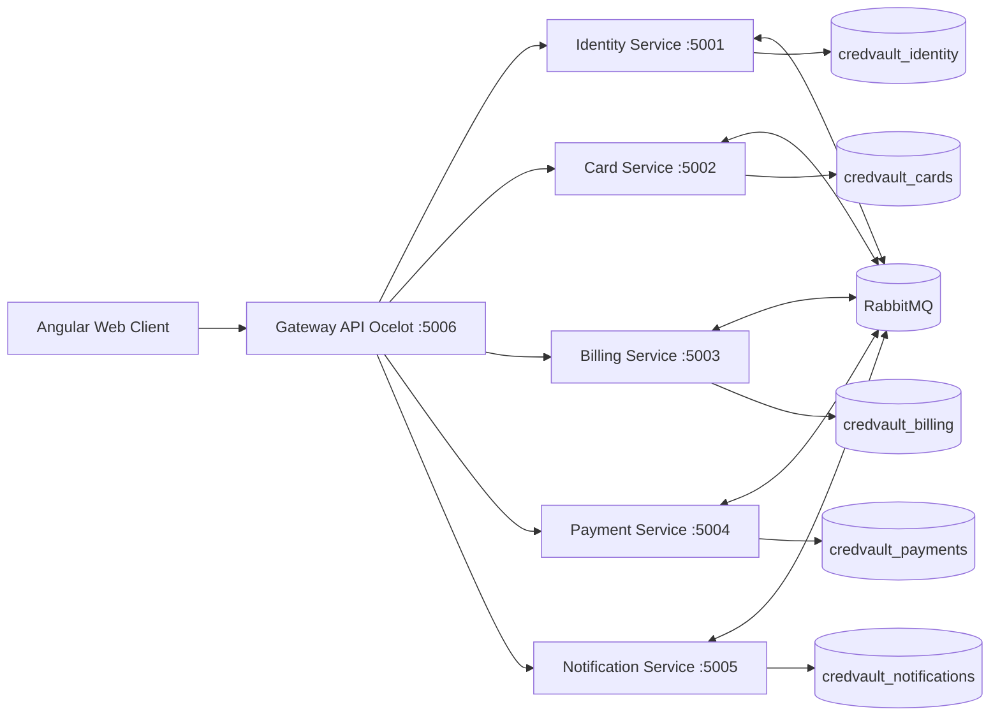
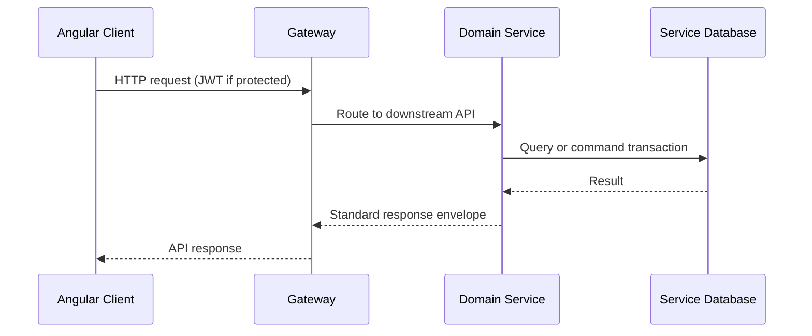
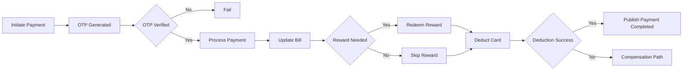

# High Level Design (HLD)

System: CredVault Credit Card Platform

Document version: 2.0 (submission draft)
Prepared for: Sprint architecture review
Date: 2026-04-10

## 1. Problem Statement and Goals

CredVault is designed to solve a common fintech platform challenge: provide a secure and reliable user experience for credit-card lifecycle operations while preserving domain isolation and operational scalability.

The product must support end users and administrators across identity, card management, billing, rewards, payment orchestration, and notification/audit workflows.

### 1.1 Problem Statement

Traditional monolithic implementations for this domain often fail in three areas:

- Tight coupling between billing and payment logic creates difficult release cycles.
- Distributed failure handling (for example payment success but bill update failure) becomes error-prone.
- Centralized schema and service ownership lead to scaling bottlenecks and change conflicts.

CredVault addresses these issues through bounded context service ownership, event-driven orchestration, and explicit compensation logic.

### 1.2 Business Goals

- Reduce failed payment reconciliation cases through deterministic orchestration and compensation.
- Provide secure user/account controls with role-aware access for user and admin personas.
- Enable near-real-time updates of payment, rewards, and audit status.
- Keep teams independently productive by decoupling services and data ownership.

### 1.3 Technical Goals

- Single ingress API for clients via gateway.
- Per-service deployability and scale-out.
- Strong consistency within each service boundary, eventual consistency across boundaries.
- Traceable operations using structured logging, trace identifiers, and queue-level observability.

## 2. Functional and Non-Functional Requirements

### 2.1 Functional Requirements

#### Identity Domain

- Register user account.
- Authenticate using email/password and Google login.
- Verify email via OTP and support resend.
- Handle forgot password and reset password flows.
- Provide user profile read/update and password change.
- Provide admin capabilities for user status and role changes.

#### Card Domain

- Manage issuers (admin).
- Create, list, update, and soft-delete cards.
- Record card transactions and retrieve transaction history.
- Expose admin inspection APIs for user card details.
- Consume payment saga events for card deduction.

#### Billing Domain

- Generate bills and check overdue bills.
- Mark bills paid and support compensation revert.
- Generate and retrieve statements and statement transactions.
- Manage reward tiers (admin) and reward accounts/transactions.
- Support rewards redemption API for user and internal orchestration flow.

#### Payment Domain

- Initiate payment with OTP generation.
- Verify OTP and progress payment orchestration.
- Track payment status and payment transaction ledger.
- Run distributed saga with compensation for partial failures.

#### Notification Domain

- Consume domain and saga events.
- Send notifications (email-based implementation).
- Persist notification delivery logs.
- Persist and retrieve audit logs.

### 2.2 Non-Functional Requirements

| Category | Requirement | Target Direction |
|---|---|---|
| Security | JWT auth + role-based authorization | All protected APIs |
| Reliability | Retry, outbox, idempotent event handling | No silent data loss |
| Scalability | Horizontal service and consumer scale-out | Independent service scaling |
| Availability | Domain isolation to limit blast radius | Partial outages tolerated |
| Performance | Fast read APIs with pagination | Predictable latency under load |
| Maintainability | Layered architecture and shared contracts | Low coupling and code reuse |
| Observability | Structured logs, trace ID, health checks | Fast issue triage |
| Consistency | Strong local consistency + saga eventual consistency | Controlled distributed state |

### 2.3 Constraints and Assumptions

- Runtime topology currently targets local host ports for all services and gateway.
- Database engine is SQL Server with one schema store per service.
- Event backbone is RabbitMQ with MassTransit.
- Frontend uses gateway URL from generated runtime environment config.
- Shared contract library is source of truth for cross-service event contracts.

## 3. Proposed System Architecture (Microservices)

Architecture style selected: Microservices with API Gateway and event-driven choreography/orchestration hybrid.

### 3.1 Logical Architecture

### 3.2 Integration Modes

- Synchronous mode:
    - Client to gateway to service APIs.
    - Select internal service calls in orchestration path (payment to billing and identity).
- Asynchronous mode:
    - Domain events for side effects (for example notifications).
    - Saga events for distributed payment transaction coordination.

### 3.3 Service Design Style

Each backend service follows layered clean architecture:

- API layer for transport and wiring.
- Application layer for commands/queries and use-case orchestration.
- Domain layer for entities and business rules.
- Infrastructure layer for persistence, messaging, and integrations.

## 4. Major Components and Services

### 4.1 Frontend

- Angular 21 client with route guards and auth interceptor.
- Runtime environment generation before start/build.
- Admin and user feature modules.

### 4.2 Gateway

- Ocelot route map as unified ingress.
- CORS policy.
- Health endpoint.

### 4.3 Core Backend Services

- Identity Service.
- Card Service.
- Billing Service.
- Payment Service.
- Notification Service.

### 4.4 Shared Platform Components

- Shared.Contracts library (events, extensions, middleware, common models).
- RabbitMQ broker.
- SQL Server.
- Logging pipeline (Serilog sinks).

## 5. Responsibilities of Each Component

| Component | Primary Responsibilities | Outbound Dependencies | Data Ownership |
|---|---|---|---|
| Angular Client | UI rendering, routing, token handling, request initiation | Gateway | None |
| Gateway API | Upstream routing, unified API entry, health exposure | Downstream services | None |
| Identity Service | Authentication, user lifecycle, user admin controls | RabbitMQ, SQL Server | credvault_identity |
| Card Service | Card/issuer lifecycle, card transactions, deduction handlers | RabbitMQ, SQL Server, Billing API client | credvault_cards |
| Billing Service | Bills/statements/rewards lifecycle, compensation handlers | RabbitMQ, SQL Server | credvault_billing |
| Payment Service | OTP flow, saga orchestration, payment ledger and reversals | RabbitMQ, SQL Server, Billing API, Identity API | credvault_payments |
| Notification Service | Event consumption, notification delivery, audit and log query APIs | RabbitMQ, SQL Server | credvault_notifications |
| Shared.Contracts | Event and common API behavior standardization | Used by all backend services | Not applicable |
| RabbitMQ | Event transport and queue decoupling | Services as producers/consumers | Not applicable |
| SQL Server | Transactional persistence | Services | Per-service DBs |

### 5.1 Queue-Level Responsibility Overview

| Queue | Owned Processing Domain | Typical Event Type |
|---|---|---|
| payment-orchestration | Payment saga | saga state machine events |
| payment-process | Payment worker consumers | payment process and compensation events |
| payment-domain-event | Payment domain side effects | completion/failure/user deleted |
| billing-domain-event | Billing saga handlers | bill update/revert requests |
| card-domain-event | Card saga and domain handlers | card deduction/payment reversed/user deleted |
| notification-domain-event | Notification side effects | user/payment/billing/card notification events |

## 6. End-to-End Data Flow

### 6.1 Generic API Request Flow

### 6.2 User Registration and Notification Flow

1. Client calls register endpoint through gateway.
2. Identity service creates user and emits registration/OTP event.
3. Notification service consumes event and sends notification.
4. Notification logs are persisted for audit retrieval.

### 6.3 Payment Success Flow

1. Payment initiate command validates bill and card ownership and creates payment with OTP.
2. Payment service emits orchestration start and OTP generated events.
3. After OTP verification, saga transitions to payment processing.
4. Payment process success triggers bill update request.
5. Bill update success triggers optional reward redemption and then card deduction.
6. Card deduction success emits payment completed event.
7. Notification domain consumer sends completion notification.

### 6.4 Payment Compensation Flow

1. Bill update failure triggers revert payment request.
2. Card deduction failure triggers revert bill update request.
3. Revert operations retry with bounded attempts.
4. Saga reaches compensated or terminal failed state.

## 7. Database Types and Entities (High-Level)

### 7.1 Database Type

- SQL Server relational storage.
- One database per service boundary.

### 7.2 Domain Entity Map

| Service Domain | Database | Core Entities |
|---|---|---|
| Identity | credvault_identity | identity_users |
| Card | credvault_cards | CardIssuers, CreditCards, CardTransactions |
| Billing | credvault_billing | Bills, Statements, StatementTransactions, RewardAccounts, RewardTiers, RewardTransactions |
| Payment | credvault_payments | Payments, Transactions, PaymentOrchestrationSagas |
| Notification | credvault_notifications | NotificationLogs, AuditLogs |

### 7.3 Data Ownership Rules

- Each service is the sole writer to its own database.
- Cross-service relationships are represented by identifiers, not cross-database SQL FKs.
- Event payloads are the integration contract across service boundaries.

### 7.4 Sensitive and Critical Data Domains

- Identity credentials and auth claims: Identity domain.
- Card metadata and balances: Card domain.
- Financial obligations, statements, rewards: Billing domain.
- Payment lifecycle and compensation state: Payment domain.
- User communication history and audit records: Notification domain.

## 8. Scaling and Performance Considerations

### 8.1 Horizontal Scaling

- Stateless API layers support horizontal replicas per service.
- Queue consumers can scale independently based on event throughput.
- High-write domains (Payment, Notification) can be scaled without impacting identity read APIs.

### 8.2 Throughput and Latency Optimizations

- Use asynchronous queue workflows for long-running and side-effect-heavy operations.
- Paginate high-cardinality list APIs (logs, statements, users).
- Keep database indices aligned to read patterns (already present for major lookup keys).

### 8.3 Reliability Performance Balance

- Retry policy increases success under transient failures but may increase duplicate processing risk.
- Outbox pattern reduces inconsistent publish scenarios.
- Idempotency checks are required for consumers handling retried messages.

### 8.4 Capacity Planning Directions

- Monitor queue lag per domain queue.
- Monitor DB CPU/IO for billing and payment workloads separately.
- Track p95 and p99 response times for gateway routes.
- Track failed compensation counts as an operational KPI.

## 9. Trade-offs and Design Decisions

### 9.1 Key Decisions

| Decision | Why It Was Chosen | Benefit | Trade-off |
|---|---|---|---|
| Microservices over monolith | Domain boundaries are strong and workflows are independent | Team autonomy and targeted scaling | Operational complexity and cross-service tracing overhead |
| API Gateway ingress | Single stable entrypoint for frontend and integrations | Simplified client routing and security edge | Extra hop and route maintenance burden |
| Event-driven saga for payment | Payment is distributed and needs explicit compensation | Better distributed consistency handling | More complex state management and debugging |
| Per-service database ownership | Prevents shared-schema coupling | Strong domain data autonomy | No direct cross-domain joins |
| Shared contract package | Ensures common event/API behavior | Consistency across services | Contract governance becomes critical |

### 9.2 Rejected Alternatives

- Global transactional model across all domains using distributed transaction coordinator:
    - Rejected due to high coupling, latency, and operational fragility.
- Direct service-to-service tight coupling for all side effects:
    - Rejected to avoid cascading failures and runtime dependency chains.

### 9.3 Risk Register and Mitigation Summary

| Risk | Potential Impact | Mitigation |
|---|---|---|
| Route drift in gateway | Broken client API paths | Favor resilient route strategy and route smoke tests |
| Event contract mismatch | Consumer runtime failures | Shared.Contracts as single source of truth + contract review process |
| Compensation failure loops | Financial inconsistency | Attempt counters, bounded retries, operator alerts |
| Cross-domain ID drift | Broken references in workflows | Validation at API boundaries and reconciliation jobs |
| Runtime config mismatch | Wrong environment routing | Generated runtime env and startup validation checklist |

### 9.4 Final Design Position

CredVault intentionally optimizes for domain autonomy, resilience, and long-term maintainability. The architecture accepts eventual consistency for cross-service workflows while preserving strong transactional consistency inside each service boundary.

This is appropriate for production financial workflow platforms where correctness, traceability, and recoverability are more important than minimizing component count.

