# Enterprise Low-Level Design (LLD) Specification

**System Name:** CredVault Credit Card Management Platform  
**Target Audience:** Core Engineering, Architecture, DBA Teams, Quality Assurance (QA), and Integration Teams  
**Document Version:** 5.0 (Enterprise Standard Specification)  
**Date:** 2026-04-14  

> [!NOTE] 
> This document remains the authoritative engineering contract for the CredVault ecosystem. It prescribes software patterns, bounded contexts (via Docker containers), physical database schemas, distributed event messaging, complex Saga State Machine orchestration, and unified API paradigms.

---

## 1. Document Control

| Version | Date | Author | Description of Changes |
|---------|------|--------|------------------------|
| 4.1     | 2026-04-13 | Architecture Team | Microservice splitting and MassTransit integration. |
| 5.0     | 2026-04-14 | Lead Architect | Enterprise standardization, enhanced diagram legibility, rich component contexts, and robust database documentation. |

---

## Table of Contents
1. [Executive Summary & Design Principles](#1-executive-summary--design-principles)
2. [Component Architecture Diagram](#2-component-architecture-diagram)
3. [Enterprise Database Architecture (Detailed DB Schemas)](#3-enterprise-database-architecture-detailed-db-schemas)
4. [Event Broker Architecture (RabbitMQ)](#4-event-broker-architecture-rabbitmq)
5. [Distributed Workflows & Saga Pattern Sequences](#5-distributed-workflows--saga-pattern-sequences)
6. [Core Business Logic Flow Instructions (Pseudocode)](#6-core-business-logic-flow-instructions-pseudocode)
7. [Deployment Architecture](#7-deployment-architecture)

---

## 1. Executive Summary & Design Principles

CredVault enforces highly decoupled architecture mapped strictly to independent sub-domains. It leverages **Command Query Responsibility Segregation (CQRS)**, **Clean Layered Architecture**, and asynchronous **Event-Driven Messaging** for distributed data consistency.

### 1.1 Structural Implementation Patterns
| Pattern Achieved | Implementation Mechanism | Strategic Trade-off / Benefit |
|---|---|---|
| **Clean Architecture** | Rigid horizontal project separation: `Domain` (entities), `Application` (use cases), `Infrastructure` (data), `Presentation` (API). | Business logic is completely decoupled from ASP.NET specifics or EF Core ORMs. |
| **CQRS Pattern** | Leveraging `MediatR` to isolate `CommandHandlers` (mutating Writes) from `QueryHandlers` (read-only queries). | Performance tuning can be scaled asymmetrically; enables future database read-replicas. |
| **Saga State Machine** | Orchestrated by `MassTransit` over `RabbitMQ`, functioning as a central coordinator for complex distributed transactions. | Solves the dual-write cross-database problem, providing out-of-box compensation (rollback) logic. |
| **API Gateway Routing** | Reverses proxying via `Ocelot`, defining static upstream URLs against dynamic downstream container internal IPs. | Shields client UI (Angular) from internal port collisions and service topology changes. |

---

## 2. Component Architecture Diagram

The Component Model demonstrates how functional sub-domains interface via the Shared Gateway and Event Bus.

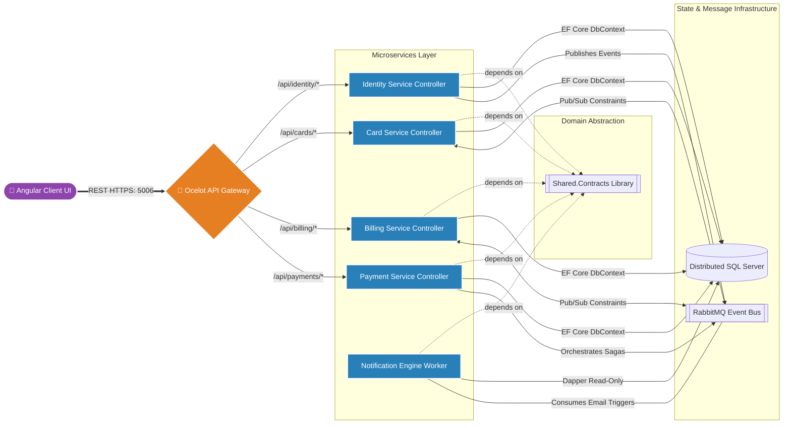

*Figure 2.1: Macro Component Diagram. The UI interacts solely with the generic `Ocelot` endpoint. Independent microservices communicate asynchronously via RabbitMQ using standardized structures contained deeply within `Shared.Contracts`.*

---

## 3. Enterprise Database Architecture (Detailed DB Schemas)

Data ownership is extremely strict. Every bounded context relies on an isolated schema. **Cross-database SQL Joins are fundamentally illegal in this architecture.** Primary keys (GUIDs) act as logical foreign keys across service boundaries.

### 3.1 Card Bounded Context (`credvault_cards`)
This context strictly manages the user's financial instruments, decoupling card details from identity or payments.

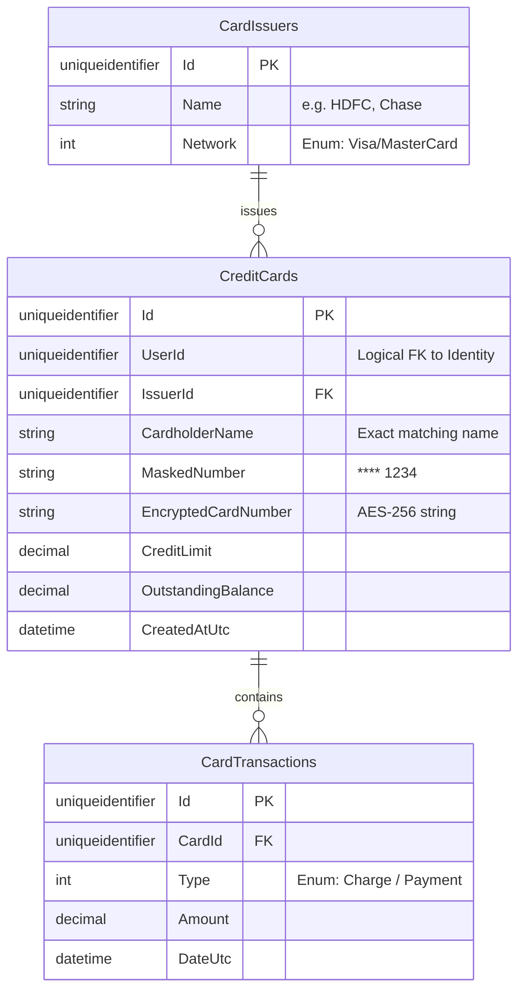
*Figure 3.1: Card Schema. Evaluates strict limits based on the outstanding vs credit limit boundaries. Encrypted fields are exclusively handled in transit.*

### 3.2 Billing Bounded Context (`credvault_billing`)
Calculates cyclic interest, outstanding dues, and aggregates customer reward properties.

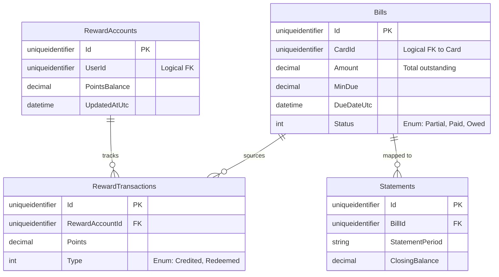
*Figure 3.2: Billing Schema. `Bills` serves as the primary root aggregate containing generated Statements and calculating required minimums.*

### 3.3 Payments Isolation Context (`credvault_payments`)
The source of absolute truth for Top-Ups and distributed Bill Payment sagas.

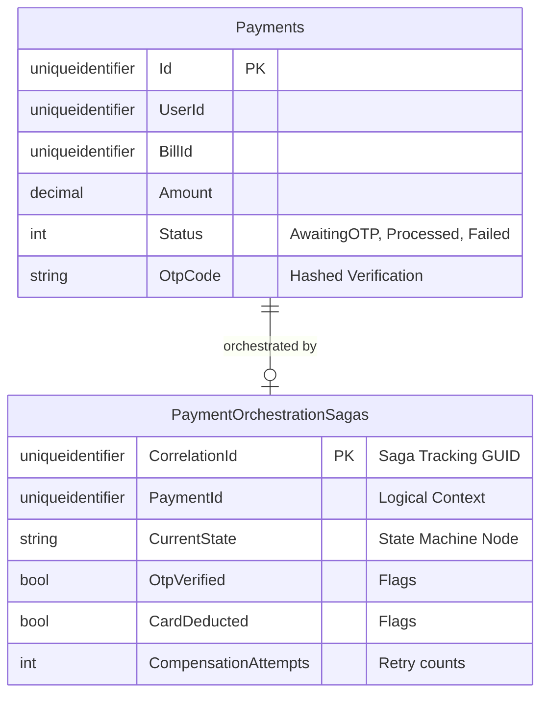
*Figure 3.3: Payment Schema. Notice the existence of the physical Saga state log (`PaymentOrchestrationSagas`). This table functions as a persistent lock for long-running workflows.*

---

## 4. Event Broker Architecture (RabbitMQ)

Credvault adheres strictly to decoupling services over Rabbit MQ. Two distinct messaging paradigms exist:
1. **Domain Events (Pub/Sub):** Fire & Forget notifications (e.g. `UserRegistered`, `StatementGenerated`). The Publisher does not care who consumes it.
2. **Distributed Requests (Saga Orchestration):** Managed exclusively by the Payment Saga Orchestrator handling deterministic point-to-point calls over RabbitMQ.

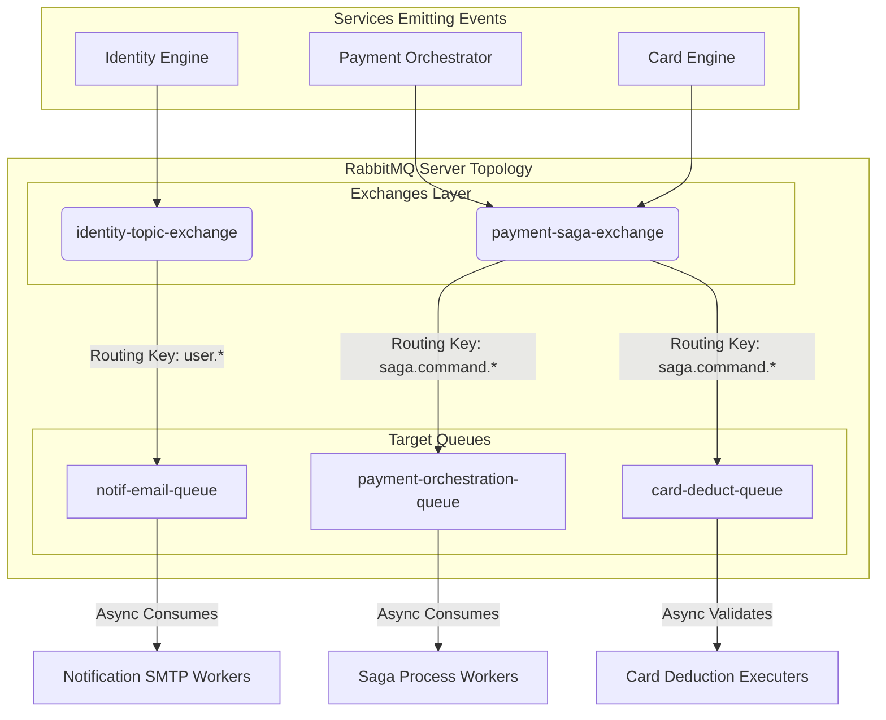
*Figure 4.1: Message Broker Map. Displays how topic-based exchanges fan out messages to strictly bounded target queues, feeding worker microservices.*

---

## 5. Distributed Workflows & Saga Pattern Sequences

The Saga State Machine orchestrates multiple separate database changes into **One Atomic Pseudo-Transaction**. Failure at any step triggers immediate compensation backwards.

### 5.1 Strict Execution Happy-Path (Orchestrated)
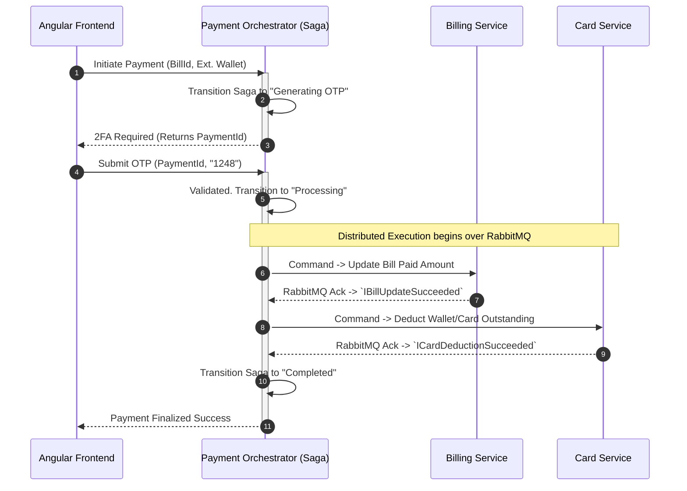
*Figure 5.1: Happy Path Saga. Illustrates a clean top-down execution whereby the user's OTP passes and all downstream database contexts execute their updates natively.*

### 5.2 The Compensation Retry Block (Orchestrated Failover)
If downstream infrastructure rejects an update (e.g. Card system is offline), preceding steps must be inherently reversed.

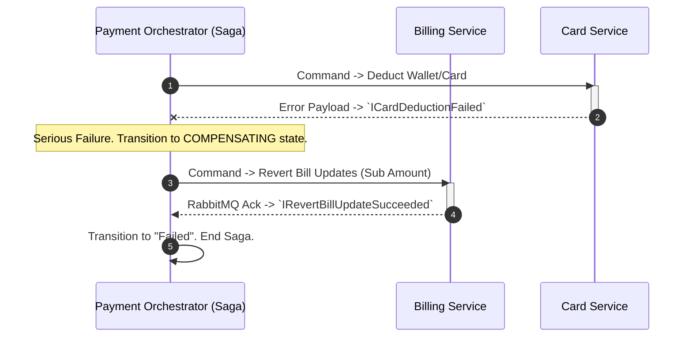
*Figure 5.2: Compensation Flow. The orchestrator explicitly acts as a cleanup system, deploying reverse-commands to undo everything that previously succeeded, thus maintaining global consistency.*

---

## 6. Core Business Logic Flow Instructions (Pseudocode)

### 6.1 Payment Validation Constraints
All payment commands must pass the following rigorous logical checks before a Saga is even allowed to initiate.

```text
FUNCTION ValidateInitiatePaymentRequest(UserContext, IncomingBillId, RequestedAmount):
    
    Define Bill Entity = DB.Bills.FirstOrDefault(id == IncomingBillId)
    
    // Assertion 1: Existence & Ownership
    IF Bill Entity IS NULL -> Return HTTP 404 (Not Found)
    IF Bill.UserId != UserContext.Id -> Return HTTP 403 (Forbidden Cross-Tenant Violation)

    // Assertion 2: Mathematical Dues Validations
    Define OutstandingDelta = MAX(0, Bill.Amount - Bill.AmountPaid)
    IF OutstandingDelta <= 0 -> Return HTTP 400 (Bill Already Cleared)
    IF RequestedAmount <= 0 -> Return HTTP 400 (Amount must be positive)
    IF RequestedAmount > OutstandingDelta -> Return HTTP 400 (Overpayment not permitted)

    // Final Setup -> Execute
    Set OTP = GenerateSecureRandom(6)
    Save Initial Payment Stub (AwaitingOTP, Insert OTP Hash)
    Return HTTP 200 (Challenge Token)
END FUNCTION
```

---

## 7. Deployment Architecture (Docker Infrastructure)

Containers execute exclusively within an internal bridged network (`credvault-network`). External traffic is entirely restricted minus the gateway's `:5006` proxy port.

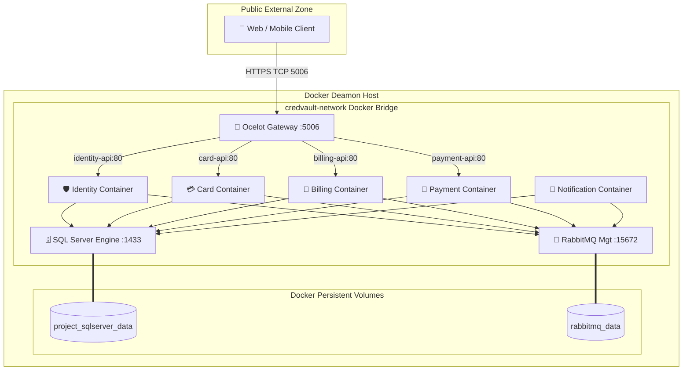
*Figure 7.1: Deployment Infrastructure Diagram. Demonstrates exactly how Docker Compose assembles the network graph, ensuring stateful servers save to local persistent volumes outliving container ephemerality.*

---

## 8. Detailed System Diagrams (Class, State, Activity, Service Flow)

To fully complete the enterprise architecture requirements, the following models detail class structures, lifecycles, and low-level flows.

### 8.1 Class Diagrams

**Identity Service Class Diagram**
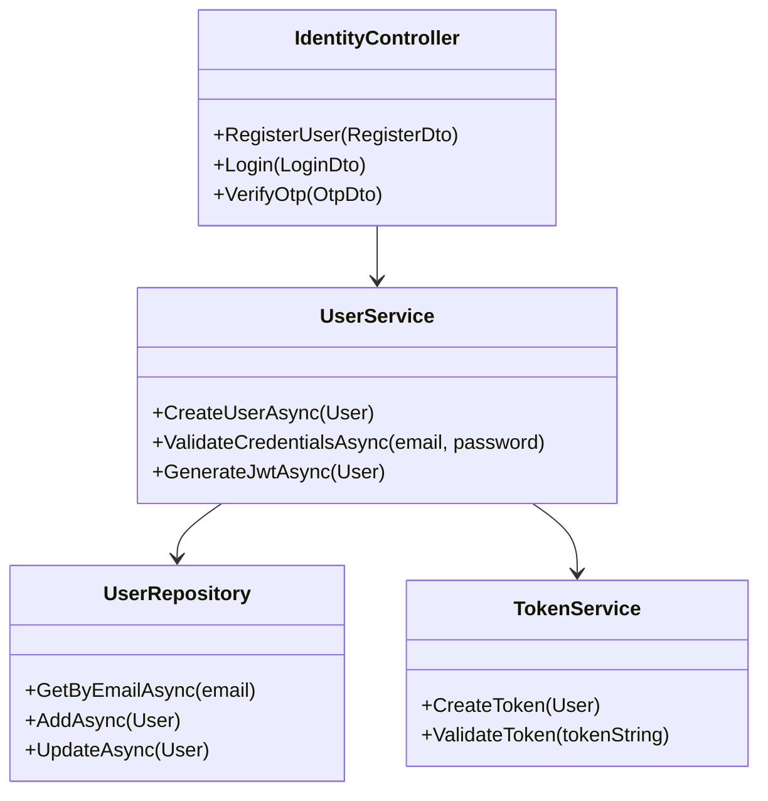
*Figure 8.1: Identity Service Class Diagram mapping internal controllers to domain managers.*

**Payment Service Class Diagram**
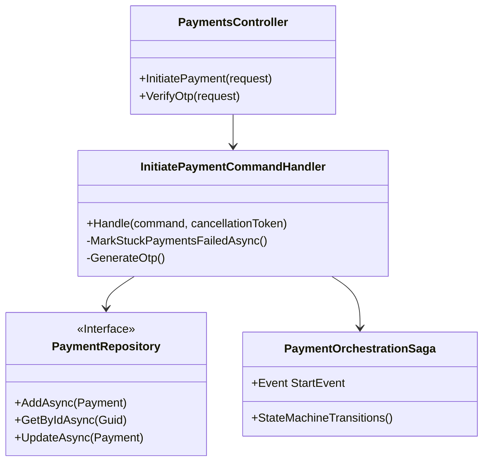
*Figure 8.2: Payment Service Class Diagram highlighting CQRS segregation and State Machine bindings.*

### 8.2 State Diagram (Payment Lifecycle)

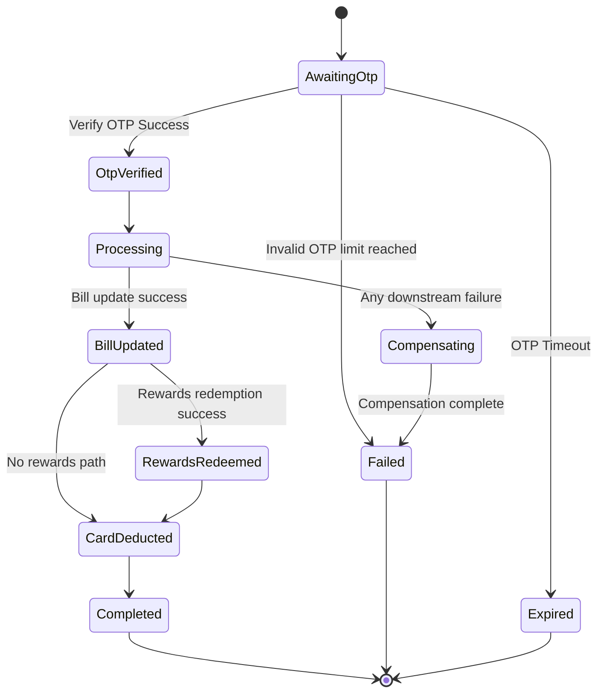
*Figure 8.3: State Diagram visualizing the progression of a distributed transation in a 2FA environment.*

### 8.3 Activity Diagram (Payment Process)

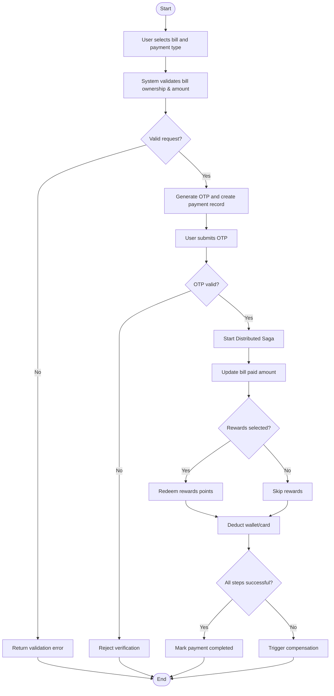
*Figure 8.4: Activity flowchart highlighting logical conditions triggering external compensation handlers.*

### 8.4 Service Flow Diagram (All Microservices)

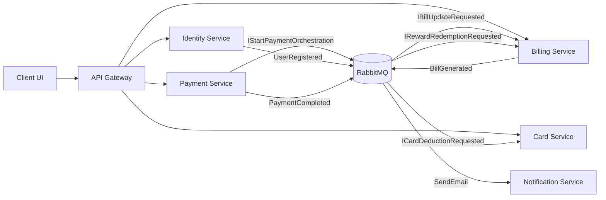
*Figure 8.5: High-level Service Flow detailing the interaction boundaries mediated via Gateway and Broker topology.*
