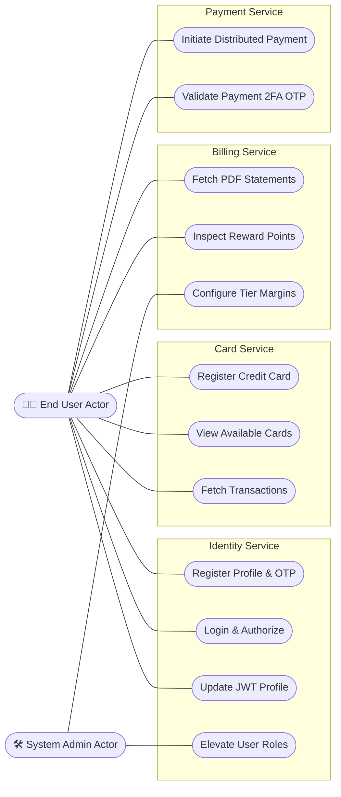
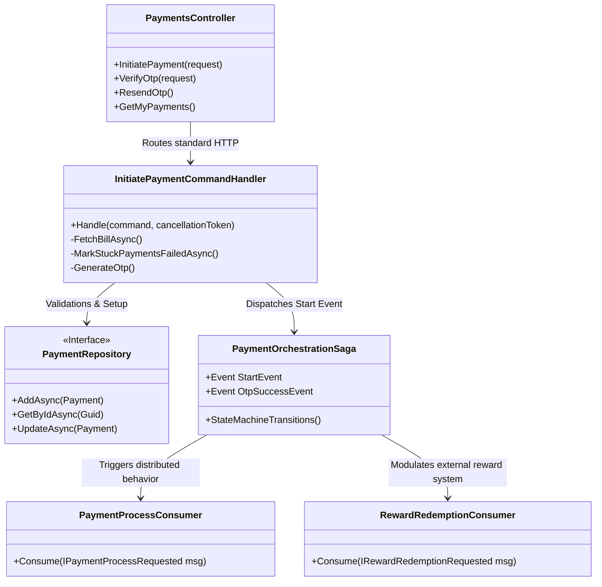
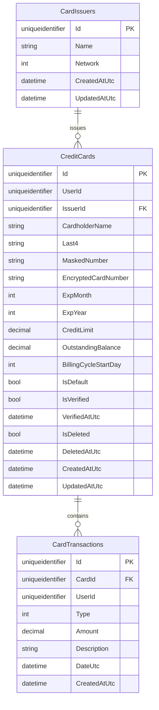
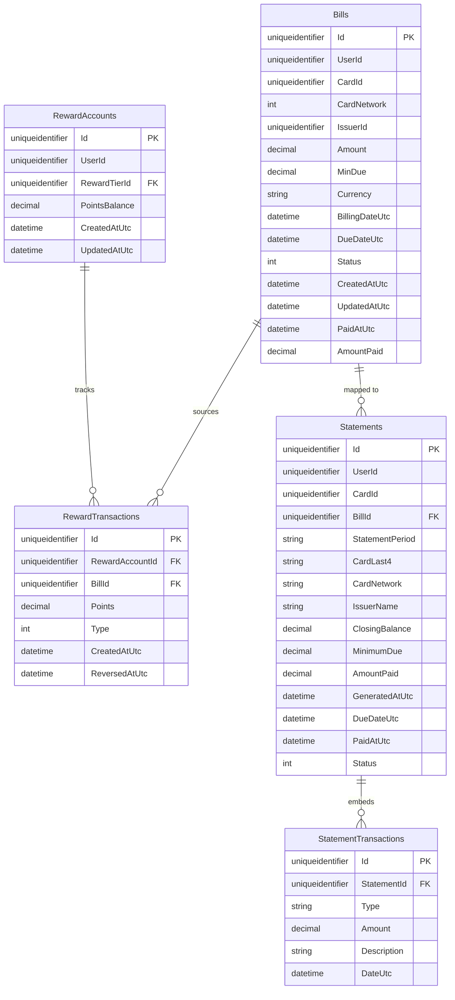
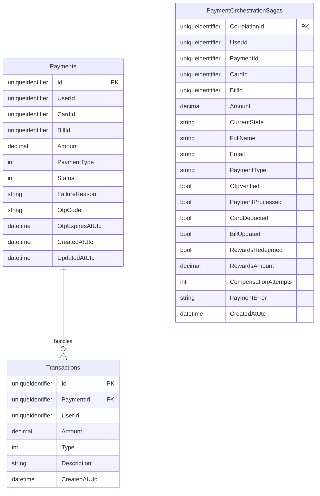
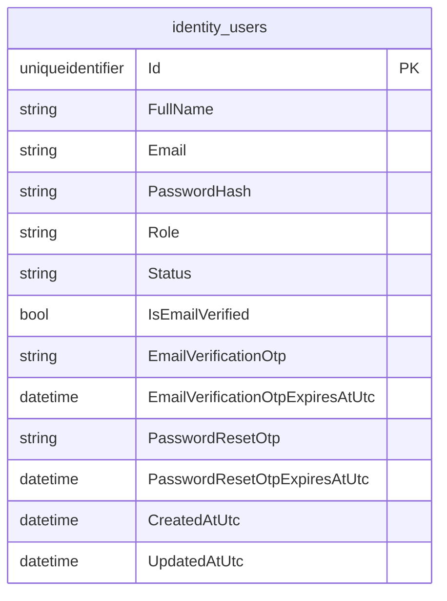
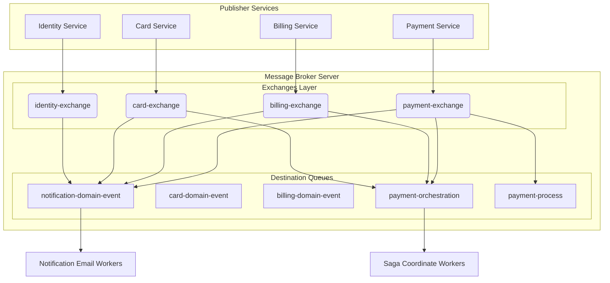
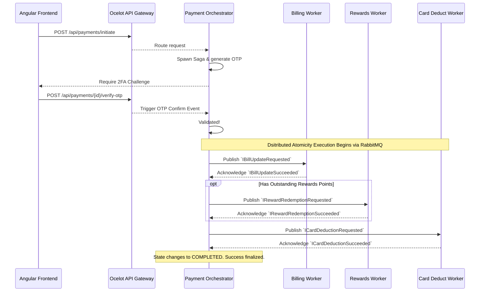
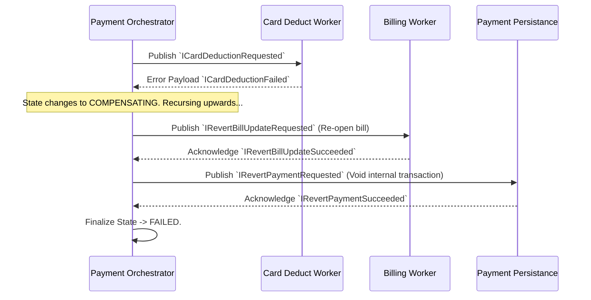

# Enterprise Low-Level Design (LLD) Specification

**System:** CredVault Credit Card Management Platform  
**Prepared for:** Core Engineering, Architecture, QA, and Integration Teams  
**Document Version:** 4.1 (Enterprise Detailed Specification)  
**Date:** 2026-04-13  

> [!NOTE]
> This expansive document represents the absolute source of truth for the CredVault ecosystem. It details software patterns, bounded contexts, database schemas, object relations, distributed event messaging, complex Saga State Machine interactions, and strict API contracts.

---

# Table of Contents
1. [Executive Summary & Design Principles](#1-executive-summary--design-principles)
2. [Macro Use Case & Actor Topologies](#2-macro-use-case--actor-topologies)
3. [Software Class Models & Components](#3-software-class-models--components)
4. [Enterprise Database Architecture (Detailed DB Schemas)](#4-enterprise-database-architecture-detailed-db-schemas)
5. [Event Broker Architecture (RabbitMQ)](#5-event-broker-architecture-rabbitmq)
6. [Distributed Workflows & Saga Pattern Sequences](#6-distributed-workflows--saga-pattern-sequences)
7. [Core Business Logic Flow Instructions (Pseudocode)](#7-core-business-logic-flow-instructions-pseudocode)
8. [Unified API Request/Response Envelopes](#8-unified-api-requestresponse-envelopes)
9. [Error Mapping & Technical Defect Tracking](#9-error-mapping--technical-defect-tracking)

---

## 1. Executive Summary & Design Principles

CredVault relies on a highly scalable, isolated microservices setup emphasizing **Command Query Responsibility Segregation (CQRS)**, **Clean Architecture**, and **Event-Driven messaging** for eventual consistency.

### 1.1 Structural Implementation Patterns
| Pattern Achieved | How It Is Implemented | Strategic Benefit |
|---|---|---|
| **Clean Architecture** | Enforced project separation: `Domain`, `Application`, `Infrastructure`, `Presentation`. | Business logic is decoupled from ASP.NET specifics. |
| **CQRS** | Utilizing `MediatR` for discrete `CommandHandlers` (Writes) and `QueryHandlers` (Reads). | Clear boundaries of read/write side-effects and performance tuning. |
| **Saga State Machine** | Implemented using `MassTransit` state saga orchestration over `RabbitMQ`. | Resolves the dual-write problem across independent databases. |
| **API Gateway Routing** | `Ocelot` JSON configuration proxy bounding upstream/downstream maps. | Client UI remains abstracted from port collisions or routing. |

---

## 2. Macro Use Case & Actor Topologies

The below diagram visually isolates Actor relationships along a perfectly crafted horizontal mapping line into the bounded context subgraphs, providing a beautiful overview of system capabilities.



---

## 3. Software Class Models & Components

### 3.1 Core Class Controller Flow: Payment Orchestrator
The `Payment Orchestrator` represents the most complicated aspect of the software structure. The following explicit class view shows how controllers hit commands, hit sagas, and dispatch out messages.



---

## 4. Enterprise Database Architecture (Detailed DB Schemas)

Data ownership is extremely strict. A component has exclusive access to its schema. Any cross-database joins are illegal. Relationships are constructed "logically" using Application-Level Foreign key checks across boundaries.

### 4.1 Card Bounded Context (`credvault_cards`)



### 4.2 Billing & Rewards Context (`credvault_billing`)



### 4.3 Payments Isolation Context (`credvault_payments`)



### 4.4 Identity Core Context (`credvault_identity`)



---

## 5. Event Broker Architecture (RabbitMQ)

Credvault adheres strictly to decoupling services over Rabbit MQ. Two distinct paradigms exist:
- **Domain Event Pattern:** (Publish/Subscriber - Fire & Forget). Primarily leveraged by `NotificationService` reading off single events (e.g. `IPaymentFailed`).
- **Distributed Request/Response Pattern:** Managed exclusively by the Saga Orchestrator in `payment-orchestration`, handling deterministic point-to-point calls over RabbitMQ.



---

## 6. Distributed Workflows & Saga Pattern Sequences

The Saga State Machine forces 4 specific sub-actions to resolve into ONE atomic operation for the user. Failure at any level reverts the previous blocks recursively up the chain.

### 6.1 Strict Execution Happy-Path (Orchestrated)


### 6.2 The Compensation Retry Block (Orchestrated Failover)
If `ICardDeductionRequested` errors out due to unavailable dependencies, the orchestrator begins compensating behaviors to prevent dangling ledger records.



---

## 7. Core Business Logic Flow Instructions (Pseudocode)

### 7.1 Detailed Payment Validation Command Requirements
The `InitiatePaymentCommandHandler` must assert extremely rigid validation.

```text
function EvaluateInitiatePayment(userContext, CardId, BillId, TargetAmount):
    Execute MarkExpiredStuckPaymentsAsync(userId, BillId) -- ensure no phantom sagas remain.
    
    bill = GET Database.Bills(BillId)
    if bill is NULL: throw NotFound()
    if bill.UserId != userContext.Id: throw UnauthorizedAccess("Entity mismatch")
    if bill.CardId != CardId: throw CrossBoundaryValidation("Card/Bill drift detected")

    outstandingDelta = MAX(0, bill.Amount - bill.AmountPaid)
    if outstandingDelta == 0: throw ValidationException("Bill zeroed out")
    if TargetAmount > outstandingDelta: throw OverpaymentException("Requested too much")
    
    if Validation clears:
        OTP = GenerateCryptoRNG(6)
        PaymentRecord = CREATE Payment in Status "AwaitingOTP"
        PUBLISH IStartPaymentOrchestration (PaymentRecord)
        return HTTP 200 OK -> PaymentID & Challenge
```

---

## 8. Unified API Request/Response Envelopes

Every microservice exposes its surface through the global `:5006` gateway. 

### 8.1 Required Standard Response Wrapper Payload
```json
{
  "success": true,               // Essential boolean trigger for Frontend RxJs observation  
  "message": "Dynamic payload message defining outcome",
  "errorCode": "null or string for translation sets",
  "data": {                      // The core response body structure
      "id": "c1f...4d"
  },
  "traceId": "0HNHTGXXXXX"       // Sentry/ELK tracing ID for diagnostic correlation
}
```

### 8.2 Standard HTTP Errors Map
- `200 OK / 201 Created` : Success behaviors.
- `400 Bad Request`: Usually caught in the `FluentValidation` intercept pipeline.
- `401 Unauthorized`: Rejections in the Bearer JWT.
- `403 Forbidden`: Passed Authentication but role-claim (like `Admin`) is falsy.
- `404 Not Found`: Internal `DbSet` queries yielding nulls.
- `500 Server Error`: Global `ExceptionHandlingMiddleware.cs` wrapped outputs preventing stack-trace leaks into the UI.

---

## 9. Error Mapping & Technical Defect Tracking

### 9.1 Known Missing RabbitMQ Implementations
| Defect Location | Feature Title | Technical Context | Impact Level |
|---|---|---|---|
| **Identity Service** | `IUserDeleted` Global Propagation | Administrative UI can delete user context. The Identity service wipes the DB. However, there is NO event publisher for `IUserDeleted`. | **CRITICAL BUG**. Orphaned invoices, payments, and credit cards will sit dead in isolated context databases taking up space. |
| **Billing Service** | `IBillOverdueDetected` Event Consumer | A CRON job sweeps and successfully publishes `IBillOverdueDetected` to the broker accurately. However, the Notification Service is not wired to consume this! | **LOW**. The architecture is sound but the business value is lost. No emails are actively warning users they've breached late timelines. |

### 9.2 Broker Retry Toleration Models
When events are rejected:
- First strike: Fast-retry applied within 5 seconds.
- Multi-strike: Messages are pushed to `.error` deadlock queues to be reviewed.
- Saga Fault exception: 3 attempts internally programmed in MassTransit before dropping back into `Compensated` mapping. 
