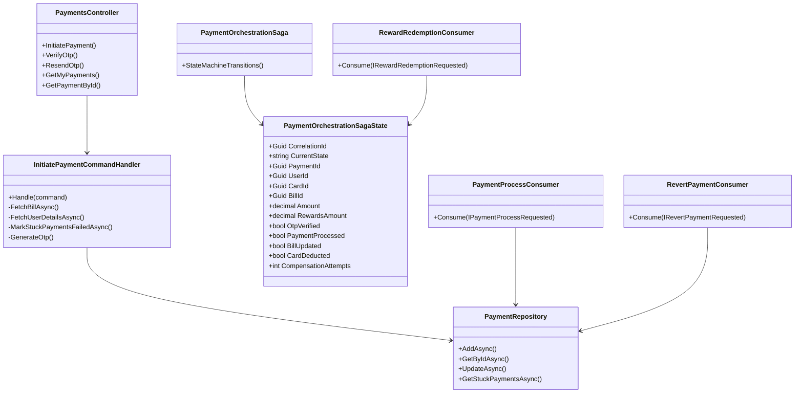
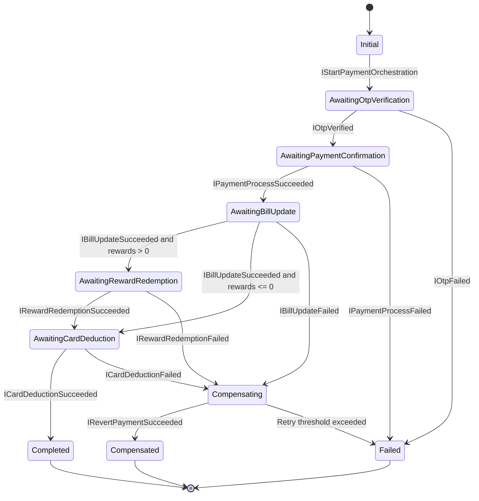
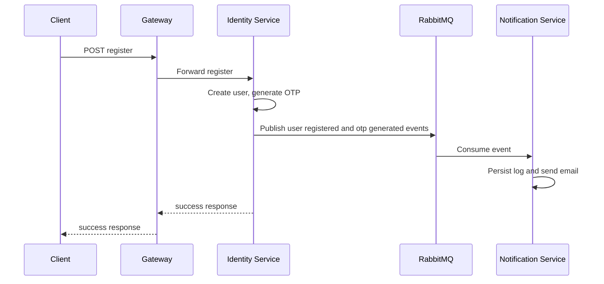
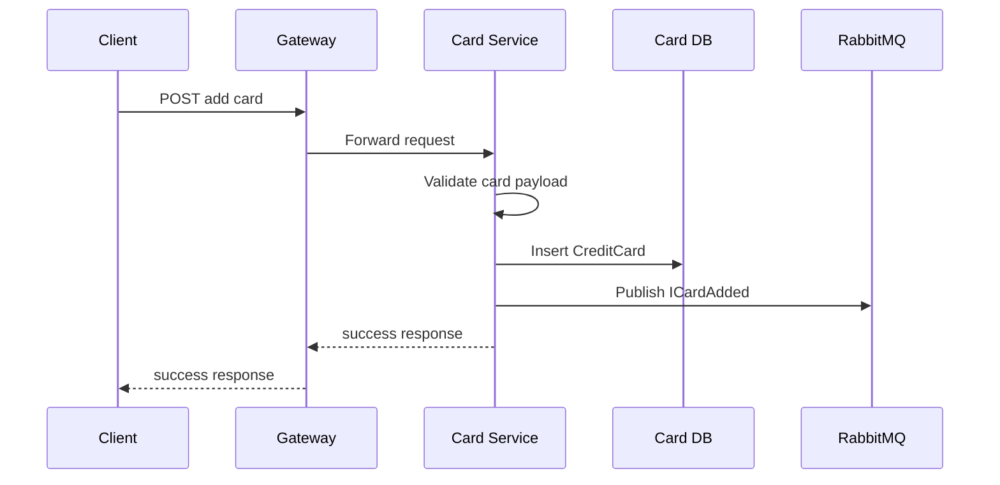
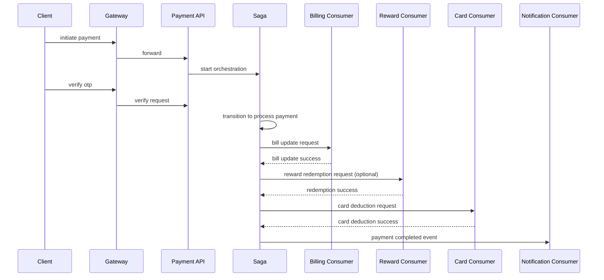
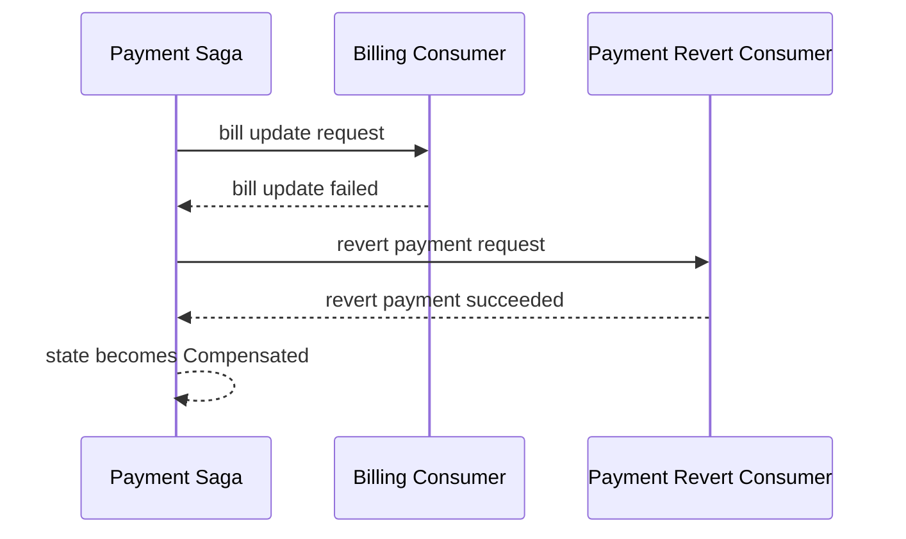

# Low Level Design (LLD)

System: CredVault Credit Card Platform

Document version: 2.1
Prepared for: Sprint engineering review
Date: 2026-04-12

## Changelog

### v2.1 (2026-04-12)
- Updated database schema to reflect FK fixes
- `RewardAccounts.RewardTierId` now has FK to `RewardTiers.Id`
- `Statements.BillId` now has FK to `Bills.Id`

### v2.0 (2026-04-10)
- Initial release

## 1. Detailed Requirements and Edge Cases

### 1.1 Detailed Functional Requirements

#### Identity Module

- Create account with email/password.
- Generate and verify email OTP.
- Support resend OTP and password reset OTP lifecycle.
- Authenticate and issue JWT.
- Support Google login.
- Support profile update and password change.
- Admin controls for user status and role changes.

#### Card Module

- CRUD operations for cards with soft delete semantics.
- Issuer management APIs (admin).
- Add/list card transactions.
- Admin read paths for user card diagnostics.
- Consume deduction/reversal/user-deletion events.

#### Billing Module

- Generate bills and mark overdue bills.
- Mark bill paid, revert bill paid (compensation path).
- Generate statements and expose statement line items.
- Manage reward tiers, reward account, reward transactions.
- Redeem rewards for user flow and internal saga flow.

#### Payment Module

- Initiate payment with pre-validation.
- Generate OTP and enforce OTP verification.
- Persist payment and orchestration state.
- Trigger distributed steps through saga state machine.
- Handle compensation with retries on failures.

#### Notification Module

- Consume identity/card/billing/payment events.
- Persist notification logs and audit logs.
- Send email notifications.
- Expose paginated logs APIs.

### 1.2 Detailed Non-Functional Requirements

- Secure endpoints with JWT and role checks.
- Deterministic response envelope for all APIs.
- Idempotent handling for retried event messages where applicable.
- Bounded retries for transient errors and compensation steps.
- Strong consistency per service DB transaction.
- Eventual consistency for cross-service workflows.

### 1.3 Edge Case Catalog

| Area | Edge Case | Expected Behavior |
|---|---|---|
| Payment OTP | OTP incorrect | Reject verification and keep state pending or fail path |
| Payment OTP | OTP expired | Reject verification and return actionable message |
| Payment initiate | Duplicate in-progress payment on same bill | Mark stuck prior initiation failed and continue with new flow |
| Payment validation | Bill does not belong to user | Reject request with business error |
| Payment validation | Card does not match bill | Reject request with business error |
| Payment validation | Full payment amount mismatch | Reject request with explicit required amount |
| Reward | Reward redemption fails | Enter compensation path |
| Card | Card deduction fails after bill update | Trigger bill revert path |
| Compensation | Revert operations repeatedly fail | Bounded retries then terminal fail |
| Gateway | Route mismatch | Return controlled error, avoid gateway 500 drift |

## 2. Class Diagrams and Entity Relationships

### 2.1 Service Class View: Payment Orchestration Core



### 2.2 Domain Entity Relationship View

```mermaid
erDiagram
    CardIssuers ||--o{ CreditCards : IssuerId
    CreditCards ||--o{ CardTransactions : CardId

    RewardAccounts ||--o{ RewardTransactions : RewardAccountId
    Bills ||--o{ RewardTransactions : BillId (optional)
    Statements ||--o{ StatementTransactions : StatementId

    Payments ||--o{ Transactions : PaymentId

    identity_users ||..o{ CreditCards : logical UserId reference
    identity_users ||..o{ Bills : logical UserId reference
    identity_users ||..o{ Payments : logical UserId reference
```

### 2.3 State Machine View



## 3. Database Schema with Fields and Keys

Detailed schema source: docs/DB-FOREIGN-KEY-ARCHITECTURE.md

### 3.1 Identity Database (credvault_identity)

Table: identity_users

- Id (PK)
- FullName
- Email
- PasswordHash
- Role
- Status
- IsEmailVerified
- EmailVerificationOtp
- EmailVerificationOtpExpiresAtUtc
- PasswordResetOtp
- PasswordResetOtpExpiresAtUtc
- CreatedAtUtc
- UpdatedAtUtc

### 3.2 Card Database (credvault_cards)

Table: CardIssuers

- Id (PK)
- Name
- Network
- CreatedAtUtc
- UpdatedAtUtc

Table: CreditCards

- Id (PK)
- UserId
- IssuerId (FK -> CardIssuers.Id)
- CardholderName
- Last4
- MaskedNumber
- EncryptedCardNumber
- ExpMonth
- ExpYear
- CreditLimit
- OutstandingBalance
- BillingCycleStartDay
- IsDefault
- IsVerified
- VerifiedAtUtc
- IsDeleted
- DeletedAtUtc
- CreatedAtUtc
- UpdatedAtUtc

Table: CardTransactions

- Id (PK)
- CardId (FK -> CreditCards.Id)
- UserId
- Type
- Amount
- Description
- DateUtc
- CreatedAtUtc

### 3.3 Billing Database (credvault_billing)

Table: Bills

- Id (PK)
- UserId
- CardId
- CardNetwork
- IssuerId
- Amount
- MinDue
- Currency
- BillingDateUtc
- DueDateUtc
- Status
- AmountPaid
- PaidAtUtc
- CreatedAtUtc
- UpdatedAtUtc

Table: RewardTiers

- Id (PK)
- CardNetwork
- IssuerId
- MinSpend
- RewardRate
- EffectiveFromUtc
- EffectiveToUtc
- CreatedAtUtc
- UpdatedAtUtc

Table: RewardAccounts

- Id (PK)
- UserId
- RewardTierId (FK -> RewardTiers.Id)
- PointsBalance
- CreatedAtUtc
- UpdatedAtUtc

Table: RewardTransactions

- Id (PK)
- RewardAccountId (FK -> RewardAccounts.Id)
- BillId (FK -> Bills.Id, nullable)
- Points
- Type
- ReversedAtUtc
- CreatedAtUtc

Table: Statements

- Id (PK)
- UserId
- CardId
- BillId (FK -> Bills.Id, nullable)
- StatementPeriod
- CardLast4
- CardNetwork
- IssuerName
- OpeningBalance
- TotalPurchases
- TotalPayments
- TotalRefunds
- PenaltyCharges
- InterestCharges
- ClosingBalance
- MinimumDue
- AmountPaid
- CreditLimit
- AvailableCredit
- PeriodStartUtc
- PeriodEndUtc
- GeneratedAtUtc
- DueDateUtc
- PaidAtUtc
- Status
- Notes
- CreatedAtUtc
- UpdatedAtUtc

Table: StatementTransactions

- Id (PK)
- StatementId (FK -> Statements.Id)
- Type
- Amount
- Description
- DateUtc
- SourceTransactionId
- CreatedAtUtc

### 3.4 Payment Database (credvault_payments)

Table: Payments

- Id (PK)
- UserId
- CardId
- BillId
- Amount
- PaymentType
- Status
- FailureReason
- OtpCode
- OtpExpiresAtUtc
- CreatedAtUtc
- UpdatedAtUtc

Table: Transactions

- Id (PK)
- PaymentId (FK -> Payments.Id)
- UserId
- Amount
- Type
- Description
- CreatedAtUtc

Table: PaymentOrchestrationSagas

- CorrelationId (PK)
- CurrentState
- PaymentId
- UserId
- Email
- FullName
- CardId
- BillId
- Amount
- PaymentType
- RewardsAmount
- RewardsRedeemed
- OtpCode
- OtpExpiresAtUtc
- OtpVerified
- PaymentProcessed
- BillUpdated
- CardDeducted
- PaymentError
- BillUpdateError
- CardDeductionError
- CompensationReason
- CompensationAttempts
- CreatedAtUtc
- UpdatedAtUtc

### 3.5 Notification Database (credvault_notifications)

Table: NotificationLogs

- Id (PK)
- Type
- Recipient
- Subject
- Body
- IsSuccess
- ErrorMessage
- UserId
- TraceId
- CreatedAtUtc

Table: AuditLogs

- Id (PK)
- EntityName
- EntityId
- Action
- Changes
- UserId
- TraceId
- CreatedAtUtc

## 4. APIs with Request and Response Format

Gateway base URL: http://localhost:5006

### 4.1 Standard API Response Contract

Base format:

```json
{
  "success": true,
  "message": "Operation completed",
  "data": {}
}
```

Extended error payload in current implementation can include optional fields:

```json
{
  "success": false,
  "message": "Validation failed",
  "errorCode": "ValidationError",
  "data": {
    "title": "Validation failed"
  },
  "traceId": "0HN..."
}
```

### 4.2 Key API Definitions (Representative)

#### Identity

POST /api/v1/identity/auth/register

Request:

```json
{
  "fullName": "Aarav Sharma",
  "email": "aarav@example.com",
  "password": "StrongPassword@123"
}
```

Response:

```json
{
  "success": true,
  "message": "Registration successful",
  "data": {
    "userId": "guid"
  }
}
```

#### Card

POST /api/v1/cards

Request:

```json
{
  "cardholderName": "Aarav Sharma",
  "cardNumber": "4111111111111111",
  "expMonth": 12,
  "expYear": 2029,
  "issuerId": "guid",
  "isDefault": true
}
```

#### Billing

GET /api/v1/billing/statements/{statementId}/transactions

Response:

```json
{
  "success": true,
  "message": "Statement transactions fetched",
  "data": {
    "items": []
  }
}
```

#### Payment

POST /api/v1/payments/initiate

Request:

```json
{
  "cardId": "guid",
  "billId": "guid",
  "amount": 4200,
  "paymentType": "Full",
  "rewardsPoints": 100
}
```

Response:

```json
{
  "success": true,
  "message": "Payment initiated",
  "data": {
    "paymentId": "guid",
    "otpRequired": true
  }
}
```

POST /api/v1/payments/{paymentId}/verify-otp

Request:

```json
{
  "otpCode": "123456"
}
```

#### Notification

GET /api/v1/notifications/logs?email=user@example.com&page=1&pageSize=20

GET /api/v1/notifications/audit?userId=guid&page=1&pageSize=20

### 4.3 API Security Rules

- Public endpoints are limited to explicit auth lifecycle and internal integration routes.
- Authenticated endpoints require bearer JWT.
- Admin endpoints require role authorization.

## 5. Sequence Flow for Key Operations

### 5.1 Registration and Verification Flow



### 5.2 Add Card Flow



### 5.3 Payment Success Flow



### 5.4 Compensation Flow



## 6. Core Business Logic (Pseudocode or Code)

### 6.1 Payment Initiation Logic

```text
function initiatePayment(userId, cardId, billId, amount, paymentType, authHeader, rewardsAmount):
  markStuckPaymentsFailed(userId, billId)

  if amount <= 0:
    return fail("Amount must be greater than zero")

  bill = fetchBill(billId, authHeader)
  if bill is null:
    return fail("Could not verify bill")
  if bill.userId != userId:
    return fail("Bill does not belong to user")
  if bill.cardId != cardId:
    return fail("Card does not match bill")

  outstanding = max(0, bill.amount - bill.amountPaid)
  if outstanding <= 0:
    return fail("Bill is already settled")
  if amount > outstanding:
    return fail("Payment exceeds outstanding")
  if paymentType == Full and abs(amount - outstanding) > tolerance:
    return fail("Full payment must equal outstanding")

  otp = generateOtp()
  payment = createPayment(status=Initiated, otp=otp)

  publish(IStartPaymentOrchestration)
  publish(IPaymentOtpGenerated)

  return success(payment.id)
```

### 6.2 OTP Verification Logic

```text
function verifyOtp(paymentId, otpCode):
  payment = loadPayment(paymentId)
  if payment not found:
    return fail("Payment not found")
  if payment.status is terminal:
    return fail("Payment cannot be verified in current state")
  if payment.otpExpired:
    emit IOtpFailed
    return fail("OTP expired")
  if otp mismatch:
    emit IOtpFailed
    return fail("Invalid OTP")

  emit IOtpVerified
  return success("OTP verified")
```

### 6.3 Bill Update Saga Consumer Logic

```text
on IBillUpdateRequested(message):
  result = MarkBillPaid(userId, billId, amount)
  if result.success:
    publish IBillUpdateSucceeded
  else:
    publish IBillUpdateFailed
```

### 6.4 Card Deduction Consumer Logic

```text
on ICardDeductionRequested(message):
  if transaction exists with description Saga:correlationId:
    publish ICardDeductionSucceeded
    return

  card = getCard(message.cardId)
  if card missing:
    publish ICardDeductionFailed
    return

  card.outstandingBalance -= amount
  addCardTransaction(type=Payment, description=Saga:correlationId)
  save
  publish ICardDeductionSucceeded
```

### 6.5 Compensation Retry Logic

```text
if revert operation fails:
  compensationAttempts += 1
  if compensationAttempts >= threshold:
    state = Failed
  else:
    republish revert request
```

## 7. Error Handling and Edge Cases

### 7.1 API Error Handling Strategy

- ExceptionHandlingMiddleware wraps domain and generic exceptions.
- Response format remains consistent with success/message/data baseline.
- Extended fields include errorCode and traceId for diagnostics.

### 7.2 Error Classification

| Error Type | HTTP Status | Source | Handling |
|---|---|---|---|
| Validation error | 400 | command/query validation | return business-safe message |
| Unauthorized | 401 | auth middleware | frontend interceptor logout on 401 |
| Forbidden | 403 | role authorization | deny operation |
| Not found | 404 | repository/service | return not-found message |
| Domain business failure | 400 | service logic | return explicit business reason |
| Unexpected exception | 500 | runtime | log with trace and return generic error |

### 7.3 Messaging Failure Handling

- Message retry intervals configured at receive endpoints.
- In-memory outbox used to reduce duplicate publication side effects.
- Idempotency checks implemented in selected critical consumers.
- Compensation paths provide fallback if direct happy path fails.

### 7.4 Notable Domain Edge Behaviors

- Payment supersession marks previous initiated/stuck records failed and emits OTP failure event.
- Reward redemption amount is bounded by payment amount before downstream deduction.
- Card deduction path records saga marker in transaction description for dedupe.
- Statement and rewards queries should rely on paginated retrieval to avoid heavy payloads.

## 8. Design Patterns Used

| Pattern | Where Used | Why |
|---|---|---|
| Clean Architecture | all services | enforce separation of concerns |
| CQRS with MediatR | application command and query handlers | clear read/write use-case boundaries |
| Repository and Unit of Work | infrastructure persistence layers | data access abstraction and transactional control |
| Saga State Machine | payment orchestration | coordinated distributed transaction and compensation |
| Event-Driven Messaging | cross-service integrations | temporal decoupling and resilience |
| Middleware | centralized exception handling and auth pipeline | uniform cross-cutting behavior |
| API Gateway | Ocelot ingress | unified client surface and route centralization |

### 8.1 Pattern Fit Summary

- Pattern set is suitable for a domain with distributed financial workflows.
- Compensation-aware orchestration is critical due to multi-service side effects.
- Contract-first event design reduces integration ambiguity across teams.

