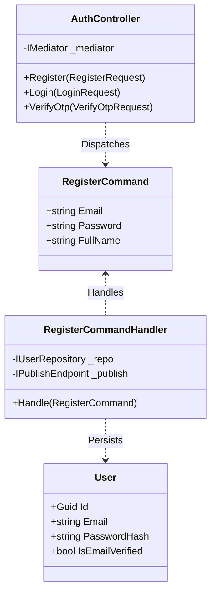
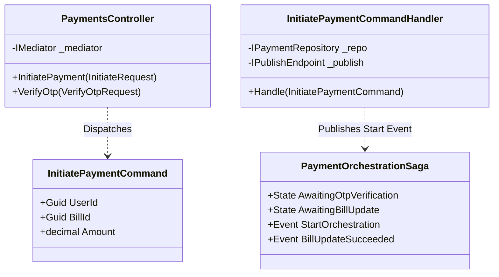
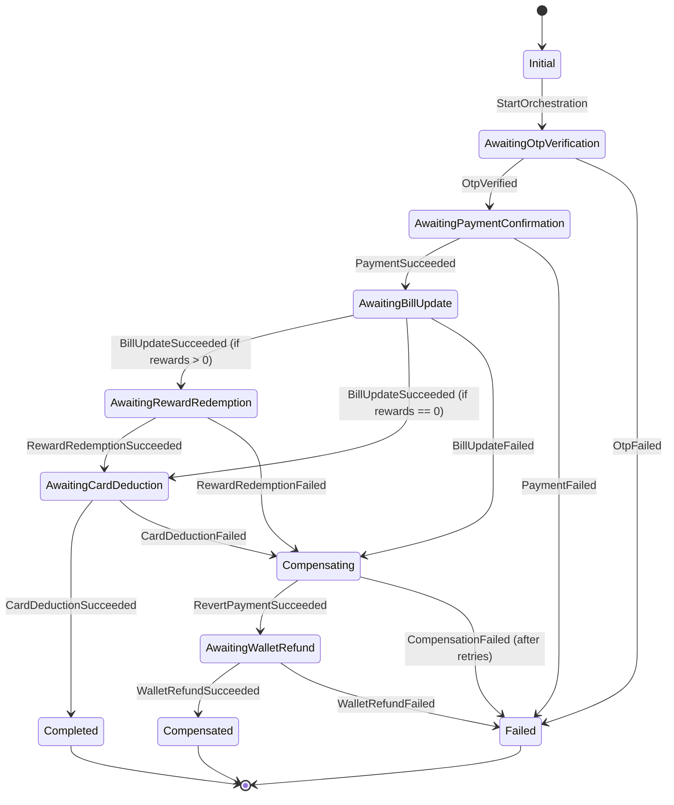

# Low-Level Design (LLD) Specification - CredVault

**System:** CredVault Credit Card Management Platform  
**Version:** 6.0 (Enterprise Specification)  
**Status:** Approved  
**Last Updated:** 2024-05-20  

---

## 1. Document Control

### 1.1 Revision History
| Version | Date | Author | Description |
|:---|:---|:---|:---|
| 5.0 | 2026-04-14 | Lead Architect | Initial Enterprise Draft |
| 6.0 | 2024-05-20 | Senior Software Engineer | Full rewrite to enterprise standard, detailed Saga State Machine, and Message Contracts. |

### 1.2 Table of Contents
1. [Design Principles](#2-design-principles)
2. [Component Detail & Class Diagrams](#3-component-detail--class-diagrams)
3. [Payment Orchestration Saga (State Machine)](#4-payment-orchestration-saga-state-machine)
4. [Service Logic & Flows](#5-service-logic--flows)
5. [Message Contracts (Event Schemas)](#6-message-contracts-event-schemas)
6. [Deployment & Infrastructure](#7-deployment--infrastructure)

---

## 2. Design Principles

The CredVault architecture is built upon three core pillars to ensure scalability, reliability, and maintainability.

### 2.1 Clean Architecture
Each microservice follows a strict layered approach:
- **Domain:** Pure business logic, entities, and enums. Zero dependencies on external libraries.
- **Application:** Use cases, MediatR commands/queries, and interfaces.
- **Infrastructure:** Persistence (EF Core), External Service Clients, and Messaging implementations.
- **API (Presentation):** Controllers, Middleware, and Dependency Injection configuration.

### 2.2 CQRS with MediatR
We use **Command Query Responsibility Segregation** to decouple write and read operations.
- **Commands:** Mutate state. Handled by `IRequestHandler<TCommand, TResult>`.
- **Queries:** Fetch data. Optimized for read performance.
- **Benefits:** Simplified scaling and clear separation of concerns.

### 2.3 Saga State Machine (Distributed Transactions)
Complex workflows spanning multiple services (Payment, Billing, Card) are orchestrated using the **Saga Pattern**. We utilize **MassTransit State Machine** to manage state, handle retries, and execute compensation logic (rollbacks) to maintain eventual consistency across distributed databases.

---

## 3. Component Detail & Class Diagrams

### 3.1 Identity Service
The Identity service manages authentication, user registration, and 2FA verification.



### 3.2 Payment Service
The Payment service initiates transactions and orchestrates the distributed saga.



---

## 4. Payment Orchestration Saga (State Machine)

The `PaymentOrchestrationSaga` is the central coordinator for the bill payment workflow. It ensures that if any step fails (e.g., Billing Service down), the system compensates by rolling back previous successful steps (e.g., refunding the wallet).

### 4.1 State Diagram



---

## 5. Service Logic & Flows

### 5.1 Payment Validation Logic (Pseudocode)
The following logic is executed within `InitiatePaymentCommandHandler` before starting the Saga.

```text
FUNCTION HandleInitiatePayment(Request):
    // 1. Cleanup: Fail any previous unfinished payments for this bill
    MarkStuckPaymentsFailed(Request.UserId, Request.BillId)

    // 2. Basic Validation
    IF Request.Amount <= 0 THEN RETURN Error("Invalid amount")

    // 3. Remote Verification (Billing Service)
    Bill = FetchBill(Request.BillId)
    IF Bill NOT FOUND THEN RETURN Error("Bill not found")
    IF Bill.UserId != Request.UserId THEN RETURN Error("Access denied")
    
    // 4. Financial Constraints
    Outstanding = Bill.Total - Bill.Paid
    IF Outstanding <= 0 THEN RETURN Error("Bill already settled")
    IF Request.Amount > Outstanding THEN RETURN Error("Overpayment not allowed")

    // 5. Wallet Check
    Wallet = FetchWallet(Request.UserId)
    IF Wallet.Balance < Request.Amount THEN RETURN Error("Insufficient funds")

    // 6. Persistence & Trigger Saga
    Payment = CreatePaymentRecord(Status.Initiated)
    Publish(IStartPaymentOrchestration)
    
    RETURN Success(Payment.Id, OtpRequired: true)
END FUNCTION
```

---

## 6. Message Contracts (Event Schemas)

All inter-service communication happens via RabbitMQ using standardized JSON contracts defined in `Shared.Contracts`.

### 6.1 IStartPaymentOrchestration
Initializes the saga instance.
```json
{
  "correlationId": "550e8400-e29b-41d4-a716-446655440000",
  "paymentId": "550e8400-e29b-41d4-a716-446655440000",
  "userId": "330e8400-e29b-41d4-a716-446655441111",
  "cardId": "220e8400-e29b-41d4-a716-446655442222",
  "billId": "110e8400-e29b-41d4-a716-446655443333",
  "amount": 1250.50,
  "paymentType": "Full",
  "otpCode": "123456",
  "rewardsAmount": 50.00,
  "startedAt": "2024-05-20T10:00:00Z"
}
```

### 6.2 IBillUpdateRequested
Command sent from Saga to Billing Service.
```json
{
  "correlationId": "550e8400-e29b-41d4-a716-446655440000",
  "paymentId": "550e8400-e29b-41d4-a716-446655440000",
  "billId": "110e8400-e29b-41d4-a716-446655443333",
  "amount": 1250.50,
  "requestedAt": "2024-05-20T10:05:00Z"
}
```

---

## 7. Deployment & Infrastructure

### 7.1 Docker Network Topology
The system uses a private bridge network `credvault-net` to isolate microservices from the public internet.

- **Internal Gateway (Ocelot):** Port `5006` (Public). Routes traffic to internal container ports.
- **Service Isolation:** Services communicate via container names (e.g., `http://identity-api:80`).
- **Persistence:** SQL Server and RabbitMQ are hosted as separate containers with named volumes for data persistence.

### 7.2 Volume Management
| Volume Name | Target Path | Purpose |
|:---|:---|:---|
| `sql_data` | `/var/opt/mssql/data` | Persistent SQL database files. |
| `rabbitmq_data` | `/var/lib/rabbitmq` | Persistent message queues and exchange configurations. |
| `logs_volume` | `/app/logs` | Shared log storage for ELK/Filebeat ingestion. |

---
*End of Specification*
