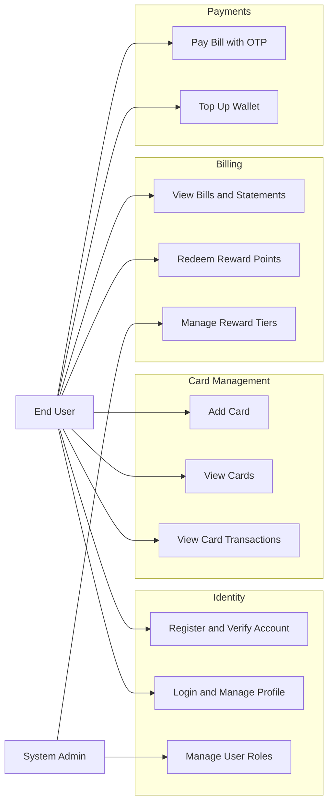
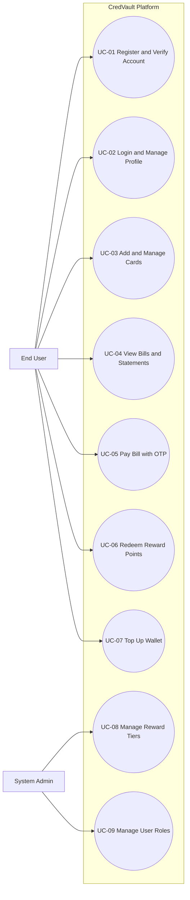

# Functional Use Case Specification

**System Name:** CredVault Credit Card Management Platform  
**Document Version:** 2.1.0  
**Date:** 2026-04-15  
**Target Audience:** Product Owners, Engineering Teams, QA Engineers, and Solution Architects

---

## 1. Document Control

| Version | Date | Author | Description of Changes |
|---------|------|--------|------------------------|
| 1.0.0 | 2026-04-01 | Engineering | Initial draft and basic use case flows |
| 2.0.0 | 2026-04-14 | Architecture Team | Expanded actor and use case coverage |
| 2.1.0 | 2026-04-15 | Engineering | Refined language, completed missing use case specifications, and aligned terminology |

---

## 2. Purpose

This document defines the functional behavior of the CredVault platform from the user and system interaction perspective. It describes who interacts with the system, what actions are supported, and what outcomes are expected under normal and exceptional conditions.

This specification focuses on business behavior. Technical design details such as internal class structures, database schemas, and deployment topology should be documented separately in design or architecture documents.

---

## 3. Actors

### 3.1 Primary Actors
- **End User (Cardholder):** A registered customer who manages cards, views bills, tops up wallet balance, and makes bill payments.
- **System Administrator (Admin):** An operational user who manages platform policies and privileged access.

### 3.2 Supporting Actors
- **Identity Service:** Authenticates users and issues JWT access tokens.
- **Message Broker (RabbitMQ):** Supports asynchronous communication between services.
- **Notification Service:** Sends transactional notifications such as OTPs and payment confirmations.

---

## 4. Functional Boundary Overview

The following diagram shows the major functional areas of the platform and the actions available to each actor.

*Figure 4.1: High-level functional boundary of the CredVault platform.*

---

## 5. Global Use Case Diagram

*Figure 5.1: Global use case view for the CredVault platform.*

---

## 6. Use Case Catalog

| Use Case ID | Name | Primary Actor | Trigger | Business Value |
|-------------|------|---------------|---------|----------------|
| UC-01 | Register and Verify Account | End User | User starts registration | Creates a verified account for platform access |
| UC-02 | Login and Manage Profile | End User | User requests access to the platform | Provides authenticated access and profile maintenance |
| UC-03 | Add and Manage Cards | End User | User links a card | Enables card-based billing and transaction tracking |
| UC-04 | View Bills and Statements | End User | User opens billing section | Provides visibility into outstanding and historical bills |
| UC-05 | Pay Bill with OTP | End User | User initiates bill payment | Executes secure bill settlement |
| UC-06 | Redeem Reward Points | End User | User chooses to apply rewards | Reduces payable amount using earned rewards |
| UC-07 | Top Up Wallet | End User | User adds funds to wallet | Supports prepaid bill payments |
| UC-08 | Manage Reward Tiers | Admin | Admin updates reward rules | Controls reward calculation policy |
| UC-09 | Manage User Roles | Admin | Admin changes a user role | Controls privileged access |

---

## 7. Detailed Use Case Specifications

### UC-01: Register and Verify Account
- **Description:** A new user creates an account and verifies ownership of the registered email address.
- **Primary Actor:** End User
- **Preconditions:** The user has a valid email address that is not already registered.
- **Postconditions:** A verified account is created and can be used for authentication.
- **Primary Flow:**
  1. The user opens the registration page.
  2. The user enters name, email address, and password.
  3. The system creates the account in a pending state.
  4. The system sends an OTP to the registered email address.
  5. The user submits the OTP.
  6. The system validates the OTP and activates the account.
- **Alternative and Exception Flows:**
  1. If the email address already exists, the system rejects the registration request.
  2. If the OTP is invalid or expired, the system prompts the user to request a new OTP.

### UC-02: Login and Manage Profile
- **Description:** A registered user signs in and manages profile information.
- **Primary Actor:** End User
- **Preconditions:** The user account is active and verified.
- **Postconditions:** The user receives an authenticated session and any allowed profile changes are saved.
- **Primary Flow:**
  1. The user opens the login page.
  2. The user submits email address and password.
  3. The system validates the credentials.
  4. The system issues a JWT token and grants access.
  5. The user opens the profile section.
  6. The user updates allowed profile fields.
  7. The system validates and stores the changes.
- **Alternative and Exception Flows:**
  1. If credentials are invalid, the system denies access and shows an error message.
  2. If the token is expired during a profile update, the user is required to authenticate again.

### UC-03: Add and Manage Cards
- **Description:** The user links a credit card and views linked card information in masked form.
- **Primary Actor:** End User
- **Preconditions:** The user is authenticated.
- **Postconditions:** The card is stored securely and appears in the user dashboard in masked form.
- **Primary Flow:**
  1. The user opens the card management page.
  2. The user enters card number, cardholder name, expiry date, and CVV.
  3. The system validates the card format.
  4. The system identifies the card network.
  5. The system stores the card data securely and masks sensitive information.
  6. The system displays the linked card in the dashboard.
- **Alternative and Exception Flows:**
  1. If the card fails validation, the system rejects the request.
  2. If the card is already linked, the system informs the user and prevents duplication.

### UC-04: View Bills and Statements
- **Description:** The user views outstanding bills, billing history, and statement documents.
- **Primary Actor:** End User
- **Preconditions:** The user is authenticated and has at least one linked card.
- **Postconditions:** The user can review current and historical billing information.
- **Primary Flow:**
  1. The user opens the billing dashboard.
  2. The system retrieves current outstanding bills.
  3. The system retrieves billing history and available statements.
  4. The user selects a bill or statement for detailed view.
  5. The system displays the selected details.
- **Alternative and Exception Flows:**
  1. If no bills are available, the system shows an empty-state message.
  2. If a statement file is unavailable, the system shows a retrieval error.

### UC-05: Pay Bill with OTP
- **Description:** The user pays an outstanding bill using wallet balance and confirms the transaction with OTP verification.
- **Primary Actor:** End User
- **Supporting Actors:** Message Broker, Notification Service
- **Preconditions:** The user is authenticated, has a payable bill, and has enough wallet balance.
- **Postconditions:** The payment is completed, wallet balance is reduced, and the bill status is updated.
- **Primary Flow:**
  1. The user selects a bill and enters the payment amount.
  2. The system creates a pending payment request.
  3. The system sends an OTP to the user.
  4. The user submits the OTP.
  5. The system validates the OTP.
  6. The payment workflow deducts wallet balance and updates the bill status.
  7. The system marks the payment as completed and sends confirmation.
- **Alternative and Exception Flows:**
  1. If the OTP is incorrect, the system rejects the attempt and allows retry within configured limits.
  2. If the retry limit is exceeded, the system marks the payment as failed.
  3. If a downstream payment step fails, the system triggers compensation to restore the previous consistent state.

### UC-06: Redeem Reward Points
- **Description:** The user applies available reward points to reduce the payable bill amount.
- **Primary Actor:** End User
- **Preconditions:** The user is authenticated, has reward points available, and initiates a payment or eligible billing action.
- **Postconditions:** Reward points are deducted from the balance and the payable amount is adjusted.
- **Primary Flow:**
  1. The user opens an eligible payment or billing screen.
  2. The system shows the available reward point balance.
  3. The user chooses to redeem reward points.
  4. The system calculates the monetary value of the selected points.
  5. The system reduces the payable amount and updates the reward balance.
- **Alternative and Exception Flows:**
  1. If the user has no available reward points, the system disables redemption.
  2. If the selected redemption exceeds policy limits, the system adjusts or rejects the request.

### UC-07: Top Up Wallet
- **Description:** The user adds funds to the wallet for future payments.
- **Primary Actor:** End User
- **Preconditions:** The user is authenticated.
- **Postconditions:** The wallet balance is increased and the transaction is recorded.
- **Primary Flow:**
  1. The user opens the wallet section.
  2. The user enters an amount greater than zero.
  3. The system validates the amount.
  4. The system records the wallet top-up transaction.
  5. The system updates the wallet balance.
- **Alternative and Exception Flows:**
  1. If the amount is invalid, the system rejects the request.
  2. If transaction recording fails, the system does not update the wallet balance.

### UC-08: Manage Reward Tiers
- **Description:** An administrator configures reward rules such as thresholds, percentages, or conversion values.
- **Primary Actor:** System Administrator
- **Preconditions:** The administrator is authenticated and has the required role.
- **Postconditions:** Updated reward rules are stored and used for future calculations.
- **Primary Flow:**
  1. The administrator opens the reward configuration page.
  2. The administrator updates reward parameters.
  3. The system validates the new values.
  4. The system stores the updated configuration.
- **Alternative and Exception Flows:**
  1. If the configuration values are invalid, the system rejects the update.
  2. If the administrator lacks required privileges, access is denied.

### UC-09: Manage User Roles
- **Description:** An administrator assigns or updates user roles for operational control.
- **Primary Actor:** System Administrator
- **Preconditions:** The administrator is authenticated and has permission to manage roles.
- **Postconditions:** The selected user's role is updated and audit information is recorded.
- **Primary Flow:**
  1. The administrator opens the user management page.
  2. The administrator selects a user account.
  3. The administrator assigns or changes the role.
  4. The system validates the request.
  5. The system updates the user's role and writes an audit record.
- **Alternative and Exception Flows:**
  1. If the target user does not exist, the system rejects the request.
  2. If the administrator attempts an unauthorized role change, the system denies the operation.

---

## 8. Cross-Cutting Business Rules

1. Financial operations must be idempotent to prevent duplicate processing.
2. Sensitive card data must be encrypted at rest and masked in all user-facing views.
3. All role changes, payment events, and wallet updates must be audit logged.
4. OTP validation is required for sensitive payment confirmation flows.
5. Distributed payment workflows must support compensation when any step fails after partial completion.

---

## 9. Notes

- This document should stay aligned with the UI, API contracts, and system behavior as the product evolves.
- Any new feature added to CredVault should include a matching entry in the use case catalog and, where necessary, a detailed use case specification.
