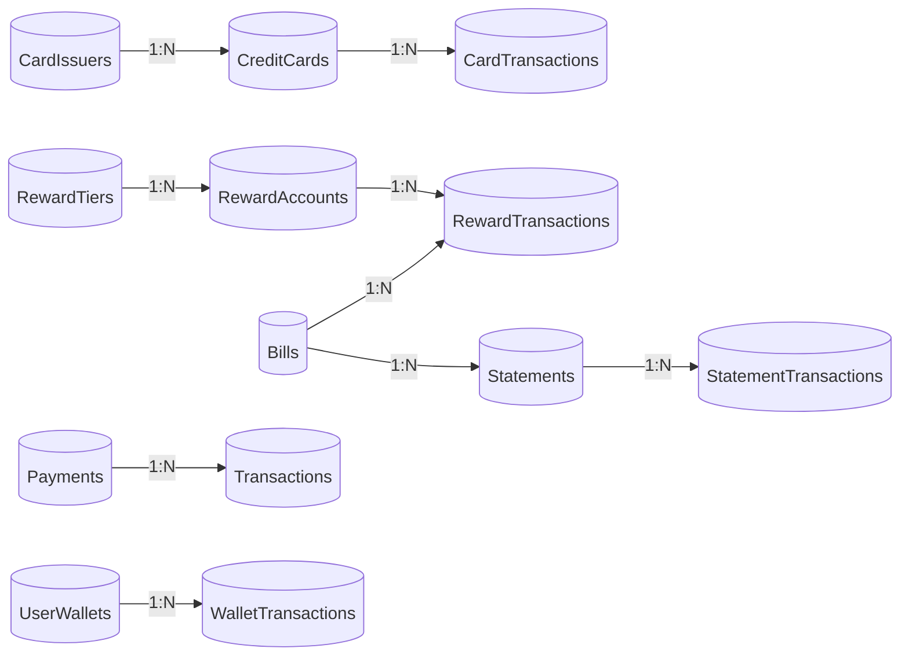
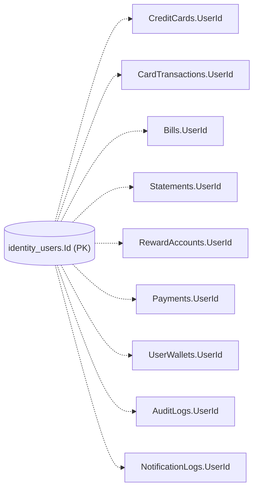
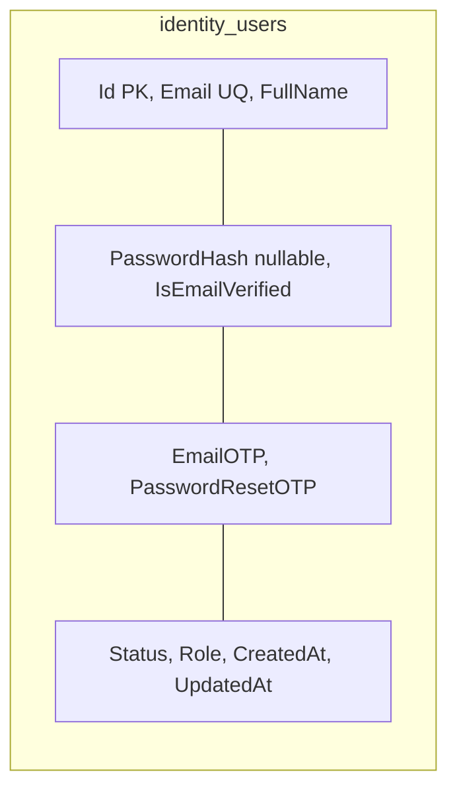
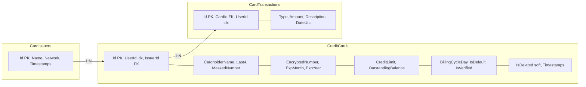
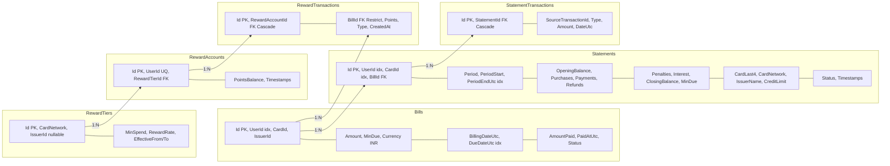
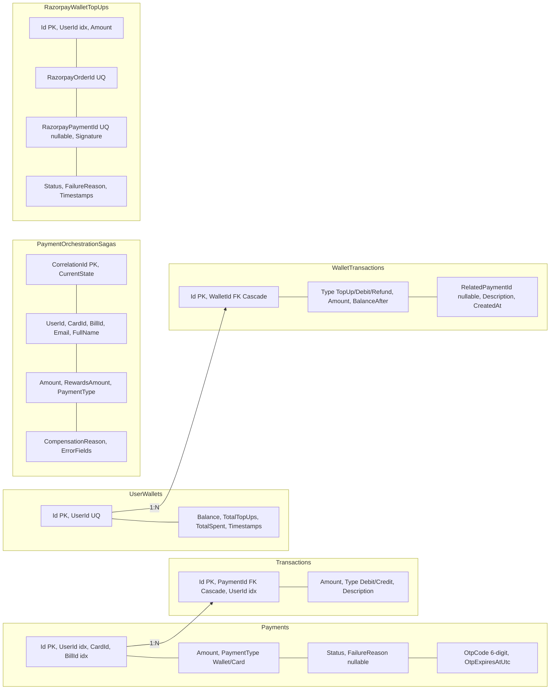
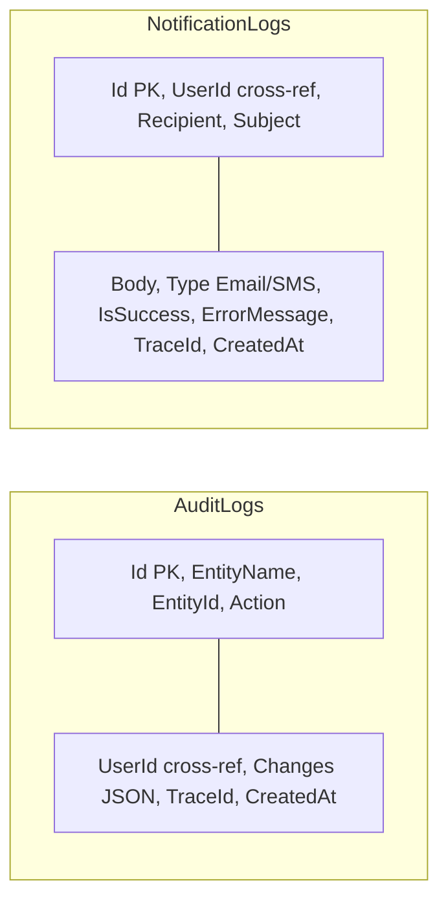
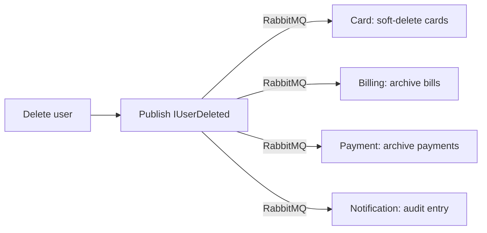
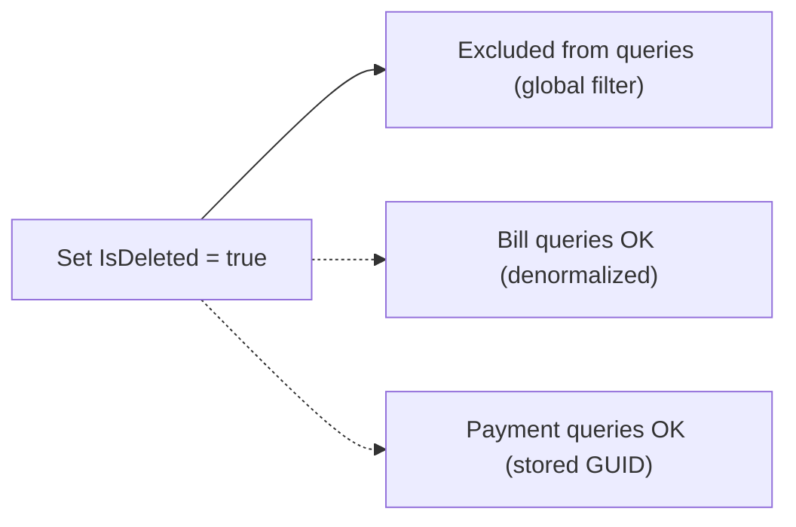

# Database Architecture — CredVault
**System:** CredVault Credit Card Management Platform  
**Version:** 1.0  
**Date:** April 2026
---
## 1. Overview
CredVault follows the **database-per-service** pattern. Each of the 5 microservices owns its own isolated SQL Server database. There are **no cross-service foreign key constraints** — referential integrity across services is maintained through event-driven communication and saga orchestration.
| Service | Database | Tables | ORM |
|---------|----------|:------:|-----|
| Identity | `credvault_identity` | 1 | EF Core (Code-First) |
| Card | `credvault_cards` | 3 | EF Core (Code-First) |
| Billing | `credvault_billing` | 6 | EF Core (Code-First) |
| Payment | `credvault_payments` | 6 | EF Core (Code-First) |
| Notification | `credvault_notifications` | 2 | EF Core (Code-First) |
**Total:** 5 databases, 18 tables, 0 cross-service FK constraints.
---
## 2. Cross-Service Relationship Architecture
### 2.1 The Core Principle

**Legend:** Solid arrows = Physical FKs (within same DB). No arrows between services = No cross-service FKs.
### 2.2 Logical References (GUIDs, No FK Constraints)

The `identity_users.Id` is referenced by 9 columns across 4 databases — none enforced as foreign keys.
### 2.3 Complete Cross-Service Reference Map
| Source Table | Column | Target Table | Consistency |
|--------------|--------|--------------|-------------|
| CreditCards | UserId | identity_users | Event-driven |
| CardTransactions | UserId | identity_users | Event-driven |
| CardTransactions | CardId | CreditCards | **Physical FK** |
| Bills | UserId | identity_users | Event-driven |
| Bills | CardId | CreditCards | Event-driven |
| Bills | IssuerId | CardIssuers | Event-driven |
| Statements | UserId | identity_users | Event-driven |
| Statements | CardId | CreditCards | Event-driven |
| Statements | BillId | Bills | **Physical FK** |
| RewardAccounts | UserId | identity_users | Event-driven |
| RewardAccounts | RewardTierId | RewardTiers | **Physical FK** |
| RewardTransactions | RewardAccountId | RewardAccounts | **Physical FK** |
| RewardTransactions | BillId | Bills | **Physical FK** |
| Payments | UserId | identity_users | Event-driven + Saga |
| Payments | CardId | CreditCards | Event-driven + Saga |
| Payments | BillId | Bills | Event-driven + Saga |
| Transactions | PaymentId | Payments | **Physical FK** |
| UserWallets | UserId | identity_users | Event-driven |
| WalletTransactions | WalletId | UserWallets | **Physical FK** |
| AuditLogs | UserId | identity_users | Logging only |
| NotificationLogs | UserId | identity_users | Logging only |
---
## 3. Per-Service Database Details
### 3.1 credvault_identity (1 table)

- **PK:** Id | **UQ:** Email
- `PasswordHash` nullable for Google SSO users
- OTPs are 6-digit, regenerated on each request
### 3.2 credvault_cards (3 tables)

**Physical FKs:** `CreditCards.IssuerId` → `CardIssuers.Id` (Restrict), `CardTransactions.CardId` → `CreditCards.Id` (Restrict)  
**Query Filters:** `IsDeleted = false` on CreditCards (global filter)
### 3.3 credvault_billing (6 tables)

**Physical FKs:** `Statements.BillId` → `Bills.Id` (Restrict), `StatementTransactions.StatementId` → `Statements.Id` (Cascade), `RewardAccounts.RewardTierId` → `RewardTiers.Id` (Restrict), `RewardTransactions.RewardAccountId` → `RewardAccounts.Id` (Cascade), `RewardTransactions.BillId` → `Bills.Id` (Restrict)
### 3.4 credvault_payments (6 tables)

**Physical FKs:** `Transactions.PaymentId` → `Payments.Id` (Cascade), `WalletTransactions.WalletId` → `UserWallets.Id` (Cascade)  
**Notes:** `PaymentOrchestrationSagas` is the MassTransit saga state table. `RazorpayOrderId` and `RazorpayPaymentId` have unique constraints for idempotency.
### 3.5 credvault_notifications (2 tables)

- No physical FKs in this database
- `TraceId` enables distributed request tracing
- Both tables are append-only (no updates/deletes)
---
## 4. Data Consistency Strategy
Since there are no cross-service foreign key constraints, data consistency is maintained through:
| Mechanism | Purpose | Implementation |
|-----------|---------|----------------|
| Saga Pattern | Distributed transaction consistency | MassTransit state machine with compensation |
| Event Publishing | Propagate changes across services | RabbitMQ pub/sub via MassTransit |
| Outbox Pattern | Prevent lost messages | `UseInMemoryOutbox()` on all publishers |
| Retry Policies | Handle transient failures | Exponential backoff: 1s → 5s → 15s |
| Idempotency | Safe message reprocessing | CorrelationId-based deduplication |
| Soft Deletes | Preserve referential integrity | `IsDeleted` flag on CreditCards |
| Denormalization | Reduce cross-service queries | CardLast4, CardNetwork, IssuerName stored in Bills/Statements |
### 4.1 What Happens When a User is Deleted?

The `IUserDeleted` event consumer is implemented in each service, but the publisher in Identity Service needs to be wired up to a delete endpoint.
### 4.2 What Happens When a Card is Soft-Deleted?

Because Bills and Statements store CardLast4, CardNetwork, and IssuerName as denormalized columns, they remain queryable even after a card is deleted.
---
## 5. Physical Foreign Key Summary
All physical FKs exist **only within a single service's database**:
| Service | Table | Column | References | Delete Behavior |
|---------|-------|--------|------------|-----------------|
| Card | CreditCards | IssuerId | CardIssuers.Id | Restrict |
| Card | CardTransactions | CardId | CreditCards.Id | Restrict |
| Billing | Statements | BillId | Bills.Id | Restrict |
| Billing | StatementTransactions | StatementId | Statements.Id | Cascade |
| Billing | RewardAccounts | RewardTierId | RewardTiers.Id | Restrict |
| Billing | RewardTransactions | RewardAccountId | RewardAccounts.Id | Cascade |
| Billing | RewardTransactions | BillId | Bills.Id | Restrict |
| Payment | Transactions | PaymentId | Payments.Id | Cascade |
| Payment | WalletTransactions | WalletId | UserWallets.Id | Cascade |
**Total physical FKs:** 9 | **Total cross-service FKs:** 0
---
## 6. Index Strategy
### Cross-Service Reference Indexes
| Database | Table | Column | Index Type | Purpose |
|----------|-------|--------|------------|---------|
| credvault_cards | CreditCards | UserId | Non-clustered | Find cards by user |
| credvault_cards | CardTransactions | UserId | Non-clustered | Find transactions by user |
| credvault_billing | Bills | UserId | Non-clustered | Find bills by user |
| credvault_billing | Bills | DueDateUtc | Non-clustered | Find overdue bills |
| credvault_billing | Statements | UserId | Non-clustered | Find statements by user |
| credvault_billing | Statements | CardId | Non-clustered | Find statements by card |
| credvault_billing | Statements | PeriodEndUtc | Non-clustered | Find statements by period |
| credvault_billing | RewardAccounts | UserId | **Unique** | One reward account per user |
| credvault_payments | Payments | UserId | Non-clustered | Find payments by user |
| credvault_payments | Payments | BillId | Non-clustered | Find payments by bill |
| credvault_payments | UserWallets | UserId | **Unique** | One wallet per user |
| credvault_payments | WalletTransactions | CreatedAtUtc | Non-clustered | Find transactions by date |
| credvault_payments | RazorpayWalletTopUps | RazorpayOrderId | **Unique** | Idempotent webhook handling |
| credvault_payments | RazorpayWalletTopUps | RazorpayPaymentId | **Unique** | Idempotent webhook handling |
---
*End of Database Architecture Document*