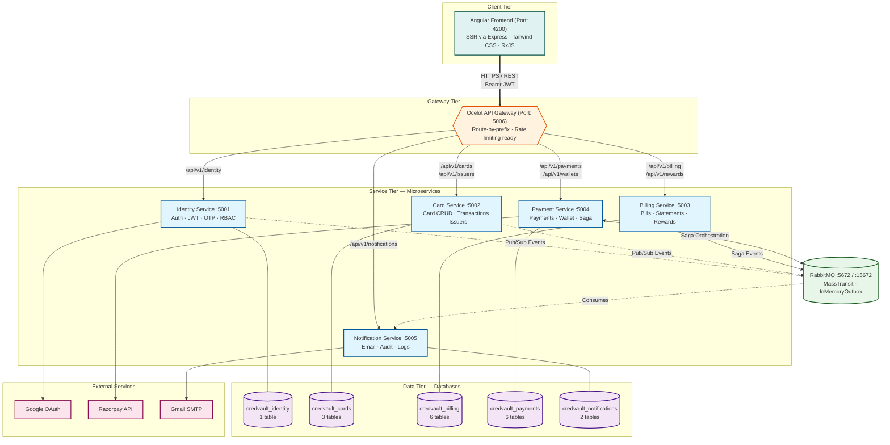
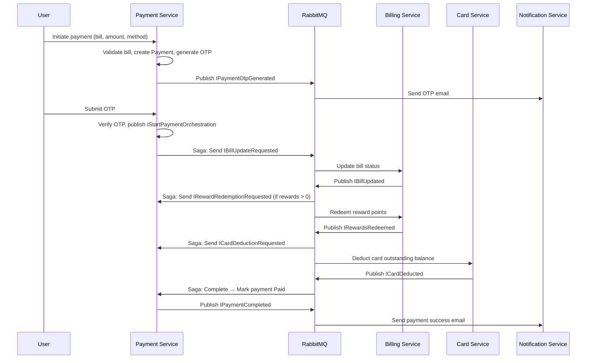

# High-Level Design (HLD) — CredVault

## 1. Overview

| Field | Details |
|-------|---------|
| **System Name** | CredVault |
| **Type** | Enterprise Credit Card Management Platform |
| **Architecture Style** | Microservices with Event-Driven Communication + Saga Orchestration |
| **Primary Domain** | Financial Services / Credit Card Management |

### Purpose
CredVault is a production-grade credit card management platform that enables users to register, manage credit cards, generate bills, process payments, earn and redeem rewards, and maintain a digital wallet. It serves as a self-learning project demonstrating enterprise microservices patterns: CQRS, Saga orchestration, event-driven communication, API Gateway routing, and the outbox pattern.

### Scope

**In Scope:**
- User registration with email OTP verification and Google OAuth SSO
- Credit card lifecycle management (add, view, manage, soft-delete)
- Automated bill generation and statement creation
- Rewards point system with tier-based earning rates
- Wallet-based and card-direct payments with OTP 2FA
- Distributed transaction management via Saga pattern
- Email notifications for all critical system events
- Admin panel for user, card, billing, and reward management

**Out of Scope:**
- Real-time payment gateway integration for bill payments (simulated via saga)
- SMS notifications (email only via Gmail SMTP)
- Mobile native applications (web-only via Angular SPA)
- Multi-currency support (USD only)
- Third-party card issuer API integrations

---

## 2. Goals & Non-Goals

### Functional Goals
1. User registration, email OTP verification, and Google OAuth SSO login
2. Credit card CRUD operations with encrypted storage and soft-delete
3. Bill generation and statement aggregation from card transactions
4. Secure payment processing with OTP 2FA and saga orchestration
5. Rewards system with tier-based earning and redemption during payments
6. Wallet management with Razorpay top-ups
7. Email notifications for registration, OTP, card addition, and payment events
8. Admin capabilities for user, card, billing, and reward tier management

### Non-Goals
- Real bank/card network integrations (simulated via internal services)
- Push notifications or mobile app support
- Fraud detection or ML-based risk scoring
- Multi-tenant SaaS architecture (single-tenant design)
- Real-time streaming analytics or dashboards

---

## 3. Requirements

### Functional Requirements

| ID | Requirement | Service |
|----|-------------|---------|
| FR-01 | User registration with email, name, password | Identity |
| FR-02 | Email OTP verification (6-digit, 10-min expiry) | Identity |
| FR-03 | Google OAuth SSO login | Identity |
| FR-04 | Password reset via OTP | Identity |
| FR-05 | User profile management (view, update, change password) | Identity |
| FR-06 | Add/update/delete credit cards (soft-delete) | Card |
| FR-07 | Card number encryption at rest (AES) | Card |
| FR-08 | Record card transactions (purchase, payment, refund) | Card |
| FR-09 | Card issuer management | Card |
| FR-10 | Generate bills for cards | Billing |
| FR-11 | Create statements with transaction breakdown | Billing |
| FR-12 | Reward account management (earn, redeem, reverse) | Billing |
| FR-13 | Reward tier configuration (network/issuer specific) | Billing |
| FR-14 | Initiate payment with OTP 2FA (6-digit, 5-min expiry) | Payment |
| FR-15 | Orchestrate distributed payment via Saga pattern | Payment |
| FR-16 | Wallet management (create, top-up, debit, refund) | Payment |
| FR-17 | Razorpay integration for wallet top-ups | Payment |
| FR-18 | Email notifications for all critical events | Notification |
| FR-19 | Audit logging for all entity changes | Notification |
| FR-20 | Admin user management (list, update status/role, stats) | Identity |
| FR-21 | Admin card management (list, update, view transactions) | Card |
| FR-22 | Admin bill generation and overdue checking | Billing |
| FR-23 | Admin reward tier CRUD | Billing |
| FR-24 | Admin notification and audit log viewing | Notification |

### Non-Functional Requirements

| Requirement | Specification |
|-------------|---------------|
| **Scalability** | Each service scales independently; stateless services behind API Gateway |
| **Availability** | Services are autonomous; one service failure doesn't cascade to others |
| **Consistency** | Eventual consistency via RabbitMQ events and Saga compensation |
| **Performance** | Async communication for non-critical paths; CQRS for read-heavy operations |
| **Security** | JWT Bearer auth, RBAC (User/Admin), AES card encryption, OTP 2FA for payments, BCrypt password hashing |
| **Reliability** | Exponential backoff retry (1s → 5s → 15s, 3 attempts); InMemory Outbox pattern |
| **Maintainability** | Clean Architecture per service; Shared.Contracts library; consistent patterns |
| **Observability** | Structured logging via Serilog; correlation IDs across services; audit trails |
| **Portability** | Docker Compose for local development; each service containerized |
| **Uptime Target** | 99.5% (development/self-learning project; production would target 99.9%+) |

---

## 4. System Architecture

### Architecture Style
**Microservices with Event-Driven Communication + Saga Orchestration**

The system is organized into five logical tiers with clear separation of concerns. Services communicate synchronously via the API Gateway (client-facing) and asynchronously via RabbitMQ (inter-service).

### High-Level Architecture Diagram



### Key Components

| Component | Technology | Responsibility |
|-----------|------------|----------------|
| **Angular Frontend** | Angular 21, TypeScript, Tailwind CSS | User interface, SSR via Express, JWT management in sessionStorage |
| **Ocelot API Gateway** | Ocelot (.NET) | Request routing by prefix, rate limiting, single entry point |
| **Identity Service** | .NET 8/10, EF Core, MediatR | User registration, authentication, JWT issuance, OTP lifecycle, RBAC |
| **Card Service** | .NET 8/10, EF Core, MediatR | Card CRUD, transaction recording, issuer management, AES encryption |
| **Billing Service** | .NET 8/10, EF Core, MediatR | Bill generation, statement creation, reward accounts, reward tiers |
| **Payment Service** | .NET 8/10, EF Core, MediatR, MassTransit | Payment flow, OTP 2FA, wallet operations, Saga orchestration, Razorpay |
| **Notification Service** | .NET 8/10, EF Core, MassTransit | Email delivery (Gmail SMTP), audit logging, notification tracking |
| **RabbitMQ** | RabbitMQ 3.12, MassTransit | Async pub/sub messaging, saga event routing, retry policies |
| **SQL Server 2022** | SQL Server, EF Core Code-First | 5 isolated databases, auto-migrations on startup |

### Service Responsibilities Matrix

| Feature | Identity | Card | Billing | Payment | Notification |
|---------|:--------:|:----:|:-------:|:-------:|:------------:|
| User Registration | **Primary** | — | — | — | Email |
| Authentication | **Primary** | Validates JWT | Validates JWT | Validates JWT | — |
| User Management | **Primary** | — | — | — | Audit |
| Card CRUD | — | **Primary** | — | Deduction (saga) | Email |
| Bill Generation | — | — | **Primary** | — | — |
| Statement Creation | — | — | **Primary** | — | — |
| Rewards System | — | — | **Primary** | Redeem (saga) | — |
| Payment Initiation | — | — | — | **Primary** | OTP Email |
| Wallet Management | — | — | — | **Primary** | — |
| Email Notifications | Publishes event | Publishes event | — | Publishes event | **Primary** |
| Audit Logging | — | — | — | — | **Primary** |

---

## 5. Data Flow

### 5.1 Communication Patterns

| Pattern | Type | Protocol | Direction | Usage |
|---------|------|----------|-----------|-------|
| Client → Gateway | Sync | HTTPS | External | All user-facing API calls |
| Gateway → Service | Sync | HTTP (internal) | Internal | Request routing by prefix |
| Service → Service (Pub/Sub) | Async | RabbitMQ/AMQP | Internal | Domain events (registration, card added) |
| Service → Service (Saga) | Async | RabbitMQ/AMQP | Internal | Distributed payment orchestration |
| Service → Database | Sync | TCP/SQL | Internal | Data persistence via EF Core |
| Service → External | Sync | HTTPS/SMTP | External | Google OAuth, Razorpay, Gmail |

### 5.2 API Gateway Routing

| Route Prefix | Destination Service | Port |
|--------------|---------------------|:----:|
| `/api/v1/identity/` | Identity Service | 5001 |
| `/api/v1/cards/` | Card Service | 5002 |
| `/api/v1/issuers/` | Card Service | 5002 |
| `/api/v1/billing/` | Billing Service | 5003 |
| `/api/v1/rewards/` | Billing Service | 5003 |
| `/api/v1/payments/` | Payment Service | 5004 |
| `/api/v1/wallets/` | Payment Service | 5004 |
| `/api/v1/notifications/` | Notification Service | 5005 |

### 5.3 Event Routing

| Event | Publisher | Consumer(s) | Purpose |
|-------|-----------|-------------|---------|
| `IUserRegistered` | Identity | Notification | Send welcome email |
| `IUserOtpGenerated` | Identity | Notification | Send OTP email |
| `ICardAdded` | Card | Notification | Send card confirmation email |
| `IPaymentOtpGenerated` | Payment | Notification | Send payment OTP email |
| `IStartPaymentOrchestration` | Payment | Payment (Saga) | Trigger payment saga |
| `IBillUpdateRequested` | Payment (Saga) | Billing | Update bill status |
| `IBillUpdated` | Billing | Payment (Saga) | Confirm bill update |
| `IRewardRedemptionRequested` | Payment (Saga) | Billing | Redeem reward points |
| `IRewardsRedeemed` | Billing | Payment (Saga) | Confirm reward redemption |
| `ICardDeductionRequested` | Payment (Saga) | Card | Deduct card balance |
| `ICardDeducted` | Card | Payment (Saga) | Confirm card deduction |
| `IPaymentCompleted` | Payment (Saga) | Notification | Send payment success email |
| `IPaymentCompensated` | Payment (Saga) | Notification | Send payment failure email |

### 5.4 Payment Saga Flow



---

## 6. Database Design (High-Level)

### Database-per-Service Strategy

Each service owns its own isolated database. No cross-service foreign key constraints exist.

| Database | Service | Tables | Key Entities |
|----------|---------|:------:|--------------|
| `credvault_identity` | Identity | 1 | `IdentityUser` |
| `credvault_cards` | Card | 3 | `CreditCard`, `CardTransaction`, `CardIssuer` |
| `credvault_billing` | Billing | 6 | `Bill`, `Statement`, `StatementTransaction`, `RewardAccount`, `RewardTier`, `RewardTransaction` |
| `credvault_payments` | Payment | 6 | `Payment`, `Transaction`, `UserWallet`, `WalletTransaction`, `PaymentOrchestrationSagaState`, `RazorpayWalletTopUp` |
| `credvault_notifications` | Notification | 2 | `AuditLog`, `NotificationLog` |

### Database Types

- **All databases**: SQL Server 2022 (relational)
- **ORM**: EF Core Code-First with auto-migrations on startup
- **Isolation**: Each service has its own DbContext; no shared tables
- **Consistency**: Eventual consistency via RabbitMQ events and Saga compensation

---

## 7. External Integrations

| Integration | Service | Protocol | Purpose | Key Details |
|-------------|---------|----------|---------|-------------|
| **Google OAuth** | Identity Service | HTTPS / OIDC | Passwordless SSO login | Validates Google IdToken with public keys; auto-creates user if new |
| **Razorpay** | Payment Service | HTTPS / REST | Wallet top-up payment processing | Creates orders, verifies HMAC-SHA256 webhook signatures, handles duplicates |
| **Gmail SMTP** | Notification Service | SMTP | Transactional email delivery | Used for OTP emails, welcome emails, card confirmations, payment notifications |

---

## 8. Scalability Strategy

### Horizontal Scaling
- All 5 microservices are **stateless** behind the API Gateway
- Each service can be scaled independently based on load
- Docker Compose supports multiple replicas per service

### Load Balancing
- **Ocelot API Gateway** acts as the single entry point and load balancer
- Route-by-prefix configuration distributes requests to appropriate services
- Rate limiting capability ready for production

### Caching Strategy
- **No distributed cache** (Redis) in current design — appropriate for self-learning scope
- CQRS pattern separates reads from writes, allowing future read-model caching
- JWT tokens cached client-side in sessionStorage (cleared on tab close)

### Database Scaling
- Each service owns its database — can be moved to separate SQL Server instances
- EF Core query optimization via indexed foreign keys (e.g., `UserId` on CreditCards)

---

## 9. Reliability & Fault Tolerance

### Retry Mechanisms
- **MassTransit consumers**: Exponential backoff — 1s → 5s → 15s (3 attempts)
- Applied to all event consumers across all services

### Circuit Breakers
- Not explicitly implemented (self-learning scope)
- Service autonomy prevents cascade failures — if one service is down, others continue operating

### Failover Strategy
- **Database per service**: Failure in one database doesn't affect others
- **Saga compensation**: If a distributed transaction step fails, all completed steps are reversed
- **Outbox pattern**: `UseInMemoryOutbox()` prevents message loss during service restarts
- **Idempotency**: Saga uses `CorrelationId` (GUID) as primary key; duplicate events are ignored

### Saga Reliability
| Mechanism | Configuration |
|-----------|---------------|
| **Outbox** | `UseInMemoryOutbox()` — prevents lost messages during restart |
| **Retry** | Exponential backoff: 1s → 5s → 15s (3 attempts) |
| **Timeout** | 30 seconds per step; triggers compensation |
| **Idempotency** | CorrelationId (GUID) as saga PK; duplicates ignored |
| **Persistence** | `PaymentOrchestrationSagas` table tracks current state |

---

## 10. Security Overview

### Authentication
| Aspect | Configuration |
|--------|---------------|
| **Token Type** | JWT Bearer |
| **Issuer** | Identity Service |
| **Audience** | All services (shared config) |
| **Expiry** | 60 minutes |
| **Clock Skew** | 30 seconds tolerance |
| **Token Payload** | `sub` (UserId), `email`, `name`, `role`, `iss`, `aud`, `exp` |
| **Client Storage** | `sessionStorage` (cleared on tab close) |

### Authorization
| Role | Access |
|------|--------|
| **Public** | Registration, login, OTP verification, password reset |
| **User** | Own cards, bills, payments, wallet, profile |
| **Admin** | All user management, card management, bill generation, reward tiers, logs |

### Data Protection
| Data | Protection |
|------|------------|
| **Card Numbers** | AES encryption at rest; only last 4 digits stored plain |
| **Passwords** | BCrypt hashing (nullable for Google SSO users) |
| **OTPs** | 6-digit codes with expiry (10 min for email, 5 min for payment) |
| **API Transport** | HTTPS for all external communication |
| **Webhook Signatures** | HMAC-SHA256 verification for Razorpay callbacks |

---

## 11. Deployment Architecture

### Cloud Provider
- **Current**: Docker Compose for local development
- **Future**: AWS/EKS or Azure AKS for production container orchestration

### Docker Compose Services

```yaml
services:
  identity-service:       # Port 5001 — User auth & management
  card-service:           # Port 5002 — Card CRUD & transactions
  billing-service:        # Port 5003 — Bills, statements, rewards
  payment-service:        # Port 5004 — Payments, wallet, saga
  notification-service:   # Port 5005 — Email, audit, logs
  gateway:                # Port 5006 — Ocelot API Gateway (exposed)
  rabbitmq:               # Port 5672, Management UI: 15672
  sqlserver:              # Port 1433 — All 5 databases
  frontend:               # Port 4200 — Angular SPA (dev)
```

### Network Topology

| Zone | Components | Accessibility |
|------|------------|---------------|
| **Public Zone** | Gateway (5006), Frontend (4200) | Reachable from host/browser |
| **Private Zone** | All 5 microservices | Only reachable via Gateway or internal Docker DNS |
| **Data Zone** | SQL Server (1433), RabbitMQ (5672) | Only reachable by services on Docker bridge network |

### CI/CD Pipeline (Recommended)
- **Source Control**: GitHub
- **CI**: GitHub Actions — build, test, lint on every push
- **CD**: Docker image build → push to registry → deploy to Docker Compose or Kubernetes
- **Environments**: Dev (local Docker Compose), Staging, Production

### Data Management
| Aspect | Strategy |
|--------|----------|
| **Migrations** | EF Core `Database.Migrate()` on service startup |
| **Seed Data** | Card issuers (Visa, Mastercard, Rupay, Amex), default reward tiers |
| **Persistence** | Docker volumes for SQL Server data and RabbitMQ state |
| **Internal DNS** | Services communicate via Docker service names (e.g., `http://identity-api:80`) |

---

## 12. Trade-offs & Decisions

### Why Microservices Over Monolith?
- **Decision**: Microservices with 5 separate services
- **Rationale**: Demonstrates distributed system patterns (Saga, CQRS, event-driven); each service can be developed, tested, and deployed independently
- **Alternative**: Monolith would be simpler but wouldn't showcase enterprise patterns

### Why RabbitMQ Over Kafka?
- **Decision**: RabbitMQ with MassTransit
- **Rationale**: Simpler setup for development; MassTransit provides excellent .NET integration with built-in saga support; sufficient for the message volume of this project
- **Alternative**: Kafka would be overkill for this scale and lacks native saga orchestration

### Why SQL Server Over PostgreSQL/NoSQL?
- **Decision**: SQL Server 2022 for all databases
- **Rationale**: Strong EF Core support; ACID compliance needed for financial data; consistent technology across services simplifies development
- **Alternative**: PostgreSQL would work equally well; NoSQL not needed given relational data model

### Why MassTransit InMemory Outbox Over Transactional Outbox?
- **Decision**: `UseInMemoryOutbox()`
- **Rationale**: Simpler implementation; adequate for development/self-learning; avoids additional database table per service
- **Alternative**: Transactional outbox with a separate OutboxEvents table would be more production-resilient

### Why Saga Choreography Over Orchestration?
- **Decision**: MassTransit State Machine (orchestration-based)
- **Rationale**: Centralized state tracking in Payment Service makes debugging easier; clear compensation paths; state persisted for recovery
- **Alternative**: Pure choreography (event-based without central state) would be harder to trace and debug

### Why No Redis/Distributed Cache?
- **Decision**: No caching layer
- **Rationale**: Read operations are not a bottleneck for a self-learning project; CQRS already separates reads from writes
- **Alternative**: Redis could be added later for read-heavy endpoints (e.g., user profile, reward balance)

---

*End of High-Level Design Document*
