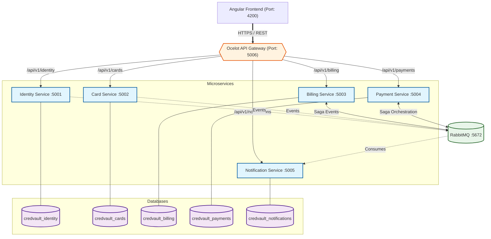
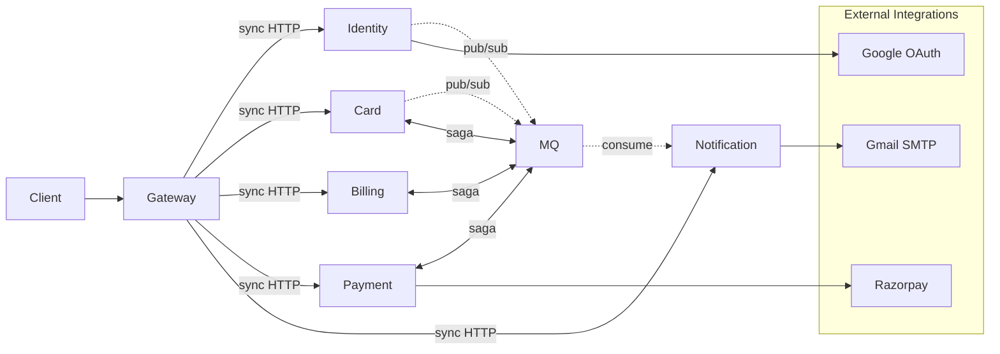

# High-Level Design (HLD) — CredVault

## System Overview

| Field   | Details |
|--------|--------|
| System | CredVault Credit Card Management Platform |
| Version | 1.0 |
| Date | April 2026 |

---

## 1. Introduction

CredVault is an enterprise-grade credit card management platform built using a microservices architecture.

It supports:
- User authentication  
- Credit card lifecycle management  
- Automated billing  
- Rewards and points system  
- OTP-based secure payments  
- Wallet operations  

This document outlines:
- System macro-architecture  
- Service boundaries  
- Communication patterns  
- Technology decisions  
---
## 2. System Architecture
CredVault follows a **microservices architecture** with an **API Gateway** as the single entry point. The system consists of:
- **1 Angular Frontend** (client SPA with SSR support)
- **1 Ocelot API Gateway** (request routing)
- **5 Backend Microservices** (each with its own database)
- **1 RabbitMQ Message Broker** (async inter-service communication)
### 2.1 Architecture Diagram

---
## 3. Service Boundaries
### 3.1 Responsibility Matrix
| Service | Responsibility | Port | Database |
|---------|----------------|:----:|----------|
| **Identity** | User auth, JWT, OTP, profile management, RBAC | 5001 | `credvault_identity` |
| **Card** | Card CRUD, transactions, issuer management | 5002 | `credvault_cards` |
| **Billing** | Bills, statements, rewards points, reward tiers | 5003 | `credvault_billing` |
| **Payment** | Payment flow, OTP 2FA, wallet, saga orchestration, Razorpay | 5004 | `credvault_payments` |
| **Notification** | Email delivery (Gmail SMTP), audit logs, notification logs | 5005 | `credvault_notifications` |
### 3.2 Service Independence
Each service:
- Owns its database (no shared tables across services)
- Has no cross-service foreign key constraints
- Communicates with other services only via the Gateway (sync) or RabbitMQ (async)
- Can be deployed, scaled, and restarted independently
---
## 4. Communication Patterns
### 4.1 Synchronous (REST over HTTP)
| Direction | Usage |
|-----------|-------|
| Client → Gateway → Service | All user-facing API calls |
The Gateway routes requests based on URL prefix:
| Route Prefix | Destination |
|--------------|-------------|
| `/api/v1/identity/` | Identity Service |
| `/api/v1/cards/` | Card Service |
| `/api/v1/issuers/` | Card Service |
| `/api/v1/billing/` | Billing Service |
| `/api/v1/payments/` | Payment Service |
| `/api/v1/wallets/` | Payment Service |
| `/api/v1/notifications/` | Notification Service |
### 4.2 Asynchronous (RabbitMQ via MassTransit)
| Pattern | Usage |
|---------|-------|
| **Pub/Sub** | Event notifications (user registered, card added, payment OTP) |
| **Saga Orchestration** | Distributed payment transactions (Payment ↔ Billing ↔ Card) |
Key events:
- `IUserRegistered` → Identity publishes, Notification consumes (sends welcome email)
- `ICardAdded` → Card publishes, Notification consumes (sends confirmation email)
- `IPaymentOtpGenerated` → Payment publishes, Notification consumes (sends OTP email)
- Saga events → Payment orchestrates with Billing and Card services
### 4.3 Communication Summary

---
## 5. Technology Stack
| Layer | Technology |
|-------|------------|
| **Frontend** | Angular 21.2, TypeScript 5.9, Tailwind CSS 4.2, Chart.js 4.5, RxJS 7.8 |
| **Gateway** | Ocelot API Gateway |
| **Backend** | .NET 8/10, ASP.NET Core Web API, C# |
| **Messaging** | RabbitMQ 3.12, MassTransit (with InMemoryOutbox) |
| **Database** | SQL Server 2022, Entity Framework Core (Code-First) |
| **Auth** | JWT Bearer tokens, Google OAuth (SSO) |
| **Payments** | Razorpay (wallet top-ups) |
| **Email** | Gmail SMTP |
| **Logging** | Serilog (structured, rolling daily logs) |
| **Validation** | FluentValidation |
| **Containerization** | Docker, Docker Compose |
---
## 6. Architectural Patterns
| Pattern | Implementation |
|---------|----------------|
| **Microservices** | 5 autonomous services, database-per-service |
| **API Gateway** | Ocelot routes all client requests by URL prefix |
| **Clean Architecture** | Domain → Application → Infrastructure → API per service |
| **CQRS** | MediatR separates Commands (writes) from Queries (reads) |
| **Saga Pattern** | MassTransit State Machine orchestrates distributed payments with compensation |
| **Event-Driven** | RabbitMQ pub/sub for async inter-service communication |
| **Outbox Pattern** | MassTransit `UseInMemoryOutbox()` prevents lost messages |
| **Retry Policy** | Exponential backoff (1s → 5s → 15s) on all consumers |
| **RBAC** | User and Admin roles enforced at service level |
| **Soft Deletes** | Cards use `IsDeleted` flag instead of physical deletion |
---
## 7. Security Architecture
### 7.1 Authentication
- **JWT Bearer tokens** issued by Identity Service
- All services validate JWT using shared configuration
- Token payload: `sub`, `email`, `name`, `role`, `iss`, `aud`, `exp`
- 60-minute expiry, 30-second clock skew tolerance
### 7.2 Authorization
| Role | Access |
|------|--------|
| **Public** | Registration, login, OTP verification |
| **User** | Own cards, bills, payments, wallet, profile |
| **Admin** | All user management, card management, bill generation, reward tiers, logs |
### 7.3 Data Protection
- Card numbers encrypted at rest (AES)
- Passwords hashed with BCrypt
- OTPs for email verification, password reset, and payments
- TLS for all external communication
---
## 8. External Integrations
| Integration | Service | Purpose |
|-------------|---------|---------|
| **Google OAuth** | Identity Service | Passwordless SSO login |
| **Razorpay** | Payment Service | Wallet top-up payment processing |
| **Gmail SMTP** | Notification Service | Email delivery (OTP, confirmations, alerts) |
---
## 9. Deployment View
### 9.1 Docker Compose Services
```yaml
services:
  identity-service:       # Port 5001
  card-service:           # Port 5002
  billing-service:        # Port 5003
  payment-service:        # Port 5004
  notification-service:   # Port 5005
  gateway:                # Port 5006 (exposed to host)
  rabbitmq:               # Port 5672, Management UI: 15672
  sqlserver:              # Port 1433
```
### 9.2 Network Isolation
- **Public Zone**: Only Gateway (5006) is reachable from outside
- **Private Zone**: All services, databases, and RabbitMQ on isolated Docker bridge network
- Services communicate via internal DNS names (e.g., `http://identity-api:80`)
### 9.3 Data Persistence
- Docker volumes for SQL Server data and RabbitMQ state
- Each service runs EF Core migrations on startup (`Database.Migrate()`)
- Seed data: Card issuers (Visa, Mastercard, Rupay, Amex), default reward tiers
---
*End of High-Level Design Document*