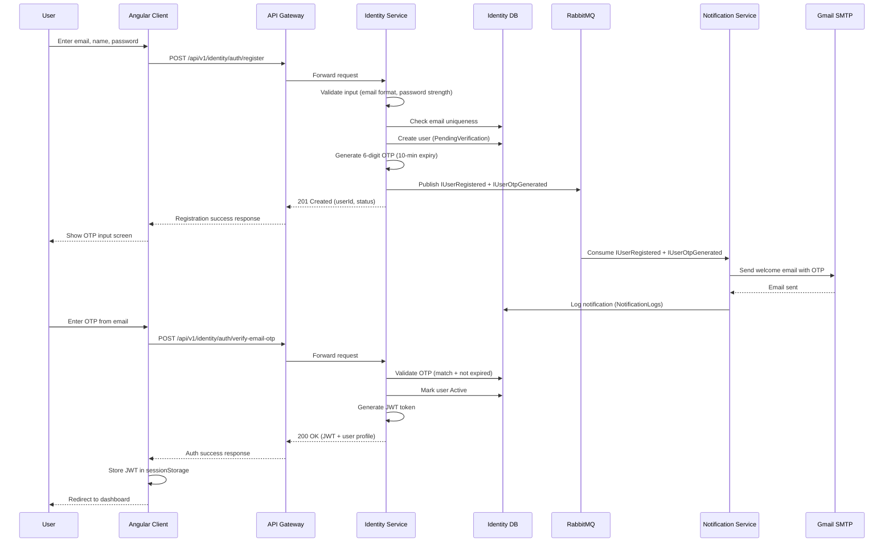
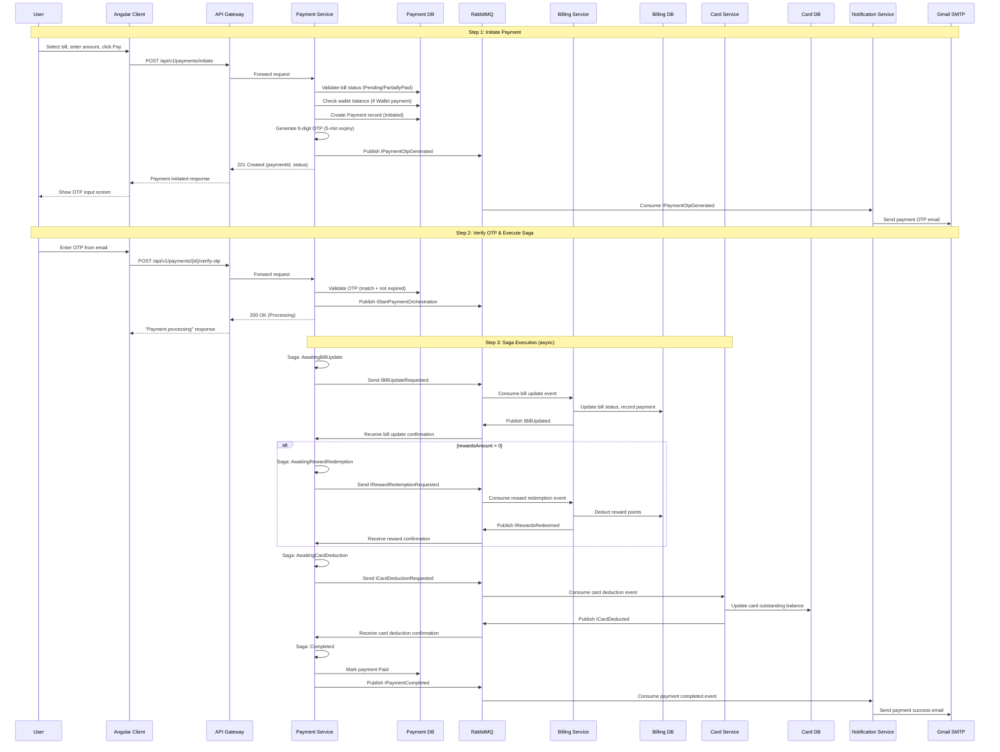
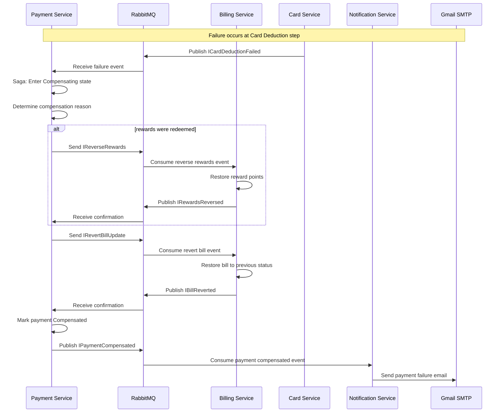
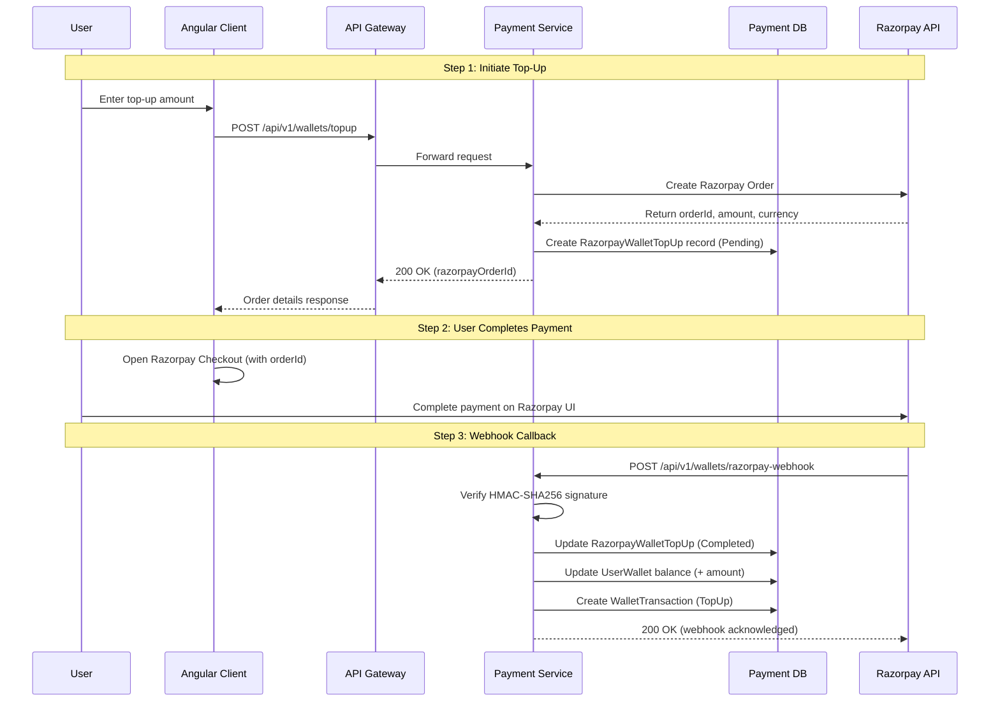
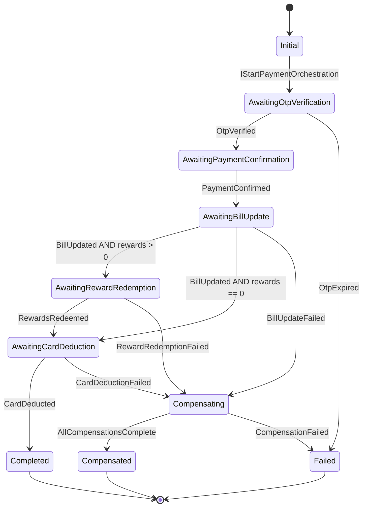
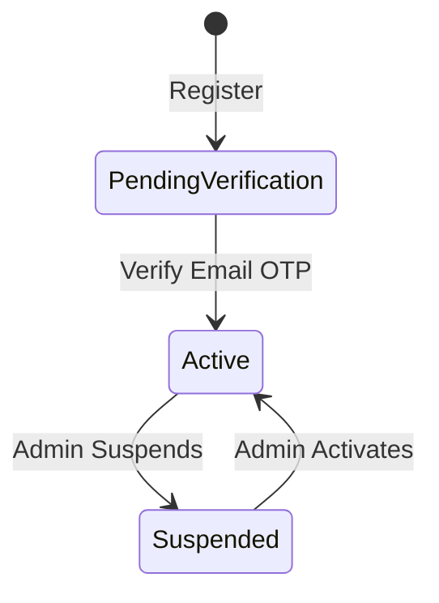
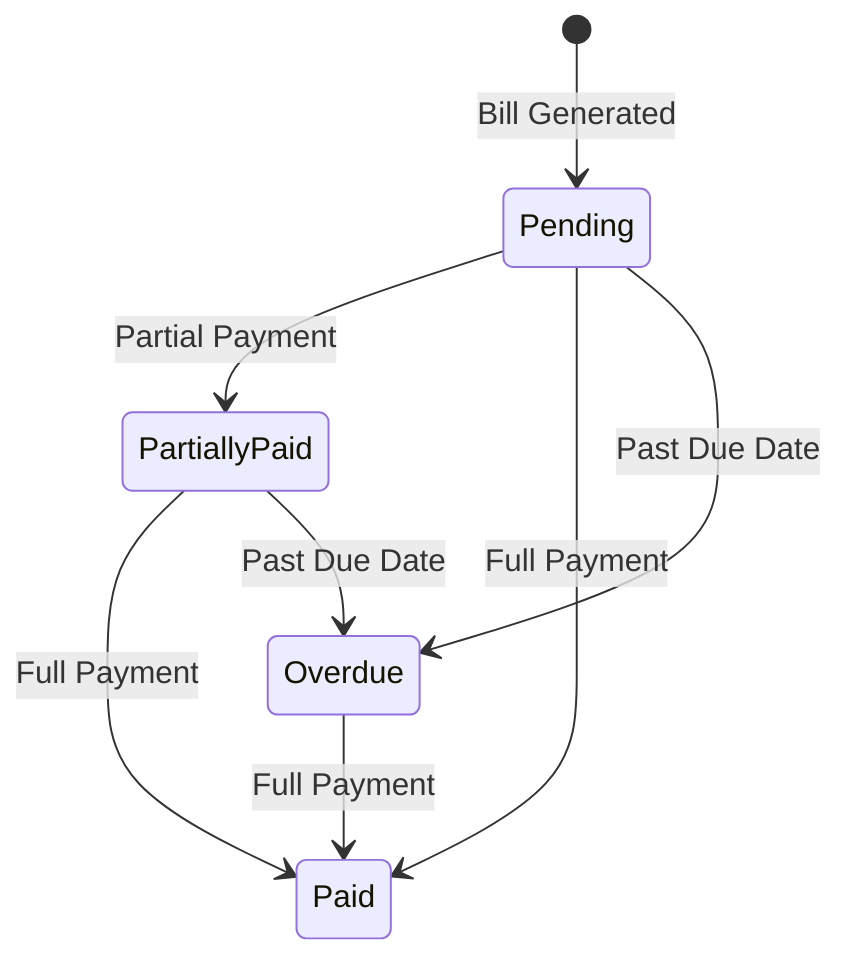
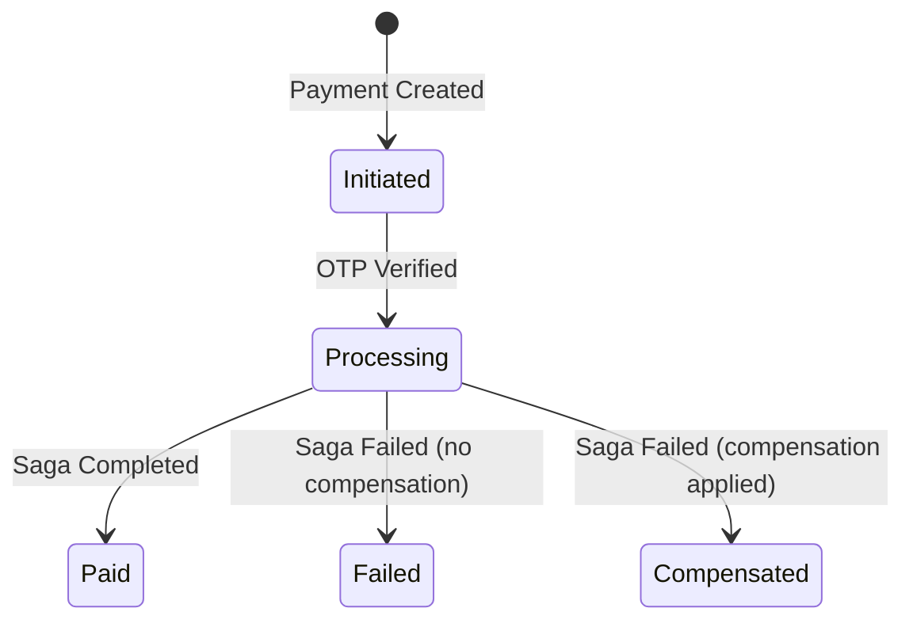

# Low-Level Design (LLD) — CredVault

**System:** CredVault Credit Card Management Platform  
**Version:** 1.0  
**Date:** May 2026

---

## Table of Contents
1. [Module Breakdown](#1-module-breakdown)
2. [Class & Schema Design](#2-class--schema-design)
3. [Database Schema (Detailed)](#3-database-schema-detailed)
4. [API Design](#4-api-design)
5. [Sequence Diagrams](#5-sequence-diagrams)
6. [Business Logic](#6-business-logic)
7. [Error Handling](#7-error-handling)
8. [Security Implementation](#8-security-implementation)
9. [Performance Optimizations](#9-performance-optimizations)
10. [Logging & Monitoring](#10-logging--monitoring)
11. [Configuration Management](#11-configuration-management)
12. [Test Strategy](#12-test-strategy)

---

## 1. Module Breakdown

Every service follows Clean Architecture with four layers:

```
API Layer (Controllers, Middleware, DI)
   ↓
Application Layer (Commands, Queries, DTOs, Validators, Handlers)
   ↓
Infrastructure Layer (EF Core DbContext, Repositories, Messaging, External Clients)
   ↓
Domain Layer (Entities, Enums, Domain Events)
```

**Dependency Rule:** Inner layers never depend on outer layers.

### 1.1 Identity Service (:5001)

**Domain Entity:** `IdentityUser`

**Commands:**

| Command | Handler Action |
|---------|--------|
| `RegisterUserCommand` | Create user (PendingVerification), generate OTP, publish `IUserRegistered` + `IUserOtpGenerated` |
| `LoginUserCommand` | Validate credentials, check status, return JWT |
| `GoogleLoginCommand` | Validate Google IdToken, create/login user, return JWT |
| `VerifyEmailOtpCommand` | Validate OTP, mark user Active, return JWT |
| `ForgotPasswordCommand` | Generate reset OTP, publish `IUserOtpGenerated` |
| `ResetPasswordCommand` | Validate OTP, update password hash |
| `UpdateUserProfileCommand` | Update FullName |
| `ChangePasswordCommand` | Validate old password, set new hash |
| `AdminUpdateUserStatusCommand` | Change user status (Active/Suspended) |
| `AdminUpdateUserRoleCommand` | Change user role (User/Admin) |

**Queries:** `GetUserProfileQuery`, `AdminListUsersQuery`, `AdminGetUserQuery`, `AdminGetUserStatsQuery`

**Events Published:** `IUserRegistered`, `IUserOtpGenerated`

**Infrastructure:** `IdentityDbContext` (1 table), auto-migration, `UserRepository`.

### 1.2 Card Service (:5002)

**Domain Entities:** `CreditCard`, `CardTransaction`, `CardIssuer`

**Commands:** `AddCardCommand` (encrypt, mask, publish `ICardAdded`), `UpdateCardCommand`, `DeleteCardCommand` (soft-delete), `SetDefaultCardCommand`, `AddCardTransactionCommand`, `AdminUpdateCardCommand`, Issuer CRUD commands.

**Queries:** `GetCardsByUserQuery` (excludes soft-deleted), `GetCardByIdQuery`, `GetCardTransactionsQuery`, `GetAllUserTransactionsQuery`, `ListIssuersQuery`.

**Events Published:** `ICardAdded`

**Infrastructure:** `CardDbContext` (3 tables), AES encryption service, soft-delete global query filter.

### 1.3 Billing Service (:5003)

**Domain Entities:** `Bill`, `Statement`, `StatementTransaction`, `RewardAccount`, `RewardTier`, `RewardTransaction`

**Commands:** `GenerateBillCommand`, `CheckOverdueBillsCommand`, `PayBillCommand`, `CreateStatementCommand`, `EarnRewardsCommand`, `RedeemRewardsCommand` (saga step), `ReverseRewardsCommand` (saga compensation), RewardTier CRUD.

**Queries:** `GetBillsByUserQuery`, `GetBillByIdQuery`, `HasPendingBillQuery`, `GetStatementsByUserQuery`, `GetStatementByIdQuery`, `GetRewardAccountQuery`, `ListRewardTiersQuery`.

**Events Consumed:** `IBillUpdateRequested`, `IRewardRedemptionRequested`, `IRevertBillUpdate`, `IReverseRewards` (from Payment Service saga).

**Infrastructure:** `BillingDbContext` (6 tables), statement aggregation, tier-based reward calculation.

### 1.4 Payment Service (:5004)

**Domain Entities:** `Payment`, `Transaction`, `UserWallet`, `WalletTransaction`, `PaymentOrchestrationSagaState`, `RazorpayWalletTopUp`

**Commands:** `InitiatePaymentCommand` (validate, create, OTP, publish), `VerifyPaymentOtpCommand` (triggers saga), `TopUpWalletCommand` (Razorpay order), `ProcessRazorpayWebhookCommand`, `DebitWalletCommand` (saga step), `RefundWalletCommand` (compensation).

**Queries:** `GetPaymentByIdQuery`, `GetWalletQuery`, `GetWalletBalanceQuery`, `GetWalletTransactionsQuery`.

**Saga:** `PaymentOrchestrationSaga` (MassTransit State Machine) — see Section 5.4.

**Events Published:** `IPaymentOtpGenerated`, `IStartPaymentOrchestration`, saga request/response events, `IPaymentCompleted`, `IPaymentCompensated`.

**Background Jobs:** `PaymentExpirationJob` — expires unpaid payments.

**Infrastructure:** `PaymentDbContext` (6 tables), Razorpay client, saga state repository.

### 1.5 Notification Service (:5005)

**Domain Entities:** `AuditLog`, `NotificationLog`

**Consumers (MassTransit):**

| Event | Action |
|-------|--------|
| `IUserRegistered` | Send welcome email |
| `IUserOtpGenerated` | Send OTP email (verification or password reset) |
| `ICardAdded` | Send card confirmation email |
| `IPaymentOtpGenerated` | Send payment OTP email |
| `IPaymentCompleted` | Send payment success email |
| `IPaymentCompensated` | Send payment failure email |

**Commands:** `SendEmailCommand`, `LogAuditCommand`, `LogNotificationCommand`

**Queries:** `GetNotificationLogsQuery`, `GetAuditLogsQuery`

**Infrastructure:** `NotificationDbContext` (2 tables), `GmailSmtpEmailSender`, retry policy (1s → 5s → 15s).

---

## 2. Class & Schema Design

### 2.1 Domain Entities Summary

| Entity | Service | Key Fields |
|--------|---------|------------|
| `IdentityUser` | Identity | Id, Email (UQ), FullName, PasswordHash (nullable), IsEmailVerified, EmailVerificationOtp, PasswordResetOtp, Status (enum), Role (enum), CreatedAtUtc, UpdatedAtUtc |
| `CreditCard` | Card | Id, UserId (indexed), IssuerId (FK), CardholderName, Last4, MaskedNumber, EncryptedCardNumber, ExpMonth, ExpYear, CreditLimit, OutstandingBalance, IsDefault, IsVerified, IsDeleted (soft), timestamps |
| `CardTransaction` | Card | Id, CardId (FK), UserId, Type (enum), Amount, Description, DateUtc |
| `CardIssuer` | Card | Id, Name, Network (enum), timestamps |
| `Bill` | Billing | Id, UserId, CardId, CardNetwork, IssuerId, Amount, MinDue, Currency, BillingDateUtc, DueDateUtc, AmountPaid, PaidAtUtc, Status (enum), timestamps |
| `Statement` | Billing | Id, UserId, CardId, BillId (FK), Period, balances (opening/purchases/payments/refunds/penalties/interest/closing), status, card metadata, timestamps |
| `StatementTransaction` | Billing | Id, StatementId (FK), SourceTransactionId, Type, Amount, Description, DateUtc |
| `RewardAccount` | Billing | Id, UserId (UQ), RewardTierId (FK), PointsBalance, timestamps |
| `RewardTier` | Billing | Id, CardNetwork, IssuerId (nullable), MinSpend, RewardRate, EffectiveFromUtc, EffectiveToUtc, timestamps |
| `RewardTransaction` | Billing | Id, RewardAccountId (FK), BillId (FK, nullable), Points, Type (Earned/Redeemed/Reversed), CreatedAtUtc |
| `Payment` | Payment | Id, UserId, CardId, BillId, Amount, PaymentType (enum), Status (enum), FailureReason, OtpCode, OtpExpiresAtUtc, timestamps |
| `Transaction` | Payment | Id, PaymentId (FK), UserId, Amount, Type (Debit/Credit), Description, timestamps |
| `UserWallet` | Payment | Id, UserId (UQ), Balance, TotalTopUps, TotalSpent, timestamps |
| `WalletTransaction` | Payment | Id, WalletId (FK), Type (TopUp/Debit/Refund), Amount, BalanceAfter, Description, RelatedPaymentId, CreatedAtUtc |
| `PaymentOrchestrationSagaState` | Payment | CorrelationId (PK), CurrentState, UserId, CardId, BillId, Email, FullName, Amount, RewardsAmount, PaymentType, CompensationReason, error fields |
| `RazorpayWalletTopUp` | Payment | Id, UserId, Amount, RazorpayOrderId (UQ), RazorpayPaymentId (UQ), RazorpaySignature, Status, FailureReason, timestamps |
| `AuditLog` | Notification | Id, EntityName, EntityId, Action, UserId, Changes (JSON), TraceId, CreatedAtUtc |
| `NotificationLog` | Notification | Id, UserId, Recipient, Subject, Body, Type, IsSuccess, ErrorMessage, TraceId, CreatedAtUtc |

### 2.2 Application Layer Pattern

**CQRS via MediatR:**
- Commands mutate state (create, update, delete) — return result objects
- Queries read data (fetch, list, search) — return DTOs
- Each handler is isolated — no shared logic between reads and writes
- FluentValidation runs as a pipeline behavior before handlers execute

**Shared Contracts Library (`Shared.Contracts`):**
- `BaseApiController` — standardized response methods (Ok, Created, BadRequest, etc.)
- `ApiResponse<T>` — consistent API envelope (success, data, message, errors)
- `ExceptionHandlingMiddleware` — global error handling, returns 500 envelope
- `ServiceCollectionExtensions` — JWT, Swagger, MassTransit DI setup
- All event interfaces and enum definitions shared across services

### 2.3 Event Contracts

**Identity Events:**
```
IUserRegistered:     userId, email, fullName, role, registeredAt
IUserOtpGenerated:   userId, email, otp, otpType (EmailVerification/PasswordReset), expiresAt
```

**Card Events:**
```
ICardAdded:          cardId, userId, cardLast4, cardNetwork, issuerName, addedAt
```

**Payment Events:**
```
IPaymentOtpGenerated:     paymentId, userId, email, otp, amount, expiresAt
IStartPaymentOrchestration: correlationId, paymentId, userId, cardId, billId, email, fullName, amount, rewardsAmount, paymentType
```

**Saga Events:**
```
IBillUpdateRequested:     correlationId, billId, amount, paymentId
IBillUpdated:             correlationId, billId, success
IRewardRedemptionRequested: correlationId, userId, rewardsAmount, billId
IRewardsRedeemed:         correlationId, pointsRedeemed, success
ICardDeductionRequested:  correlationId, cardId, amount
ICardDeducted:            correlationId, cardId, success
IPaymentCompleted:        correlationId, paymentId, completedAt
IPaymentCompensated:      correlationId, paymentId, compensationReason, compensatedAt
```

**Event Routing:**

| Event | Publisher | Consumer |
|-------|-----------|----------|
| `IUserRegistered` | Identity | Notification |
| `IUserOtpGenerated` | Identity | Notification |
| `ICardAdded` | Card | Notification |
| `IPaymentOtpGenerated` | Payment | Notification |
| `IStartPaymentOrchestration` | Payment | Payment (Saga) |
| `IBillUpdateRequested` | Payment (Saga) | Billing |
| `IBillUpdated` | Billing | Payment (Saga) |
| `IRewardRedemptionRequested` | Payment (Saga) | Billing |
| `IRewardsRedeemed` | Billing | Payment (Saga) |
| `ICardDeductionRequested` | Payment (Saga) | Card |
| `ICardDeducted` | Card | Payment (Saga) |
| `IPaymentCompleted` | Payment (Saga) | Notification |
| `IPaymentCompensated` | Payment (Saga) | Notification |

---

## 3. Database Schema (Detailed)

### 3.1 credvault_identity

**Table: identity_users**

| Column | Type | Constraints | Description |
|--------|------|-------------|-------------|
| Id | UNIQUEIDENTIFIER | PK, NOT NULL | Primary key |
| Email | NVARCHAR(256) | UQ, NOT NULL | User email |
| FullName | NVARCHAR(200) | NOT NULL | Display name |
| PasswordHash | NVARCHAR(512) | NULLABLE | BCrypt hash (null for SSO) |
| IsEmailVerified | BIT | NOT NULL, DEFAULT 0 | Email verification flag |
| EmailVerificationOtp | NVARCHAR(6) | NULLABLE | Current OTP code |
| PasswordResetOtp | NVARCHAR(6) | NULLABLE | Password reset OTP |
| Status | INT | NOT NULL, DEFAULT 0 | UserStatus enum |
| Role | INT | NOT NULL, DEFAULT 0 | UserRole enum |
| CreatedAtUtc | DATETIME2 | NOT NULL | Record creation time |
| UpdatedAtUtc | DATETIME2 | NOT NULL | Last update time |

**Indexes:** PK on `Id`, UQ on `Email`

### 3.2 credvault_cards

**Table: CardIssuers**

| Column | Type | Constraints |
|--------|------|-------------|
| Id | UNIQUEIDENTIFIER | PK, NOT NULL |
| Name | NVARCHAR(100) | NOT NULL |
| Network | INT | NOT NULL |
| CreatedAtUtc / UpdatedAtUtc | DATETIME2 | NOT NULL |

**Table: CreditCards**

| Column | Type | Constraints | Description |
|--------|------|-------------|-------------|
| Id | UNIQUEIDENTIFIER | PK, NOT NULL | Primary key |
| UserId | UNIQUEIDENTIFIER | NOT NULL, INDEXED | Owner user ID |
| IssuerId | UNIQUEIDENTIFIER | FK → CardIssuers.Id | Card issuer |
| CardholderName | NVARCHAR(200) | NOT NULL | Name on card |
| Last4 | NVARCHAR(4) | NOT NULL | Last 4 digits (plain) |
| MaskedNumber | NVARCHAR(19) | NOT NULL | `**** **** **** XXXX` |
| EncryptedCardNumber | NVARCHAR(512) | NOT NULL | AES-encrypted full number |
| ExpMonth | INT | NOT NULL | Expiry month (1-12) |
| ExpYear | INT | NOT NULL | Expiry year |
| CreditLimit | DECIMAL(18,2) | NOT NULL | Credit limit |
| OutstandingBalance | DECIMAL(18,2) | NOT NULL, DEFAULT 0 | Current balance |
| BillingCycleStartDay | INT | NOT NULL | Day of month for billing |
| IsDefault | BIT | NOT NULL, DEFAULT 0 | Default card flag |
| IsVerified | BIT | NOT NULL, DEFAULT 0 | Verification status |
| IsDeleted | BIT | NOT NULL, DEFAULT 0 | Soft delete flag |
| CreatedAtUtc / UpdatedAtUtc | DATETIME2 | NOT NULL | Timestamps |

**Table: CardTransactions**

| Column | Type | Constraints | Description |
|--------|------|-------------|-------------|
| Id | UNIQUEIDENTIFIER | PK, NOT NULL | Primary key |
| CardId | UNIQUEIDENTIFIER | FK → CreditCards.Id | Related card |
| UserId | UNIQUEIDENTIFIER | NOT NULL | Owner user ID |
| Type | INT | NOT NULL | CardTransactionType enum |
| Amount | DECIMAL(18,2) | NOT NULL | Transaction amount |
| Description | NVARCHAR(500) | NULLABLE | Description |
| DateUtc | DATETIME2 | NOT NULL | Transaction date |

**Relationships:** CardIssuers 1→N CreditCards, CreditCards 1→N CardTransactions

### 3.3 credvault_billing

**Table: Bills**

| Column | Type | Constraints | Description |
|--------|------|-------------|-------------|
| Id | UNIQUEIDENTIFIER | PK, NOT NULL | Primary key |
| UserId | UNIQUEIDENTIFIER | NOT NULL | Owner user ID |
| CardId | UNIQUEIDENTIFIER | NOT NULL | Related card |
| CardNetwork | INT | NOT NULL | CardNetwork enum |
| IssuerId | UNIQUEIDENTIFIER | NOT NULL | Card issuer |
| Amount | DECIMAL(18,2) | NOT NULL | Total bill amount |
| MinDue | DECIMAL(18,2) | NOT NULL | Minimum due amount |
| Currency | NVARCHAR(3) | NOT NULL, DEFAULT 'USD' | Currency code |
| BillingDateUtc | DATETIME2 | NOT NULL | Bill generation date |
| DueDateUtc | DATETIME2 | NOT NULL | Payment due date |
| AmountPaid | DECIMAL(18,2) | NOT NULL, DEFAULT 0 | Amount paid so far |
| PaidAtUtc | DATETIME2 | NULLABLE | Full payment date |
| Status | INT | NOT NULL, DEFAULT 0 | BillStatus enum |
| CreatedAtUtc / UpdatedAtUtc | DATETIME2 | NOT NULL | Timestamps |

**Table: Statements**

| Column | Type | Constraints | Description |
|--------|------|-------------|-------------|
| Id | UNIQUEIDENTIFIER | PK, NOT NULL | Primary key |
| UserId | UNIQUEIDENTIFIER | NOT NULL | Owner user ID |
| CardId | UNIQUEIDENTIFIER | NOT NULL | Related card |
| BillId | UNIQUEIDENTIFIER | FK → Bills.Id, NULLABLE | Related bill |
| StatementPeriod | NVARCHAR(50) | NOT NULL | Period label |
| PeriodStartUtc / PeriodEndUtc | DATETIME2 | NOT NULL | Period range |
| OpeningBalance | DECIMAL(18,2) | NOT NULL | Starting balance |
| TotalPurchases / TotalPayments / TotalRefunds | DECIMAL(18,2) | NOT NULL | Aggregated amounts |
| PenaltyCharges / InterestCharges | DECIMAL(18,2) | NOT NULL, DEFAULT 0 | Fees |
| ClosingBalance | DECIMAL(18,2) | NOT NULL | Final balance |
| MinimumDue | DECIMAL(18,2) | NOT NULL | Minimum payment |
| AmountPaid | DECIMAL(18,2) | NOT NULL, DEFAULT 0 | Amount paid |
| Status | INT | NOT NULL, DEFAULT 0 | StatementStatus enum |
| CardLast4 / CardNetwork / IssuerName | NVARCHAR | NOT NULL | Card metadata |
| CreditLimit / AvailableCredit | DECIMAL(18,2) | NOT NULL | Credit info |
| CreatedAtUtc / UpdatedAtUtc | DATETIME2 | NOT NULL | Timestamps |

**Table: StatementTransactions**

| Column | Type | Constraints |
|--------|------|-------------|
| Id | UNIQUEIDENTIFIER | PK, NOT NULL |
| StatementId | UNIQUEIDENTIFIER | FK → Statements.Id |
| SourceTransactionId | UNIQUEIDENTIFIER | NOT NULL |
| Type | INT | NOT NULL |
| Amount | DECIMAL(18,2) | NOT NULL |
| Description | NVARCHAR(500) | NULLABLE |
| DateUtc | DATETIME2 | NOT NULL |

**Table: RewardAccounts**

| Column | Type | Constraints | Description |
|--------|------|-------------|-------------|
| Id | UNIQUEIDENTIFIER | PK, NOT NULL | Primary key |
| UserId | UNIQUEIDENTIFIER | UQ, NOT NULL | Owner (unique) |
| RewardTierId | UNIQUEIDENTIFIER | FK → RewardTiers.Id | Current tier |
| PointsBalance | DECIMAL(18,2) | NOT NULL, DEFAULT 0 | Available points |
| CreatedAtUtc / UpdatedAtUtc | DATETIME2 | NOT NULL | Timestamps |

**Table: RewardTiers**

| Column | Type | Constraints | Description |
|--------|------|-------------|-------------|
| Id | UNIQUEIDENTIFIER | PK, NOT NULL | Primary key |
| CardNetwork | INT | NOT NULL | CardNetwork enum |
| IssuerId | UNIQUEIDENTIFIER | NULLABLE | Specific issuer (null = all) |
| MinSpend | DECIMAL(18,2) | NOT NULL | Minimum spend |
| RewardRate | DECIMAL(18,4) | NOT NULL | Points per unit |
| EffectiveFromUtc | DATETIME2 | NOT NULL | Effective start |
| EffectiveToUtc | DATETIME2 | NULLABLE | Effective end |
| CreatedAtUtc / UpdatedAtUtc | DATETIME2 | NOT NULL | Timestamps |

**Table: RewardTransactions**

| Column | Type | Constraints | Description |
|--------|------|-------------|-------------|
| Id | UNIQUEIDENTIFIER | PK, NOT NULL | Primary key |
| RewardAccountId | UNIQUEIDENTIFIER | FK → RewardAccounts.Id | Related account |
| BillId | UNIQUEIDENTIFIER | FK → Bills.Id, NULLABLE | Related bill |
| Points | DECIMAL(18,2) | NOT NULL | Points amount |
| Type | INT | NOT NULL | Earned / Redeemed / Reversed |
| CreatedAtUtc | DATETIME2 | NOT NULL | Creation time |

**Relationships:** Bills 1→N Statements, Statements 1→N StatementTransactions, RewardTiers 1→N RewardAccounts, RewardAccounts 1→N RewardTransactions, Bills 1→N RewardTransactions (nullable)

### 3.4 credvault_payments

**Table: Payments**

| Column | Type | Constraints | Description |
|--------|------|-------------|-------------|
| Id | UNIQUEIDENTIFIER | PK, NOT NULL | Primary key |
| UserId | UNIQUEIDENTIFIER | NOT NULL | Owner user ID |
| CardId | UNIQUEIDENTIFIER | NOT NULL | Related card |
| BillId | UNIQUEIDENTIFIER | NOT NULL | Related bill |
| Amount | DECIMAL(18,2) | NOT NULL | Payment amount |
| PaymentType | INT | NOT NULL | PaymentType enum |
| Status | INT | NOT NULL, DEFAULT 0 | PaymentStatus enum |
| FailureReason | NVARCHAR(500) | NULLABLE | Failure description |
| OtpCode | NVARCHAR(6) | NOT NULL | Payment OTP |
| OtpExpiresAtUtc | DATETIME2 | NOT NULL | OTP expiry |
| CreatedAtUtc / UpdatedAtUtc | DATETIME2 | NOT NULL | Timestamps |

**Table: Transactions**

| Column | Type | Constraints | Description |
|--------|------|-------------|-------------|
| Id | UNIQUEIDENTIFIER | PK, NOT NULL | Primary key |
| PaymentId | UNIQUEIDENTIFIER | FK → Payments.Id | Related payment |
| UserId | UNIQUEIDENTIFIER | NOT NULL | Owner user ID |
| Amount | DECIMAL(18,2) | NOT NULL | Transaction amount |
| Type | INT | NOT NULL | Debit / Credit |
| Description | NVARCHAR(500) | NULLABLE | Description |
| CreatedAtUtc / UpdatedAtUtc | DATETIME2 | NOT NULL | Timestamps |

**Table: UserWallets**

| Column | Type | Constraints | Description |
|--------|------|-------------|-------------|
| Id | UNIQUEIDENTIFIER | PK, NOT NULL | Primary key |
| UserId | UNIQUEIDENTIFIER | UQ, NOT NULL | Owner (unique) |
| Balance | DECIMAL(18,2) | NOT NULL, DEFAULT 0 | Current balance |
| TotalTopUps / TotalSpent | DECIMAL(18,2) | NOT NULL, DEFAULT 0 | Lifetime totals |
| CreatedAtUtc / UpdatedAtUtc | DATETIME2 | NOT NULL | Timestamps |

**Table: WalletTransactions**

| Column | Type | Constraints | Description |
|--------|------|-------------|-------------|
| Id | UNIQUEIDENTIFIER | PK, NOT NULL | Primary key |
| WalletId | UNIQUEIDENTIFIER | FK → UserWallets.Id | Related wallet |
| Type | INT | NOT NULL | TopUp / Debit / Refund |
| Amount | DECIMAL(18,2) | NOT NULL | Transaction amount |
| BalanceAfter | DECIMAL(18,2) | NOT NULL | Balance after transaction |
| Description | NVARCHAR(500) | NULLABLE | Description |
| RelatedPaymentId | UNIQUEIDENTIFIER | NULLABLE | Related payment |
| CreatedAtUtc | DATETIME2 | NOT NULL | Creation time |

**Table: PaymentOrchestrationSagas**

| Column | Type | Constraints | Description |
|--------|------|-------------|-------------|
| CorrelationId | UNIQUEIDENTIFIER | PK, NOT NULL | Saga correlation ID |
| CurrentState | NVARCHAR(50) | NOT NULL | Current saga state |
| UserId / CardId / BillId | UNIQUEIDENTIFIER | NOT NULL | Related entities |
| Email / FullName | NVARCHAR | NOT NULL | User details |
| Amount / RewardsAmount | DECIMAL(18,2) | NOT NULL | Payment amounts |
| PaymentType | INT | NOT NULL | PaymentType enum |
| CompensationReason | NVARCHAR(500) | NULLABLE | Compensation reason |

**Table: RazorpayWalletTopUps**

| Column | Type | Constraints | Description |
|--------|------|-------------|-------------|
| Id | UNIQUEIDENTIFIER | PK, NOT NULL | Primary key |
| UserId | UNIQUEIDENTIFIER | NOT NULL | Owner user ID |
| Amount | DECIMAL(18,2) | NOT NULL | Top-up amount |
| RazorpayOrderId | NVARCHAR(100) | UQ, NOT NULL | Razorpay order ID |
| RazorpayPaymentId | NVARCHAR(100) | UQ, NULLABLE | Razorpay payment ID |
| RazorpaySignature | NVARCHAR(512) | NULLABLE | Webhook signature |
| Status | INT | NOT NULL, DEFAULT 0 | RazorpayTopUpStatus enum |
| FailureReason | NVARCHAR(500) | NULLABLE | Failure description |
| CreatedAtUtc / UpdatedAtUtc | DATETIME2 | NOT NULL | Timestamps |

**Relationships:** UserWallets 1→N WalletTransactions, Payments 1→N Transactions. Sagas and TopUps are independent tracking tables.

### 3.5 credvault_notifications

**Table: AuditLogs**

| Column | Type | Constraints | Description |
|--------|------|-------------|-------------|
| Id | UNIQUEIDENTIFIER | PK, NOT NULL | Primary key |
| EntityName | NVARCHAR(100) | NOT NULL | Entity type |
| EntityId | UNIQUEIDENTIFIER | NOT NULL | Entity ID |
| Action | NVARCHAR(50) | NOT NULL | Action performed |
| UserId | UNIQUEIDENTIFIER | NOT NULL | Actor user ID |
| Changes | NVARCHAR(MAX) | NOT NULL | JSON change log |
| TraceId | NVARCHAR(100) | NOT NULL | Correlation trace ID |
| CreatedAtUtc | DATETIME2 | NOT NULL | Creation time |

**Table: NotificationLogs**

| Column | Type | Constraints | Description |
|--------|------|-------------|-------------|
| Id | UNIQUEIDENTIFIER | PK, NOT NULL | Primary key |
| UserId | UNIQUEIDENTIFIER | NULLABLE | Recipient user ID |
| Recipient | NVARCHAR(256) | NOT NULL | Email address |
| Subject | NVARCHAR(500) | NOT NULL | Email subject |
| Body | NVARCHAR(MAX) | NOT NULL | Email body |
| Type | NVARCHAR(10) | NOT NULL | NotificationType enum |
| IsSuccess | BIT | NOT NULL | Delivery success flag |
| ErrorMessage | NVARCHAR(1000) | NULLABLE | Error description |
| TraceId | NVARCHAR(100) | NOT NULL | Correlation trace ID |
| CreatedAtUtc | DATETIME2 | NOT NULL | Creation time |

### 3.6 Cross-Database Constraint Policy

**No cross-service foreign key constraints.** Referential integrity across services maintained through:
- Eventual consistency via RabbitMQ events
- Saga compensation for distributed transactions
- UserId/CardId/BillId passed as plain GUIDs in events and commands

---

## 4. API Design

### 4.1 Standard Response Format

All responses follow the `ApiResponse<T>` envelope via `BaseApiController`:

**Success:**
```json
{
  "success": true,
  "data": { ... },
  "message": "Operation successful",
  "errors": []
}
```

**Error:**
```json
{
  "success": false,
  "data": null,
  "message": "Validation failed",
  "errors": ["Email is required", "Password must be at least 8 characters"]
}
```

### 4.2 Identity Service (`/api/v1/identity`)

| # | Method | Endpoint | Auth | Description |
|---|--------|----------|------|-------------|
| 1 | POST | `/auth/register` | Public | Register new user |
| 2 | POST | `/auth/login` | Public | Email/password login |
| 3 | POST | `/auth/google` | Public | Google OAuth login |
| 4 | POST | `/auth/verify-email-otp` | Public | Verify email with OTP |
| 5 | POST | `/auth/resend-verification` | Public | Resend verification OTP |
| 6 | POST | `/auth/forgot-password` | Public | Request password reset |
| 7 | POST | `/auth/reset-password` | Public | Reset password with OTP |
| 8 | GET | `/users/me` | User | Get current user profile |
| 9 | PUT | `/users/me` | User | Update current user profile |
| 10 | PUT | `/users/me/password` | User | Change password |
| 11 | GET | `/users` | Admin | List all users (paginated) |
| 12 | GET | `/users/{id}` | Admin | Get user by ID |
| 13 | PUT | `/users/{id}/status` | Admin | Update user status |
| 14 | PUT | `/users/{id}/role` | Admin | Update user role |
| 15 | GET | `/users/stats` | Admin | User statistics |

### 4.3 Card Service (`/api/v1/cards`)

| # | Method | Endpoint | Auth | Description |
|---|--------|----------|------|-------------|
| 16 | GET | `/cards` | User | List user's cards |
| 17 | POST | `/cards` | User | Add new card |
| 18 | GET | `/cards/{id}` | User | Get card details |
| 19 | PUT | `/cards/{id}` | User | Update card |
| 20 | PATCH | `/cards/{id}/default` | User | Set card as default |
| 21 | DELETE | `/cards/{id}` | User | Soft-delete card |
| 22 | GET | `/cards/{cardId}/transactions` | User | Get card transactions |
| 23 | POST | `/cards/{cardId}/transactions` | User | Record card transaction |
| 24 | GET | `/cards/transactions` | User | All transactions for user |
| 25 | GET | `/issuers` | User | List all issuers |
| 26 | GET | `/issuers/{id}` | User | Get issuer details |
| 27 | POST | `/issuers` | Admin | Create issuer |
| 28 | PUT | `/issuers/{id}` | Admin | Update issuer |
| 29 | DELETE | `/issuers/{id}` | Admin | Delete issuer |

### 4.4 Billing Service (`/api/v1/billing`)

| # | Method | Endpoint | Auth | Description |
|---|--------|----------|------|-------------|
| 35 | GET | `/bills` | User | List user's bills |
| 36 | GET | `/bills/{id}` | User | Get bill details |
| 37 | GET | `/bills/has-pending/{cardId}` | User | Check pending bill |
| 38 | POST | `/bills/admin/generate-bill` | Admin | Generate bill |
| 39 | POST | `/bills/admin/check-overdue` | Admin | Check overdue bills |
| 40 | GET | `/statements` | User | List user's statements |
| 41 | GET | `/statements/{id}` | User | Get statement details |
| 42 | GET | `/statements/{id}/transactions` | User | Get statement transactions |
| 43 | GET | `/rewards/account` | User | Get reward balance |
| 44 | GET | `/rewards/transactions` | User | Get reward history |
| 45 | POST | `/rewards/internal/redeem` | Internal | Redeem rewards (saga) |
| 46 | GET | `/rewards/tiers` | User | List reward tiers |
| 47 | POST | `/rewards/tiers` | Admin | Create reward tier |
| 48 | PUT | `/rewards/tiers/{id}` | Admin | Update reward tier |
| 49 | DELETE | `/rewards/tiers/{id}` | Admin | Delete reward tier |

### 4.5 Payment Service (`/api/v1/payments`)

| # | Method | Endpoint | Auth | Description |
|---|--------|----------|------|-------------|
| 50 | POST | `/payments/initiate` | User | Initiate payment (triggers OTP) |
| 51 | POST | `/payments/{id}/verify-otp` | User | Verify payment OTP |
| 52 | POST | `/payments/{id}/resend-otp` | User | Resend payment OTP |
| 53 | GET | `/payments/{id}` | User | Get payment details |
| 54 | GET | `/wallets/me` | User | Get wallet info |
| 55 | GET | `/wallets/balance` | User | Get wallet balance |
| 56 | GET | `/wallets/transactions` | User | Get wallet history |
| 57 | POST | `/wallets/topup` | User | Create Razorpay top-up order |
| 58 | POST | `/wallets/razorpay-webhook` | Public | Razorpay webhook callback |

### 4.6 Notification Service (`/api/v1/notifications`)

| # | Method | Endpoint | Auth | Description |
|---|--------|----------|------|-------------|
| 59 | GET | `/logs` | Admin | Get notification logs |
| 60 | GET | `/audit` | Admin | Get audit trail |

### 4.7 Key Request DTOs

**RegisterUserRequest** — `POST /api/v1/identity/auth/register`
```json
{
  "email": "string (required, valid email)",
  "fullName": "string (required, min 2 chars)",
  "password": "string (required, min 8 chars, 1 uppercase, 1 lowercase, 1 digit)"
}
```

**AddCardRequest** — `POST /api/v1/cards`
```json
{
  "cardNumber": "string (required, 16 digits, Luhn valid)",
  "cardholderName": "string (required)",
  "expiryMonth": "int (required, 1-12)",
  "expiryYear": "int (required, >= current year)",
  "issuerId": "Guid (required)",
  "creditLimit": "decimal (required, > 0)",
  "billingCycleStartDay": "int (required, 1-28)"
}
```

**InitiatePaymentRequest** — `POST /api/v1/payments/initiate`
```json
{
  "cardId": "Guid (required)",
  "billId": "Guid (required)",
  "amount": "decimal (required, > 0)",
  "paymentType": "int (required, 0=Wallet, 1=Card)",
  "rewardsAmount": "decimal (optional, 0 if not redeeming)"
}
```

---

## 5. Sequence Diagrams

### 5.1 User Registration & Email Verification



### 5.2 Bill Payment with Saga Orchestration



### 5.3 Saga Compensation (Payment Failure)



### 5.4 Wallet Top-Up via Razorpay



### 5.5 Payment Saga State Machine



### 5.6 Entity State Machines

**User Status:**


**Bill Status:**


**Payment Status:**


---

## 6. Business Logic

### 6.1 User Rules
- Email must be unique across all users
- Password minimum: 8 characters, 1 uppercase, 1 lowercase, 1 digit
- OTP expires after 10 minutes (email verification/password reset), 5 minutes for payment OTP
- Suspended users cannot login or perform any action
- Google SSO users have null PasswordHash

### 6.2 Card Rules
- Card number validated via Luhn algorithm before encryption
- Card number encrypted with AES-256-CBC before storage
- Only last 4 digits stored in plain text (Last4 field)
- Masked number generated as `**** **** **** XXXX`
- Soft delete via `IsDeleted` flag with global query filter
- One card can be marked as default; setting a new default unsets the previous

### 6.3 Billing Rules
- Minimum due calculated as percentage of total bill amount
- Bills transition to Overdue if not paid by due date
- Partial payments allowed (status → PartiallyPaid)
- Statements aggregate all transactions within billing period

### 6.4 Rewards Rules
- Reward rate determined by tier (network + issuer specific)
- IssuerId on tier is nullable — null means applies to all issuers of that network
- Rewards earned on payment completion
- Rewards redeemable during payment (reduces payment amount)
- Reward redemption is reversible via saga compensation
- Each user has exactly one reward account

### 6.5 Payment Rules
- Payments require OTP verification (2FA)
- Payment via Wallet or Card (PaymentType enum)
- Wallet balance must be sufficient for wallet payments
- Expired payments cleaned up by background job
- All payments go through saga orchestration
- Payment amount must be >= minimum due

### 6.6 Wallet Rules
- Each user has exactly one wallet (auto-created on first use)
- Wallet balance cannot go negative
- Wallet transactions are immutable (append-only)
- Razorpay top-ups verified via HMAC-SHA256 signature
- Duplicate webhooks handled idempotently (check RazorpayPaymentId uniqueness)

### 6.7 Saga Rules
- Saga is idempotent (same CorrelationId = same saga instance)
- Compensation triggered on any step failure
- Compensation executes in reverse order of completed steps
- Saga state persisted in `PaymentOrchestrationSagas` table
- 30-second timeout per step triggers compensation

### 6.8 Core Algorithms

**OTP Generation:** Generate random 6-digit number (100000-999999), set expiry (10 min for email, 5 min for payment), store in record, send via notification.

**Card Number Encryption:** Encrypt plain number using AES-256-CBC → store in EncryptedCardNumber. Extract last 4 digits → Last4. Generate masked format → MaskedNumber. Never return plain number.

**Reward Calculation:** Find matching RewardTier by CardNetwork + IssuerId (fallback to network-only tier if IssuerId = null). Points = spendAmount × RewardRate. Add to RewardAccount.PointsBalance. Create RewardTransaction (Earned).

**Razorpay Webhook Verification:** Construct expected signature: HMAC-SHA256(orderId + "|" + paymentId, secret). Compare with received razorpay_signature. If match: update wallet, create transaction, mark top-up complete. If mismatch: reject 400. Check RazorpayPaymentId uniqueness for idempotency.

---

## 7. Error Handling

### 7.1 Error Response Format

```json
{
  "success": false,
  "data": null,
  "message": "Validation failed",
  "errors": ["Email is required", "Password must be at least 8 characters"]
}
```

### 7.2 HTTP Status Codes

| Status Code | Usage |
|-------------|-------|
| 200 | Successful GET, PUT, PATCH |
| 201 | Successful POST (resource created) |
| 400 | Validation errors, invalid input |
| 401 | Missing or invalid JWT token |
| 403 | Insufficient permissions (role mismatch) |
| 404 | Resource not found |
| 409 | Conflict (duplicate email, duplicate card) |
| 429 | Rate limit exceeded |
| 500 | Internal server error |

### 7.3 Validation Errors

| Rule | Error Message |
|------|---------------|
| Email format | "Email must be a valid email address" |
| Email max length | "Email must not exceed 256 characters" |
| Password length | "Password must be at least 8 characters" |
| Password uppercase | "Password must contain at least one uppercase letter" |
| Password lowercase | "Password must contain at least one lowercase letter" |
| Password digit | "Password must contain at least one digit" |
| Full name min | "Full name must be at least 2 characters" |
| Card number Luhn | "Card number is invalid" |
| Expiry date | "Card has expired" |
| Payment amount | "Payment amount must be greater than zero" |
| Wallet balance | "Insufficient wallet balance" |

### 7.4 Retry Logic

| Context | Strategy |
|---------|----------|
| MassTransit consumers | Exponential backoff: 1s → 5s → 15s (3 attempts) |
| External API calls (Razorpay, Google) | Not configured in current scope; should add Polly in production |
| Database operations | SQL Server handles transient faults natively |

### 7.5 Failure Scenarios

| Scenario | Handling |
|----------|----------|
| OTP expired | Return 400: "OTP has expired, please request a new one" |
| OTP mismatch | Return 400: "Invalid OTP, please try again" |
| Bill already paid | Return 400: "Bill is already paid" |
| Card not found | Return 404 |
| Saga step timeout | Trigger compensation after 30 seconds |
| Razorpay webhook signature mismatch | Return 400, log security event |
| Gmail SMTP failure | Log error in NotificationLog, retry via MassTransit |
| Service unavailable | Gateway returns 502; other services continue operating |

---

## 8. Security Implementation

### 8.1 Password Hashing
- **Algorithm:** BCrypt via `BCrypt.Net-Next` library
- **Work factor:** Default (10 rounds)
- **SSO users:** PasswordHash is null for Google OAuth users

### 8.2 JWT Token Management

**Token Payload:**
```
sub (UserId), email, name, role, iss (CredVault.Identity), aud (CredVault), exp, iat
```

- **Issuer:** Identity Service (shared secret across all services)
- **Expiry:** 60 minutes
- **Clock skew:** 30 seconds tolerance
- **Client storage:** `sessionStorage` (cleared on tab close)
- **Auto-attachment:** Angular HTTP interceptor adds Bearer token to all requests
- **401 handling:** Interceptor redirects to login on 401 response

### 8.3 Card Number Encryption
- **Algorithm:** AES-256-CBC
- **Key management:** Service-level configuration (should use Azure Key Vault / AWS KMS in production)
- **Fields stored:** EncryptedCardNumber (encrypted), Last4 (plain), MaskedNumber (masked)
- **Never exposed:** Plain card number is never returned in any API response

### 8.4 Role-Based Access Control (RBAC)

| Attribute | Access |
|-----------|--------|
| `[AllowAnonymous]` | Registration, login, OTP verification, password reset, Razorpay webhook |
| `[Authorize(Roles = "User")]` | Own cards, bills, payments, wallet, profile |
| `[Authorize(Roles = "Admin")]` | User management, card management, bill generation, reward tiers, logs |

### 8.5 Razorpay Webhook Security
- **Signature verification:** HMAC-SHA256 of `orderId + "|" + paymentId` using webhook secret
- **Idempotency:** RazorpayPaymentId stored with UNIQUE constraint; duplicate webhooks return 200 without reprocessing
- **Endpoint:** Only webhook endpoint is `[AllowAnonymous]`; all other payment endpoints require auth

### 8.6 CORS Configuration
- Angular frontend origin allowed in all services
- Configured via `appsettings.json` per environment

---

## 9. Performance Optimizations

### 9.1 Query Optimization
- **Indexed foreign keys:** `UserId` on CreditCards, `CardId` on CardTransactions, `BillId` on Statements
- **Unique constraints:** `Email` on IdentityUsers, `UserId` on UserWallets and RewardAccounts
- **Soft-delete filter:** Global query filter (`IsDeleted == false`) avoids scanning deleted records
- **Pagination:** All list endpoints support Page/PageSize to limit result sets

### 9.2 CQRS Benefits
- Commands and queries separated, allowing independent optimization
- Read queries don't acquire write locks
- Future-ready for read-model caching (Redis) without affecting write path

### 9.3 Async Communication
- Non-critical operations (emails, audit logs) handled asynchronously via RabbitMQ
- Payment saga runs async — user receives immediate "Processing" response
- Notification service consumption doesn't block request-response flow

### 9.4 Lazy Loading Considerations
- EF Core lazy loading disabled by default
- Related data loaded explicitly via `.Include()` to avoid N+1 queries
- Statement transactions loaded separately from statement header

### 9.5 Background Jobs
- `PaymentExpirationJob`: Cleans up expired unpaid payments (runs periodically)
- `CheckOverdueBillsCommand`: Marks bills past due date as Overdue (admin-triggered)

---

## 10. Logging & Monitoring

### 10.1 Logging Strategy
- **Framework:** Serilog with structured logging
- **Output:** Rolling daily files (per service)
- **Log levels:** Information (default), Warning, Error, Fatal
- **Format:** JSON-structured for machine parsing

### 10.2 Correlation IDs
- Every incoming request generates a `TraceId`
- TraceId passed through HTTP headers between services, RabbitMQ message headers, database audit logs, and notification logs
- Enables end-to-end request tracing across all services

### 10.3 Audit Trail
- **Entity:** `AuditLog` in Notification Service
- **Captured:** EntityName, EntityId, Action, UserId, Changes (JSON), TraceId
- **Triggered:** All admin actions, user profile changes, card updates, payment state changes
- **Queryable:** Admin endpoint `/api/v1/notifications/audit`

### 10.4 Notification Logging
- **Entity:** `NotificationLog` in Notification Service
- **Captured:** UserId, Recipient, Subject, Body, Type, IsSuccess, ErrorMessage, TraceId
- **Purpose:** Track email delivery success/failure for debugging
- **Queryable:** Admin endpoint `/api/v1/notifications/logs`

### 10.5 Metrics (Recommended for Production)
- Request latency per endpoint, error rates per service, saga completion vs compensation rates, RabbitMQ queue depths
- **Tools:** Prometheus + Grafana (infrastructure), ELK Stack (logs)

---

## 11. Configuration Management

### 11.1 Environment Variables

| Variable | Service | Purpose |
|----------|---------|---------|
| `ConnectionStrings__DefaultConnection` | All services | Database connection string |
| `Jwt__Key` | All services | JWT signing/verification key |
| `Jwt__Issuer` | Identity Service | JWT issuer claim |
| `Jwt__Audience` | All services | JWT audience claim |
| `Jwt__ExpiryMinutes` | Identity Service | Token expiry duration |
| `Google__ClientId` / `Google__ClientSecret` | Identity Service | Google OAuth credentials |
| `RabbitMQ__Host` / `RabbitMQ__Username` / `RabbitMQ__Password` | All services | RabbitMQ connection |
| `Smtp__Host` / `Smtp__Port` / `Smtp__Username` / `Smtp__Password` | Notification Service | Gmail SMTP credentials |
| `Razorpay__KeyId` / `Razorpay__KeySecret` / `Razorpay__WebhookSecret` | Payment Service | Razorpay API credentials |
| `CardEncryption__Key` | Card Service | AES encryption key |

### 11.2 appsettings.json Structure

Each service maintains its own `appsettings.json` with:
- ConnectionStrings (database)
- JWT configuration (shared secret, issuer, audience, expiry)
- RabbitMQ connection details
- Serilog logging configuration (console + rolling file, JSON format)
- Service-specific settings (SMTP, Razorpay, Google OAuth, CardEncryption)

### 11.3 Secrets Handling
- **Development:** `appsettings.Development.json` (gitignored)
- **Docker Compose:** Environment variables in `docker-compose.yml`
- **Production (recommended):** Azure Key Vault / AWS Secrets Manager
- **NEVER commit:** JWT keys, SMTP passwords, Razorpay secrets, encryption keys

---

## 12. Test Strategy

### 12.1 Unit Tests

| Scope | What to Test | Tools |
|-------|-------------|-------|
| Command Handlers | Business logic, state changes, event publishing | xUnit, Moq, FluentAssertions |
| Query Handlers | Data retrieval, filtering, pagination | xUnit, Moq, FluentAssertions |
| Validators | Input validation rules, edge cases | FluentValidation.TestHelper |
| Domain Logic | Entity behavior, business rules, state transitions | xUnit |
| Saga State Machine | State transitions, event handling, compensation | MassTransit Test Harness |

Key test scenarios: valid registration creates user and publishes events, login rejects unverified/suspended accounts, card addition encrypts number and publishes event, OTP validation rejects expired/incorrect codes.

### 12.2 Integration Tests

| Scope | What to Test | Tools |
|-------|-------------|-------|
| API Endpoints | Full request/response cycle with test database | WebApplicationFactory, Testcontainers |
| Database Operations | EF Core queries, migrations, relationships | Testcontainers (SQL Server) |
| MassTransit Consumers | Event consumption, side effects | MassTransit InMemory Test Harness |

Key test scenarios: POST /auth/register returns 201 with userId, POST /cards returns 201 with masked card number, GET /bills returns paginated results, saga happy path completes all steps.

### 12.3 Contract Tests

| Scope | What to Test | Tools |
|-------|-------------|-------|
| Event Schemas | Event interfaces match between publisher/consumer | Shared.Contracts library |
| API Responses | Response envelope consistent across services | Shared.BaseApiController |
| DTO Validation | Request DTOs validate correctly | FluentValidation tests |

### 12.4 Saga Tests

| Scope | What to Test | Tools |
|-------|-------------|-------|
| Happy Path | Full saga execution: bill update → reward redemption → card deduction | MassTransit Test Harness |
| Compensation | Step failure triggers reverse compensation | MassTransit Test Harness |
| Timeout | Step timeout triggers compensation | MassTransit Test Harness |
| Idempotency | Duplicate events don't break saga | MassTransit Test Harness |

### 12.5 Edge Cases to Cover

| Scenario | Expected Behavior |
|----------|-------------------|
| Duplicate email registration | Return 409 Conflict |
| Login with unverified account | Return 400 "verify email first" |
| Login with suspended account | Return 403 "account suspended" |
| Add card with invalid number (Luhn fail) | Return 400 validation error |
| Add card with past expiry | Return 400 validation error |
| Payment with insufficient wallet balance | Return 400 "insufficient balance" |
| Payment on already-paid bill | Return 400 "bill already paid" |
| Expired OTP submission | Return 400 "OTP expired" |
| Razorpay webhook with wrong signature | Return 400, log security event |
| Duplicate Razorpay webhook | Return 200 (idempotent), no double-credit |
| Saga step failure mid-execution | Compensation reverses completed steps |

---

*End of Low-Level Design Document*
