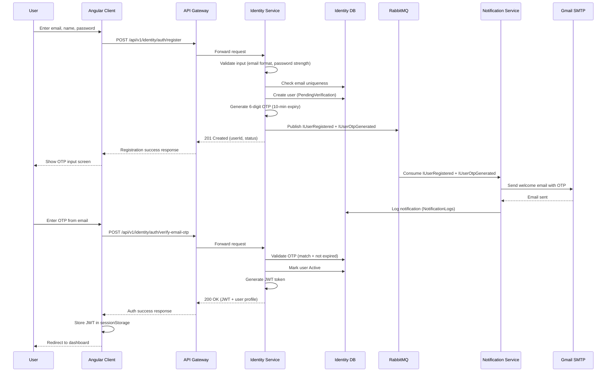
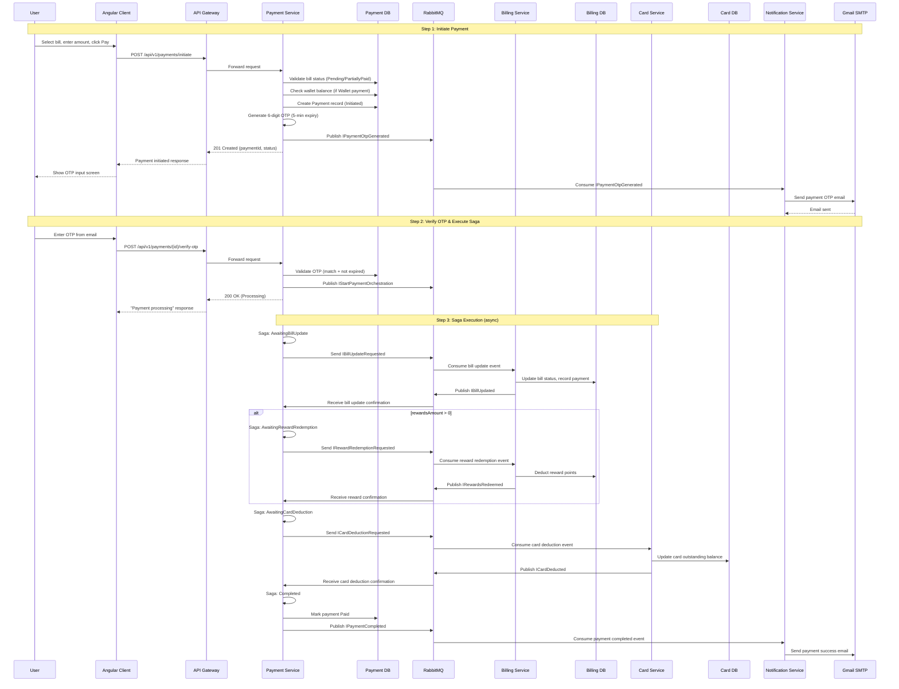
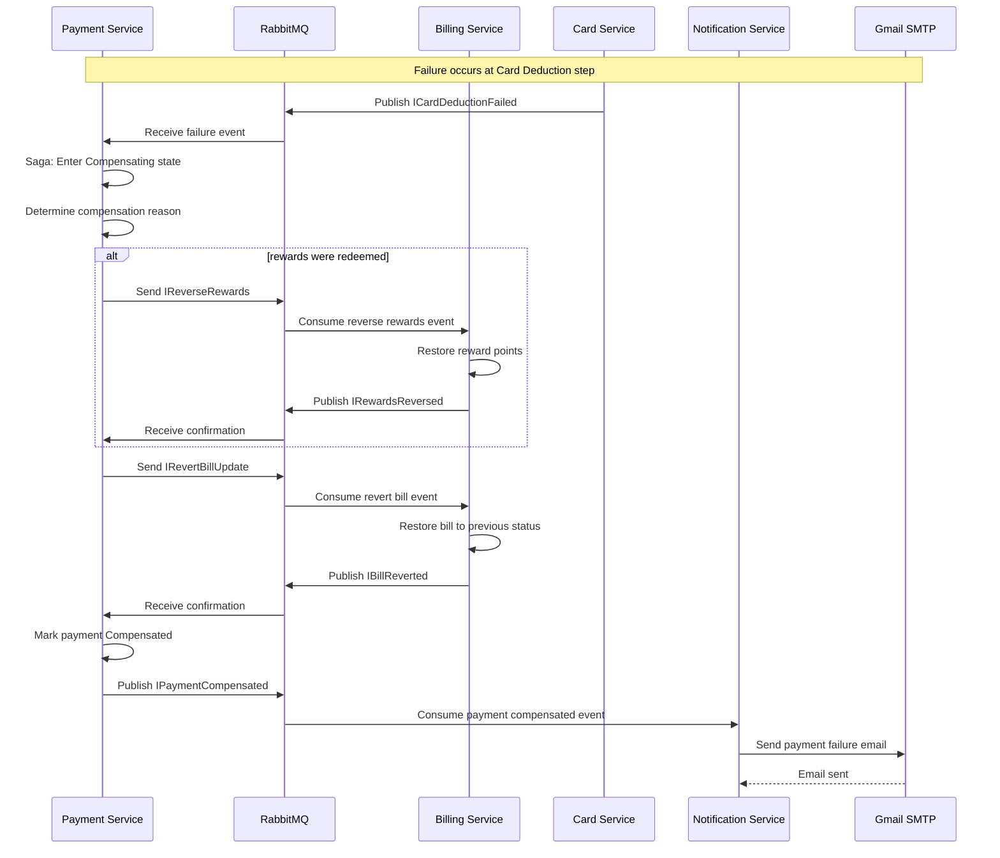
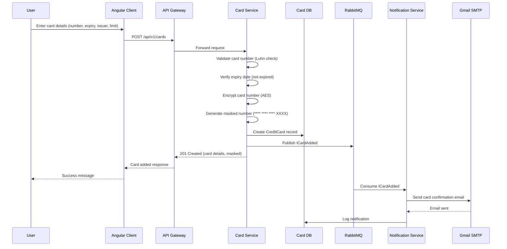
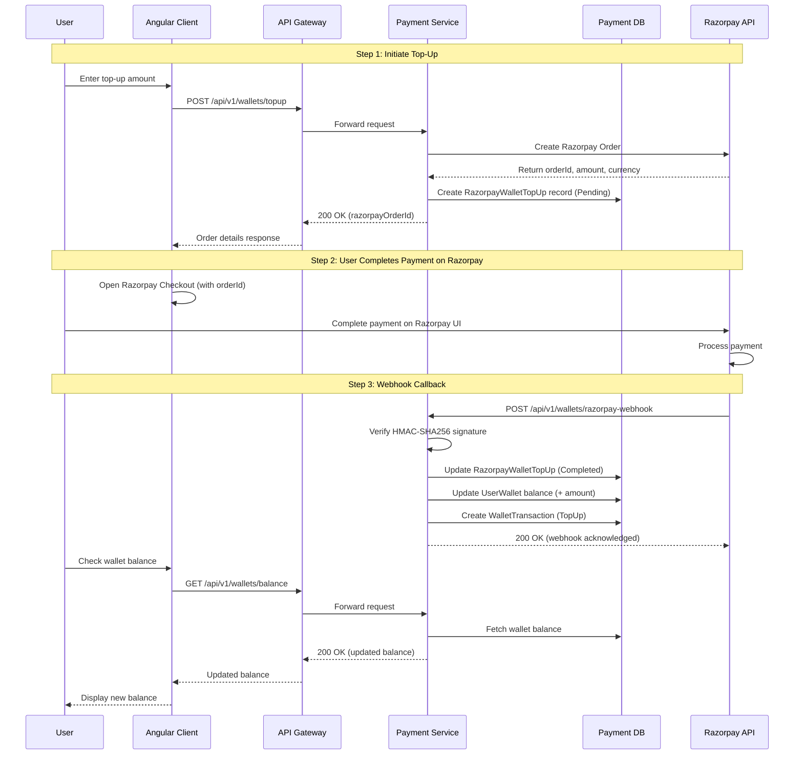
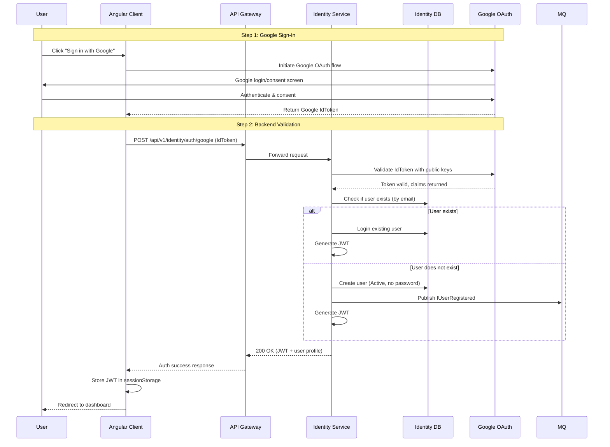
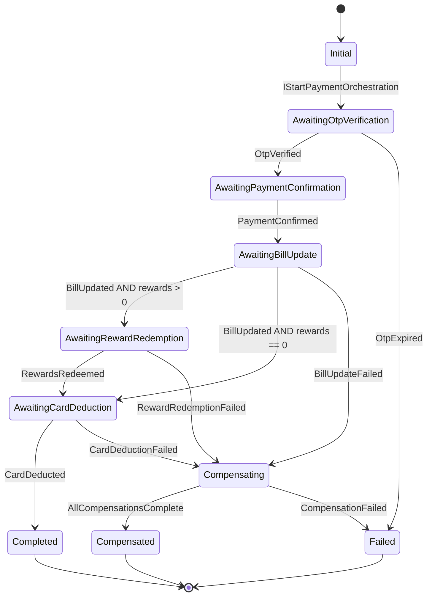
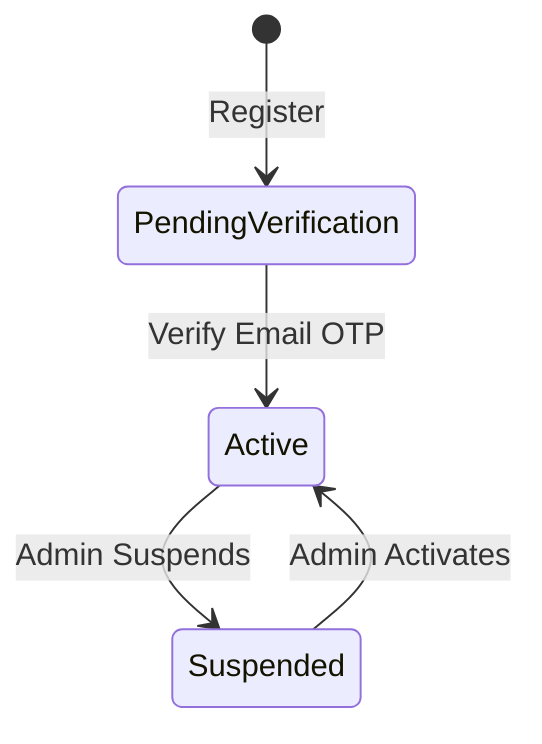
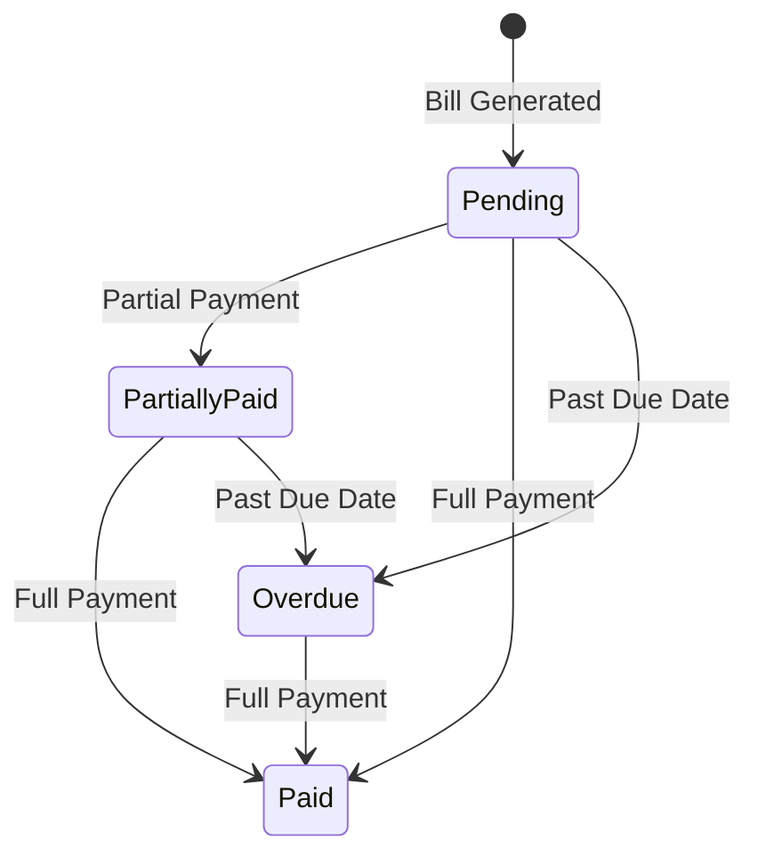
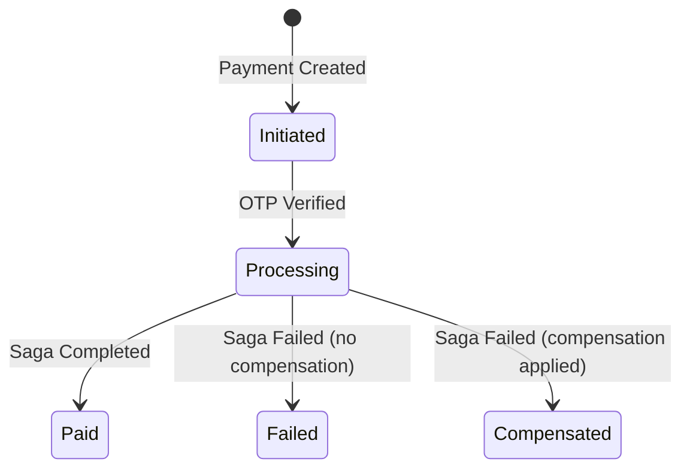

# Low-Level Design (LLD) — CredVault
**System:** CredVault Credit Card Management Platform  
**Version:** 1.0  
**Date:** April 2026
---
## Table of Contents
1. [Design Principles](#1-design-principles)
2. [Service Architecture](#2-service-architecture)
3. [Sequence Diagrams](#3-sequence-diagrams)
4. [Saga Orchestration](#4-saga-orchestration)
5. [Database Schema](#5-database-schema)
6. [Event Contracts](#6-event-contracts)
7. [State Machines](#7-state-machines)
8. [Business Rules](#8-business-rules)
---
## 1. Design Principles
### 1.1 Clean Architecture
Every microservice follows a strict four-layer structure:
```
┌──────────────────────────────────────────┐
│              API Layer                    │  Controllers, Middleware, DI setup
├──────────────────────────────────────────┤
│          Application Layer                │  Commands, Queries, Handlers, Validators
├──────────────────────────────────────────┤
│        Infrastructure Layer               │  EF Core DbContext, Repositories, Messaging
├──────────────────────────────────────────┤
│            Domain Layer                   │  Entities, Enums, Domain Events
└──────────────────────────────────────────┘
```
**Dependency Rule:** Inner layers never depend on outer layers. The Domain layer has zero external dependencies.
### 1.2 CQRS with MediatR
- **Commands** mutate state (create, update, delete)
- **Queries** read data (fetch, list, search)
- Each handler is isolated — no shared logic between reads and writes
- FluentValidation runs as a pipeline behavior before handlers execute
### 1.3 Saga Pattern for Distributed Transactions
Cross-service operations (bill payment involves Payment → Billing → Card services) use a **choreography-based saga** via MassTransit State Machine:
- Each step publishes an event; the next step reacts to it
- On failure, compensation events reverse completed steps
- State is persisted so sagas survive service restarts
### 1.4 Shared Contracts Library
`Shared.Contracts` is a .NET class library referenced by all services providing:
- `BaseApiController` — standardized response methods
- `ApiResponse<T>` — consistent API envelope
- `ExceptionHandlingMiddleware` — global error handling
- `ServiceCollectionExtensions` — JWT, Swagger, MassTransit setup
- All event interfaces and enum definitions
---
## 2. Service Architecture
### 2.1 Identity Service (:5001)
**Domain Entities:** `IdentityUser`
**Commands:**
| Command | Handler Action |
|---------|---------------|
| `RegisterUserCommand` | Create user (PendingVerification), generate OTP, publish `IUserRegistered` + `IUserOtpGenerated` |
| `LoginUserCommand` | Validate credentials, check status, return JWT |
| `GoogleLoginCommand` | Validate Google IdToken, create/login user, return JWT |
| `VerifyEmailOtpCommand` | Validate OTP, mark user Active, return JWT |
| `ResendVerificationCommand` | Regenerate OTP, publish `IUserOtpGenerated` |
| `ForgotPasswordCommand` | Generate reset OTP, publish `IUserOtpGenerated` |
| `ResetPasswordCommand` | Validate OTP, update password hash |
| `UpdateUserProfileCommand` | Update FullName |
| `ChangePasswordCommand` | Validate old password, set new hash |
| `AdminUpdateUserStatusCommand` | Change user status (Active/Suspended) |
| `AdminUpdateUserRoleCommand` | Change user role (User/Admin) |
**Queries:**
| Query | Returns |
|-------|---------|
| `GetUserProfileQuery` | Current user profile |
| `AdminListUsersQuery` | Paginated user list |
| `AdminGetUserQuery` | Single user details |
| `AdminGetUserStatsQuery` | Aggregated user statistics |
**Events Published:** `IUserRegistered`, `IUserOtpGenerated`
---
### 2.2 Card Service (:5002)
**Domain Entities:** `CreditCard`, `CardTransaction`, `CardIssuer`
**Commands:**
| Command | Handler Action |
|---------|---------------|
| `AddCardCommand` | Encrypt card number, generate masked number, create card, publish `ICardAdded` |
| `UpdateCardCommand` | Update cardholder name, credit limit, billing cycle |
| `DeleteCardCommand` | Set `IsDeleted = true` (soft delete) |
| `SetDefaultCardCommand` | Mark card as default, unset previous default |
| `AddCardTransactionCommand` | Record purchase/payment/refund |
| `AdminUpdateCardCommand` | Admin card update |
| `AddIssuerCommand` | Create card issuer |
| `UpdateIssuerCommand` | Update issuer details |
| `DeleteIssuerCommand` | Delete issuer |
**Queries:**
| Query | Returns |
|-------|---------|
| `GetCardsByUserQuery` | User's cards (excludes soft-deleted) |
| `GetCardByIdQuery` | Single card details |
| `GetCardTransactionsQuery` | Paginated card transactions |
| `GetAllUserTransactionsQuery` | All transactions across user's cards |
| `ListIssuersQuery` | All card issuers |
| `AdminListCardsQuery` | All cards (including soft-deleted) |
**Events Published:** `ICardAdded`
---
### 2.3 Billing Service (:5003)
**Domain Entities:** `Bill`, `Statement`, `StatementTransaction`, `RewardAccount`, `RewardTier`, `RewardTransaction`
**Commands:**
| Command | Handler Action |
|---------|---------------|
| `GenerateBillCommand` | Aggregate transactions, calculate totals/min-due, create bill + statement |
| `CheckOverdueBillsCommand` | Scan bills past due date, mark as Overdue |
| `PayBillCommand` | Update bill status, record payment amount |
| `CreateStatementCommand` | Generate statement from card transactions |
| `EarnRewardsCommand` | Calculate points from tier rate, add to reward account |
| `RedeemRewardsCommand` | Deduct points, create RewardTransaction (Redeemed) |
| `ReverseRewardsCommand` | Restore points, create RewardTransaction (Reversed) — saga compensation |
| `CreateRewardTierCommand` | Create reward tier |
| `UpdateRewardTierCommand` | Update tier configuration |
| `DeleteRewardTierCommand` | Delete reward tier |
**Queries:**
| Query | Returns |
|-------|---------|
| `GetBillsByUserQuery` | User's bills (paginated) |
| `GetBillByIdQuery` | Single bill details |
| `HasPendingBillQuery` | Boolean + bill details if exists |
| `GetStatementsByUserQuery` | User's statements |
| `GetStatementByIdQuery` | Statement with full breakdown |
| `GetRewardAccountQuery` | Reward balance + tier info |
| `GetRewardTransactionsQuery` | Reward history |
| `ListRewardTiersQuery` | All reward tiers |
---
### 2.4 Payment Service (:5004)
**Domain Entities:** `Payment`, `Transaction`, `UserWallet`, `WalletTransaction`, `PaymentOrchestrationSagaState`, `RazorpayWalletTopUp`
**Commands:**
| Command | Handler Action |
|---------|---------------|
| `InitiatePaymentCommand` | Validate bill, check wallet balance, create Payment, generate OTP, publish `IPaymentOtpGenerated` |
| `VerifyPaymentOtpCommand` | Validate OTP, publish `IStartPaymentOrchestration` (triggers saga) |
| `ResendPaymentOtpCommand` | Regenerate OTP |
| `TopUpWalletCommand` | Create Razorpay order |
| `DebitWalletCommand` | Deduct wallet balance — saga step |
| `RefundWalletCommand` | Restore wallet balance — saga compensation |
| `ProcessRazorpayWebhookCommand` | Verify signature, update wallet, mark top-up complete |
**Queries:**
| Query | Returns |
|-------|---------|
| `GetPaymentByIdQuery` | Payment details |
| `GetPaymentTransactionsQuery` | Payment transaction history |
| `GetWalletQuery` | Full wallet info |
| `GetWalletBalanceQuery` | Balance only |
| `GetWalletTransactionsQuery` | Wallet transaction history |
**Events Published:** `IPaymentOtpGenerated`, `IStartPaymentOrchestration`, saga state events
**Background Jobs:** Payment expiration cleanup
---
### 2.5 Notification Service (:5005)
**Domain Entities:** `AuditLog`, `NotificationLog`
**Consumers (MassTransit):**
| Event Consumer | Action |
|----------------|--------|
| `IUserRegistered` | Send welcome email |
| `IUserOtpGenerated` | Send OTP email (verification or password reset) |
| `ICardAdded` | Send card confirmation email |
| `IPaymentOtpGenerated` | Send payment OTP email |
| `IPaymentCompleted` | Send payment success email |
| `IPaymentCompensated` | Send payment failure email |
**Commands:**
| Command | Handler Action |
|---------|---------------|
| `SendEmailCommand` | Send via Gmail SMTP, log result |
| `LogAuditCommand` | Create audit log entry |
| `LogNotificationCommand` | Create notification log entry |
**Queries:**
| Query | Returns |
|-------|---------|
| `GetNotificationLogsQuery` | Paginated notification logs (admin) |
| `GetAuditLogsQuery` | Paginated audit logs (admin) |
---
## 3. Sequence Diagrams
### 3.1 User Registration & Email Verification

---
### 3.2 Bill Payment with Saga Orchestration

---
### 3.3 Saga Compensation (Payment Failure)

---
### 3.4 Card Addition Flow

---
### 3.5 Wallet Top-Up via Razorpay

---
### 3.6 Google OAuth Login Flow

---
## 4. Saga Orchestration
### 4.1 Payment Saga State Machine
The Payment Service uses a MassTransit State Machine to orchestrate distributed bill payments across Billing and Card services.

### 4.2 Saga Steps & Compensation
| Step | Action | Target Service | Compensation |
|------|--------|----------------|-------------|
| 1 | Update bill (mark Paid/PartiallyPaid) | Billing Service | Revert bill status |
| 2 | Redeem reward points (if applicable) | Billing Service | Reverse points to reward account |
| 3 | Deduct card outstanding balance | Card Service | Restore card balance |
| 4 | Debit wallet (if wallet payment) | Payment Service | Refund wallet balance |
### 4.3 Saga Reliability
| Mechanism | Configuration |
|-----------|---------------|
| **Outbox** | `UseInMemoryOutbox()` — prevents lost messages during restart |
| **Retry** | Exponential backoff: 1s → 5s → 15s (3 attempts) |
| **Timeout** | 30 seconds per step; triggers compensation |
| **Idempotency** | CorrelationId (GUID) as saga PK; duplicates ignored for completed sagas |
| **Persistence** | `PaymentOrchestrationSagas` table tracks current state |
---
## 5. Database Schema
### 5.1 credvault_identity
| Table | Key Columns | Relationships |
|-------|-------------|---------------|
| `identity_users` | Id (PK), Email (UQ), FullName, PasswordHash, IsEmailVerified, EmailVerificationOtp, PasswordResetOtp, Status, Role, CreatedAtUtc, UpdatedAtUtc | — |
### 5.2 credvault_cards
| Table | Key Columns | Relationships |
|-------|-------------|---------------|
| `CardIssuers` | Id (PK), Name, Network (enum), CreatedAtUtc, UpdatedAtUtc | 1 → N CreditCards |
| `CreditCards` | Id (PK), UserId (indexed), IssuerId (FK), CardholderName, Last4, MaskedNumber, EncryptedCardNumber, ExpMonth, ExpYear, CreditLimit, OutstandingBalance, BillingCycleStartDay, IsDefault, IsVerified, IsDeleted, CreatedAtUtc, UpdatedAtUtc | N → 1 CardIssuers; 1 → N CardTransactions |
| `CardTransactions` | Id (PK), CardId (FK), UserId, Type (enum), Amount, Description, DateUtc | N → 1 CreditCards |
### 5.3 credvault_billing
| Table | Key Columns | Relationships |
|-------|-------------|---------------|
| `Bills` | Id (PK), UserId, CardId, CardNetwork, IssuerId, Amount, MinDue, Currency, BillingDateUtc, DueDateUtc, AmountPaid, PaidAtUtc, Status (enum), CreatedAtUtc, UpdatedAtUtc | 1 → N Statements; 1 → N RewardTransactions |
| `Statements` | Id (PK), UserId, CardId, BillId (FK), StatementPeriod, PeriodStartUtc, PeriodEndUtc, OpeningBalance, TotalPurchases, TotalPayments, TotalRefunds, PenaltyCharges, InterestCharges, ClosingBalance, MinimumDue, AmountPaid, Status, CardLast4, CardNetwork, IssuerName, CreditLimit, AvailableCredit, CreatedAtUtc, UpdatedAtUtc | N → 1 Bills; 1 → N StatementTransactions |
| `StatementTransactions` | Id (PK), StatementId (FK), SourceTransactionId, Type, Amount, Description, DateUtc | N → 1 Statements |
| `RewardAccounts` | Id (PK), UserId (UQ), RewardTierId (FK), PointsBalance, CreatedAtUtc, UpdatedAtUtc | N → 1 RewardTiers; 1 → N RewardTransactions |
| `RewardTiers` | Id (PK), CardNetwork, IssuerId (nullable), MinSpend, RewardRate, EffectiveFromUtc, EffectiveToUtc, CreatedAtUtc, UpdatedAtUtc | 1 → N RewardAccounts |
| `RewardTransactions` | Id (PK), RewardAccountId (FK), BillId (FK, nullable), Points, Type (enum), CreatedAtUtc | N → 1 RewardAccounts; N → 1 Bills |
### 5.4 credvault_payments
| Table | Key Columns | Relationships |
|-------|-------------|---------------|
| `Payments` | Id (PK), UserId, CardId, BillId, Amount, PaymentType (enum), Status (enum), FailureReason, OtpCode, OtpExpiresAtUtc, CreatedAtUtc, UpdatedAtUtc | 1 → N Transactions |
| `Transactions` | Id (PK), PaymentId (FK), UserId, Amount, Type (enum), Description, CreatedAtUtc, UpdatedAtUtc | N → 1 Payments |
| `UserWallets` | Id (PK), UserId (UQ), Balance, TotalTopUps, TotalSpent, CreatedAtUtc, UpdatedAtUtc | 1 → N WalletTransactions |
| `WalletTransactions` | Id (PK), WalletId (FK), Type (enum), Amount, BalanceAfter, Description, RelatedPaymentId, CreatedAtUtc | N → 1 UserWallets |
| `PaymentOrchestrationSagas` | CorrelationId (PK), CurrentState, UserId, CardId, BillId, Email, FullName, Amount, RewardsAmount, PaymentType, CompensationReason, error fields | — |
| `RazorpayWalletTopUps` | Id (PK), UserId, Amount, RazorpayOrderId (UQ), RazorpayPaymentId (UQ), RazorpaySignature, Status, FailureReason, CreatedAtUtc, UpdatedAtUtc | — |
### 5.5 credvault_notifications
| Table | Key Columns | Relationships |
|-------|-------------|---------------|
| `AuditLogs` | Id (PK), EntityName, EntityId, Action, UserId, Changes (JSON), TraceId, CreatedAtUtc | — |
| `NotificationLogs` | Id (PK), UserId, Recipient, Subject, Body, Type (enum), IsSuccess, ErrorMessage, TraceId, CreatedAtUtc | — |
### 5.6 Cross-Database Constraint Policy
**No cross-service foreign key constraints.** Each database is fully isolated. Referential integrity across services is maintained through:
- Eventual consistency via RabbitMQ events
- Saga compensation for distributed transactions
- UserId/CardId/BillId passed as plain GUIDs in events and commands
---
## 6. Event Contracts
### 6.1 Identity Events
```typescript
interface IUserRegistered {
  userId: string;
  email: string;
  fullName: string;
  role: string;
  registeredAt: Date;
}
interface IUserOtpGenerated {
  userId: string;
  email: string;
  otp: string;
  otpType: string;  // "EmailVerification" | "PasswordReset"
  expiresAt: Date;
}
```
### 6.2 Card Events
```typescript
interface ICardAdded {
  cardId: string;
  userId: string;
  cardLast4: string;
  cardNetwork: string;
  issuerName: string;
  addedAt: Date;
}
```
### 6.3 Payment Events
```typescript
interface IPaymentOtpGenerated {
  paymentId: string;
  userId: string;
  email: string;
  otp: string;
  amount: number;
  expiresAt: Date;
}
interface IStartPaymentOrchestration {
  correlationId: string;
  paymentId: string;
  userId: string;
  cardId: string;
  billId: string;
  email: string;
  fullName: string;
  amount: number;
  rewardsAmount: number;
  paymentType: string;  // "Wallet" | "Card"
}
```
### 6.4 Saga Events
```typescript
interface IBillUpdateRequested {
  correlationId: string;
  billId: string;
  amount: number;
  paymentId: string;
}
interface IBillUpdated {
  correlationId: string;
  billId: string;
  success: boolean;
}
interface IRewardRedemptionRequested {
  correlationId: string;
  userId: string;
  rewardsAmount: number;
  billId: string;
}
interface IRewardsRedeemed {
  correlationId: string;
  pointsRedeemed: number;
  success: boolean;
}
interface ICardDeductionRequested {
  correlationId: string;
  cardId: string;
  amount: number;
}
interface ICardDeducted {
  correlationId: string;
  cardId: string;
  success: boolean;
}
interface IPaymentCompleted {
  correlationId: string;
  paymentId: string;
  completedAt: Date;
}
interface IPaymentCompensated {
  correlationId: string;
  paymentId: string;
  compensationReason: string;
  compensatedAt: Date;
}
```
### 6.5 Event Routing
| Event | Publisher | Consumer(s) |
|-------|-----------|-------------|
| `IUserRegistered` | Identity | Notification |
| `IUserOtpGenerated` | Identity | Notification |
| `ICardAdded` | Card | Notification |
| `IPaymentOtpGenerated` | Payment | Notification |
| `IStartPaymentOrchestration` | Payment | Payment (Saga) |
| `IBillUpdateRequested` | Payment (Saga) | Billing |
| `IBillUpdated` | Billing | Payment (Saga) |
| `IRewardRedemptionRequested` | Payment (Saga) | Billing |
| `IRewardsRedeemed` | Billing | Payment (Saga) |
| `ICardDeductionRequested` | Payment (Saga) | Card |
| `ICardDeducted` | Card | Payment (Saga) |
| `IPaymentCompleted` | Payment (Saga) | Notification |
| `IPaymentCompensated` | Payment (Saga) | Notification |
---
## 7. State Machines
### 7.1 User Status

| Status | Description |
|--------|-------------|
| `PendingVerification` | Just registered, awaiting email OTP verification |
| `Active` | Verified and can use all features |
| `Suspended` | Disabled by admin; cannot login |
### 7.2 Bill Status

| Status | Description |
|--------|-------------|
| `Pending` | Bill generated, no payments received |
| `PartiallyPaid` | Some amount paid, balance remaining |
| `Paid` | Fully settled |
| `Overdue` | Past due date without full payment |
### 7.3 Payment Status

| Status | Description |
|--------|-------------|
| `Initiated` | Payment record created, OTP sent |
| `Processing` | OTP verified, saga executing |
| `Paid` | All saga steps completed successfully |
| `Failed` | Saga failed, no steps to compensate |
| `Compensated` | Saga failed, all completed steps reversed |
---
## 8. Business Rules
### 8.1 User Rules
- Email must be unique across all users
- Password minimum: 8 characters, 1 uppercase, 1 lowercase, 1 digit
- OTP expires after 10 minutes (5 minutes for payment OTP)
- Suspended users cannot login or perform any action
- Google SSO users have null PasswordHash
### 8.2 Card Rules
- Card number encrypted before storage (AES)
- Only last 4 digits stored in plain text
- Soft delete (IsDeleted flag) — no physical deletion
- Deleted cards excluded from all queries
- One card can be marked as default; setting a new default unsets the previous
### 8.3 Billing Rules
- Minimum due calculated as percentage of total bill amount
- Bills transition to Overdue if not paid by due date
- Partial payments allowed (status → PartiallyPaid)
- Statements aggregate all transactions within billing period
### 8.4 Rewards Rules
- Reward rate determined by tier (network + issuer specific)
- Rewards earned on payment completion
- Rewards redeemable during payment (reduces payment amount)
- Reward redemption is reversible via saga compensation
- Each user has exactly one reward account
### 8.5 Payment Rules
- Payments require OTP verification (2FA)
- Payment via Wallet or Card
- Wallet balance must be sufficient for wallet payments
- Payment OTP expires after 5 minutes
- Expired payments cleaned up by background job
- All payments go through saga orchestration
### 8.6 Wallet Rules
- Each user has exactly one wallet (auto-created on first use)
- Wallet balance cannot go negative
- Wallet transactions are immutable
- Razorpay top-ups verified via HMAC-SHA256 signature
- Duplicate webhooks handled idempotently
### 8.7 Saga Rules
- Saga is idempotent (same CorrelationId = same saga instance)
- Compensation triggered on any step failure
- Compensation executes in reverse order
- Saga state persisted for recovery
- 30-second timeout per step triggers compensation
---
*End of Low-Level Design Document*